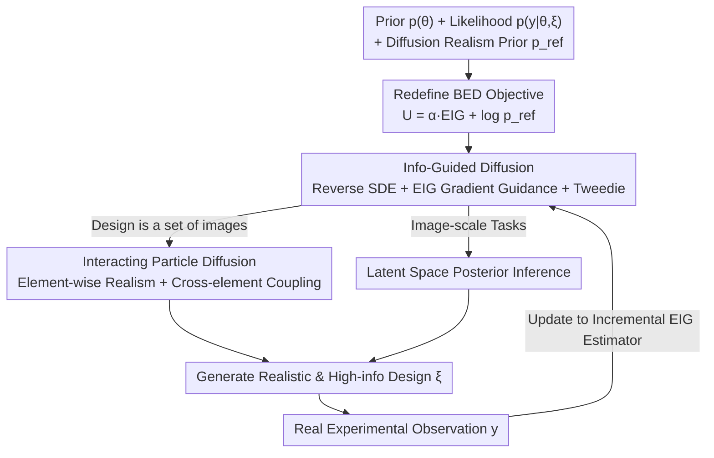

# DiffBED: Scaling Bayesian Experimental Design to High-Dimensions

**Conference**: ICLR2026  
**OpenReview**: [https://openreview.net/forum?id=pNO7VqKAcY](https://openreview.net/forum?id=pNO7VqKAcY)  
**Code**: TBD  
**Area**: Bayesian Experimental Design / Diffusion Models / Probabilistic Methods  
**Keywords**: Bayesian Experimental Design, Expected Information Gain, Diffusion Guidance, Model Mismatch, Reward Hacking

## TL;DR
DiffBED identifies that the primary cause of Bayesian Experimental Design (BED) failure in high-dimensional design spaces is not the inadequacy of EIG estimators, but rather the "overconfident" exploitation of the likelihood in areas far from the data manifold (a form of reward hacking). It utilizes a diffusion model as a "realism prior" and uses EIG gradients to guide the reverse SDE of the diffusion process, thereby generating designs that are both highly informative and realistically feasible. This marks the first extension of BED to image design spaces exceeding 750,000 dimensions.

## Background & Motivation

**Background**: Bayesian Experimental Design (BED) is a principled framework for "how to collect data intelligently." Given a prior $p(\theta)$ for the target quantity $\theta$ and a likelihood $p(y\mid\theta,\xi)$, BED selects a design $\xi$ that maximizes the Expected Information Gain (EIG) $\text{EIG}(\xi)=\mathbb{E}_{p(\theta)p(y\mid\theta,\xi)}[\log p(y\mid\theta,\xi)-\log p(y\mid\xi)]$ to reduce uncertainty to the greatest extent. It is naturally suited for sequential adaptive acquisition—incorporating observations into the posterior at each step before selecting the next design.

**Limitations of Prior Work**: Despite its theoretical generality, BED has historically succeeded only in simple problems with low-dimensional design variables (typically $\lesssim 20$ dimensions). The community has largely interpreted "scaling to high dimensions" as a **computational problem**, leading to extensive research on more efficient and lower-variance EIG gradient estimators (NMC, PCE, etc.).

**Key Challenge**: This paper points out a more fundamental obstacle that has been overlooked—**the assumption that the likelihood remains accurate across the entire design space is unrealistic**. As design dimensionality increases, the likelihood must be accurate across an exponentially growing space, whereas modern ML models only learn well near the data manifold. Paradoxically, experimental design aims to explore information "beyond the known," forcing the likelihood to extrapolate into regions where modeling assumptions are most fragile. Consequently, directly optimizing EIG is attracted to regions where the likelihood is "spuriously overconfident," producing designs that appear to have high EIG but are actually meaningless (e.g., pure pixel noise). The authors liken this to **reward hacking** in reinforcement learning. In sequential settings, this problem is amplified: a pathological feedback loop causes the posterior to collapse onto incorrect values (Figure 2 in the paper).

**Goal**: To enable BED to select truly useful designs in high-dimensional spaces without requiring the likelihood to be accurate everywhere.

**Key Insight**: The authors observe that model mismatch is not uniform. The likelihood tends to be sufficiently accurate on the "realistic, feasible design manifold" (as it was learned from such data) but becomes untrustworthy outside it. In many practical scenarios, prior knowledge about "which designs are feasible" exists (e.g., a batch of unlabeled images or a generative foundation model). This "realism" criterion can be specified independently of experimental results.

**Core Idea**: Instead of fixing the likelihood, the design objective itself is modified. A "realism reward" is explicitly added to the EIG, characterized by a diffusion model acting as a realism prior. EIG gradients are then used to guide diffusion sampling, ensuring the generated designs satisfy both "high information gain + high realism."

## Method

### Overall Architecture
The core approach of DiffBED is to shift from "direct EIG gradient ascent in total space" to "sampling from a realism distribution tilted by EIG." Specifically, it defines a new utility $U_{\text{DiffBED}}(\xi)=\alpha\cdot\text{EIG}(\xi)+\log p_{\text{ref}}(\xi)$, where $p_{\text{ref}}$ is a "realistic design prior" provided by a diffusion model. Rather than direct optimization of $U$, it samples from the exponentially tilted distribution $p^*(\xi)\propto p_{\text{ref}}(\xi)\exp(\alpha\cdot\text{EIG}(\xi))$. Sampling is achieved via "information-guided diffusion": a guidance drift composed of EIG gradients is added to the reverse SDE of the diffusion model, pushing noise samples toward realistic designs with high EIG. In sequential scenarios, the EIG estimator is updated with each new observation (replacing the prior with the posterior and using incremental EIG), and guided diffusion is rerun to select the next design.

### Key Designs

**1. Redefining BED Objective: Suppressing Reward Hacking with Realism Regularization**

This step addresses the problem where "direct EIG maximization exploits likelihood loopholes." The authors clarify this theoretically: by using a "True EIG" (TEIG, using the unknown true distribution $p_{\text{true}}$) as a reference, the model EIG can be decomposed as $\text{EIG}(\xi)=\text{TEIG}(\xi)+\underbrace{\mathbb{E}_{p(\theta)}[H[p_{\text{true}}(y\mid\theta,\xi)]-H[p(y\mid\theta,\xi)]]}_{M(\xi)}+\big(H[p(y\mid\xi)]-H[p_{\text{true}}(y\mid\xi)]\big)$. Here, $M(\xi)$ measures the "average model overconfidence": the more certain the likelihood is compared to the true distribution, the larger $M(\xi)$. Since $M(\xi)$ varies with the design, direct optimization encourages moving toward regions where $M(\xi)$ is large—i.e., where the likelihood is overconfident. The remaining marginal term, being averaged over $\theta$, is much more diffuse than the likelihood and often fails to provide sufficient protection. This explains why high-dimensional EIG optimization almost inevitably leads to reward hacking.

The solution is not to fix the likelihood (as being accurate everywhere in high dimensions is unrealistic and optimization amplifies residuals), but to change the objective: add a penalty $r(\xi)$ for designs that "fall outside well-aligned regions." Since the aligned region is latent, the authors use a generative model $p_{\text{ref}}(\xi)$ trained on realistic data as a proxy, setting $r(\xi)=-\log p_{\text{ref}}(\xi)$. This yields the utility $U_{\text{DiffBED}}(\xi)=\alpha\cdot\text{EIG}(\xi)+\log p_{\text{ref}}(\xi)$, where $\alpha>0$ balances "informativeness vs. realism." However, direct optimization of $U$ has flaws: the highest density point of a deep generative model may not be a reasonable sample, and SOTA models (diffusion/flow) are often implicit, making $p_{\text{ref}}$ inaccessible. Thus, the authors use **sampling** instead of optimization—sampling from $p^*(\xi)\propto p_{\text{ref}}(\xi)\exp(\alpha\cdot\text{EIG}(\xi))$. This tilted distribution also has an equivalent variational interpretation: it is the unique solution to $\max_q \mathbb{E}_q[\text{EIG}(\xi)]-\tfrac{1}{\alpha}\text{KL}[q\Vert p_{\text{ref}}]$, where $\alpha$ is the same hyperparameter weighting "high EIG" against "closeness to the realism prior."

**2. Information-Guided Diffusion: Guiding Reverse SDE with EIG Gradients without Retraining**

To sample from $p^*(\xi)$, the authors transform it into a stochastic optimal control problem: adding a drift term $u(\xi_t,t)\,dt$ to the reverse SDE of the diffusion process to push noise states toward high EIG regions. The ideal drift is $u(\xi_t,t)=g(t)^2\nabla_{\xi_t}\log\mathbb{E}_{p_{\text{ref}}(\xi_0\mid\xi_t)}[\exp(\alpha\cdot\text{EIG}(\xi_0))]$, but this requires computing expectations over $p_{\text{ref}}(\xi_0\mid\xi_t)$ and re-solving the SDE for every sample, which is infeasible. Drawing on training-free guidance, the authors use a delta approximation at the conditional mean $\hat\xi_0(\xi_t)=\mathbb{E}_{p_{\text{ref}}}[\xi_0\mid\xi_t]$, yielding $u(\xi_t,t)\approx g(t)^2\nabla_{\xi_t}[\alpha\cdot\text{EIG}(\hat\xi_0(\xi_t))]$. Crucially, $\hat\xi_0$ can be computed directly from the existing score function $s_{\text{ref}}$ using the **Tweedie formula** without simulation: for example, under VP-SDE/DDPM, $\hat\xi_0(\xi_t)=(\xi_t+(1-\alpha_t)s_{\text{ref}}(\xi_t,t))/\sqrt{\alpha_t}$. The final sampler simply superimposes the "score + scaled EIG gradient" into the reverse SDE:

$$d\xi_t=\Big[f(\xi_t,t)-g(t)^2\big(s_{\text{ref}}(\xi_t,t)+\alpha\nabla_{\xi_t}\text{EIG}(\hat\xi_0(\xi_t))\big)\Big]dt+g(t)\,d\overleftarrow{W}_t.$$

This involves adding a scaled EIG gradient estimator (using the non-nested estimator in Eq. 3 for discrete $y$, or PCE/NMC for continuous $y$) to the score network at each step. This scheme is advantageous because it is compatible with implicit generative priors, requires no likelihood-dependent retraining, and does not modify the likelihood, allowing the direct use of SOTA pre-trained diffusion or foundation models. For sequential use, the EIG gradient estimator is replaced with the incremental EIG $\text{EIG}(\xi_k\mid D_{k-1})$ to achieve adaptivity.

**3. Interacting Particle Diffusion: When the Design is a Set of Images**

In many tasks (e.g., preference elicitation), a design consists of a set of $S$ elements $\xi=\{\xi^{(1)},\dots,\xi^{(S)}\}$. The authors reuse a diffusion model defined on single elements, treating the reference distribution as a product of independent elements $p_{\text{ref}}(\xi)\propto\prod_j p_{\text{ref}}(\xi^{(j)})$. They then run the reverse process for each element $\xi^{(j)}_t$: the diffusion prior provides **element-wise independent score updates** (ensuring each image is individually realistic), while the EIG term $\nabla_{\xi^{(j)}_t}\text{EIG}(\hat\xi_0(\xi_t))$ introduces **cross-element coupling** (ensuring the set as a whole is maximally informative, e.g., the images are distinguishable). This constitutes an interacting particle diffusion—structurally similar to diversity-guided particle guidance, but the coupling arises from the EIG objective itself rather than a manually designed repulsion kernel. This explains why DiffBED explores coarse attributes (gender, hair color) before refining them in experiments: the demand for information naturally requires the compared images to be different, whereas simple predictive entropy (Entropy baseline) does not.

**4. Latent Space Posterior Inference: Compressing High-Dimensional Tasks into Low-Dimensional Representations**

Sequential BED requires a fast and accurate posterior sampler. A key design choice for image-scale experiments in DiffBED is **performing inference in latent space (rather than pixel space)**. In many nominally high-dimensional tasks, the information of interest is concentrated in a much lower-dimensional representation (e.g., perceptual features), while nuisance variations like background, lighting, and pixel noise can be ignored. Performing inference in the embedding space makes DiffBED robust and scalable, while naturally fitting problems where the likelihood is already defined over an encoder—$\theta$ is taken from pre-trained embeddings like SimCLR or VGGFace2, and inferred posterior samples are decoded back to image space.

## Key Experimental Results

Experiments focus on the theme of "human feedback elicitation" (design is one or more images, feedback is ranking or discrete ratings), with the goal of recovering a ground truth $\theta_{\text{true}}$. The primary baseline is the current standard paradigm: BED via direct gradient ascent on EIG estimators. Other baselines include Entropy (guidance using marginal predictive entropy instead of EIG), Rank (Pool) (selecting the highest EIG from 1000 candidates each round), Rank (Diffuse) (sampling few candidates from the diffusion prior), and Random.

### Main Results

| Task | Design Dim / Setting | Evaluation Metric | DiffBED Performance | Standard BED |
|------|------|------|------|------|
| Source Localization (Synthetic) | Low-dim sensor pos, manual mismatch $\Xi^*$ | L2 error of posterior to true source | **Lowest L2 error**, high-precision recovery | High EIG but often falls in $\Xi^*$; L2 error worse than random sampling from $p_{\text{ref}}$ |
| MNIST Search | $S{=}4$ image set, rank feedback | Cosine similarity: posterior vs $\theta_{\text{true}}$ | **Highest similarity** | High EIG but designs collapse to noise; similarity near 0 |
| CelebA Search | $S{=}4$ image set, rank feedback | Cosine similarity | **Highest**; outperforms Rank (Pool) with 1000 candidates | Failed |
| Zappos Scoring | $512{\times}512$ single image, >750k dim, ratings | Cosine similarity | Outperforms all except Rank (Pool); marginal difference | Fails to learn anything meaningful |

The most significant result is Zappos: using a fine-tuned Stable Diffusion v1.5 (1B parameters) as $p_{\text{ref}}$, DiffBED remains effective in a design space of **over 750,000 dimensions**—whereas previous sequential BED rarely succeeded beyond approximately 20 dimensions.

### Ablation Study

| Configuration | Phenomenon | Explanation |
|------|------|------|
| Standard BED (No realism prior) | High EIG, designs are noise, similarity $\approx 0$ | Direct evidence of reward hacking |
| Entropy (EIG $\to$ Marginal Entropy) | Fails to encourage diversity in image sets | Indicates ranking informativeness requires EIG, not just uncertainty |
| Rank (Pool) with 1000 candidates | Worse than DiffBED on "set-based design" tasks | More candidates increase chance of selecting designs impossible under $p_{\text{ref}}$ + "Winner's Curse" noise |
| Rank (Pool) vs. Rank (Diffuse) | 1000 candidates sometimes have worse L2 than 5 | Larger candidate pools are more likely to select OOD designs, echoing the degradation of BALD in active learning as pools grow |

### Key Findings
- **Reward hacking is the true bottleneck for high-dimensional BED**: In source localization, incremental EIG in BED rises even as the posterior degrades, a fingerprint of a pathological feedback loop; high EIG does not equal high informativeness.
- **"More candidates" can hurt Rank**: Larger candidate pools are more likely to contain unrealistic designs under $p_{\text{ref}}$ which are amplified by estimation noise (winner's curse). Thus, Rank (Pool) loses to DiffBED in set-based designs.
- **DiffBED actively trades EIG for realism**: Its incremental EIG under $p_{\text{model}}$ is often lower than standard BED, but because designs fall in well-aligned regions, the actual learning effect is superior—reflecting the suppression of reward hacking.
- **Greater advantage in set-based designs**: DiffBED uses gradients to directly generate complementary sets, while Rank relies on random luck to find good combinations. The more sub-designs, the larger DiffBED's lead.

## Highlights & Insights
- **Re-diagnosing the problem**: Re-characterizing the "high-dimensional BED failure" from a computational "EIG estimator problem" to a "reward hacking problem" where the optimizer exploits likelihood mismatch, supported by the $M(\xi)$ overconfidence decomposition. This is a fundamental cognitive shift.
- **Bypassing mismatch instead of fixing likelihood**: Acknowledging that likelihood accuracy everywhere is impossible in high dimensions, and instead constraining designs to the credible realism manifold. This approach is transferable to any scenario where optimization pushes the model off-manifold (e.g., offline RL, adversarial optimization, molecular design).
- **Leveraging pre-trained diffusion as priors**: The use of training-free guidance + Tweedie allows EIG guidance with a single score function evaluation without retraining the diffusion model, enabling direct integration with foundation models like Stable Diffusion.
- **Coupling in interacting particle diffusion**: Diversity in image sets is not forced by human-engineered kernels but is naturally induced by the EIG objective, causing sophisticated behaviors like "exploring coarse attributes before fine ones" to emerge spontaneously.

## Limitations & Future Work
- **Crude delta approximation**: Using the conditional mean $\hat\xi_0$ as a delta approximation for $p_{\text{ref}}(\xi_0\mid\xi_t)$ is acknowledged as a crude approximation; guidance signals may be inaccurate if $p_{\text{ref}}$ is multi-modal or the conditional distribution is wide.
- **Dependence on a good realism prior**: DiffBED's effectiveness relies on a $p_{\text{ref}}$ that characterizes feasible designs and overlaps with the likelihood's credible region. If unlabeled data is scarce or feasible designs are far from existing manifolds, this premise fails.
- **Focus on human feedback/images**: Although the framework is general, experiments are centered on image preference elicitation; validation in scientific experimental design (e.g., drugs, clinical trials) is still needed.
- **Sensitivity to $\alpha$**: The trade-off between informativeness and realism rests on a single hyperparameter $\alpha$; its sensitivity and adaptive selection were not fully explored.
- **Rank (Pool) remains strong for single images**: On Zappos, DiffBED only marginally leads Rank (Pool), indicating that when the design is a single element and a large data pool is available, the advantage of generative over selection-based methods narrows.

## Related Work & Insights
- **vs. Scalable EIG Estimators (Foster et al. 2019/2020, Goda et al. 2022, Iollo et al. 2025)**: These works treat high dimensionality as a challenge of "cheaper EIG gradient estimation" but remain limited to design spaces around 15–20 dimensions. DiffBED points to likelihood mismatch as the real bottleneck and scales design space to 750k+ dimensions. Iollo et al. also use diffusion, but only for the prior in the target variable $\theta$ space, not for the design space.
- **vs. Model Mismatch in BED (Feng 2015, Go & Isaac 2022, Sürer et al. 2024)**: Previous work corrected models/EIG or used Gaussian Processes for bias correction (assuming real data is already available). This paper is the first to demonstrate reward hacking behavior and argue its inevitability with high-dimensional learned likelihoods. In high-dim, low-data settings, learning explicit bias is infeasible; DiffBED uses design priors to regularize the optimization instead.
- **vs. BED for Preference Elicitation with LLMs (Choudhury 2025, Kobalczyk 2025, Handa 2024)**: These typically use LLMs to generate candidates, estimate EIG separately, and select the highest—similar to the Rank baseline. DiffBED addresses continuous high-dimensional design spaces, using gradient-based optimization to directly generate the most informative sets.
- **vs. Diversified Particle Guidance (Corso 2023, Kirchhof 2025)**: While structurally similar (interacting particles), DiffBED's cross-element coupling comes from the EIG objective rather than artificial diversity kernels.

## Rating
- Novelty: ⭐⭐⭐⭐⭐ Re-diagnosing high-dim BED through the lens of reward hacking and using diffusion guidance to bypass mismatch is highly novel.
- Experimental Thoroughness: ⭐⭐⭐⭐ Solid progressive validation from synthetic source localization to 750k-dim Zappos with rich baselines, though scenarios are concentrated on image preferences.
- Writing Quality: ⭐⭐⭐⭐⭐ Logical progression from problem diagnosis ($M(\xi)$ decomposition) to methodological derivation (tilted distribution $\to$ guided SDE $\to$ Tweedie) with intuitive illustrations.
- Value: ⭐⭐⭐⭐⭐ First expansion of BED to image scales, creating a practical path for "BED + Generative Foundation Models" and significantly broadening the scope of principled experimental design.

<!-- RELATED:START -->

## Related Papers

- [\[NeurIPS 2025\] Learning Quadratic Neural Networks in High Dimensions: SGD Dynamics and Scaling Laws](../../NeurIPS2025/optimization/learning_quadratic_neural_networks_in_high_dimensions_sgd_dynamics_and_scaling_l.md)
- [\[ICLR 2026\] From Sorting Algorithms to Scalable Kernels: Bayesian Optimization in High-Dimensional Permutation Spaces](from_sorting_algorithms_to_scalable_kernels_bayesian_optimization_in_high-dimens.md)
- [\[ICLR 2026\] Contextual Causal Bayesian Optimisation](contextual_causal_bayesian_optimisation.md)
- [\[ICLR 2026\] CALM: Co-evolution of Algorithms and Language Model for Automatic Heuristic Design](calm_co-evolution_of_algorithms_and_language_model_for_automatic_heuristic_desig.md)
- [\[ICLR 2026\] Combinatorial Bandit Bayesian Optimization for Tensor Outputs](combinatorial_bandit_bayesian_optimization_for_tensor_outputs.md)

<!-- RELATED:END -->
