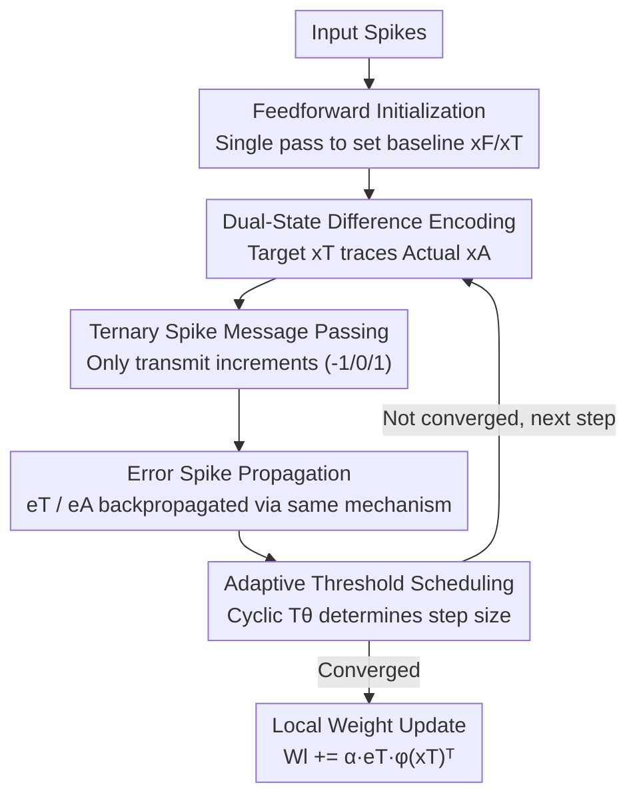

# Difference Predictive Coding for Training Spiking Neural Networks

**Conference**: ICLR2026  
**OpenReview**: [https://openreview.net/forum?id=iu9dbz2lB9](https://openreview.net/forum?id=iu9dbz2lB9)  
**Code**: To be confirmed  
**Area**: Optimization / Spiking Neural Networks / Neuromorphic Computing  
**Keywords**: Difference Predictive Coding, Spiking Neural Networks, Predictive Coding, Local Learning, Ternary Spikes  

## TL;DR
This paper transforms the bio-inspired local learning framework "Predictive Coding" into a **spike-native** training algorithm named DiffPC. Instead of transmitting dense floating-point numbers between layers, it only emits sparse ternary spikes (-1/0/1) when states change. DiffPC achieves 99.3% on MNIST and 89.6% on Fashion-MNIST, outperforming backpropagation baselines on CIFAR-10 while reducing training communication volume by over two orders of magnitude.

## Background & Motivation
**Background**: The success of deep learning is built upon Error Backpropagation (BP). However, BP suffers from two widely criticized "biological implausibilities": first, the requirement for **global error signals**, where weight updates in a layer depend on information transmitted across multiple layers beyond the neuron's local reach; second, the reliance on **continuous-valued activations and gradients**, whereas the brain utilizes discrete, event-driven spikes. Neuromorphic hardware (e.g., Intel Loihi 2, TrueNorth, SpiNNaker) co-locates memory and computation to reduce data movement, making it naturally suited for Spiking Neural Networks (SNNs), yet training SNNs remains a significant challenge.

**Limitations of Prior Work**: Existing SNN training methods generally fall into three categories, each with drawbacks: (i) ANN-to-SNN conversion: High accuracy but training occurs off-chip using dense floats; (ii) Direct training with surrogate gradients (BPTT + SG): Highest accuracy but still relies on global backpropagation and dense communication, making on-chip training difficult; (iii) Purely local rules (e.g., STDP): Biologically and hardware-constrained but often require extra classifiers and suffer performance drops on complex tasks. **Predictive Coding (PC)** is an ideal candidate as it only transmits residual errors between adjacent layers using local learning rules, theoretically fitting the parallel distributed structure of neuromorphic hardware.

**Key Challenge**: However, standard PC implementations require iterative "settling." To propagate information through the network, a single input must undergo multiple forward/backward passes to converge, and these message-passing steps utilize **dense floating-point numbers**. Consequently, while PC solves the global error transport problem of BP, it loses the energy-efficiency benefits of event-driven hardware due to dense continuous communication—failing to leverage the sparsity of the neuromorphic substrate.

**Goal**: To rewrite PC into a **spike-native** algorithm where both computation and communication are event-driven (occurring only when prediction errors need correction), while maintaining the local learning properties of PC to enable deployment on neuromorphic chips like Loihi 2.

**Key Insight**: The authors adopt the "gradient-by-spikes" approach—discretizing continuous state changes into spikes. Instead of transmitting the entire state, only the **incremental changes** are communicated.

**Core Idea**: Use sparse ternary spikes to transmit "state differences" instead of dense floating-point message passing. Combine this with an adaptive threshold scheduling mechanism to allow discrete spike states to approximate the dynamics of continuous PC—this is Difference Predictive Coding (DiffPC).

## Method

### Overall Architecture
Standard PC involves an $L$-layer network where each layer maintains a target activity $x_{T,l}$ and a prediction $x_{F,l}=W_l\,\phi(x_{T,l-1})$ generated by the previous layer. The difference is the prediction error $\epsilon_l = x_{T,l}-x_{F,l}$. The network minimizes the "free energy" $F=\sum_l \|\epsilon_l\|_2^2$ through two types of **local** updates: weight updates $W_l \leftarrow W_l + \alpha\,\epsilon_l\,\phi(x_{T,l-1})^\top$ and target activity updates (depending on the current layer's error and the backpropagated $W_{l+1}^\top\epsilon_{l+1}$ from the next layer). These involve only adjacent layers, requiring multiple iterations for information to permeate the network.

DiffPC discretizes all **floating-point computations and message passing into ternary spike sequences (-1, 0, 1)**. Specifically, each unit no longer transmits "state values" but maintains two sets of variables:

- Target state $x_T$ and actual state $x_A$: $x_T$ is the desired activity, while $x_A$ attempts to track $x_T$. The difference is reduced step-by-step with a step size proportional to an adaptive threshold $T_\theta$. Each incremental adjustment is sent to subsequent layers as a spike.
- Target error $e_T$ and actual error $e_A$: These function identically, where $e_A$ tracks $e_T$ and adjustments are transmitted as spikes.

Since the threshold $T_\theta$ determines the step size of each update, its scheduling is critical for convergence. The process begins with a **feedforward initialization** to establish baseline states, followed by iterative steps: receiving input spikes to update predictions, calculating target errors, updating target states to generate activity spikes, encoding errors as spikes for propagation, and finally updating weights.

### Key Designs

**1. Dual-State Difference Encoding: Using "Target/Actual State Difference" to Carry Floating-Point States**

Standard PC broadcasts full floating-point states at every step, causing high communication overhead. DiffPC splits each unit into two states: the target state $x_T$ (desired activity) and the actual state $x_A$ (currently "announced" activity). Subsequent layers do not see $x_T$ but an approximation reconstructed via accumulated spikes from $x_A$. In each timestep, a spike is emitted only if the difference exceeds the threshold: $s_A = \mathrm{sign}(x_T - x_A)\odot(|x_T - x_A| > T_\theta)$. Then $x_A \leftarrow x_A + T_\theta\cdot s_A$ to bridge the gap. This "no spike if no change" approach converts dense broadcasting into **on-demand incremental communication**—essentially an event-driven incremental quantization of states. Error variables $e_T, e_A$ are propagated using the same mechanism, and the feedforward prediction accumulates received spikes: $x_F \leftarrow x_F + s_{in}\cdot T_\theta$.

**2. Ternary Spike Message Passing: Compressing Activations and Errors into -1/0/1**

DiffPC restricts all information transmitted during training to ternary sequences. After spike generation, a "spiking ReLU" is applied: $s_A \leftarrow s_A \odot (x_A + s_A\cdot T_\theta > 0)$, ensuring pulses are only sent if they do not push the actual state below zero, approximating the non-linearity $\phi$ in the spike domain. On the error side, the next layer receives spikes multiplied by the transposed weights $(W^{l+1})^\top s_e^{l+1}$. Compared to standard BP (32-bit float per neuron) or standard PC (960 bits), DiffPC reduces error propagation to **0.08–0.18 bits per neuron** on MNIST—a reduction of over two orders of magnitude. The trade-off is the requirement for more timesteps (75–120) to "reconstruct" information via spikes.

**3. Cyclic Threshold Scheduler: Exponentially Approximating Continuous PC with Discrete Spikes**

Spike discretization introduces quantization errors. To address this, the authors designed a cyclic scheduler: $T_\theta(t)=\dfrac{2^m}{2^{\,t \bmod n}}$. The threshold halves step-by-step within a cycle of length $n$ ($2^m, 2^{m-1}, \dots$), acting as a binary search approximation—using large steps for fast approach and smaller steps for refinement. The authors provide a convergence guarantee (Theorem 4.1): if $|x_T - x_A| < 2^{m+1}$ and $x_T>0$, then after one $n$-step $\gamma$-cycle, $|x_T - x_A| < 2^{m+1-n}$, meaning **error decays exponentially with cycle length**.

**4. Cyclic Decay Scheduling + Feedforward Initialization: Accelerating Convergence Dynamics**

Setting $n$ to be very large is accurate but expensive. The authors observed that as the PC network converges, changes in $e_T$ and $x_T$ decrease, suggesting the threshold scale should also shrink. Thus, a **Cyclic Decay Schedule** is introduced: $T_\theta(t)=d(t\bmod T)\,\dfrac{2^m}{2^{\,t\bmod n}}$, where $d(t)$ is a decreasing function. This allows high precision even with shorter $n$. Additionally, a **Feedforward Initialization** pass is performed before iterations—a single forward pass of input spikes without feedback to set initial values for $x_T$ and $x_F$, significantly reducing subsequent iteration steps.

### Loss & Training
The training objective remains the PC free energy $F=\sum_{l=1}^L \|\epsilon_l\|_2^2$, with weights updated via local rules $W_l \leftarrow W_l + \alpha\,e_T^l\,\phi(x_T^{l-1})^\top$. MLPs use one or two hidden layers with dropout; CIFAR-10 uses two $5\times5$ stride-2 convolutional layers followed by three fully connected layers, optimized with AdamW. Deployability was verified on the Intel Loihi 2 official simulator (LAVA).

## Key Experimental Results

### Main Results
DiffPC-L/S/M represent different network scales or scheduling configurations (L=Large, S=Small, M/Long/Efficient correspond to cycle lengths $n$).

| Dataset | Config | Architecture | Accuracy | Comparison |
|---------|--------|--------------|----------|------------|
| MNIST | DiffPC-L | 784-1024-512-10 FC | 99.3% | = BP(99.3%), > Standard PC-SE(98.3%) |
| MNIST | DiffPC-S | 784-400-10 FC | 98.3% | ≈ PC-SNN(98.1%) |
| Fashion-MNIST | DiffPC-M | 784-1000-10 FC | 89.6% | > FastSNN-FC(89.1%) |
| CIFAR-10 | DiffPC-Long (n=16) | CNN | 65.6% | **> BP Baseline 63.5%** |
| CIFAR-10 | DiffPC-Efficient (n=12) | CNN | 63.3% | ≈ BP |

### Communication Efficiency (MNIST Error Propagation Phase)

| Method | Op Type | Bits per Neuron | Timesteps |
|--------|---------|-----------------|-----------|
| Backpropagation | Float | 32 | 1 |
| PC-SE (Std. PC) | Float | 960 | 15 |
| PC-SNN | Float | 960 | 15 |
| **Ours (DiffPC-L)** | Spike | **0.18** (0.09 spikes) | 120 |
| **Ours (DiffPC-S)** | Spike | **0.08** (0.04 spikes) | 75 |

On CIFAR-10, DiffPC-Long requires 1.9 bits/neuron and DiffPC-Efficient requires 0.7 bits/neuron, still significantly lower than BP's 32 bits and standard PC's 960 bits.

### Key Findings
- **No Accuracy Loss**: On CIFAR-10, DiffPC actually outperformed the BP baseline (65.6% vs 63.5%), suggesting that spike discretization and sparse communication do not sacrifice expressive power and may provide a regularization effect.
- **Bits-Timestep Trade-off**: DiffPC exchanges "more timesteps" for "extremely low communication volume"—using 75–120 steps to compress per-neuron communication to less than 1 bit.
- **Cycle Length $n$ as the Core Knob**: Larger $n$ yields better approximation of standard PC but costs more timesteps. The cyclic decay schedule allows the network to automatically use smaller steps after convergence.

## Highlights & Insights
- **"Incremental rather than State" Transmission**: The dual-state (Target/Actual) structure reduces communication from "absolute state" to "state change," fitting event-driven hardware—zero communication when states are stable.
- **Bisection Scheduling with Convergence Theory**: The cyclic scheduler allows the spike-based state to exponentially approach the floating-point target (bound by $2^{m+1-n}$), providing a rigorous theoretical foundation.
- **End-to-End Pure Spiking**: Unlike previous spike-based PC works that freeze networks or use non-spiking classifiers, DiffPC performance reflects a true end-to-end spiking system.
- **Transferable Concept**: The "differential quantization + adaptive threshold scheduling" mechanism is applicable to any scenario requiring the propagation of continuous values over bandwidth-constrained or event-driven hardware (e.g., gradient compression in distributed training).

## Limitations & Future Work
- **Task Scale**: Experiments are limited to MNIST/Fashion-MNIST/CIFAR-10. CIFAR-10 accuracy (65.6%) is lower than modern SOTA SNNs. Scaling to ImageNet or Transformers remains unverified.
- **Cost of Timesteps**: While communication is reduced by two orders of magnitude, timesteps increase from 1 (BP) to 75–120. Final energy efficiency depends on the ratio of "timestep cost vs. data movement cost" on specific hardware.
- **Simulation-Only**: Due to limited access to Loihi 2 physical hardware, results are from the official simulator. Real-chip accuracy and energy consumption require further confirmation.
- **Hyperparameter Sensitivity**: Parameters like $m, n, a, c, T$ require task-specific tuning, and a systematic sensitivity analysis is missing.

## Related Work & Insights
- **vs. Standard Predictive Coding (PC-SE / Rosenbaum 2022)**: Both share objectives and local rules, but standard PC uses dense floating-point messages (960 bits/neuron); DiffPC uses ternary spikes (<0.2 bits) while maintaining or improving accuracy.
- **vs. PC-SNN (Lan et al. 2022)**: PC-SNN uses time-to-first-spike encoding with a runtime that grows exponentially ($2^B$ steps) with input precision, and it trains on GPUs with floats. DiffPC is spike-native and deployable to neuromorphic chips.
- **vs. Surrogate Gradient Training (BPTT, e.g., SLAYER/TET)**: These achieve SOTA accuracy with few timesteps ($O(1\text{–}8)$) but rely on global backpropagation and dense communication.
- **vs. Purely Local Plasticity (STDP)**: STDP is purely local but often requires external classifiers and drops in performance on complex tasks. DiffPC is local yet achieves end-to-end training that exceeds BP on CIFAR-10.

## Rating
- Novelty: ⭐⭐⭐⭐ Solid implementation of spike-native PC with incremental communication and convergence bounds.
- Experimental Thoroughness: ⭐⭐⭐ Convincing communication efficiency but limited to small-scale tasks; lacks physical hardware energy analysis.
- Writing Quality: ⭐⭐⭐⭐ Clear pseudocode, scheduling formulas, and convergence bounds.
- Value: ⭐⭐⭐⭐ Provides a theoretically grounded, communication-efficient local training framework for neuromorphic hardware.

<!-- RELATED:START -->

## Related Papers

- [\[ICML 2026\] A2SG: Adaptive and Asymmetric Surrogate Gradients for Training Deep Spiking Neural Networks](../../ICML2026/optimization/a2sgadaptive_and_asymmetric_surrogate_gradients_for_training_deep_spiking_neural.md)
- [\[ICML 2026\] ePC: Fast and Deep Predictive Coding in Digital Simulation](../../ICML2026/optimization/epc_fast_and_deep_predictive_coding_in_digital_simulation.md)
- [\[ICLR 2026\] Predictive Differential Training Guided by Training Dynamics](predictive_differential_training_guided_by_training_dynamics.md)
- [\[ICLR 2026\] Differentiable Model Predictive Control on the GPU](differentiable_model_predictive_control_on_the_gpu.md)
- [\[ICLR 2026\] Rapid Training of Hamiltonian Graph Networks using Random Features](rapid_training_of_hamiltonian_graph_networks_using_random_features.md)

<!-- RELATED:END -->
