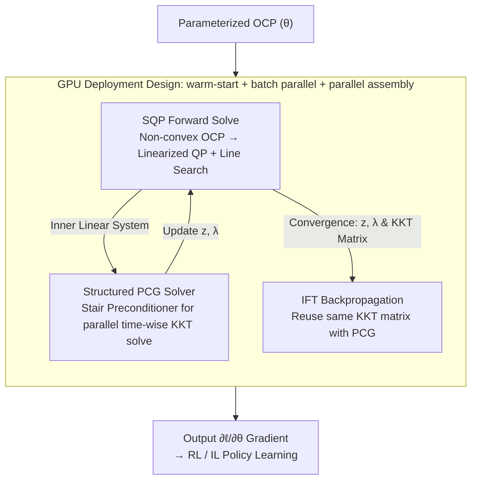

# Differentiable Model Predictive Control on the GPU

**Conference**: ICLR2026  
**OpenReview**: [https://openreview.net/forum?id=bFYfV6c9zu](https://openreview.net/forum?id=bFYfV6c9zu)  
**Code**: https://github.com/ToyotaResearchInstitute/diffmpc  
**Area**: Optimization / Differentiable Optimization / Model Predictive Control  
**Keywords**: Differentiable MPC, GPU Parallelism, Sequential Quadratic Programming, Preconditioned Conjugate Gradient, Implicit Function Theorem

## TL;DR
The authors propose DiffMPC, a solver that completely ports differentiable Model Predictive Control (MPC) to the GPU. By employing Sequential Quadratic Programming (SQP) for the forward pass, a Preconditioned Conjugate Gradient (PCG) with a "stair" preconditioner to solve the KKT linear system in parallel across the time dimension, and the Implicit Function Theorem (IFT) to reuse the same KKT matrix for gradient computation, the method achieves a $4$--$7\times$ speedup on GPU compared to baselines like mpc.pytorch, trajax, and Theseus. It was successfully used to automatically tune parameters via Reinforcement Learning, enabling a Toyota Supra to robustly drift through puddles.

## Background & Motivation
**Background**: Differentiable optimization treats the optimization algorithm as a layer within a neural network, allowing the "solver output" to serve as a structured, constrained inductive bias. This approach reduces data requirements, enforces physical constraints, and enables the automatic tuning of optimizer hyperparameters using data. Differentiable MPC is one of the most widely used branches, covering motion planning, parameter estimation, reinforcement learning, imitation learning, and end-to-end control.

**Limitations of Prior Work**: Optimization algorithms are inherently **serial**. Optimal Control Problems (OCP) possess a "time-sparse" structure, which mainstream differentiable solvers (such as iLQR-based mpc.pytorch, trajax, or Riccati-based methods) exploit through recursion along the time dimension $t=0, \dots, T$. However, recursion is fundamentally serial and fails to achieve acceleration on GPUs, sometimes even performing slower than on CPUs. Other general-purpose differentiable solvers (e.g., Theseus) support GPUs but do not sufficiently exploit the OCP structure, resulting in several orders of magnitude slower performance. Consequently, solvers either fail to leverage GPU speed or fail to exploit problem structure.

**Key Challenge**: There is a **tension between "exploiting time-sparse structure" and "GPU parallelism."** Traditional methods of exploiting sparse structure (Riccati / iLQR recursion) lock the computation into a serial execution, preventing parallelization along the time dimension. To achieve GPU acceleration, a different solving path that is both structure-aware and parallelizable is required.

**Goal**: To build an OCP solver that is **both fast and differentiable on the GPU**, ensuring both the forward pass (solving the OCP) and the backward pass (computing gradients with respect to parameters $\theta$) are fully parallelized, thereby extending differentiable MPC to large-batch, large-data, and high-expressivity learning pipelines.

**Key Insight**: The authors draw inspiration from their previous work, MPCGPU, which uses a **GPU-tailored PCG routine** to solve the linear system derived from OCP optimality conditions. Although PCG is an iterative method, it exposes the time dimension $t$ as a parallelizable dimension and naturally supports warm-starting, which is particularly suitable for the repeated replanning scenarios in MPC.

**Core Idea**: Replace Riccati recursion with a "triad" of SQP (forward), structured PCG (KKT system solving), and IFT (backward). This allows the same parallel-friendly linear solver to serve both forward and backward passes, effectively parallelizing the entire differentiable MPC pipeline on the GPU.

## Method

### Overall Architecture
DiffMPC solves and differentiates a class of parameterized optimal control problems:

$$\text{OCP}:\ \arg\min_{z=(x,u)} \sum_{t=0}^{T} c^{x,\theta}_t(x_t) + \sum_{t=0}^{T-1} c^{u,\theta}_t(u_t)\quad \text{s.t. } f^\theta_t(x_{t+1},x_t,u_t)=0,\ x_0=x^\theta_s,$$

where costs, equality constraints (dynamics), and initial conditions are all determined by parameters $\theta$. The pipeline consists of three components: the **forward pass** uses SQP to iteratively linearize the non-convex OCP into a Quadratic Program (QP) and solve for trajectory $z$; the core of solving the QP is reducing the KKT system to a Schur complement and solving it in parallel via **structured PCG**; the **backward pass** utilizes the Implicit Function Theorem, reusing the KKT matrix already computed in the forward pass and invoking the same PCG to obtain $\partial \ell/\partial\theta$. All matrix assembly, PCG iterations, and line searches are parallelized across both batch and time dimensions and support warm-starting. Finally, DiffMPC acts as a fully differentiable policy that can be embedded directly into Reinforcement Learning (RL) and Imitation Learning (IL).

### Key Designs

**1. SQP Forward Solve: Iteratively Linearizing Non-convex OCP into Parallel QPs**

Since OCPs are generally non-convex, the authors use Sequence Quadratic Programming (SQP) with line search for approximation. At each step, using the current guess $z$ as a baseline, the cost is quadratically approximated and dynamics constraints are linearized to obtain a parameterized QP:

$$\text{QP}:\min_{z}\sum_t \tfrac12 x_t^\top Q_t x_t + q_t^\top x_t + \sum_t \tfrac12 u_t^\top R_t u_t + r_t^\top u_t\quad \text{s.t. } A^+_t x_{t+1}+A_t x_t+B_t u_t=C_t,\ x_0=x_s.$$

Here, $(Q_t, q_t)$ are the second/first-order derivatives of the cost w.r.t. $x_t$, and $(A^+_t, A_t, B_t)$ are the Jacobians of the dynamics w.r.t. $x_{t+1}, x_t, u_t$. **These matrices are assembled in parallel across all problem instances and all time steps $t$**, which is the primary source of GPU friendliness. To ensure $(Q, R)$ are positive definite, they are projected onto the PSD cone. Following standard SQP practices (e.g., Amos 2018), the authors **intentionally ignore the curvature of dynamics constraints**, using only the cost Hessian for $(Q,R)$, relying on line search for descent. Line search is performed in parallel over multiple preset step sizes.

**2. Structured PCG Solver: Solving the KKT System in Parallel via Stair Preconditioner**

This is the engine of DiffMPC. In the KKT matrix $\frac{\partial F}{\partial w}=\begin{bmatrix}G & H^\top\\ H & 0\end{bmatrix}$, $G$ is a block-diagonal cost matrix and $H$ is a banded dynamics matrix. Instead of Riccati recursion, the authors construct the Schur complement $S:=-HG^{-1}H^\top$ and $\gamma:=d+HG^{-1}b$, solving $S\lambda=\gamma$ first and then back-substituting for $z=-G^{-1}(b+H^\top\lambda)$. Crucially, $S$ has a block-tridiagonal structure. They use a **Symmetric Stair Preconditioner** $\Phi^{-1}$ (from Bu & Plancher 2024), which significantly reduces the condition number of $S$ while **maintaining the block-tridiagonal structure**, allowing each matrix-vector multiplication in PCG to be parallelized along time $t$. PCG also inherently supports warm-starting, which saves significant iterations during repeated MPC calls.

**3. IFT Backpropagation: Reusing Forward KKT Matrix for Near-"Free" Gradients**

To compute the gradient w.r.t. $\theta$, the authors use the Implicit Function Theorem (IFT). Given primal-dual solutions $w=(z, \lambda)$ satisfying $F(z, \lambda, \theta)=0$, then $\frac{\partial w}{\partial\theta}=-\big(\frac{\partial F}{\partial w}\big)^{-1}\frac{\partial F}{\partial\theta}$. For most ML tasks requiring the gradient of a scalar loss $\ell(z)$ w.r.t. $\theta$, the Vector-Jacobian Product (VJP) requires solving **one** linear system:

$$\begin{bmatrix}\tilde z\\ \tilde\lambda\end{bmatrix}=\begin{bmatrix}G & H^\top\\ H & 0\end{bmatrix}^{-1}\begin{bmatrix}\partial\ell/\partial z\\ 0\end{bmatrix}.$$

**This system uses the same KKT matrix as the forward QP solve**, merely replacing the right-hand side. Consequently, the KKT matrix, Schur complement, and preconditioner are all pre-computed during the forward pass and passed directly to the backward pass. Running the same structured PCG once more adds negligible "assembly" overhead.

**4. GPU Deployment Design: Warm-start + Batch Parallel + Parallel Assembly**

These engineering choices enable wall-clock speedups:
1.  **Multiple Sources of Parallelism**: All matrices and Schur blocks are assembled in parallel; PCG is parallel along $t$; line search is parallel along step sizes.
2.  **Warm-start and Reuse**: Both SQP and PCG loops can be hot-started with previous solutions; KKT matrices are reused in backpropagation.
3.  **Batch Parallelism**: DiffMPC processes problem instances in batches, compatible with large-batch training.

### Loss & Training
As a differentiable policy $\pi^\theta_{0:T}(x_0):=(u^\theta_0,\dots,u^\theta_T)$, DiffMPC can be integrated into two paradigms: RL, maximizing $\mathbb{E}\big[\sum_{t} R(x_t,\pi^\theta(x_t))\big]$ with states advanced by a differentiable simulator; and IL, minimizing the MSE imitation loss $\mathbb{E}\big[\|(\hat u_0,\dots,\hat u_T)-\pi^\theta_{0:T}(x_0)\|^2\big]$. Unlike black-box policies, it injects physical inductive bias via the dynamics model and the OCP optimization layer.

## Key Experimental Results

### Main Results
DiffMPC was implemented in JAX and compared against three SOTA differentiable solvers: Theseus (PyTorch, Nonlinear Lease Squares), mpc.pytorch (PyTorch, iLQR), and Trajax (JAX, iLQR).

**RL Timing (Randomly generated convex MPC, batch 64, 50 steps, single iteration, average of 10 seeds)**:

| Solver (Device) | Forward (ms) | Backward (ms) | Notes |
| :--- | :--- | :--- | :--- |
| **DiffMPC (GPU)** | **219** | **322** | Backward includes one forward pass |
| DiffMPC (CPU) | 1326 | 2702 | Not advantageous on CPU |
| mpc.pytorch (GPU) | 1909 | 4460 | Riccati recursion, limited GPU gain |
| trajax (GPU) | ~954 / 1828 | — | Fastest baseline, still ~4× slower |
| Theseus (CPU) | >80,000 | — | Failed to exploit sparsity |

DiffMPC is **4×** faster than the fastest baseline on GPU. In other tasks like nonlinear pose stabilization, it achieved **4–7×** speedups over trajax. On CPU, DiffMPC is slower than trajax, confirming that its speed comes from GPU parallelization rather than algorithmic efficiency alone.

**IL (Cart-pole nonlinear dynamics, 200 epochs)**: On GPU, DiffMPC is **~2× faster in wall-clock time** than trajax while maintaining comparable convergence.

### Ablation Study

| Configuration / Item | Key Metric | Description |
| :--- | :--- | :--- |
| Warm-start (PCG tol $10^{-12}$) | +4% Fwd/Bwd | Moderate gains at high precision |
| Warm-start (PCG tol $10^{-4}$) | +11% Fwd / +9% Bwd | Significant in low precision / high-frequency scenarios |
| Drift: Baseline Policy | 70% Success | Manual tuning; prone to spin-outs in puddles |
| Drift: RL Learned Policy | **100%** Success | Rear friction −13%, side-slip cost −58% |

### Key Findings
- **Acceleration stems from GPU parallelism**: DiffMPC does not lead on CPU; only on GPU does it surpass recursive solvers, proving "unrolling time into parallel dimensions" is key.
- **Warm-starting is more valuable in low-precision scenarios**: Gains increase from 4% to ~10% when loosening tolerance, which is particularly beneficial for high-frequency MPC.
- **Learned parameters are physically sensible but hard to tune manually**: The RL agent learned to asymmetryically reduce rear friction and side-slip tracking costs, trading tracking precision for robustness against puddles.
- **Sim-to-Real Transfer**: Policies trained only on figure-8 trajectories transferred to donuts and real-world Toyota Supra puddle crossings without additional tuning, thanks to the MPC inductive bias.

## Highlights & Insights
- **Shifting the solving path, not just the hardware**: Recognizing that Riccati recursion is the bottleneck for GPU acceleration led to the use of Schur complements and structured PCGs. This is a generalizable insight for any differentiable optimization layer with temporal/chain-like sparsity.
- **Forward-Backward KKT Reuse**: Because the linear system for IFT is identical to the forward KKT system, the backpropagation becomes almost "free," which is a significant engineering efficiency for differentiable layers.
- **Stair Preconditioner Balance**: Most preconditioners destroy sparsity or parallel structures; the symmetric stair preconditioner preserves both, serving as the fulcrum for PCG's success on GPUs.
- **Real-world edge-case validation**: Testing on "drifting through puddles"—an unstable, high-variance task—exposed the necessity of large-batch domain randomization enabled by GPU speed.

## Limitations & Future Work
- **Weak Inequality Constraint Support**: Constraints must currently be penalized in the cost or boxed in dynamics. Differentiating through hard constraints remains challenging due to potential gradient discontinuities.
- **In-efficient on CPU**: Optimized for GPU+JAX; Riccati-based methods remain superior for CPU-only deployments.
- **Solver Hyperparameter Sensitivity**: Does not yet support differentiable tuning of the solver's internal parameters (e.g., max iterations).
- **Initialization Sensitivity**: Initial guesses for solutions and parameters can cause divergence, which the authors aim to address via "robust initialization."

## Related Work & Insights
- **vs mpc.pytorch / trajax (iLQR + Riccati)**: These require very large batches to see GPU benefits due to serial recursion. DiffMPC achieves $4$--$7\times$ speedups even at moderate batch sizes.
- **vs Theseus**: While versatile, Theseus fails to exploit OCP-specific structure, resulting in massive slowdowns (80s vs 0.2s).
- **vs MPCGPU (Adabag 2024)**: DiffMPC adopts its PCG routine but adds the missing differentiability via IFT.

## Rating
- **Novelty**: ⭐⭐⭐⭐ Combines existing components in a high-impact way to solve the GPU bottleneck in differentiable control.
- **Experimental Thoroughness**: ⭐⭐⭐⭐ Robust timing and real-car validation, though lacks standard "ablation tables" for all components.
- **Writing Quality**: ⭐⭐⭐⭐ Clear mathematical framework and workflow descriptions.
- **Value**: ⭐⭐⭐⭐⭐ High utility for the learning+control community by significantly increasing differentiable MPC training throughput.

<!-- RELATED:START -->

## Related Papers

- [\[ICLR 2026\] Difference Predictive Coding for Training Spiking Neural Networks](difference_predictive_coding_for_training_spiking_neural_networks.md)
- [\[ICLR 2026\] Multilevel Control Functional](multilevel_control_functional.md)
- [\[ICLR 2026\] Predictive Differential Training Guided by Training Dynamics](predictive_differential_training_guided_by_training_dynamics.md)
- [\[ICLR 2026\] Gradient-Based Diversity Optimization with Differentiable Top-$k$ Objective](gradient-based_diversity_optimization_with_differentiable_top-k_objective.md)
- [\[ICLR 2026\] A Schrödinger Eigenfunction Method for Long-Horizon Stochastic Optimal Control](a_schrödinger_eigenfunction_method_for_long-horizon_stochastic_optimal_control.md)

<!-- RELATED:END -->
