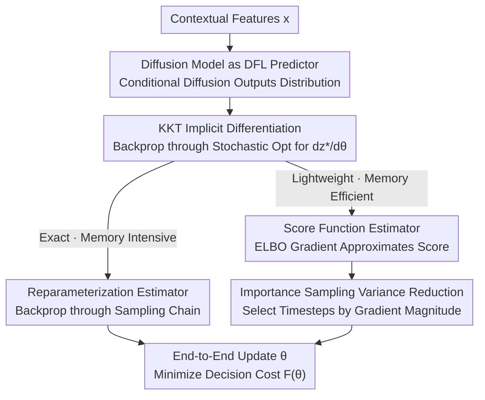

# Diffusion-DFL: Decision-focused Diffusion Models for Stochastic Optimization

**Conference**: ICLR2026  
**OpenReview**: [https://openreview.net/forum?id=uhv3f80jmG](https://openreview.net/forum?id=uhv3f80jmG)  
**Code**: https://github.com/GT-KOALA/Diffusion_DFL  
**Area**: Decision-focused Learning / Stochastic Optimization  
**Keywords**: Decision-focused learning, diffusion models, stochastic optimization, score function estimation, reparameterization

## TL;DR
This paper integrates diffusion models into the Decision-focused Learning (DFL) framework for the first time. It uses conditional diffusion models to characterize the full distribution of uncertain parameters and solves stochastic optimization using samples from this distribution. Two end-to-end gradient algorithms are proposed: an exact but memory-intensive reparameterization estimator, and a lightweight score function estimator that approximates the score function using the gradient of the ELBO, reducing memory usage from 60.75 GB to 0.13 GB. Decision quality consistently outperforms all baselines across three real-world optimization tasks.

## Background & Motivation
**Background**: Many real-world decisions (inventory ordering, power dispatch, portfolio management) follow a "predict-then-optimize" process. Traditional methods use a two-stage pipeline: first training a predictor with losses like MSE, then feeding point predictions into a solver. Decision-focused Learning (DFL) integrates prediction and optimization into an end-to-end objective, using the "minimum final decision cost" as the training signal, which typically leads to lower regret.

**Limitations of Prior Work**: Almost all existing DFL methods rely on **deterministic point predictions**, providing only a scalar or vector estimate for the unknown parameter $y^*$. However, real-world parameters are inherently stochastic and often follow multimodal distributions. Point predictions make models overconfident, degrading decision quality. The paper demonstrates that under risk-averse cost functions, any deterministic solution falls on the **boundary** of the feasible region (extreme decisions), leading to higher expected costs; whereas stochastic optimization solutions reside in the **interior**, averaging the costs of various possible outcomes to achieve lower expected costs.

**Key Challenge**: To characterize uncertainty, an **expressive enough** stochastic predictor is needed to fit complex or multimodal distributions. However, sampling from expressive generative models (like diffusion) is a multi-step sequential process, making end-to-end gradient backpropagation through the sampling chain computationally prohibitive. There is a direct conflict between expressivity and differentiable training cost. Existing attempts at randomization (e.g., Gen-DFL using normalizing flows) are limited by bijective network structures; work using closed-form score functions for DFL (Silvestri et al.) requires scores to have analytical expressions, which diffusion models lack.

**Goal**: (1) Transform the DFL predictor into a diffusion model capable of representing multimodal distributions; (2) Solve the memory and computational bottlenecks of backpropagating through the diffusion sampling chain.

**Key Insight**: Utilize a conditional diffusion model as the stochastic predictor in DFL and formulate the decision task as a stochastic optimization over the diffusion distribution. Instead of backpropagating step-by-step through the sampling chain, reformulate the gradient of the diffusion output using a **score function (gradient of the log-likelihood with respect to parameters)**. Approximate this score using the gradient of the diffusion model's own ELBO training loss to bypass sampling-chain backpropagation.

## Method

### Overall Architecture
The method addresses the following: given contextual features $x$, predict the **distribution** of the unknown parameter $y$ rather than a point value, and then ensure that the "decision obtained via stochastic optimization" minimizes the decision cost $F(\theta)=\mathbb{E}_{(x,y^*)}[f(y^*, z^*_\theta(x))]$ end-to-end.

The pipeline is: context $x$ → conditional diffusion model $P_\theta(\cdot\mid x)$ outputs parameter distribution → sample $y$ from the distribution, solve the constrained stochastic optimization $z^*_\theta(x)=\arg\min_z \mathbb{E}_{y\sim P_\theta}[f(y,z)]$ s.t. $Gz\le h, Az=b$ → calculate decision cost $F(\theta)$ → backpropagate to update diffusion parameters $\theta$.

The difficulty lies in the final backpropagation step: the decision $z^*_\theta$ is implicitly defined by a **nested optimization**. The term $\mathrm{d}z^*_\theta/\mathrm{d}\theta$ in the chain rule must be obtained via implicit differentiation of the KKT system defining $z^*_\theta$ (Amos & Kolter). This KKT system contains an expectation over the diffusion distribution $\mathbb{E}_{y\sim P_\theta}[\nabla_z f]$, where the dependence on $\theta$ is hidden within the distribution. The paper provides two algorithms: a **reparameterization estimator** (exact, expensive) and a **score function estimator** (approximate, cheap), the latter of which is stabilized using **importance sampling for variance reduction**.

### Key Designs

**1. Conditional Diffusion as Stochastic Predictor: Replacing Point Predictions with Full Distributions**

To address the failure of point predictions in representing multimodal uncertainty, the paper replaces the input to the DFL optimization layer from a deterministic $y_\theta(x)$ to a probabilistic model $P_\theta(\cdot\mid x)$. Decisions are found by solving the stochastic optimization $z^*_\theta(x)=\arg\min_z \mathbb{E}_{y\sim P_\theta(\cdot\mid x)}[f(y,z)]$. $P_\theta$ uses a conditional diffusion model (CSDI-style conditioning by Tashiro et al.), where every transition probability is conditioned on $x$. Unlike Gaussian-DFL which only represents unimodal distributions, diffusion models fit multimodal, high-dimensional distributions through a fixed noise chain and a learned denoising chain. This expressivity is the source of the performance gain: in the portfolio task, Gaussian-DFL yields only a 0.10% return, while Diffusion-DFL reaches ~4%.

**2. Reparameterization Estimator: Making Diffusion Sampling a Deterministic Function of θ**

This is the first path for precise distribution gradients. Using the reparameterization trick (Kingma & Welling), a sample is written as a differentiable transformation of base Gaussian noise $y=R(\epsilon,\theta\mid x)$, where $\epsilon\sim P(\epsilon)$, making the diffusion sample differentiable with respect to $\theta$:
$$\nabla_\theta\,\mathbb{E}_{y\sim P_\theta(\cdot\mid x)}[f(y,z)]=\mathbb{E}_{\epsilon\sim P(\epsilon)}\big[(\nabla_\theta R(\epsilon,\theta\mid x))^\top\nabla_y f(y,z)\big].$$
This gradient is fed into the KKT system to solve for $\mathrm{d}z^*_\theta/\mathrm{d}\theta$, and then multiplied by $\mathrm{d}F/\mathrm{d}z^*_\theta$ for the total gradient. While unbiased and exact, the **fatal downside** is the need to backpropagate through the entire diffusion sampling chain (up to 1000 steps), tracking gradients throughout. This incurs massive memory and computational overhead (approx. 60 GB in tests) and can be unstable.

**3. Score Function Estimator: Approximating Score via ELBO Gradient to Avoid Sampling Chain Backprop**

This is the paper's primary contribution to efficiency. The core idea uses the log-derivative trick to rewrite the gradient of the expectation as the expectation of the score function:
$$\nabla_\theta\,\mathbb{E}_{y\sim P_\theta(\cdot\mid x)}[f(y,z)]=\mathbb{E}_{y\sim P_\theta(\cdot\mid x)}\big[f(y,z)\cdot\nabla_\theta\log P_\theta(y\mid x)\big].$$
This requires only the gradient of the log-likelihood of the final output, avoiding step-by-step differentiation through the sampling chain. The challenge is that $\nabla_\theta\log P_\theta(y\mid x)$ has no closed form. The key approximation is **using the gradient of the diffusion ELBO training loss as a proxy for the score**: $\nabla_\theta\log P_\theta(y_0\mid x)\approx\nabla_\theta\,\mathrm{ELBO}(y_0\mid x;\theta)$. The ELBO simplifies to the DDPM denoising MSE $\mathbb{E}_{t,y_0,\epsilon_t}[\lVert\epsilon_t-\epsilon_\theta(y_t,t)\rVert^2]$, which can be evaluated in a single forward noise-injection step. Proposition 5.1 provides an error bound: $\sqrt{2}B(\theta,y_0)\sqrt{\mathrm{KL}(q(y_{1:T}\mid y_0)\Vert p_\theta(y_{1:T}\mid y_0))}$. If the reverse process fits well (low KL), the ELBO gradient is close to the true score. In practice, one samples a final output $y$, then randomly picks $k\ll T$ timesteps for the ELBO gradient. The total gradient is written in an **importance-weighted form** (Eq. 10): $\frac{\mathrm{d}F}{\mathrm{d}\theta}\approx\frac{\mathrm{d}}{\mathrm{d}\theta}\mathbb{E}_y[\,\mathrm{detach}[w_\theta(y)]\cdot\mathrm{ELBO}(y\mid x,\theta)\,]$, where the weight $w_\theta(y)$ is stopped-gradient, and backpropagation occurs only through the ELBO.

**4. Timestep Importance Sampling: Reducing Variance for Multi-step Scores**

Computing the score using only a few timesteps introduces high variance. The paper adopts Timestep Importance Sampling from Improved DDPM (Nichol & Dhariwal). Instead of uniform sampling, timesteps are sampled with probability $p_t\propto\sqrt{\mathbb{E}[\lVert\nabla_\theta\mathrm{ELBO}_t\rVert^2]}$ and weighted by $1/p_t$:
$$\nabla_\theta\mathrm{ELBO}_{\mathrm{IS}}=\mathbb{E}_{t\sim p_t}\Big[\frac{\nabla_\theta(\mathrm{ELBO}_t)}{p_t}\Big],\quad \sum_t p_t=1.$$
This maintains an unbiased estimator while minimizing variance. Intuitively, it assigns **less** weight to early timesteps with large gradients and more to later ones, smoothing out gradient magnitudes.

### Loss & Training
The training objective is the expected decision cost $F(\theta)=\mathbb{E}_{(x,y^*)}[f(y^*,z^*_\theta(x))]$. Diffusion parameters $\theta$ are updated end-to-end using gradients provided by either of the two estimators. Under the score function route, each update requires only a single forward noise-injection pass for $k$ (10–50) samples/timesteps. Constraints ($Gz\le h, Az=b$) are handled via the KKT implicit differentiation, ensuring that decisions remain feasible.

## Key Experimental Results

### Main Results
Three tasks: Synthetic product allocation (risk-averse cost $f=\exp(-y^\top z)$, GMM distribution), 24-hour power dispatch (asymmetric shortage/excess linear cost + quadratic tracking + ramping constraints, 8-year PJM grid data), and S&P 500 portfolio (mean-variance trade-off, 2004–2017 data). Metrics include RMSE and the task loss/returns.

| Task | Metric | Diffusion DFL (Ours) | Gaussian DFL | Deterministic DFL | Best Two-Stage |
|------|------|------|------|------|------|
| Synthetic | Task↓ | **0.362** (SF) / 0.365 (Reparam) | 1.132 | 1.987 | 0.393 (Diffusion TS) |
| Power Dispatch | Task↓ | **3.152** (Reparam) / 3.171 (SF) | 3.724 | 4.324 | 5.580 (Gaussian TS) |
| Stock Portfolio | Task(%)↑ | **4.17%** (Reparam) / 3.98% (SF) | 0.14% | 0.07% | 0.13% (Diffusion TS) |

Ours (both variants) achieve the best or second-best performance across all tasks, significantly outperforming all baselines.

### Ablation Study

| Configuration | Key Metric | Description |
|------|---------|------|
| Reparameterization | Highest decision quality, **~60 GB VRAM** | Backprops through all diffusion steps; exact but expensive. |
| Score Function (50 samples) | Task loss diff <0.02 vs Reparam, **~0.13 GB VRAM** | Memory usage reduced by orders of magnitude; nearly identical performance. |
| Score Function (10 samples) | Slightly worse but still better than deterministic | Sufficient even with very few samples. |
| SF Uniform Timesteps | High gradient variance, unstable training | Highlights the necessity of variance reduction. |
| SF + Timestep IS | Significantly more stable learning curves | Unbiased + minimum variance. |

### Key Findings
- **Score Function is most cost-effective**: VRAM usage drops from 60.75 GB → 0.13 GB while decision quality remains nearly identical to reparameterization, making Diffusion-DFL practical for complex problems.
- **Stochastic > Deterministic**: Modeling uncertainty outperforms deterministic DFL in every task, most notably in the portfolio task (0.07% → ~4%).
- **Diffusion > Gaussian**: The ability to represent multimodal distributions is the core source of decision quality; Gaussian-DFL suffers due to its unimodal assumption.
- **Comparison to Offline Contextual Bandits**: While bandits can outperform two-stage methods by optimizing the downstream objective directly, they lag behind Diffusion-DFL because they ignore optimization structure and constraints.

## Highlights & Insights
- **Replacing Sampling-Chain Backprop with ELBO Gradients**: The combination of the log-trick and the ELBO proxy for the score is the key to radical memory reduction, supported by a theoretical KL divergence bound.
- **Engineering Importance Weighting + Stop-Gradient**: The complex total KKT gradient is encapsulated into a plug-and-play PyTorch autograd module, returning optimal decisions in the forward pass and gradients in the backward pass.
- **Integration of Diffusion and Predict-then-Optimize**: While diffusion has been used in combinatorial or black-box optimization, this is the first end-to-end integration into DFL, providing a new paradigm for "uncertainty modeling + decision making."
- **Repurposing Timestep Importance Sampling**: Borrowing variance reduction from Improved DDPM to solve high variance in score estimation is an elegant cross-domain application.

## Limitations & Future Work
- **Reliance on Differentiable/Convex Optimization Layers**: The decision gradient relies on KKT implicit differentiation; the main text covers affine constraints, while the appendix discusses general convex constraints. Non-convex or combinatorial solvers might not be directly applicable.
- **Biased Approximation in Score Estimation**: The ELBO gradient proxy for the score is an approximation. If the reverse diffusion process fits poorly (large KL), the approximation accuracy may degrade.
- **Task Scale and Diversity**: The dimensionality of tasks is relatively small ($d=10$ for synthetic, 24 for Power, 50 for Portfolio). Performance on higher-dimensional, highly non-stationary real-world systems remains to be validated.
- **Future Directions**: Extending the score function estimator to non-convex solvers, adaptively selecting the number of samples $k$, and combining with fast sampling diffusion (few-step sampling) to further reduce costs.

## Related Work & Insights
- **vs. Gen-DFL (Wang et al. 2025)**: Both aim to introduce stochastic predictors to DFL, but Gen-DFL uses normalizing flows which are limited by bijective architectures. Diffusion models are more expressive and can better fit multimodal distributions.
- **vs. Silvestri et al. 2026**: Their work extends DFL to non-differentiable solvers but requires analytical score functions. This paper enables the score function route for diffusion models, which lack closed-form scores, using the ELBO gradient proxy.
- **vs. Deterministic DFL (Donti et al. 2017)**: Classic DFL optimizes decisions but uses point predictions, struggling in high-dimensional or risk-sensitive scenarios. This work fixes this expressivity deficit using full distributions.

## Rating
- Novelty: ⭐⭐⭐⭐⭐ 
- Experimental Thoroughness: ⭐⭐⭐⭐ 
- Writing Quality: ⭐⭐⭐⭐ 
- Value: ⭐⭐⭐⭐⭐ 

<!-- RELATED:START -->

## Related Papers

- [\[ICLR 2026\] Gen-DFL: Decision-Focused Generative Learning for Robust Decision Making](gen-dfl_decision-focused_generative_learning_for_robust_decision_making.md)
- [\[ICLR 2026\] NExCO: Native Solution Expansion for Diffusion-based Combinatorial Optimization](nexco_native_solution_expansion_for_diffusion-based_combinatorial_optimization.md)
- [\[ICLR 2026\] Faster Gradient Methods for Highly-Smooth Stochastic Bilevel Optimization](faster_gradient_methods_for_highly-smooth_stochastic_bilevel_optimization.md)
- [\[CVPR 2026\] Learning to Learn Weight Generation via Local Consistency Diffusion](../../CVPR2026/optimization/learning_to_learn_weight_generation_via_local_consistency_diffusion.md)
- [\[ICLR 2026\] SPREAD: Efficient Sampling-based Adaptive Diffusion Pareto Frontier Refinement](spread_sampling-based_pareto_front_refinement_via_efficient_adaptive_diffusion.md)

<!-- RELATED:END -->
