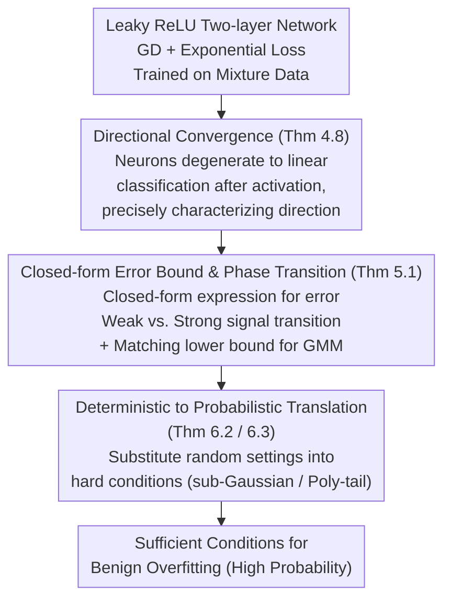

# Directional Convergence, Benign Overfitting of Gradient Descent in leaky ReLU two-layer Neural Networks

**Conference**: ICLR2026  
**arXiv**: [2505.16204](https://arxiv.org/abs/2505.16204)  
**Code**: None  
**Area**: Optimization  
**Keywords**: benign overfitting, directional convergence, leaky ReLU, implicit bias, gradient descent, neural networks

## TL;DR

This paper provides the first proof of directional convergence for gradient descent in leaky ReLU two-layer neural networks. Based on this, it establishes sufficient conditions for benign overfitting under a broad mixture data setting that significantly exceeds nearly orthogonal data while identifying a new phase transition phenomenon.

## Background & Motivation

Benign overfitting is a surprising theoretical phenomenon in deep learning: overparameterized neural networks can perfectly interpolate training data (including noisy labels) while maintaining low error on the test set. This phenomenon challenges the traditional understanding of the bias-variance tradeoff in classical statistics.

While benign overfitting is well-understood in classical models such as linear regression, linear classification, and kernel methods, research on neural networks remains limited. The core difficulty lies in precisely characterizing the implicit bias of gradient descent for ReLU-type networks. In linear classification, gradient descent training with logistic/exponential loss converges directionally to the maximum margin classifier, a property crucial for analyzing benign overfitting. However, for ReLU networks, directional convergence of gradient descent has never been proven—existing results are restricted to gradient flow or smooth approximations of leaky ReLU.

## Core Problem

1.  **Directional Convergence**: Can directional convergence of gradient descent be proven in non-smooth leaky ReLU two-layer networks, and can the convergence direction be precisely characterized?
2.  **Scope of Benign Overfitting**: Can theoretical guarantees for benign overfitting be generalized from nearly orthogonal data to more general mixture data settings?
3.  **Tightness and Failure Conditions**: When does benign overfitting necessarily fail? Are existing upper bounds tight?

## Method

### Overall Architecture

The analysis focuses on a two-layer leaky ReLU network with fixed width $m$: $f(\boldsymbol{x};W) = \sum_{j=1}^m a_j \phi(\langle \boldsymbol{x}, \boldsymbol{w}_j \rangle)$, where $\phi$ is $\gamma$-leaky ReLU. The second-layer weights are fixed at $a_j = \pm 1/\sqrt{m}$, and only the first-layer weights are trained using gradient descent on the exponential loss $\ell(u)=\exp(-u)$ with data from a mixture model $\boldsymbol{x} = y\boldsymbol{\mu} + \boldsymbol{z}$. The logical progression is step-by-step: first proving directional convergence and characterizing the direction for non-smooth networks, then substituting this direction into a closed-form classification error bound, and finally translating deterministic conditions into probabilistic ones to obtain high-probability guarantees for benign overfitting.

### Key Designs

**1. Directional Convergence: Reducing Non-smooth Training Dynamics to Linear Classification**

This is the central technical breakthrough and the foundation for all subsequent conclusions. The difficulty lies in the non-smoothness of leaky ReLU; previous works could only discuss directional convergence under gradient flow or smooth approximations. The authors (Theorem 4.8) fill this gap under two conditions: first, the **positive correlation** case, occurring when the signal $\boldsymbol{\mu}$ is strong enough to satisfy $\langle y_i \boldsymbol{x}_i, y_k \boldsymbol{x}_k \rangle \geq 0$ for all training samples, breaking previous signal strength constraints; second, the **nearly orthogonal** case, encompassing existing results as special cases. The core mechanism is "neuron activation"—by setting the initialization scale significantly smaller than the step size, all neurons are guaranteed to activate after the first gradient descent step ($t=1$), i.e., $a_j y_i \langle \boldsymbol{x}_i, \boldsymbol{w}_j \rangle > 0$. Once activation patterns are fixed, optimization reduces to a linear classification problem in a transformed space, allowing the application of classical results from Soudry et al. (2018). The final convergence direction is characterized as the unique solution to a strictly convex constrained optimization problem, resulting in a network with a linear decision boundary.

**2. Closed-form Error Bounds and Phase Transitions: Signal Strength as a Switch for Generalization**

With the precise convergence direction, the authors (Theorem 5.1) derive a closed-form expression for classification error and discover a previously unrevealed **phase transition**. Defined by the comparison between $n\|\boldsymbol{\mu}\|^2$ and the noise magnitude $R$: when $n\|\boldsymbol{\mu}\|^2 \lesssim R$, the model is in the **weak signal regime** where noise dominates (matching nearly orthogonal settings); when $n\|\boldsymbol{\mu}\|^2 \gtrsim R$, it enters the **strong signal regime** where the signal dominates and the error bound form changes. Furthermore, for Gaussian Mixture Models (GMM), the authors provide matching upper and lower bounds, proving the tightness of the error bound and clarifying when benign overfitting must fail. This phase transition is an inherent characteristic of the model rather than an artifact of the analysis.

**3. Deterministic to Probabilistic Translation: Extending to Broader Distribution Families**

The first two steps provide deterministic conditions, which are then applied to stochastic settings (Theorems 6.2 and 6.3) to obtain high-probability guarantees. For **sub-Gaussian mixture models**, benign overfitting holds with high probability, and in the isotropic Gaussian strong signal regime, the error bound differs from the Bayes optimal by only a constant. More importantly, it generalizes to **polynomial tail mixture models**: the authors relax assumptions from sub-Gaussian or bounded log-Sobolev constants to heavier-tailed distributions, requiring only $\mathbb{E}|\xi_j|^r \leq K$ for $r \in (2,4]$. This layered design allows the same theory to cover a wider range of distribution classes.

## Key Experimental Results

This is a purely theoretical work with no numerical experiments. Principal results are provided as theorems:

| Aspect | Prev. SOTA | Ours |
|------|------------|---------|
| Directional Convergence (GD) | Gradient flow or smooth approx only | First proof for non-smooth leaky ReLU |
| Data Setting | Nearly orthogonal data | Mixture data (including strong signal) |
| Distribution Assumptions | sub-Gaussian / bounded log-Sobolev | Extended to polynomial tail distributions |
| Network Width | $m$ must grow with $n$ | Fixed width $m$ |
| Error Lower Bound | None | Matching lower bound for Gaussian mixtures |

## Highlights & Insights

1.  **First Proof of Directional Convergence**: This is the first work to prove directional convergence for gradient descent (rather than gradient flow) in ReLU-type networks and precisely characterize the direction.
2.  **Decoupling Determinism and Probability**: Core theorems are presented in deterministic form before being applied to stochastic settings, making the framework extensible to more distribution classes.
3.  **Discovery of Phase Transition**: Reveals the weak-to-strong signal phase transition in two-layer networks and proves it is an inherent model feature via upper/lower bound duality.
4.  **Fixed-width Networks**: Does not require width $m$ to grow with $n$, moving beyond the NTK/lazy training regime.

## Limitations & Future Work

1.  **Limited to Two-layer Networks**: Extending to deep networks is a clear open direction but technically challenging.
2.  **No Label Noise**: The work does not consider label-flip noise; the authors conjecture the weak signal regime would remain stable, but the strong signal regime might be significantly affected.
3.  **Fixed Second Layer**: Only the first layer is trained while the second is fixed to $\pm 1/\sqrt{m}$, which is a standard but simplifying assumption in the field.
4.  **Strong Initialization Condition**: Requires initialization to be much smaller than the step size to ensure first-step activation, which is a technical requirement.
5.  **No Numerical Verification**: Purely theoretical work lacks experimental validation to intuitively assess the tightness of bounds in practice.

## Related Work & Insights

| Work | Optimization | Directional Conv. | Data Setting | Distribution |
|------|---------|---------|---------|---------|
| Frei et al. (2022) | GD | Smooth approx | Near-orthogonal | sub-Gaussian |
| Frei et al. (2023b) | GF | ✓ | Near-orthogonal | sub-Gaussian |
| Xu & Gu (2023) | GD | Partial | Near-orthogonal | Bounded log-Sobolev |
| Cai et al. (2025) | GD | ✓ (Requires $C^2$) | - | - |
| **Ours** | **GD** | **✓ (Non-smooth)** | **Mixture (incl. strong)** | **Polynomial tail** |

The positioning of this work is clear: it advances known results across all key dimensions (optimization method, data breadth, distribution assumptions, and network width).

## Rating
- Novelty: ⭐⭐⭐⭐⭐ (First proof of GD directional convergence in ReLU-type networks)
- Experimental Thoroughness: ⭐⭐ (Pure theory, no experiments)
- Writing Quality: ⭐⭐⭐⭐ (Clear structure, effective comparison in Table 1)
- Value: ⭐⭐⭐⭐⭐ (Fills a critical theoretical gap with lasting impact)

<!-- RELATED:START -->

## Related Papers

- [\[ICLR 2026\] On the Convergence Direction of Gradient Descent](on_the_convergence_direction_of_gradient_descent.md)
- [\[ICLR 2026\] Fast Convergence of Natural Gradient Descent for Over-parameterized Physics-Informed Neural Networks](fast_convergence_of_natural_gradient_descent_for_over-parameterized_physics-info.md)
- [\[ICLR 2026\] Deep-ICE: The First Globally Optimal Algorithm for Minimizing 0–1 Loss in Two-Layer ReLU and Maxout Networks](deep-ice_the_first_globally_optimal_algorithm_for_empirical_risk_minimization_of.md)
- [\[ICML 2026\] Sharp Description of Local Minima in the Loss Landscape of High-Dimensional Two-Layer ReLU Networks](../../ICML2026/optimization/sharp_description_of_local_minima_in_the_loss_landscape_of_high-dimensional_two-.md)
- [\[AAAI 2026\] On the Learning Dynamics of Two-Layer Linear Networks with Label Noise SGD](../../AAAI2026/optimization/on_the_learning_dynamics_of_two-layer_linear_networks_with_label_noise_sgd.md)

<!-- RELATED:END -->
