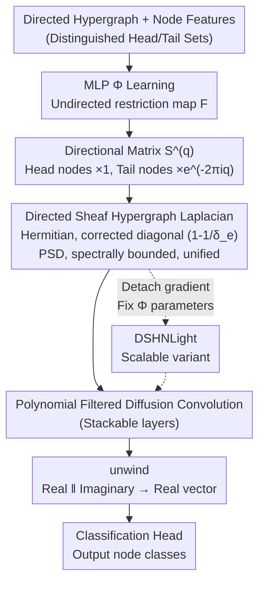

# Directional Sheaf Hypergraph Networks: Unifying Learning on Directed and Undirected Hypergraphs

**Conference**: ICLR 2026  
**arXiv**: [2510.04727](https://arxiv.org/abs/2510.04727)  
**Code**: [GitHub](https://github.com/EmaMule/DirectionalSheafHypergraphs)  
**Area**: Others  
**Keywords**: sheaf neural networks, directed hypergraphs, Laplacian, spectral methods, heterophily

## TL;DR

This paper proposes Directional Sheaf Hypergraph Networks (DSHN), which combine Cellular Sheaf theory with the directional information of directed hypergraphs to construct a complex-valued Hermitian Laplacian operator. This operator unifies and generalizes existing graph and hypergraph Laplacians, achieving a relative accuracy improvement of 2%–20% across 7 real-world datasets.

## Background & Motivation

**High-order interaction modeling in hypergraphs**: Many real-world systems exhibit high-order relationships between multiple entities, which traditional graphs can only represent as pairwise relationships. Hypergraphs model multi-way interactions by connecting multiple nodes via hyperedges.

**Limitations of undirected hypergraphs**: Most HGNNs only process undirected hypergraphs, ignoring potential directionality within hyperedges (e.g., reactants $\rightarrow$ products in chemical reactions, or initiator $\rightarrow$ receiver in causal interactions).

**Sheaf theory to alleviate heterophily**: By assigning vector spaces and learnable restriction maps to nodes and edges, Sheaf theory effectively mitigates over-smoothing and heterophily. However, existing Sheaf hypergraph methods do not support directed hypergraphs.

**Spectral property defects in existing SHNs**: The Sheaf Hypergraph Laplacian proposed by Duta et al. (2023) does not satisfy positive semi-definiteness, making it an invalid convolution operator.

**Success of directed graph methods**: Magnetic Laplacians use complex-valued phases to encode direction, but these have not been generalized to hypergraphs.

## Method

### Overall Architecture

The problem DSHN aims to solve is that existing Sheaf hypergraph networks can only handle undirected hyperedges—discarding directional roles like "reactant $\rightarrow$ product"—while the few existing directed methods lack the ability of sheaves to mitigate heterophily. DSHN integrates both into a single complex-valued operator. The pipeline operates as follows: first, for an input directed hypergraph, an MLP learns an undirected restriction map for each node-hyperedge pair; then, a directional matrix $\mathcal{S}^{(q)}$ controlled by a phase parameter $q$ "colors" the maps (head nodes remain unchanged, tail nodes are multiplied by a complex phase), making the maps complex-valued. These complex maps are assembled into a Hermitian Directed Sheaf Hypergraph Laplacian. The paper proves it is positive semi-definite (PSD) and spectrally bounded, making it a valid spectral convolution kernel. Using this for polynomial filtered diffusion convolution, several layers are stacked, and the complex features are finally unwound into real vectors for the classification head. The core insight is making "direction" and "sheaf heterophily modeling" compatible within a single operator while maintaining all mathematical properties required for spectral convolution.

### Key Designs

**1. Directional Matrix $\mathcal{S}^{(q)}$: Distinguishing Head/Tail Nodes via Complex Phases**

In undirected hypergraphs, nodes are symmetric relative to hyperedges, failing to express roles like "reactant" or "product." Borrowing from Magnetic Laplacians, DSHN transforms an undirected restriction map $\mathcal{F}_{u\trianglelefteq e}$ into a directed map $\vec{\mathcal{F}}_{u\trianglelefteq e}=\mathcal{S}^{(q)}_{u\trianglelefteq e}\mathcal{F}_{u\trianglelefteq e}$ by multiplying it with a complex coefficient: $1$ for head nodes and $e^{-2\pi i q}$ for tail nodes. A single phase (charge) parameter $q$ controls the intensity of directional information. When $q=0$, all coefficients reduce to the real number $1$, reclaiming the undirected sheaf case (as defined by Duta et al. 2023). When $q=1/4$, the tail node coefficient becomes the purely imaginary $e^{-\pi i/2}$, encoding directional differences into the imaginary part, aligned with the Magnetic Laplacian on directed graphs. This scalar parameter injects directionality in a controllable and reducible manner, maintaining compatibility with undirected data while providing discriminative power via phase for directed data.

**2. Directed Sheaf Hypergraph Laplacian: Correcting the Diagonal for a Valid Operator**

DSHN assembles the complex maps and hyperedge structure into a Laplacian $\mathbf{L}^{\vec{\mathcal{F}}} = \mathbf{D}_V - \mathbf{B}^{(q)\dagger}\mathbf{D}_E^{-1}\mathbf{B}^{(q)}$, where $\mathbf{B}^{(q)}$ is the incidence block matrix with directional phases, and $\mathbf{D}_V, \mathbf{D}_E$ are node and hyperedge degree matrices. The diagonal blocks are real-valued (node self-information), while off-diagonal blocks are complex-valued for directed hyperedges (directional neighbor coupling). A critical correction is made to the diagonal coefficients: whereas Duta et al. (2023) used $\tfrac{1}{\delta_e}$, DSHN changes this to $(1-\tfrac{1}{\delta_e})$ (where $\delta_e$ is hyperedge size). This difference—valid only on 2-uniform hypergraphs (graphs) in the previous work—allows the operator to avoid negative eigenvalues and remain PSD on general hypergraphs. With $(1-\tfrac{1}{\delta_e})$, $\mathbf{L}^{\vec{\mathcal{F}}}$ becomes a truly Hermitian operator.

**3. Spectral Properties and Unified Generalization: A Valid Kernel and Base Framework**

Hermiticity alone is insufficient; for spectral convolution, a Laplacian must be diagonalizable, have real non-negative eigenvalues, be PSD, and be spectrally bounded. DSHN proves $\mathbf{L}^{\vec{\mathcal{F}}}$ satisfies all these: Hermiticity ensures unitary diagonalizability and real eigenvalues; the non-negativity of the Dirichlet energy proves the PSD property. This ensures the Graph Fourier Transform is well-defined and polynomial filters are stable in the spectral domain, allowing safe stacking without divergence—something Duta et al. (2023) could not achieve due to negative eigenvalues. This operator also exhibits strong universality: with specific parameters, it reduces to standard hypergraph Laplacians (trivial sheaf), Graph Sheaf Laplacians (graph structure), or Magnetic Laplacians (no sheaf, keeping phase), and covers Zhou's hypergraph Laplacian and GeDi Laplacian.

**4. DSHNLight: Scaling via Gradient Detachment**

The bottleneck of the full DSHN is that a Laplacian constructed from $d\times d$ restriction maps has a scale of $nd\times nd$. Rebuilding it at every step because maps update with training is expensive. DSHNLight detaches the gradient during Laplacian construction and fixes the parameters of the MLP $\Phi$ (essentially a random projection). The model's adaptivity is shifted to the initial projection layer. This significantly reduces computational costs, while experiments show its performance is comparable to or occasionally better than the full version, echoing observations from Extreme Learning Machines that random features can be highly effective.

### Loss & Training

Standard cross-entropy loss is used for node classification. The restriction maps are learned by an MLP $\Phi$ that takes the concatenation of node and hyperedge features as input $\mathcal{F}_{v\trianglelefteq e}=\Phi(\mathbf{x}_v\,\|\,\mathbf{x}_e)$. Since features are complex-valued after the first layer, an $\mathrm{unwind}$ operation $\mathrm{unwind}(\mathbf{X})=\Re(\mathbf{X})\,\|\,\Im(\mathbf{X})$ is applied to concatenate the real and imaginary parts into a real vector before passing them to $\Phi$ or the final classification head.

## Key Experimental Results

### Main Results

Node classification accuracy compared against 13 baselines on 7 datasets:

| Dataset | DSHN Relative Improvement over Best Baseline |
|---------|---------------------------------------------|
| Cora (co-auth) | ~2% |
| Citeseer (co-auth) | ~5% |
| Senate-committees | ~8% |
| House-committees | ~4% |
| Walmart-trips | ~20% |
| Zoo | ~3% |
| 20Newsgroups | ~2% |

### Ablation Study

| Variant | Effect |
|---------|--------|
| $q=0$ (Undirected) | Reduces to undirected sheaf method, performance drops |
| $q=1/4$ (Standard Phase) | Best performance on directed data |
| Trivial sheaf ($\mathcal{F}=I$) | Reduces to directed hypergraph Laplacian, significant performance drop |
| DSHNLight | Efficient, performance close for most datasets |

### Key Findings

- The combination of directionality and Sheaf modeling is significantly better than using either alone.
- The Laplacian in Duta et al. (2023) indeed possesses negative eigenvalues (counter-examples provided in the appendix).
- The random projection strategy in DSHNLight is surprisingly effective.
- The advantage is most pronounced on datasets with high heterophily.

## Highlights & Insights

1. A complex-valued Hermitian operator unifies multiple existing Laplacian definitions.
2. Formally corrected the spectral property defects in Duta et al. (2023).
3. The paradigm of encoding directional information via complex phases naturally generalizes from directed graphs to hypergraphs.
4. DSHNLight aligns with Extreme Learning Machine concepts, showing that random features are effective in graph learning.

## Limitations & Future Work

- Scalability issues of $nd \times nd$ Laplacians.
- The parameter $q$ is global; it does not learn a different $q$ for each hyperedge.
- Experiments are restricted to node classification.
- Real-world directed hypergraph datasets are scarce.
- Lacks expressive power analysis at the WL-hierarchy level.

## Related Work & Insights

- **Hansen & Gebhart (2020)**: Graph Sheaf NN $\rightarrow$ Extended to directed hypergraphs in this work.
- **Zhang et al. (2021)**: Magnetic Laplacian $\rightarrow$ Extended to hypergraphs + sheaves in this work.
- **Duta et al. (2023)**: SheafHyperGNN $\rightarrow$ Corrected spectral property flaws in this work.
- **Insight**: The complex-valued Hermitian + Sheaf paradigm can be extended to more general topological structures like simplicial complexes.

## Rating

- **Novelty**: ⭐⭐⭐⭐ Theoretical value in combining Sheaf and directed hypergraphs with unification results.
- **Experimental Thoroughness**: ⭐⭐⭐⭐ 7 datasets, 13 baselines, complete ablation studies.
- **Writing Quality**: ⭐⭐⭐⭐ Clear mathematical derivation, precise definitions despite heavy notation.
- **Value**: ⭐⭐⭐⭐ Corrected existing method flaws and provided a unified framework.

<!-- RELATED:START -->

## Related Papers

- [\[ICLR 2026\] Unifying Formal Explanations: A Complexity-Theoretic Perspective](unifying_formal_explanations_a_complexity-theoretic_perspective.md)
- [\[ICLR 2026\] Directional Convergence, Benign Overfitting of Gradient Descent in leaky ReLU two-layer Neural Networks](directional_convergence_benign_overfitting_of_gradient_descent_in_leaky_relu_two.md)
- [\[CVPR 2026\] DC-Merge: Improving Model Merging with Directional Consistency](../../CVPR2026/optimization/dc-merge_improving_model_merging_with_directional_consistency.md)
- [\[ICLR 2026\] Entropic Confinement and Mode Connectivity in Overparameterized Neural Networks](entropic_confinement_and_mode_connectivity_in_overparameterized_neural_networks.md)
- [\[ICLR 2026\] Rapid Training of Hamiltonian Graph Networks using Random Features](rapid_training_of_hamiltonian_graph_networks_using_random_features.md)

<!-- RELATED:END -->
