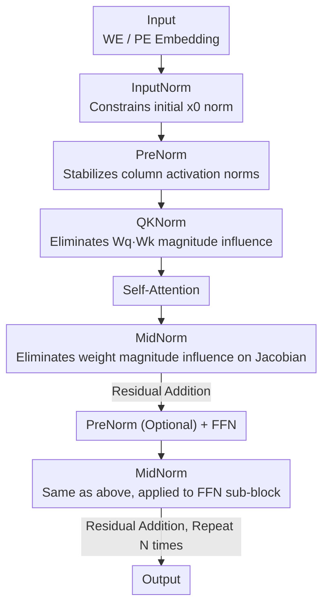

# DNT: a Deeply Normalized Transformer that can be trained by Momentum SGD

**Conference**: ICLR2026  
**OpenReview**: [https://openreview.net/forum?id=62pn18XmAg](https://openreview.net/forum?id=62pn18XmAg)  
**Code**: TBD  
**Area**: optimization  
**Keywords**: Transformer Optimization, Momentum SGD, Normalization, Heavy-tailed Gradients, Jacobian Analysis  

## TL;DR
Starting from the analysis of the Jacobian matrix, this paper clarifies the source of "heavy-tailed gradients" during Transformer training. By redesigning the DNT architecture with normalization operators at appropriate positions (InputNorm + PreNorm + QKNorm + MidNorm), the authors enable training with vanilla momentum SGDW. The performance matches AdamW (ImageNet 81.5% vs 82.1%, OpenWebText val loss 2.849 vs 2.863) while saving half of the optimizer's memory.

## Background & Motivation
**Background**: Transformers have become the de facto standard backbone for modern deep learning, but training them almost exclusively requires advanced optimizers with adaptive learning rates like Adam / AdamW. Classical SGD and its momentum variants (mSGD) typically perform significantly worse when training Transformers. Consequently, even though Adam's optimizer states occupy double the memory (first + second moments) compared to mSGD, it remains the standard for large-scale and multimodal models.

**Limitations of Prior Work**: While mSGD is memory-efficient and simple, it fails to train Transformers effectively. Existing research (Simsekli et al. 2019; Zhang et al. 2020) suggests the root cause is the **heavy-tailed distribution** of stochastic gradients in Transformers—the magnitudes of gradient elements span a wide range, causing "asynchrony" among components during weight updates. Adam is robust because it performs element-wise normalization by dividing the first moment by the square root of the second moment, naturally suppressing the heavy tail. In contrast, mSGD updates directly using the first-order momentum gradient, making it unable to handle such vast magnitude disparities.

**Key Challenge**: The problem appears to be the "optimizer," but the root lies in the "architecture." By expanding the gradient backpropagation, the authors found that the true source of the heavy tail is the **excessive dispersion of singular values** in the Jacobian matrix $\frac{\partial x_{l+1}}{\partial x_l}$ for each layer (i.e., a large condition number). This is determined jointly by the singular value distribution of the weight matrices and the magnitude range of reflections. Instead of using more complex optimizers to "put out fires" post-hoc, it is better to directly constrain the Jacobian within the architecture to keep gradients naturally concentrated.

**Goal**: Can mSGD achieve performance levels comparable to Adam on Transformers? Under what conditions? This is decomposed into two sub-problems: (1) what is the root cause of heavy-tailed gradients; and (2) how can normalization be used to specifically tame the Jacobian.

**Key Insight**: Instead of inventing new normalizations, the authors derive how five normalizations at **different positions**—InputNorm, PreNorm, MidNorm, PostNorm, and QKNorm—act on the Jacobian. They identify which ones suppress weight magnitudes, which suppress activation norms, and which suppress the joint influence of $W_q^\top W_k$, finally assembling the "beneficial" ones.

**Core Idea**: Place normalization operators in the "right positions" to constrain the Jacobian matrix term-by-term. This concentrates the gradient distribution and eliminates the heavy tail, allowing vanilla mSGDW to match AdamW in training Transformers—this is the Deeply Normalized Transformer (DNT).

## Method

### Overall Architecture
The starting point of DNT is a strictly expanded factual derivation: for a forward layer $x_l = W^l x_{l-1}$, the weight gradient satisfies

$$\frac{\partial L}{\partial W^l} = \frac{\partial L}{\partial x_{l+1}}\frac{\partial x_{l+1}}{\partial x_l} x_{l-1\top},$$

Thus, **whether the gradient is heavy-tailed depends on whether the singular values of the Jacobian $\frac{\partial x_{l+1}}{\partial x_l}$ are dispersed**. Dispersion arises from two sources: the large singular value span of the weight matrix itself and the large magnitude span of activations. To suppress the heavy tail, one must separately constrain "weight magnitude influence," "activation norm influence," and "their joint influence." DNT accomplishes this by placing four types of normalization at corresponding positions within the Transformer.

The forward flow is as follows: Token/Patch Embedding (WE/PE) → **InputNorm** (taming the initial activation $x_0$ norm) → $N$ stacked blocks. Within each block: **PreNorm** → Self-Attention with **QKNorm** → **MidNorm** → Residual Addition, then (optional PreNorm) → FFN → **MidNorm** → Residual Addition → Repeat $N$ times → Output. Notably, DNT **deliberately avoids PostNorm** (normalization after residual addition) because it is overly sensitive to activation norms and prone to training instability. The vision version is V-DNT (using patch embedding), and the language version is L-DNT (using word embedding + attention mask).

### Key Designs

**1. InputNorm: Fixing the norm of initial activation $x_0$ in a reasonable range**

In the expanded residual structure of a Transformer, the activation at layer $l$ is $x_{l+1} = x_0 + f(x_0) + \cdots + f(x_l)$. Under high-dimensional "near-orthogonality" assumptions, its norm satisfies $\|x_{l+1}\|_2 \asymp \sqrt{\|x_0\|_2^2 + \|f(x_0)\|_2^2 + \cdots}$. This means the **initial term $\|x_0\|_2^2$ is carried through every layer**. In the Jacobian of a normalization layer $\frac{\partial \mathrm{RMSN}(x)}{\partial x} = \frac{\sqrt{d}}{\sqrt{\|x\|_2^2+\epsilon}}\mathrm{diag}(\gamma)\big(I - \frac{xx^\top}{\|x\|_2^2+\epsilon}\big)$, there is a factor of $\frac{1}{\|x\|_2}$. If $x_0$ is too large, gradients in subsequent layers vanish; if $x_0$ is too small, gradients explode (Proposition 1). InputNorm normalizes the embedding before entering the backbone to limit the norm of $x_0$, cutting off this "norm contagion" at the source. This is a key difference between DNT and nGPT—nGPT uses many PostNorms but lacks InputNorm.

**2. PreNorm: Stabilizing activation column norms before attention to indirectly stabilize $W_q, W_k, W_v$ gradients**

The Jacobian of self-attention $Y = W_v X A$ with respect to input $X$ (Eq. 5) is highly dependent on the norms of column vectors $x_j$. PreNorm scales each column to $x_j' = \alpha_j x_j$ (where $\alpha_j$ is a normalization scalar). The paper proves (Proposition 2) that for fixed $W_q, W_k, W_v$, the Jacobian of attention with respect to $X$ is identical to that of normalized $X'$. Thus, normalization removes "column norm" as a perturbation factor from the Jacobian. Stable norms lead to a stable Jacobian; since the gradients of $W_q, W_k, W_v$ all directly contain $X$, stabilizing activation column norms also stabilizes the gradients of these three projection matrices. This is why PreNorm cannot be replaced by QKNorm: QKNorm does not affect $W_v$, whose gradient is equally influenced by $X$.

**3. QKNorm: Eliminating the joint influence of $W_q, W_k$ magnitudes to avoid attention collapse**

QKNorm is applied to queries and keys: $q_i' = \sqrt{d_h}\,\mathrm{diag}(\gamma_q)\frac{W_q x_i}{\|W_q x_i\|_2}$, and similarly for keys. Deriving the gradient of the logit term $P_{ij}' = q_i'^\top k_j'$ with respect to the input (Eq. 11) yields Proposition 5: under high-dimensional random assumptions, $\frac{\partial P_{ij}'}{\partial x}$ **is independent of the magnitudes of $W_q, W_k$**. This is critical—during training, the maximum singular value of $W_q^\top W_k$ often expands rapidly, which is considered a root cause of rank/entropy collapse (model crash). QKNorm strips this joint magnitude factor from the gradient, suppressing the risk of model collapse. However, since it only handles $W_q$ and $W_k$, PreNorm is still needed to handle the parts containing $W_v$ that depend on $X$.

**4. MidNorm: Making sub-block Jacobians dependent only on weight "shape," not "magnitude"**

MidNorm is placed after the output of self-attention/FFN and before residual addition. Taking FFN ($z = W_2\,\mathrm{ReLU}(W_1 x)$) as an example, after adding RMSNorm, the critical term in the Jacobian (Eq. 7) becomes $M = \frac{W_2\,\mathrm{diag}(\mathbb{1}(W_1x>0))W_1}{\|W_2\mathrm{ReLU}(W_1x)\|_2}$. Proposition 3 proves that under high-dimensional randomness, the singular values of $M$ depend only on the **shapes** of $W_1, W_2$, not their **magnitudes**. Even if the norms of $W_1, W_2$ grow large during training, they will not amplify the gradient. In the attention sub-block, $W_v, W_o$ play the same roles as $W_1, W_2$ and are similarly covered by MidNorm. Conversely, PostNorm (placed after the residual block) is extremely sensitive to input norms (Proposition 4): in standard Transformers, $\sigma_1(W_1), \sigma_1(W_2)$ often grow to thousands, making $\|f(x;W)\|_2$ and $z_{l+1}$ massive. PostNorm then causes severe gradient vanishing. DNT uses MidNorm to "digest" weight magnitude influence before the residual addition and discards PostNorm entirely to ensure training stability.

> ⚠️ The paper does not claim to invent new normalizations but argues for "placing existing normalizations correctly + providing a Jacobian-based theoretical explanation for each position." The four normalizations together flatten the singular values of the Jacobian and concentrate the gradient.

### Loss & Training
No changes were made to the objective functions; the modification is purely architectural. Training used PyTorch + bfloat16 + A800, cosine learning rate, and a default momentum coefficient $\mu=0.90$. Vision tasks used ViT-Large(307M)/ViT-Huge(632M) from `timm`, and language tasks used GPT2-Small(124M)/GPT2-Large(774M) from `nanoGPT`. The authors emphasize that learning rates were mostly adopted from prior work (Karpathy 2022; Sophia) without fine-tuning, suggesting potential for further gains.

## Key Experimental Results

### Main Results
A cross-comparison of two architectures (standard ViT/GPT2 vs. V-DNT/L-DNT) and two optimizers (AdamW vs. mSGDW). Core conclusion: **DNT allows mSGDW to match AdamW, whereas standard Transformers lag significantly when using mSGDW**.

| Task / Scale | AdamW + Std | AdamW + DNT | mSGDW + Std | mSGDW + DNT |
|------|------|------|------|------|
| ImageNet Acc↑ (307M) | 81.7 | 82.1 | 78.2 | **81.5** |
| ImageNet Acc↑ (632M) | 80.8 | 81.9 | 73.5 | **81.2** |
| OpenWebText Loss↓ (124M) | 2.867 | 2.863 | 2.906 | **2.849** |
| OpenWebText Loss↓ (774M) | 2.492 | 2.481 | 2.544 | **2.503** |
| OpenWebText Loss↓ (1436M) | 2.435 | 2.396 | 2.472 | 2.408 |

mSGDW training standard ViT-Huge reached only 73.5%, while switching to V-DNT pulled it to 81.2% (+7.7), exceeding AdamW on standard ViT-Huge (80.8%). Gradient visualization (Fig. 1) shows that standard ViT weight gradients are scattered across a long tail in $[0, 10^{-4}]$, while V-DNT gradients are concentrated in $[0, 10^{-5}]$, confirming the "flattening" of the heavy tail.

### Memory Comparison

| | AdamW (Opt Only) | mSGDW (Opt Only) | DNT + AdamW (Total) | DNT + mSGDW |
|------|------|------|------|------|
| 1.4B Model Memory | 11.5 GB† | 5.7 GB† | ≈67 GB‡ | ≈61 GB‡ |

mSGDW requires only one set of momentum states, theoretically saving half the optimizer memory compared to AdamW. For the 1.4B model, this translates to a saving of approximately 6GB (†theoretical, ‡measured).

### Ablation Study
All five settings were trained using mSGDW, incrementally adding normalizations:

| Setting | Configuration | Key Finding |
|------|------|------|
| S1 | Standard PreNorm | Worst performance (mSGDW cannot train standard Transformers) |
| S2 | S1 + QKNorm | Close to S1; QKNorm alone provides limited gain |
| S3 | S2 + InputNorm | Significant improvement; best on ImageNet |
| S4 | 2×PreNorm + MidNorm + QKNorm + InputNorm | Best on OpenWebText |
| S5 | 1×PreNorm (before SA) + MidNorm + QKNorm + InputNorm | Comparable to S4 (second PreNorm is discarded by default) |

### Key Findings
- **InputNorm's contribution is prominent**: Moving from S2 to S3 by only adding InputNorm resulted in a large performance jump, supporting the theory of $x_0$ norm "contagion."
- **Second PreNorm is redundant**: S4 and S5 are nearly identical, so DNT defaults to keeping only one PreNorm before Self-Attention.
- **Single normalizations are insufficient**: Adding only QKNorm (S2) was barely effective; all four types must be combined to flatten the overall Jacobian.

## Highlights & Insights
- **Transformation from optimization problem to architectural problem**: The core insight is that mSGD's failure to train Transformers is not due to the optimizer's inability but due to the architectural tendency for heavy-tailed gradients. If the architecture flattens the Jacobian singular values, simple optimizers suffice.
- **Position-by-position Jacobian accounting**: Each of the five normalizations is paired with a Proposition, clearly explaining which perturbation factor ($x_0$ norm / activation column norm / $W_qW_k$ joint magnitude / sub-block weight magnitude) it eliminates. This is derivable design rather than empirical stacking.
- **Negative value of PostNorm**: Through the analysis that $\sigma_1(W)$ grows to thousands, making PostNorm inevitably cause gradient vanishing, the paper provides a clean theoretical explanation for why modern models have largely discarded PostNorm.
- **Transferable tricks**: QKNorm to prevent model crash via $W_q^\top W_k$ expansion and InputNorm to prevent norm contagion are directly applicable to any Transformer stability engineering, regardless of the optimizer used.

## Limitations & Future Work
- **Insufficient Learning Rate Tuning**: The authors admitted to using old settings without fine-tuning lr; the potential of mSGDW might be underestimated, though current comparisons require this caveat.
- **Limited Scale**: The maximum scale tested is 1.4B (GPT2 magnitude). Whether the conclusions about heavy tails and Jacobians hold for contemporary LLMs with tens/hundreds of billions of parameters or long contexts is unknown.
- **High-Dimensional Quasi-Orthogonality Assumption**: Several Propositions rely on the idealized assumption that high-dimensional random vectors are nearly orthogonal. This may not hold in early training or specific layers, warranting further empirical testing.
- **Modest Memory Savings**: On the 1.4B model, the saving is only ~6GB (67→61), which is a small fraction of the total memory. The appeal of mSGDW lies more in "simplicity + SOTA performance with basic optimizers" than in memory savings alone.

## Related Work & Insights
- **vs. AdamW**: AdamW uses second-order moments for element-wise normalization to suppress heavy tails "post-hoc" at the cost of double optimizer memory. DNT moves normalization into the architecture to suppress the Jacobian "a priori," making first-order mSGDW sufficient.
- **vs. nGPT (Loshchilov et al. 2025)**: nGPT also utilizes various normalizations, but (a) DNT provides theoretical explanations for each position; (b) DNT uses InputNorm instead of PostNorm; (c) nGPT constrains activations/weights to a hypersphere, while DNT only normalizes activations without requiring hypersphere mapping.
- **vs. Optimizer-based works (Sophia, signSGD, Lion, Muon, etc.)**: These address heavy tails/anisotropy from the optimizer side. DNT provides an orthogonal architectural solution, and the two could theoretically be combined.
- **vs. QKNorm (Henry et al. 2020) Original Motivation**: The original QKNorm was mainly for numerical stability. This paper integrates it into a unified Jacobian framework, explaining why it suppresses attention collapse caused by $W_q^\top W_k$ expansion.

## Rating
- Novelty: ⭐⭐⭐⭐⭐ First to prove that with the right architecture, vanilla mSGDW can match AdamW, while providing theoretical accounts for position-based normalizations.
- Experimental Thoroughness: ⭐⭐⭐⭐ Dual backbones (ViT/GPT), cross-comparison, gradient visualization, and complete ablation, though scale is limited to 1.4B and lr was not fine-tuned.
- Writing Quality: ⭐⭐⭐⭐⭐ Logical progression from the problem to Jacobian derivations to architectural assembly; Propositions correspond perfectly with design choices.
- Value: ⭐⭐⭐⭐⭐ Offers both practical memory-saving results and a deep understanding of "Heavy-Tailed Gradient ↔ Jacobian ↔ Normalization Position," which has long-term reference value for Transformer training stability.

<!-- RELATED:START -->

## Related Papers

- [\[ICML 2026\] RMNP: Row-Momentum Normalized Preconditioning for Scalable Matrix-Based Optimization](../../ICML2026/optimization/rmnp_row-momentum_normalized_preconditioning_for_scalable_matrix-based_optimizat.md)
- [\[ICLR 2026\] SGD with Adaptive Preconditioning: Unified Analysis and Momentum Acceleration](sgd_with_adaptive_preconditioning_unified_analysis_and_momentum_acceleration.md)
- [\[ICLR 2026\] High-dimensional limit theorems for SGD: Momentum and Adaptive Step-sizes](high-dimensional_limit_theorems_for_sgd_momentum_and_adaptive_step-sizes.md)
- [\[ICML 2026\] On the Provable Suboptimality of Momentum SGD in Nonstationary Stochastic Optimization](../../ICML2026/optimization/on_the_provable_suboptimality_of_momentum_sgd_in_nonstationary_stochastic_optimi.md)
- [\[ICLR 2026\] DeMo: Decoupled Momentum Optimization](demo_decoupled_momentum_optimization.md)

<!-- RELATED:END -->
