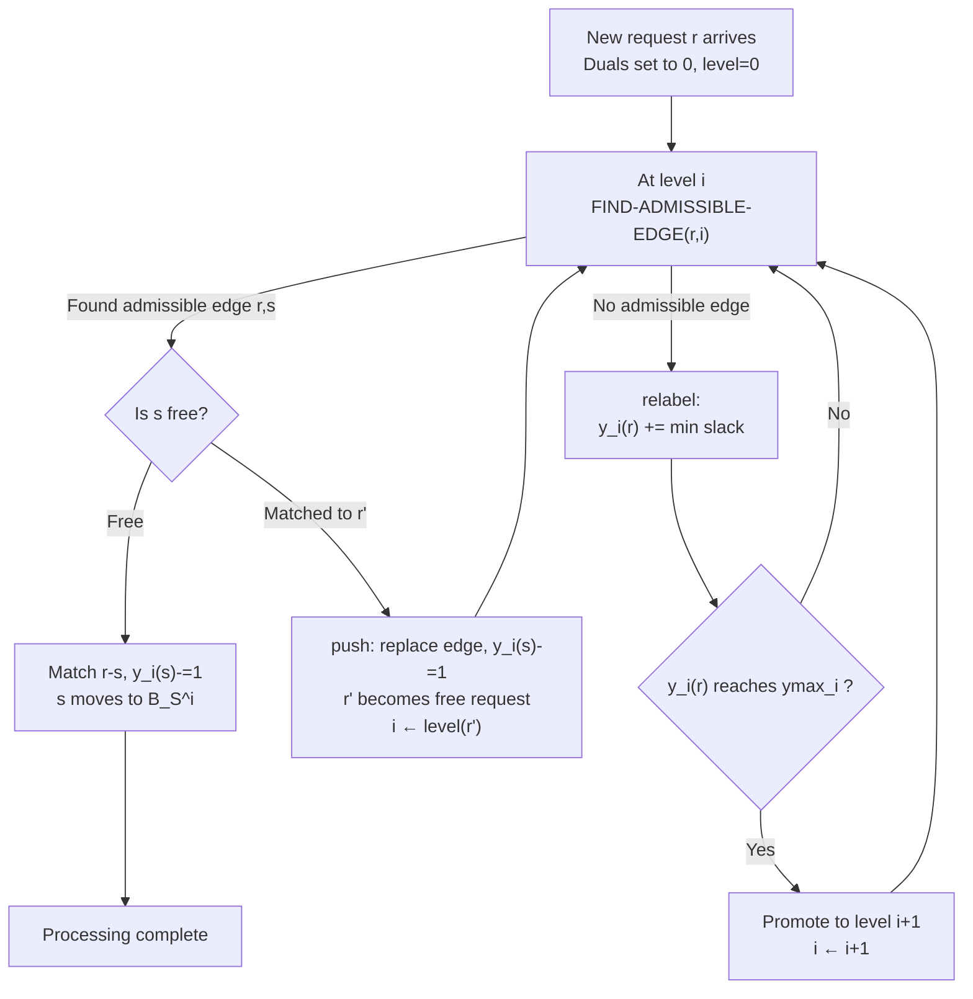

# Efficient Algorithms for Incremental Metric Bipartite Matching

**Conference**: ICLR 2026  
**OpenReview**: [https://openreview.net/forum?id=wnIanx0r0w](https://openreview.net/forum?id=wnIanx0r0w)  
**Code**: [https://github.com/ritesh-777/Incremental-Metric-Bipartite-Matching-Algorithm](https://github.com/ritesh-777/Incremental-Metric-Bipartite-Matching-Algorithm)  
**Area**: optimization  
**Keywords**: bipartite matching, incremental algorithm, metric space, push-relabel, optimal transport, Wasserstein distance, approximation algorithm  

## TL;DR
This paper provides the **first constant-factor approximation algorithm for incremental minimum-cost bipartite matching in arbitrary metric spaces**. Under the setting of a fixed server set $S$ and requests arriving online on one side, a "distance scaling hierarchy + push-relabel" framework is used to maintain an $O(1/\delta^{0.631})$ approximate matching. The amortized update time per insertion is $\tilde{O}(n^{1+\delta})$, and the approach is naturally parallelizable and GPU-compatible.

## Background & Motivation
**Background**: Minimum-cost bipartite matching is a foundational component for machine learning, computer vision, and logistics scheduling. It serves as both a classical model for "request-server" problems (e.g., assigning taxi requests to drivers) and an equivalent form for computing the 1-Wasserstein distance $W_1(\mu,\nu)=\inf_{\pi\in\Pi(\mu,\nu)}\int d(x,y)\,d\pi$ between two empirical distributions. In static scenarios, the Hungarian algorithm achieves an exact solution in $O(n^3)$ time, while Agarwal & Sharathkumar (2014) provided a $1/\delta^{0.631}$ approximation in $O(n^{2+\delta})$ time for offline metric spaces.

**Limitations of Prior Work**: In reality, points often **arrive dynamically**. For instance, the New York taxi system handles over 300,000 requests daily, and samples in distribution shift monitoring, online learning, and fairness auditing are often streaming. Recomputing the matching from scratch for every new request is prohibitively expensive; the Hungarian algorithm requires $\Theta(n^2)$ per update, accumulating to $O(n^3)$ for $n$ requests, where computation time may exceed dispatch time, causing a "queue avalanche."

**Key Challenge**: Existing work on dynamic matching (e.g., Goranci et al. 2025) is almost entirely restricted to **low-dimensional Euclidean spaces** and assumes the number of vertices on both sides remains equal (balanced instances). Their proofs rely heavily on balance and cannot naturally generalize to one-sided arrivals or high-dimensional/general metrics (graph shortest paths, manifolds, $L_1$, etc.). Directly applying the static algorithm of Agarwal-Sharathkumar to incremental scenarios is also infeasible, as each new request could trigger an augmenting path search traversing $\Theta(n^2)$ edges, and their distance-scaling framework relies on a constant-factor estimate of the optimal value, which is difficult to maintain dynamically.

**Goal**: To answer whether a matching algorithm can be designed for one-sided insertions that is **applicable to arbitrary metric spaces**, features fast updates, and provides a constant-factor approximation guarantee.

**Core Idea**: **Replace augmenting paths with push-relabel**. Instead of serial execution, the $O(\log(1/\delta))$ distance scaling levels of the static algorithm are maintained simultaneously. Each new request performs local "push" and "relabel" operations across levels rather than global augmenting path searches. Through refined amortized analysis, the update time is reduced to $\tilde{O}(n^{1+\delta})$.

## Method

### Overall Architecture
The algorithm is built upon the static work of Agarwal & Sharathkumar (2014) but transforms serial level processing into "simultaneous maintenance of all levels + local push-relabel updates." The core components include: (1) An $\mu+1\approx O(\log(1/\delta))$ level **scaling metric hierarchy** $M_0,\dots,M_\mu$, where higher levels compress distances more aggressively and involve fewer points; (2) A **1-feasible partial matching** $M_i$ and dual weights $y_i(\cdot)$ maintained at each level, from which "admissible edges" are derived; (3) A **push-relabel scheduler**: new requests start at level 0 seeking admissible edges for a push; if none are found, a relabel operation increases their dual. Once a dual reaches its threshold, the point is promoted to the next level until it is matched or reaches level $\mu+2$ for final handling via the Hungarian algorithm.

### Key Designs

**1. $\omega$-scaling metric hierarchy: Exponentially thinning points at higher levels.** The algorithm does not work directly on the original metric $d(\cdot,\cdot)$. Given an estimate $\omega$ of the offline optimal (satisfying $w(M^\star_j)\le\omega\le 2w(M^\star_j)$), a series of metrics $M_0,\dots,M_\mu$ is constructed with distances defined as:
$$\hat{d}_i(s,r)=\begin{cases}\left\lceil \dfrac{2 d(s,r)\cdot n}{\varepsilon\omega}\right\rceil & i=0\\[2mm] \left\lceil \dfrac{\hat{d}_{i-1}(s,r)}{2(1+\varepsilon)^2 n^{\phi_{i-1}}}\right\rceil & i>0\end{cases}$$
where $\phi_i=3^i\delta$ and $\varepsilon=\tfrac{1}{2\log_3(1/\delta)}$. Level $M_0$ discretizes all distances into bounded integers such that the optimal cost is $O(n)$; at higher levels, the scaling factor $n^{3^i\delta}$ grows exponentially, compressing distances and **sharply decaying the number of points reaching higher levels**. This is the cornerstone of the amortized analysis. Each level remains a valid metric (Lemma 1) with bounded proportionality to the original metric.

**2. 1-feasible matching + Admissible edges: Converting "approximate optimality" into local dual conditions.** Following Gabow-Tarjan (1989), each level maintains a matching $M_i$ with duals $y_i(\cdot)$ satisfying:
$$y_i(s)+y_i(r)\le \hat{d}_i(s,r)+1\ \ (\text{non-matched edges}),\qquad y_i(s)+y_i(r)=\hat{d}_i(s,r)\ \ (\text{matched edges}).$$
An edge is **admissible** if it is in $M_i$ or satisfies $y_i(r)+y_i(s)=\hat{d}_i(s,r)+1$. Thus, the potential for improvement is localized to whether the "slack" is zero, eliminating the need for global augmenting paths. The novelty here lies in **simultaneously maintaining duals for all levels** while strictly adhering to two invariants: (I1) each matching remains 1-feasible; (I2) duals for free servers are always 0, and duals for matched points in levels below their residence are fixed at $y^{\max}_k$ (for requests) or $0$ (for servers).

**3. Incremental push-relabel: Local displacement instead of global augmenting paths.** This is the critical transition from static to dynamic. A new request $r$ starts with zeroed duals and a pre-constructed list $L_r$ of free servers sorted by distance. In current level $i$, it repeatedly calls FIND-ADMISSIBLE-EDGE to find an edge $(r,s)$. If $s$ is free, a match is formed, $y_i(s)$ is decremented, and $s$ moves to the matched set $B_S^i$. If $s$ is matched to $r'$, a **push** occurs: the edge is replaced, $y_i(s)$ is decremented, and the displaced $r'$ becomes a new free request resuming from $i\leftarrow level(r')$. If no admissible edge exists, a **relabel** increases $y_i(r)$ by the minimum slack. Once $y_i(r)$ hits the ceiling $y^{\max}_i=\tfrac{30}{\varepsilon}n^{\phi_i}$, $r$ is **promoted** to level $i+1$. A key invariant ensures that servers matched at level $i$ are only available to requests at levels $\ge i$, so searches never need to touch servers locked in lower levels.

**4. Amortized update time analysis: Suppressing $\Theta(n^2)$ to $\tilde{O}(n^{1+\delta})$.** While pushing a single request could worst-case scan $\Theta(n^2)$ edges, the amortized cost is much lower. The proof comprises three parts: (a) **relabel** steps are bounded by $y^{\max}_i$ per request per level; (b) the total number of **push** operations is bounded by the total increase in request duals (Lemma 3), thus restrained by the total relabel count; (c) **admissible edge searches** are the costliest, but Lemma 4 shows "the number of requests $n_i$ reaching level $i$ and above is $\le n^{1-\Phi_i}$" (where $\Phi_i=\tfrac{3^i-1}{2}\delta$). This exponential sparsification at higher levels, combined with maintaining sorted server lists to find the nearest free server in $O(1)$, results in a total level search time of $O(n^{2+\delta})$ (Lemma 5). Requests pushed to level $\mu+2$ (fewer than $n^\delta$) are handled by the Hungarian algorithm in $O(n^{1+\delta})$ each. This yields a total update time of $O(n^{2+\delta}\log^2(1/\delta))$, or $\tilde{O}(n^{1+\delta})$ amortized per insertion.

**5. Relaxing $\omega$ assumptions + Batch parallelization.** Since the optimal $\omega$ is unknown, a standard **guess-and-double** strategy is used. Starting with $\omega=\min_s d(s,r_1)$, if any level $i$ exceeds the count $n^{1-\Phi_i}$, $\omega$ is doubled and the sequence is re-run. The number of phases is bounded by $\log(n\Delta)$ (where $\Delta$ is the aspect ratio). Furthermore, push steps can be formulated as finding a maximal matching in an admissible graph, and relabel steps as updating a "slack matrix"—both of which are naturally parallelizable. Borrowing from Lahn et al. (2023), requests are processed in batches of 200 on the GPU (Batch Incremental PR) to avoid serial queuing.

## Key Experimental Results

### Main Results
Two independent implementations were tested: a C++ CPU version and a PyTorch GPU version. Hardware included AMD EPYC 7763 (single-threaded for CPU tasks) and NVIDIA A100-40GB. Four datasets were used with 10,000 points each, 10,000 fixed servers, request counts $n\in\{1000,\dots,10000\}$, $\delta=0.001$, batch size 200, and results averaged over 10 runs.

| Dataset | Metric | Type |
|--------|------|------|
| MNIST | $L_1$ norm (784-dim) | High-dimensional |
| NYC-Taxi | Euclidean (Lat/Long) | Low-dimensional Euclidean |
| Beijing Road Network | Shortest path distance (≈31k nodes / 72k edges) | Graph metric |
| Synthetic | $[0,100]^2$ Uniform Euclidean | Low-dimensional Euclidean |

Baselines: Greedy (nearest free server, GPU-calculated distances), QuadTree-based (QT, CPU), Dynamic Euclidean (Goranci et al. 2025, Euclidean only).

### Key Findings
- **High-dimensional / General metrics are the main advantage**: On MNIST ($L_1$) and Beijing (shortest path), QT and Dynamic Euclidean are **not applicable**. Batch Incremental PR **substantially outperforms Greedy in both cost and update time**, demonstrating the value for "arbitrary metrics."
- **NYC-Taxi (Low-dim Euclidean)**: In the specialized domain for QT and Dynamic Euclidean, those baselines are faster but **incur higher costs**. Batch Incremental PR consistently achieves lower cost than both, performing comparably to Greedy, thus offering a better cost-time balance.
- **Beijing Road Network**: Costs are significantly lower than Greedy. While runtime is faster than Greedy up to ~7,000 points, Greedy eventually becomes faster; however, the average response time for the proposed method **never exceeds 50ms**.
- **Summary**: Across datasets, Batch Incremental PR achieves the best balance between cost and runtime, with its advantages extending well beyond low-dimensional Euclidean scenarios.
- Appendix B.1 provides sensitivity analysis for $\delta$ (tuning the runtime-cost trade-off), and B.2 analyzes the impact of batch size on average update time.

## Highlights & Insights
- **"Engine Swap" approach to algorithm migration**: The difficulty in making static matching dynamic is not the interface, but that augmenting paths degrade to $\Theta(n^2)$ under dynamic conditions. The insight here is that the locality of push-relabel perfectly matches incremental updates—an idea borrowed from the "push-relabel over augmenting paths for dynamic flow" intuition in maximum flow research.
- **Scaling hierarchy as cheap "Divide and Conquer"**: Converting a $\Theta(n^2)$ search into an exponentially sparse search across levels ($n_i\le n^{1-\Phi_i}$) is the technical heart of the analysis, causing "scan the whole graph" worst-case scenarios to vanish in an amortized sense.
- **Rigorous generalization of existing results**: Total execution time and approximation ratios remain on par with the Agarwal-Sharathkumar static algorithm while gaining support for dynamic insertions—obtaining dynamic capabilities effectively for "free."
- **Practical Parallelism**: The parallel structure of push/relabel is not just theoretical. Integrating it with Lahn et al. (2023) GPU implementations as a batch process completes the theory-to-engineering loop.

## Limitations & Future Work
- **One-sided insertion only; no deletions**: The server set is fixed, and requests only increase. Since requests can cancel and servers can go offline, extending this framework of "maintaining precise combinatorial structures + approximate costs" to deletions remains a "highly challenging open problem."
- **The $1/\delta^{0.631}$ ratio is loose for small $\delta$**: When $\delta=0.001$, the constant factor is not small. Compared to $(1+\delta)$ approximate Sinkhorn or offline OT methods, the accuracy scale is different; the selling point is "arbitrary metric + fast updates" rather than the tightest approximation.
- **Dependence on aspect ratio $\Delta$**: The update time includes $\log(n\Delta)$, which leads to more phases in metrics with extreme aspect ratios.
- **CPU evaluations limited to single threads**: The absolute time comparison for CPU baselines is limited. GPU batching gains are highly dependent on batch size, and scalability under very large batches requires more systematic evaluation.
- **Outlook**: Future work includes addressing **fully dynamic (insertion+deletion)** settings, integrating with new near-linear time min-cost flow tools (Chen et al. 2022), and applying the method to more general structured metrics like Graph/Manifold OT.

## Related Work & Insights
- **Metric Matching Foundations**: The distance scaling + synchronous augmenting paths of Agarwal & Sharathkumar (2014) is the direct "subject of modification" here. Gabow & Tarjan (1989) provided the 1-feasible matching duality framework.
- **Dynamic/Streaming Matching**: The dynamic Euclidean matching of Goranci et al. (2025) (bilateral updates, $O(1/\delta)$ approx., sublinear updates) is the closest baseline but is limited to balanced instances and low-dimensional Euclidean spaces. Andoni et al. (2009) provided streaming sketches for EMD.
- **Near-linear Min-cost Flow Wave**: Recent breakthroughs like Chen et al. (2022) for near-linear min-cost flow suggest that "transferring dynamic maintenance techniques from approximate flows to precise combinatorial structures (perfect matching)" remains a difficult open problem—this paper bypasses this by focusing on approximate costs + push-relabel.
- **Parallel/Additive OT**: Sinkhorn (Cuturi 2013) and additive approximations (Lahn et al. 2019, 2023) are highly parallelizable. The batch implementation here specifically grafts the parallel push-relabel of Lahn et al. (2023).
- **Inspiration**: For any combinatorial optimization problem where "static algorithms are good but dynamic versions degrade," this paper demonstrates a paradigm: **find an equivalent framework with stronger locality (e.g., push-relabel) + hierarchical sparsification + amortized analysis**. This often yields efficient incremental maintenance without sacrificing approximation guarantees.

## Rating
- **Novelty**: ⭐⭐⭐⭐½ — The first constant-factor approximation for incremental matching in arbitrary metric spaces. The transition from augmenting paths to push-relabel with simultaneous multi-level dual maintenance is a substantial technical contribution.
- **Experimental Thoroughness**: ⭐⭐⭐½ — Covers high-dimensional $L_1$, graph shortest paths, and low-dimensional Euclidean metrics across three baselines. However, results are mostly visual; single-threaded CPU comparisons carry limited weight, and larger scale/scalability curves are missing.
- **Writing Quality**: ⭐⭐⭐⭐ — Logical progression from motivation and technical overview to formal analysis. Amortized analysis intuition is clear; despite many formulas, the notation remains consistent.
- **Value**: ⭐⭐⭐⭐ — Addresses both logistics scheduling and Wasserstein/OT computation. The combination of "arbitrary metric + sublinear update + GPU parallelism" has significant potential in dynamic OT monitoring and distribution shift detection.

<!-- RELATED:START -->

## Related Papers

- [\[ICLR 2026\] High-dimensional Mean-Field Games by Particle-based Flow Matching](high-dimensional_mean-field_games_by_particle-based_flow_matching.md)
- [\[CVPR 2025\] Towards Stable and Storage-efficient Dataset Distillation: Matching Convexified Trajectory](../../CVPR2025/optimization/towards_stable_and_storage-efficient_dataset_distillation_matching_convexified_t.md)
- [\[ICLR 2026\] A Memory-Efficient Hierarchical Algorithm for Large-scale Optimal Transport Problems](a_memory-efficient_hierarchical_algorithm_for_large-scale_optimal_transport_prob.md)
- [\[ICLR 2026\] Convergence of Regret Matching in Potential Games and Constrained Optimization](convergence_of_regret_matching_in_potential_games_and_constrained_optimization.md)
- [\[ICLR 2026\] AutoEP: LLMs-Driven Automation of Hyperparameter Evolution for Metaheuristic Algorithms](autoep_llms-driven_automation_of_hyperparameter_evolution_for_metaheuristic_algo.md)

<!-- RELATED:END -->
