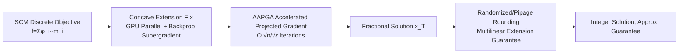

# Efficient Submodular Maximization for Sums of Concave over Modular Functions

**Conference**: ICLR 2026  
**OpenReview**: [https://openreview.net/forum?id=HIi4lNsvXW](https://openreview.net/forum?id=HIi4lNsvXW)  
**Code**: [https://github.com/lvymath1/Efficient-Submodular-Maximization](https://github.com/lvymath1/Efficient-Submodular-Maximization)  
**Area**: optimization  
**Keywords**: Submodular maximization, SCM, Concave extension, Accelerated projected gradient, Randomized rounding, GPU parallelism  

## TL;DR
Focusing on the "Sum of Concave over Modular" (SCM) subclass of submodular functions, this paper proposes a toolkit of "concave extension + Accelerated Approximate Projected Gradient Ascent (AAPGA) + randomized rounding." It reduces the query complexity for cardinality, knapsack, and partition matroid constraints from $O(n^2\varepsilon^{-2})$ of PGA to $O(n^{1/2}\varepsilon^{-1/2}(T_1+T_2))$, achieving a measured speedup of up to 32.3x.

## Background & Motivation

**Background**: Submodular maximization is widely applied in sensor placement, data summarization, and coverage problems. However, the $O(nk)$ serial complexity of classical greedy algorithms is difficult to scale for modern large-scale problems. The community has developed various acceleration routes, including streaming, parallel, distributed, and continuous relaxation. Notably, Bai et al. (2018) proposed a framework for "Deep Submodular Functions" utilizing continuous relaxation + Projected Gradient Ascent (PGA) + pipage rounding, which can be accelerated by GPUs.

**Limitations of Prior Work**: Mainstream acceleration methods treat submodular functions as black-box value oracles and fail to exploit internal structures. Even within the gradient framework of Bai et al., PGA requires $O(n^2/\varepsilon^2)$ iterations to achieve a $(1-\varepsilon)$ approximation. Each iteration requires a backpropagation step (costing $T_2$), leading to a total query complexity of $O((n^2/\varepsilon^2)T_2)$, which remains prohibitively high for ultra-large graphs.

**Key Challenge**: The two types of continuous extensions involve a trade-off: multilinear extension possesses "directional concavity" which facilitates approximation guarantees during rounding but is computationally infeasible and requires sampling for gradient estimation; concave extension can be parallelized on GPUs with supergradients efficiently obtained via backpropagation, yet it lacks the directional concavity required for rounding. Achieving both "optimization computational efficiency" and "rounding approximation guarantees" is the critical challenge.

**Goal**: Focusing on the SCM subclass $f(A)=\sum_{i\in V}\phi_i(m_i(A))$ (where $\phi_i$ is non-negative monotone concave and $m_i$ is modular), this paper aims to design an approximation algorithm with significantly lower iteration counts and query complexity under cardinality, knapsack, and partition matroid constraints.

**Core Idea**: **[Hybrid Extension + Nesterov Acceleration]** The optimization phase utilizes concave extension (GPU parallelism + backpropagation supergradients) to run an accelerated projected gradient method. The rounding phase switches to multilinear extension to leverage its directional concavity for approximation guarantees. The standard PGA is replaced with a FISTA-style AAPGA, compressing the iteration count from $O(n^2/\varepsilon^2)$ to $O(n^{1/2}\varepsilon^{-1/2})$.

## Method

### Overall Architecture

The paper follows the three-stage pipeline of "continuous relaxation → continuous optimization → rounding" from Bai et al. (2018) but upgrades each stage: the continuous relaxation stage extends supergradients to non-differentiable activation functions; the optimization stage replaces PGA with AAPGA; and the rounding stage introduces $O(n)$ randomized rounding for knapsack constraints while completing approximation and complexity proofs for all three constraint types. The core is a hybrid strategy of "concave extension for optimization, multilinear extension for rounding," bridged by Lemma 1.

### Key Designs

**1. Replacing Multilinear Extension with Concave Extension via Backpropagation**: For SCM $f(A)=\sum_i\phi_i(m_i(A))$, since modular functions are linear mappings, the composition of concave and linear functions remains concave, and the sum of concave functions is concave. Thus, a continuous concave extension $F(x)=\sum_{i\in V}\phi_j(m_j(x))$ satisfies $f(A)=F(\mathbf{1}_A)$. Unlike multilinear extensions that rely on sampling, the concave extension is essentially a two-layer network of "linear layer + concave activation." The supergradient $g=\big(\sum_{i}m_{ij}\,\phi_{i+}'(m_i(x))\big)_j$ can be directly computed via backpropagation on multiple GPUs. To support common non-differentiable activations like $\min\{x,1\}$, $1-\exp(x)$, or $\sqrt x$, the paper uses the right derivative $\phi_{i+}'$ to define the superdifferential $\partial F(x)=\{g\mid F(y)-F(x)\le g\cdot(y-x)\}$. This transforms the gradient computation bottleneck from "sampling approximation" to "exact backpropagation."

**2. AAPGA: FISTA-style Acceleration + δ-Approximate Projection**: Standard PGA performs projection directly on $x^{(t)}$, whereas AAPGA, inspired by Nesterov/FISTA, performs projection on an extrapolated point $y^{(t)}=x^{(t)}+\frac{\alpha_t-1}{\alpha_{t+1}}(x^{(t)}-x^{(t-1)})$. A key modification is that the projection only needs to be an "approximation"—defined by the approximate projection set $P_L'(y)=\{x'\in P:\|x'-\Pi_P(y+\frac1L\gamma_F(y))\|\le\delta\}$, using backtracking line search to find the smallest integer $i_t$ satisfying the quadratic surrogate $Q_L$. The paper proves (Theorem 1) that as long as the approximation error $\delta < O(1/T^3)$, a convergence rate of $F(x^*)-F(x^{(T)})\le O(n/T^2)$ is achieved. Reaching a $(1-\varepsilon)$ approximation requires only $T=O(n^{1/2}\varepsilon^{-1/2})$ iterations (Corollary 1), a multi-order reduction compared to $O(n^2/\varepsilon^2)$ in PGA. The $\delta$-approximate projection for each constraint type can be computed in $O(n\log(n/\delta))$, making the per-step cost nearly identical to PGA, with a total query complexity of $T\cdot(T_1+T_2)=O(n^{1/2}\varepsilon^{-1/2}(T_1+T_2))$.

**3. Hybrid Extension + Lemma 1 Bridging**: While concave extension is optimization-friendly, it lacks directional concavity, preventing direct rounding quality guarantees. Conversely, the multilinear extension $F_m$ possesses directional concavity (pipage rounding preserves expectations along $e_i-e_j$) but is hard to compute. Lemma 1 (from Bai et al. 2018) bridges the two: $\max_{\eta\in[0,1]}(1-\eta)\big[1-|V|\exp(-\eta^2\triangle(x))\big]F(x)\le F_m(x)\le F(x)$, where $\triangle(x)=\min_{i\in V}\frac{m_i(x)}{2\max m_i}$. Thus, $F$ is used for optimization and $F_m$ for rounding. For cardinality/partition matroid constraints, the finalized approximation ratio is $(1-\varepsilon)(1-\eta)[1-|V|\exp(-\eta^2\min_i\frac{\min m_i\cdot k}{\max m_i})]$ (Theorem 2), which tightens as the constraint scale $k$ increases.

**4. O(n) Randomized Rounding for Knapsack Constraints**: While cardinality and partition matroids can use $O(n)$ pipage rounding, traditional $(1-\varepsilon)$ rounding for knapsack constraints costs a prohibitive $O(n^{\lceil\varepsilon^{-4}\rceil+1})$. This paper (Algorithm 2) uses "Optimal Single Element + Pairwise Randomized Rounding": it first takes $e=\arg\max_e f(e)$ as a fallback, then repeatedly picks a pair $(i,j)$ from the fractional solution and moves along the direction $v=\frac{1}{c_j}e_i - \frac{1}{c_j}e_j$ (preserving knapsack cost). It takes feasible steps $\theta_{\min}, \theta_{\max}$ with probabilities $\frac{-\theta_{\min}}{-\theta_{\min}+\theta_{\max}}$ and $\frac{\theta_{\max}}{-\theta_{\min}+\theta_{\max}}$ respectively, ensuring at least one component becomes an integer each round. It returns $\arg\max\{f(x), f(e)\}$. This rounding takes $O(n)$ time and provides a $1/2$ constant factor approximation, resulting in a total knapsack complexity of $O(nT_1+n^{1/2}\varepsilon^{-1/2}T_2)$.

## Key Experimental Results

Environment: Hygon C86 7380 32-core CPU, 2×NVIDIA A800 80GB GPU, 256GB RAM, CUDA 12.2. All methods (including originally non-GPU baselines) were GPU-accelerated; randomized results are averaged over 50 runs.

### Main Results

Probabilistic Coverage Maximization under Cardinality Constraint ($k=50$); results are Objective Value / Wall-clock Time (seconds):

| Algorithm | EU-Email Val/Time | Facebook-ego Val/Time | SBM Val/Time | Erdős–Rényi Val/Time |
| :--- | :--- | :--- | :--- | :--- |
| Greedy | **864.61** / 4.96 | **3676.31** / 145.74 | **1654.00** / 9.73 | **3773.46** / 42.02 |
| Lazier-greedy | 853.75 / 1.02 | 3610.24 / 29.18 | 1628.71 / 1.98 | 3748.74 / 8.44 |
| Stream | 784.74 / 0.99 | 3441.45 / 25.47 | 1440.89 / 1.90 | 3538.56 / 6.88 |
| PGA+Rounding | 862.69 / 1.68 | 1661.63 / 1.49 | 1427.04 / 2.09 | 3652.71 / 2.50 |
| **AAPGA+Rounding** | 864.60 / **1.12** | 3653.14 / **1.84** | 1642.38 / **1.78** | 3714.83 / **1.30** |

AAPGA+Rounding ranks consistently in the top three for objective value and takes significantly less time: it is **32.3x** faster than Greedy on Erdős–Rényi.

Under Knapsack Constraint: On Facebook-ego, AAPGA+Rounding is roughly **9.72x** faster than Lazier-greedy, with an objective value only slightly lower (4850.83 vs 4885.69), significantly outperforming the Streaming baseline.

### Ablation Study

Convergence comparison of AAPGA vs PGA on concave extension:

| Setting | PGA | AAPGA |
| :--- | :--- | :--- |
| EU-Email Knapsack (Early) | 743.8 at 50 rounds | 748.7 at 20 rounds |
| Wikipedia Vote | Converges to 4600.6 | Reaches higher 4629.0 |

Theoretically, AAPGA iteration count is $O(n^{1/2}\varepsilon^{-1/2})$, while PGA is $O(n^2\varepsilon^{-2})$.

### Key Findings
- **Faster and Better**: Due to Nesterov acceleration, AAPGA not only rises steeper in early stages but also often reaches higher objective values than PGA.
- **GPU Parallelization Dividend**: Greedy and Lazier-greedy are difficult to parallelize, leading to much higher wall-clock times. Concave extension allows GPU/Multi-GPU parallelism, resulting in clear acceleration.
- **Large-scale Scalability**: On the Google+ network (107,614 nodes, 30.49 million edges) with $k$ from 10 to 5120, AAPGA+pipage consistently scales better than PGA under cardinality and partition matroid constraints.

## Highlights & Insights
- The **hybrid strategy of "concave extension for optimization, multilinear for rounding"** is a core ingenuity: using Lemma 1 to bridge the two eat the engineering dividends of concave extension (backprop/GPU) while maintaining approximation guarantees.
- **"Neural-izing" Submodular Optimization**: Concave extension is essentially a shallow network of "linear layer + concave activation." Supergradient equals backpropagation, making it perfectly compatible with GPUs and modern deep learning infrastructure.
- **Approximation Ratio Tightens with Scale**: The form $1-|V|\exp(-\eta^2\cdot\text{(prop. to } k \text{ or } B))$ means guarantees improve as $k, B$ increase, which is friendly for large-scale problems; for coverage functions, it reaches $1-1/e-\varepsilon$.
- **Knapsack Randomized Rounding** reduces traditional exponential costs of $O(n^{\lceil\varepsilon^{-4}\rceil+1})$ to $O(n)$, trading a $1/2$ approximation factor for practical speed.

## Limitations & Future Work
- **Non-constant Approximation Ratio**: Guarantees for cardinality/partition matroids depend on $\eta, |V|, \min m_i/\max m_i$. Worst-case ensures are weaker than the classic $1-1/e$; only specific cases like coverage functions reach $1-1/e-\varepsilon$.
- **Knapsack Degradation to 1/2**: The approximation ratio is significantly lower than for cardinality/matroids, and in experiments, AAPGA's objective value on knapsack constraints is sometimes slightly lower than Lazier-greedy, winning primarily on speed.
- **Limited to SCM Subclass**: The method exploits the "concave composed with modular" structure and is not directly applicable to general black-box submodular functions.
- **Reliance on GPU Infrastructure**: Performance gains rely on GPU parallelism; in CPU-only scenarios, the advantage narrows.

## Related Work & Insights
- **Gradient Ascent for Submodular Maximization**: The framework of deep submodular + PGA + pipage by Bai et al. (2018) is the direct foundation; this paper provides systematic upgrades in iteration count, rounding, and non-differentiable activations.
- **Continuous Relative Acceleration**: Nesterov acceleration from FISTA (Beck & Teboulle, 2009) is adapted into AAPGA, including new convergence analysis for $\delta$-approximate projections.
- **Three-step Framework for Coverage**: The "Relaxation–Optimization–Rounding" pipeline from Karimi et al. (2017) inspired the SCM approach and provided the basis for coverage functions reaching $1-1/e-\varepsilon$.
- **Classical Submodular Acceleration**: Lazier-Greedy (Mirzasoleiman et al., 2015), FAST (Breuer et al., 2020), and LS+PGB (Chen et al., 2021) serve as baselines; this work emphasizes exploiting SCM internal structure over "value oracle black-box acceleration."

## Rating
- Novelty: ⭐⭐⭐⭐ The combination of hybrid extensions + FISTA acceleration + $O(n)$ knapsack rounding for SCM is a clear engineering innovation, though individual techniques are clever assemblies of existing ideas.
- Experimental Thoroughness: ⭐⭐⭐⭐ Coverage of small/large scales, multiple constraints, synthetic/real graphs up to 30M edges. Convergence and end-to-end comparisons are comprehensive, though comparisons with recent knapsack-specific SOTA are absent.
- Writing Quality: ⭐⭐⭐⭐ Theory and algorithms are clear; the bridge between extensions is well-justified, though some approximation expressions are cumbersome.
- Value: ⭐⭐⭐⭐ Bridging submodular maximization with deep learning infrastructure provides a practical, scalable, and open-source solution with real-world significance for large-scale summarization and coverage tasks.

<!-- RELATED:START -->

## Related Papers

- [\[ICML 2026\] Differentially Private Submodular Maximization with a Knapsack Constraint](../../ICML2026/optimization/differentially_private_submodular_maximization_with_a_knapsack_constraint.md)
- [\[ICML 2026\] A General Framework for Dynamic Consistent Submodular Maximization](../../ICML2026/optimization/a_general_framework_for_dynamic_consistent_submodular_maximization.md)
- [\[NeurIPS 2025\] Online Two-Stage Submodular Maximization](../../NeurIPS2025/optimization/online_two-stage_submodular_maximization.md)
- [\[NeurIPS 2025\] A Unified Approach to Submodular Maximization Under Noise](../../NeurIPS2025/optimization/a_unified_approach_to_submodular_maximization_under_noise.md)
- [\[ICLR 2026\] DR-Submodular Maximization with Stochastic Biased Gradients: Classical and Quantum Gradient Algorithms](dr-submodular_maximization_with_stochastic_biased_gradients_classical_and_quantu.md)

<!-- RELATED:END -->
