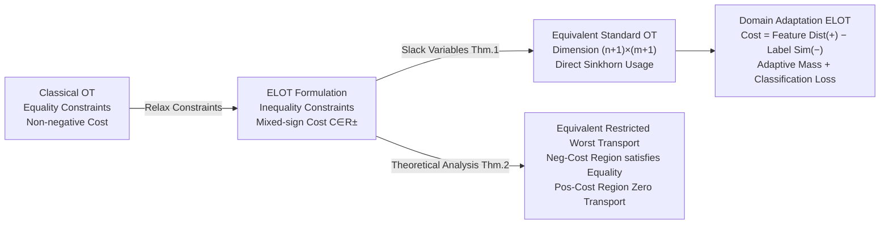

# Elastic Optimal Transport: Theory, Application, and Empirical Evaluation

**Conference**: ICLR 2026  
**Paper**: [OpenReview: gG09r15HhQ](https://openreview.net/forum?id=gG09r15HhQ)  
**Code**: Provided in supplementary material, GitHub repository not public  
**Area**: Optimal Transport Theory / Domain Adaptation  
**Keywords**: Elastic Optimal Transport, Adaptive Mass Transport, Mixed-sign Cost Matrix, Unsupervised Domain Adaptation, Partial Domain Adaptation

## TL;DR

This paper proposes Elastic Optimal Transport (ELOT), which replaces the equality constraints of classical OT with "marginal inequality constraints + mixed-sign cost matrices." This allows the transport mass to be adaptively determined by the geometric structure of the problem itself, significantly outperforming POT/UOT series methods on unsupervised domain adaptation and partial domain adaptation benchmarks.

## Background & Motivation

**Background**: Optimal Transport (OT) is a classical tool for comparing and aligning distribution pairs, widely used in machine learning tasks such as domain adaptation, GANs, image processing, and NLP. Cuturi's (2013) entropy-regularized Sinkhorn algorithm made large-scale OT practical, driving a surge in OT applications.

**Limitations of Prior Work**: Classical Kantorovich OT requires full mass conservation—all probability mass from the source and target domains must be transported. In real-world data, this forces the alignment of noise, outliers, and mismatched samples, leading to distorted OT mappings. Consequently, two research directions have emerged: **Partial OT (POT)**, which relaxes the constraint to "transporting a fixed budget of mass $s$," and **Unbalanced OT (UOT)**, which uses KL divergence to "softly constrain" marginal distributions via coefficients $\tau_1, \tau_2$.

**Key Challenge**: Neither approach truly resolves the question of "how much mass should be transported." POT requires manual specification of $s$, and UOT requires tuning $\tau_1, \tau_2$. Both essentially transfer the problem of adaptation to hyperparameter selection, which remains difficult in practice.

**Goal**: Can the transport mass be adaptively determined entirely by the internal geometric structure of the data, without requiring extra hyperparameters to control the amount of transport?

**Key Insight**: Relax marginal constraints from equalities to inequalities while allowing for mixed-sign cost matrices (containing negative values), enabling the optimizer to decide which sample pairs are worth aligning and which should be ignored.

**Core Idea**: The combination of marginal inequality constraints and mixed-sign cost matrices drives adaptive mass allocation. Positive costs correspond to "harmful alignment" pairs (naturally resulting in zero transport), while negative costs correspond to "beneficial alignment" pairs (maximizing transport).

## Method

### Overall Architecture

The core of ELOT is a new OT formulation: replacing classical equality constraints with **marginal inequality constraints** and allowing for **mixed-sign cost matrices**. By introducing slack variables, ELOT is equivalently transformed into a standard OT problem (with dimensions increased by 1×1), allowing for the direct reuse of existing solvers like Sinkhorn. In domain adaptation applications, the cost matrix is jointly composed of feature space distances (positive terms) and label similarities (negative terms), enabling the transport plan to align similar sample pairs while automatically filtering outliers.

### Key Designs

**1. Elastic OT Formulation: Inequality Constraints + Mixed-sign Cost**

The transport plan set $\Pi(\mu,\nu)$ of classical Kantorovich OT requires $\gamma \mathbf{1}_m = \mu$ and $\gamma^\top \mathbf{1}_n = \nu$ (equalities on both sides). ELOT relaxes this to:

$$\Pi_e(\mu,\nu) = \{\gamma \in \mathbb{R}^{n\times m}_+ \mid \gamma \mathbf{1}_m \leq \mu,\ \gamma^\top \mathbf{1}_n \leq \nu\}$$

Simultaneously, it allows the cost matrix $C \in \mathbb{R}^{n\times m}_\pm$ (containing both positive and negative values). Adaptive behavior cannot be achieved by inequality constraints alone—if costs are all non-negative, the optimizer would choose zero transport. Similarly, negative costs alone cannot constrain the transport range. Both are essential: **negative costs drive transport for beneficial pairs, while inequality constraints prevent over-transport**, together producing exactly the right adaptive mass allocation.

The advantage of this formulation is that it eliminates the need to specify a fixed budget $s$ as in POT or to tune soft constraint strengths $\tau_1, \tau_2$ as in UOT. It requires fewer hyperparameters than JUMBOT and m-POT, as the transport amount is determined solely by the geometric structure of the cost matrix.

**2. Equivalent Standard OT Reformulation: Seamless Reuse of Solvers (Theorem 1)**

Because ELOT contains inequality constraints, standard OT solvers cannot be called directly. The authors introduce **slack variables** (a classical technique in linear programming to convert inequalities to equalities) to construct an augmented cost matrix and marginal vectors:

$$\bar{C} = \begin{pmatrix} C & \sigma\mathbf{1}_m \\ \sigma\mathbf{1}_n^\top & 2\sigma \end{pmatrix},\quad \bar\mu = \begin{pmatrix}\mu \\ \|\nu\|_1\end{pmatrix},\quad \bar\nu = \begin{pmatrix}\nu \\ \|\mu\|_1\end{pmatrix}$$

**Theorem 1** proves that the optimal transport plan of the augmented problem (excluding the last row/column) is identical to the optimal plan of the original ELOT. The optimal values differ by a constant $\sigma(\|\mu\|_1+\|\nu\|_1)$, which can be ignored during optimization. Importantly, the optimal plan is independent of the value of $\sigma$, allowing for $\sigma=1$. This ensures that ELOT's algorithmic complexity is only a constant factor higher than classical OT (problem size increases from $n\times m$ to $(n+1)\times(m+1)$) and can be efficiently solved using Sinkhorn-Knopp with entropy regularization.

**3. Mechanism: Equivalent Restricted Worst Transport (Theorem 2)**

To understand how ELOT automatically filters outliers, the authors decompose the cost matrix into positive part $C^+$ and negative part $C^-$. They prove that ELOT is equivalent to a **restricted worst transport problem**: maximizing $\sum_{i,j}(-C^-_{ij})\gamma_{ij}$ only on the negative cost region, where the equality marginal constraint is exactly satisfied at negative cost positions.

**Theorem 2** provides intuition: if a source sample $x_i$ has positive costs with all target samples (i.e., it has no similar samples in the target domain), then $\sum_j \gamma^*_{ij} = 0$, and the sample is not transported at all—ELOT automatically identifies it as an outlier or noise and discards it. Conversely, pairs with more negative costs receive more transport mass. This perfectly matches the intuition of partial domain adaptation: samples in the source domain belonging to classes not present in the target domain ("private classes") naturally lean toward positive cost values, causing ELOT to decrease or eliminate their transport and avoid negative transfer.

**4. Mixed-sign Cost Construction in Domain Adaptation**

In domain adaptation scenarios, ELOT constructs the mixed-sign cost matrix as:

$$C_{ij} = \alpha\|g(x_i) - g(z_j)\|^2 - \beta\, y_i \tanh\!\left(f(g(z_j))\right)$$

The first term is the $\ell_2$ distance in feature space (positive, penalizing mismatch), while the second term provides a negative reward based on the sign consistency between source labels $y_i$ and target pseudo-labels $f(g(z_j))$ (lower cost for same-class pairs, higher for different-class pairs). The objective is to jointly minimize the ELOT transport distance and the source classification loss:

$$\min_{\gamma,g,f}\,\langle\gamma, C(g,f)\rangle + \mathcal{L}(g,f),\quad \gamma\in\Pi_e(\mu,\nu)$$

Compared to JUMBOT (UOT) and m-POT (POT), ELOT maintains a similar cost structure but **eliminates the need for $s$, $\tau_1$, or $\tau_2$ hyperparameters**, achieving "less tuning, more adaptive."

## Key Experimental Results

### Main Results—Unsupervised Domain Adaptation (UDA)

| Dataset | Metric | ELOT (Ours) | m-POT (SOTA) | JUMBOT | Gain |
|--------|------|-------------|--------------|--------|------|
| VisDA (Large-scale, 150k images) | Avg Acc (%) | **76.32±0.28** | 73.59±0.15 | 72.50 | +2.73 |
| Office-31 (6 tasks) | Avg Acc (%) | **90.5** | 88.3 | 86.4 | +2.2 |
| Office-Home (12 tasks) | Avg Acc (%) | **71.75** | 70.34 | 70.17 | +1.41 |

### Main Results—Partial Domain Adaptation (PDA)

| Dataset | Metric | ELOT (Ours) | m-POT | JUMBOT | Gain |
|--------|------|-------------|-------|--------|------|
| Office-Home PDA (12 tasks) | Avg Acc (%) | **79.19** | 77.98 | 75.96 | +1.21 |
| DomainNet PDA (6 tasks, 345 classes) | Avg Acc (%) | **71.4** | — | — | vs ARPM 68.8, +2.6 |

### Ablation Study (Transport Plan Heatmap Analysis)

| Configuration | Transport Mass (Normalized) | VisDA Acc | Note |
|------|-------------------|-----------|------|
| ELOT, ε=0 | 0.6111 | 75.0% | Sparse plan, noise samples filtered |
| ELOT, ε=0.1 (Entropic) | 0.7468 | 76.39% | Denser plan, converges to approx 0.75 |
| m-POT Optimal Setting | s=0.75 (Manual) | Reference | Optimal $s$ must be known a priori |

### Key Findings

- ELOT outperforms m-POT and JUMBOT across all UDA datasets, demonstrating that adaptive mass transport is superior to fixed budget or soft constraint schemes.
- In partial domain adaptation, ELOT surpasses ARPM (specifically designed for PDA) on DomainNet, validating its robustness in filtering outliers.
- Heatmap analysis shows concentrated transport plans along diagonal blocks (inter-class alignment), and ELOT's adaptive mass (≈0.75) closely matches m-POT's optimal manual setting without requiring manual specification.

## Highlights & Insights

- **Elegance of Adaptive Mass**: ELOT automatically determines "how much to transport" through the geometry of the cost matrix. Theoretically equivalent to restricted worst transport (Theorem 2), it ensures positive-cost pairs are not transported—an extremely clean mechanism that requires no prior knowledge of noise or outlier ratios.
- **Fewer Hyperparameters, Better Performance**: While JUMBOT and m-POT require $s$ or $\tau_1, \tau_2$ to control mass, ELOT only retains $\beta$ (cost structure hyperparameter). This reduces selection difficulty while consistently outperforming baselines.
- **Engineering Value of Equivalent Reformulation**: Theorem 1 indicates that the problem can be solved directly by Sinkhorn just by expanding the problem size by one row and one column. This requires minimal code changes while maintaining complete theoretical guarantees.

## Limitations & Future Work

- Mixed-sign costs require the cost matrix to contain negative values. For tasks with naturally non-negative costs (e.g., pure feature distances), negative cost terms must be designed, increasing the barrier to application.
- Validation is currently limited to domain adaptation. Theoretically, it can be extended to GAN training, graph matching, and point cloud registration, but these have yet to be experimentally verified.
- The hyperparameter $\beta$ in the cost matrix (controlling label cost weight) still requires cross-validation, meaning the tuning burden is not entirely eliminated.

## Related Work & Insights

- **vs Kantorovich OT**: Full mass conservation; ELOT relaxes this with inequality constraints to allow partial mass transport.
- **vs Partial OT (Caffarelli & McCann 2010)**: POT fixes the mass budget $s$; ELOT determines it adaptively without manual specification.
- **vs Unbalanced OT (Liero et al. 2017)**: UOT uses divergence for soft constraints with $\tau_1, \tau_2$; ELOT achieves similar effects via mixed-sign costs with fewer parameters.
- **vs JUMBOT (Fatras et al. 2021)**: UOT + mini-batch, requiring $\tau_1, \tau_2, s$; ELOT uses the same cost structure with two fewer hyperparameters and higher accuracy.
- **vs m-POT (Nguyen et al. 2022)**: POT + mini-batch, requiring $s$; ELOT leads significantly on VisDA by +2.73 pp.

## Rating

- Novelty: ⭐⭐⭐⭐ Innovative problem formulation; the combination of mixed-sign costs and inequality constraints is original with deep theoretical analysis.
- Experimental Thoroughness: ⭐⭐⭐⭐ Covers 5 benchmark datasets for UDA and PDA, comparing with multiple OT and non-OT baselines, including heatmap and t-SNE analysis.
- Writing Quality: ⭐⭐⭐⭐ Clear theorems, complete derivations, well-explained motivation, and compact structure.
- Value: ⭐⭐⭐⭐ Provides an OT framework with fewer parameters and better performance. The theory is concise and practical, with wide potential applications.

<!-- RELATED:START -->

## Related Papers

- [\[ICLR 2026\] HOTA: Hamiltonian Framework for Optimal Transport Advection](hota_hamiltonian_framework_for_optimal_transport_advection.md)
- [\[ICLR 2026\] The Polar Express: Optimal Matrix Sign Methods and their Application to the Muon Algorithm](the_polar_express_optimal_matrix_sign_methods_and_their_application_to_the_muon_.md)
- [\[ICLR 2026\] Hyperparameter Trajectory Inference with Conditional Lagrangian Optimal Transport](hyperparameter_trajectory_inference_with_conditional_lagrangian_optimal_transpor.md)
- [\[ICLR 2026\] Neural Optimal Transport Meets Multivariate Conformal Prediction](neural_optimal_transport_meets_multivariate_conformal_prediction.md)
- [\[ICLR 2026\] Neural Hamilton–Jacobi Characteristic Flows for Optimal Transport](neural_hamilton--jacobi_characteristic_flows_for_optimal_transport.md)

<!-- RELATED:END -->
