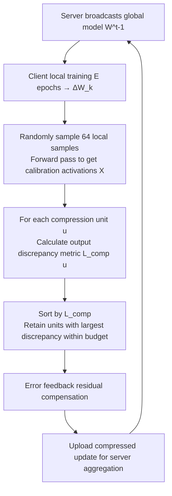

# Enhancing Communication Compression via Discrepancy-aware Calibration for Federated Learning

**Conference**: ICLR 2026  
**OpenReview**: [https://openreview.net/forum?id=Hude2v2AEX](https://openreview.net/forum?id=Hude2v2AEX)  
**Code**: [https://github.com/wzy1026wzy/Discrepancy-aware-Compression-for-FL](https://github.com/wzy1026wzy/Discrepancy-aware-Compression-for-FL)  
**Area**: optimization / federated learning  
**Keywords**: Federated Learning, Communication Compression, Sparsification, Low-rank Decomposition, Calibration Data, Output Discrepancy

## TL;DR
Existing communication compression methods in Federated Learning (e.g., Top-k, ATOMO) decide which parameters to discard based on "magnitude." This paper proposes using a small set of local calibration data to directly measure "how much dropping a specific compression unit changes the layer output." By sorting based on this output discrepancy, the method provides a plug-and-play enhancement for mainstream compression schemes, achieving an 18.9% relative accuracy improvement at a compression ratio of 0.1.

## Background & Motivation
- **Background**: Federated Learning (FL) protects privacy by transmitting parameter updates instead of raw data. However, limited client bandwidth and battery life make the communication overhead of uploading model updates a core bottleneck. Common mitigation strategies include communication compression: sparsification (Top-k, Random-k) transmits only a subset of elements, while low-rank decomposition (ATOMO, PowerSGD) transmits only primary singular values and their vectors.
- **Limitations of Prior Work**: All these methods rely on **magnitude or randomness** as selection rules for deciding which "compression units" to discard, ignoring the actual impact on the layer's output. Consequently, "small magnitude but high impact" units may be dropped, causing unnecessary compression loss.
- **Key Challenge**: Large magnitude $\neq$ Importance. A layer's output $Y=WX$ depends on both weights $W$ and input activations $X$. An element with a magnitude of 0.1 corresponding to an input feature with $10^3$ energy may cause an output discrepancy $10^8$ times larger than dropping an element with a magnitude of 10. The specificity of FL amplifies this: FL transmits **parameter updates** (not gradients) accumulated over multiple local steps, where magnitude correlates even more weakly with loss/importance.
- **Goal**: To establish a unified principle that enhances existing compression schemes under extremely restricted communication budgets, improving the trade-off between accuracy and communication efficiency.
- **Core Idea**: **Discrepancy-aware calibration compression**. Each client utilizes a small set of local data as a calibration set to directly measure the output discrepancy induced by discarding each candidate compression unit (element or singular triplet). This serves as the compression metric to guide selection, replacing magnitude/random rules. The communication-sparse nature of FL justifies trading local computation to maximize the value of each transmitted bit.

## Method

### Overall Architecture
The method is integrated into the "client compression and upload" step of the standard FedAvg training loop. After local training yields the update $\Delta W_k$, the client randomly samples a small set of local data to compute calibration activations $X$. For each candidate compression unit $u$, the "output discrepancy" $L_{comp}(u)$ caused by its removal is calculated. Units with the largest impact are retained within the communication budget and uploaded for server aggregation. The scheme is fully compatible with classic error feedback (residual accumulation).

### Key Designs

**1. Minimizing Output Discrepancy as a Unified Compression Objective.** 
Instead of indirect proxies like magnitude, this paper defines the objective as minimizing the difference between compressed and original outputs. For a layer (Transformer layer $Y=(W_0+W)X$ or CNN cross-correlation), given compressed update $\widehat{W}$ and output $Y'$, the goal is to minimize the Frobenius norm on the calibration set: $\min_{\widehat W} L_{comp}(W-\widehat W)=\sum_X \lVert\Delta Y\rVert_F^2=\sum_X \lVert Y-Y'\rVert_F^2$. This objective unifies both sparsification and low-rank compressors.

**2. Calibration Data-driven Output Discrepancy Metric.** 
Each client randomly samples a small set of local training samples (default 64) per round to obtain calibration activations $X$. For each candidate compression unit $u$ (an element or singular triplet), the removal cost is calculated as $L_{comp}(u)=\sum_{\text{cal }X}\lVert Y-Y'\rVert_F^2$. Units are sorted by $L_{comp}(u)$ to retain high-impact ones. Since the calibration set consists of the client’s own data, it naturally captures local data distribution characteristics, which is critical in non-IID scenarios.

**3. Closed-form Metrics for Architectures and Granularities.** 
To avoid expensive "compress-forward-calculate" iterations, the authors derived closed-form expressions. For element sparsification in Transformer layers, the cost of dropping element $w_{i,j}$ is $L_{comp}(w_{i,j})=w_{i,j}^2\lVert f_j\rVert_F^2$ (where $f_j$ is the $j$-th row of $X$). For low-rank decomposition, the cost of dropping singular value $\sigma_t$ is $L_{comp}(\sigma_t)=\sigma_t^2\lVert v_t^\top X\rVert_F^2$. For CNN layers, a "two-pass" filtering scheme (horizontal then vertical) reduces the computational complexity of low-rank metrics from $O(rF^2H'W')$ to $O(rFH'W')$, ensuring compatibility with efficient approximations like PowerSGD.

**4. Plug-and-play + Error Feedback Compatibility.** 
The discrepancy metric replaces only the "sorting/selection" step, allowing it to seamlessly enhance representative methods such as Top-k sparsification and ATOMO low-rank decomposition. It is fully compatible with error feedback, where clients maintain a residual vector to accumulate historical compression errors, alleviating bias from lossy compression.

## Key Experimental Results
Datasets: CIFAR-10/100, Fashion-MNIST; non-IID (Dirichlet $\alpha=0.2$); 100 clients (10 sampled per round); 200 rounds; 64 calibration samples per client. Models: ViT-tiny/small/base, AlexNet, ResNet-18.

### Main Results (Element Sparsification Top-k, Final Test Accuracy %)

| Dataset (Model) | Method | 0.01 | 0.1 | 0.2 | 0.4 | 0.6 |
|---|---|---|---|---|---|---|
| CIFAR-10 (ViT-tiny) | Magnitude | 21.03 | 34.93 | 37.69 | 38.25 | 38.57 |
| CIFAR-10 (ViT-tiny) | **Discrepancy** | **29.62** | **41.52** | **43.11** | **42.81** | 41.21 |
| CIFAR-100 (ResNet-18) | Magnitude | 10.76 | 27.28 | 30.71 | 32.34 | 32.82 |
| CIFAR-100 (ResNet-18) | **Discrepancy** | **15.58** | **29.71** | **32.54** | **33.65** | **33.71** |
| FMNIST (AlexNet) | Magnitude | 63.31 | 70.32 | 71.50 | 71.59 | 71.98 |
| FMNIST (AlexNet) | **Discrepancy** | **67.55** | **73.42** | **73.61** | **73.70** | **74.01** |

At a 0.1 compression ratio, CIFAR-10/ViT-tiny shows an 18.9% relative improvement. Gains increase as compression becomes more aggressive.

### Low-rank Decomposition (ATOMO, Accuracy % at Different Ranks)

| Dataset (Model) | Method | rank 1 | 2 | 4 | 8 |
|---|---|---|---|---|---|
| CIFAR-10 (ViT-small) | Magnitude | 33.41 | 37.01 | 41.32 | 44.01 |
| CIFAR-10 (ViT-small) | **Discrepancy** | **34.61** | **40.10** | **43.17** | **45.29** |
| CIFAR-100 (ViT-base) | Magnitude | 17.08 | 19.07 | 24.62 | 29.01 |
| CIFAR-100 (ViT-base) | **Discrepancy** | **20.17** | **23.99** | **26.13** | **30.62** |

### Key Findings
- **Faster Convergence**: The number of communication rounds required to reach target accuracy is significantly reduced, with up to 1.56× speedup for CIFAR-10/ViT-tiny at a 0.01 compression ratio.
- **Overlap Analysis**: The more aggressive the compression and the more non-IID the data, the less overlap there is between units selected by discrepancy-aware versus magnitude rules, highlighting the advantage of the former.

## Highlights & Insights
- The selection of compression units is redefined from a heuristic magnitude rule to an optimization perspective of "minimizing output discrepancy."
- Closed-form metrics (e.g., $L_{comp}(w_{i,j})=w_{i,j}^2\lVert f_j\rVert_F^2$) allow "discrepancy awareness" with almost zero additional forward overhead.
- The work identifies a fundamental difference between FL and traditional distributed learning: in FL, trading local computation for transmission bit value is highly cost-effective due to communication sparsity.

## Limitations & Future Work
- Experiments are restricted to small-to-medium-scale CV tasks (CIFAR, FMNIST); the method has not been verified on LLMs or larger datasets.
- Calibration activations require storage and forward passes. While closed-form solutions exist, there is still additional local compute/memory overhead per layer/round.
- Discussions on the robustness of calibration sample size (64) and potential privacy implications (though data is not transmitted) are limited.
- The combination with quantization (e.g., QSGD) and downlink compression remains to be explored.

## Related Work & Insights
- **Communication Compression**: Sparsification (Top-k/Random-k) and Low-rank decomposition (ATOMO/PowerSGD) serve as the baselines. The core difference here is the introduction of output discrepancy.
- **Adaptive FL Compression**: Works like FedFQ/FedAQ and AdapComFL focus on adaptive quantization or bandwidth prediction but still rely on magnitude/random selection rules.
- **Insights**: The approach of using calibration data to measure sensitivity is consistent with Post-Training Quantization (PTQ) paradigms (e.g., SparseGPT/GPTQ), representing a clean cross-domain migration into FL.

## Rating
- **Novelty**: ⭐⭐⭐⭐ Migrates the "calibration-based discrepancy" paradigm effectively to FL, backed by a strong justification of FL's communication characteristics.
- **Experimental Thoroughness**: ⭐⭐⭐ Covers multiple datasets/models/ratios, though lacks LLM or end-to-end PowerSGD comparisons.
- **Writing Quality**: ⭐⭐⭐⭐ Clear motivation, complete derivations, and concise algorithm pseudocode.
- **Value**: ⭐⭐⭐⭐ Plug-and-play with significant gains under high compression, offering practical utility for bandwidth-constrained FL deployments.

<!-- RELATED:START -->

## Related Papers

- [\[ICLR 2026\] Unlocking the Potential of Weighting Methods in Federated Learning through Communication Compression](unlocking_the_potential_of_weighting_methods_in_federated_learning_through_commu.md)
- [\[ICLR 2026\] FedMC: Federated Manifold Calibration](fedmc_federated_manifold_calibration.md)
- [\[AAAI 2026\] Personalized Federated Learning with Bidirectional Communication Compression via One-Bit Random Sketching](../../AAAI2026/optimization/personalized_federated_learning_with_bidirectional_communication_compression_via.md)
- [\[ICLR 2026\] Towards Understanding the Calibration Benefits of Sharpness-Aware Minimization](towards_understanding_the_calibration_benefits_of_sharpness-aware_minimization.md)
- [\[ICLR 2026\] LEGACY: A Lightweight Dynamic Gradient Compression Strategy for Distributed Deep Learning](legacy_a_lightweight_dynamic_gradient_compression_strategy_for_distributed_deep_.md)

<!-- RELATED:END -->
