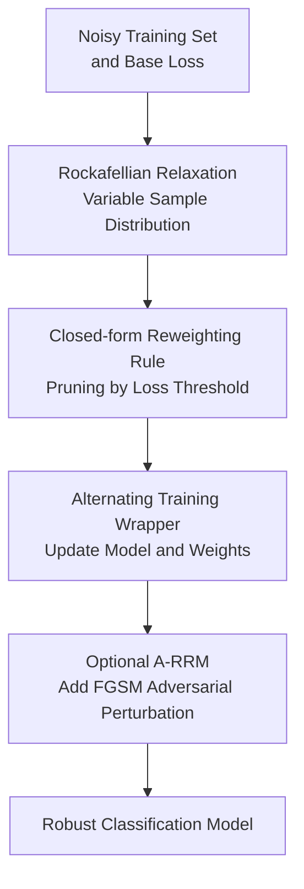

# Enhancing Learning with Noisy Labels via Rockafellian Relaxation

**Conference**: ICLR2026  
**OpenReview**: [https://openreview.net/forum?id=g4EpGiN5X3](https://openreview.net/forum?id=g4EpGiN5X3)  
**Code**: To be confirmed  
**Area**: Optimization / Learning with Noisy Labels  
**Keywords**: Noisy Labels, Loss Reweighting, Rockafellian Relaxation, Distributionally Robust Optimization, Adversarial Training  

## TL;DR
This paper proposes the Rockafellian Relaxation Method (RRM), which wraps any supervised training loss into a reweightable min-min optimization problem. By automatically downweighting suspicious high-loss samples, it enhances the robustness of classification models in real-world noise, synthetic noise, and partial adversarial perturbation scenarios.

## Background & Motivation
**Background**: Learning with noisy labels (LNL) typically follows two tracks: one category involves modifying network structures, regularization terms, or loss functions to slow down the model's memorization of incorrect labels; the other category involves estimating sample reliability during training to reduce the impact of erroneous samples via sample selection, semi-supervised learning, or loss reweighting.

**Limitations of Prior Work**: Although many powerful methods perform well, they rely on additional assumptions. For instance, methods like Meta-Weight-Net require a clean validation set to learn weights, while methods like DivideMix / ProMix / CC filter out clean samples for semi-supervised training, yet the filtered sets themselves may still contain contaminated samples. This is particularly problematic in industrial data where label sources are complex, noise proportions are unknown, and clean validation sets are expensive. The more a method relies on external clean signals, the higher the barrier to deployment.

**Key Challenge**: In neural network training, high-loss samples can be either hard examples or mislabeled examples. Simply discarding high-loss samples harms truly difficult but valuable data, while purely averaging all samples allows incorrect labels to be memorized in later training stages. This paper seeks to address whether the empirical distribution can be relaxed from "all samples are equally trustworthy" to an optimization problem that "allows moving part of the probability mass away from suspicious samples" without assuming a clean validation set or changing the model structure.

**Goal**: The authors aim to provide an architecture-independent wrapper: given any training method centered on supervised loss, only its supervised loss weights are modified without forcing the use of a specific network, task, or robust loss. Furthermore, this wrapper should ideally explain why certain samples are pruned, how to control the pruning ratio using noise proportion estimates, and whether it can be used alongside adversarial training.

**Key Insight**: From the perspective of Rockafellian Relaxation and optimistic distributionally robust optimization (DRO), the paper views the "trustworthiness of the empirical distribution" as an optimization variable. Rather than fixing the probability of each sample to $1/N$, it allows learning a new distribution $p$, but at the cost of a total variation penalty when it deviates from the original empirical distribution. Thus, the model can reduce the weights of high-loss suspicious samples to zero without unconstrainedly picking an overly optimistic data distribution.

**Core Idea**: Use Rockafellian Relaxation to rewrite standard empirical risk minimization as an alternating process of "parameter optimization + sample distribution optimization," allowing the training to automatically transfer probability mass from suspected noisy samples to low-loss trustworthy samples.

## Method

### Overall Architecture
The input to RRM is a set of potentially contaminated training samples, a prediction loss $J(\theta; x, y)$ to be minimized, and any off-the-shelf training method. The output remains the model parameters $\theta$, but an additional reweighting variable $u_i$ is maintained for each sample during training. Rather than a new network architecture, it is an optimization layer wrapped around the supervised loss: the model is first trained with current weights, then weights are re-calculated based on current sample losses to weaken or discard samples with significantly high losses from the training distribution.

The three contribution nodes in the diagram correspond to the following key designs: Rockafellian Relaxation defines the optimizable sample distribution, the closed-form reweighting rule explains which samples are downweighted, and the alternating training wrapper along with the optional A-RRM explains how it is embedded into existing methods. The inputs and outputs serve as scaffolding and are not individual design points.

### Key Designs
**1. Rockafellian Relaxation: Transforming "Averaging All Samples" into "Optimizing a Neighboring Training Distribution"**

Standard training assumes each sample weight is $1/N$, with the training loss expressed as $L(\theta)=\frac{1}{N}\sum_i J(\theta;x_i,y_i)$. If some $y_i$ are mislabeled, the ideal state is not to average all samples but to set the weights of samples in the contaminated set $C$ near 0 and re-normalize the clean samples. Since $C$ is latent, RRM does not directly judge label correctness but treats sample probability $p$ as an inner optimization variable, restricted from being too far from the uniform empirical distribution:

$$
L_{\mathrm{RRM}}(\theta)=\min_{p\in\Delta(N)} \mathbb{E}_{(x,y)\sim p}[J(\theta;x,y)] + \gamma\, d_{TV}(p_N, p).
$$

The paper further rewrites this problem using $p_i=1/N+u_i$, leading to a constrained optimization on $u$: $\sum_i u_i=0$ and $1/N+u_i\ge 0$. The intuition is straightforward: $u_i<0$ removes probability mass from the $i$-th sample, while $u_i>0$ redistributes it to others; $\gamma$ controls the "cost" of moving probability mass. Unlike traditional loss reweighting, these weights are derived from an optimization objective with a total variation penalty rather than heuristic scoring, thus unifying sample pruning and distribution relaxation.

**2. Closed-form Reweighting Rule: Filtering High-loss Suspicious Samples via $c_{\min}+\gamma$ Threshold**

The inner optimization might seem to require linear programming, but the paper proves that for a fixed $\theta$, the optimal $u$ has a clear structure. Let $c_i=J(\theta;x_i,y_i)$ and $c_{\min}=\min_i c_i$; samples with losses exceeding $c_{\min}+\gamma$ are categorized into $\chi(\theta)=\{i:c_i>c_{\min}+\gamma\}$. An optimal solution exists that reduces the weights of these samples to $0$ (i.e., $u_i=-1/N$); the total removed probability mass $|\chi|/N$ is then uniformly transferred to the set of samples with minimum loss.

This result provides two benefits to RRM. First, reweighting can be completed in a single pass over the loss list without calling expensive optimizers on large datasets. Second, the role of $\gamma$ is highly interpretable: if $\gamma$ is large, few samples meet the threshold condition, and RRM degrades to standard training; if $\gamma$ is small, more high-loss samples are pruned. The paper also suggests using a noise proportion estimate $C'$ to automatically adjust $\gamma$, setting the threshold approximately at the $(1-C')$ quantile, ensuring the pruning ratio at least approaches the expected contamination ratio. Thus, RRM requires no clean validation set, only a conservatively estimable noise rate to control pruning intensity.

**3. Alternating Training Wrapper: Replacing Supervised Loss without Model or Robust Method Binding**

The training process of RRM follows block coordinate descent: when $u$ is fixed, model parameters $\theta$ are updated using weighted supervised loss; when $\theta$ is fixed, $u$ is updated based on the current losses of all samples. This allows it to wrap around many existing algorithms. For standard CCE, MAE, and MSE, it directly replaces the average supervised loss with $\sum_i (1/N+u_i)J_i$. For methods like ProMix, DivideMix, and CC that contain a supervised component $L_X$, it only wraps the labeled supervised part, retaining the original semi-supervised and auxiliary terms.

This wrapper design is the most practical aspect of the paper. RRM does not claim to replace all noisy-label methods but rather corrects the weakness of existing methods where the "clean sample set" might still contain noise through an additional layer of loss reweighting. Experimental logic follows this: testing both standard baselines like CCE enhanced by RRM and whether strong methods like ProMix, DivideMix, and CC can achieve further gains when wrapped by RRM.

**4. A-RRM Extension: Simultaneously Suppressing Mislabeled Samples during Adversarial Perturbation Training**

The paper extends RRM to A-RRM with minor differences: during GradientSteps, for each batch, perturbed samples such as $x_i+\epsilon\cdot \mathrm{sign}(\nabla_x J(\theta;x_i,y_i))$ are first generated using FGSM, then SGD updates are performed using current sample weights. That is, A-RRM simultaneously handles two types of contamination: adversarial perturbations in features and incorrect labels.

The rationale behind this design is that pure adversarial training might make incorrect labels more "stable" under noise, especially when training and testing perturbation intensities mismatch, leading to performance collapse. The reweighting step in A-RRM allows the model to identify and downweight high-loss contaminated samples during adversarial training, making it less likely to be misled by incorrect labels compared to pure AT.

### Loss & Training
The core objective of RRM training is an alternating approximate solution to:

$$
\min_{\theta}\min_{u\in U}\sum_{i=1}^{N}(1/N+u_i)J(\theta;x_i,y_i)+\frac{\gamma}{2}\|u\|_1.
$$

The practical algorithm initializes $u=0$. Each round first runs several epochs of GradientSteps to train $\theta$ with current weights; then it performs Re-weight calculation of $u^*$ based on current losses $c_i$ and the threshold $c_{\min}+\gamma$; finally, weights are updated smoothly via $u\leftarrow \mu u^*+(1-\mu)u$. If a contamination estimate $C'$ is available, the paper suggests automatically setting $\gamma$ as the difference between the quantile threshold and the minimum loss, with $\mu=1$, to precisely control the pruning ratio.

The adversarial version A-RRM simply incorporates FGSM input perturbations in GradientSteps with perturbation parameter $\epsilon$. The paper emphasizes that Re-weighting does not need to happen every batch but after several epochs; in experiments on CIFAR-10, Re-weighting added only about 3.88 seconds of overhead, indicating the computational bottleneck remains standard neural network training rather than the reweighting itself.

## Key Experimental Results

### Main Results
Experiments cover real-world noise datasets, synthetic noise datasets, mixed adversarial perturbation and label noise scenarios, and text/medical weak supervision tasks in the appendix. The primary conclusion is that RRM significantly improves standard losses like CCE and MSE and provides additional gains for strong noisy-label methods like DivideMix and CC, though it is not always stable for inherently robust losses like MAE.

| Dataset / Setting | Metric | Ours (RRM Wrapper) | Prev. SOTA / Results | Gain |
|--------|------|------|----------|------|
| CIFAR-100N Noisy Fine, ProMix | Test Acc. | 74.19 | 73.79 | +0.40 |
| CIFAR-100N Noisy Fine, DivideMix | Test Acc. | 73.98 | 71.13 | +2.85 |
| CIFAR-10N Worst, DivideMix | Test Acc. | 94.75 | 92.56 | +2.19 |
| Clothing1M, CC | Test Acc. | 75.69 | 75.40 | +0.29 |
| Clothing1M, CCE | Test Acc. | 71.48 | 68.94 | +2.54 |
| Food-101N, CCE | Test Acc. | 84.21 | 81.67 | +2.54 |

On real noise, CIFAR-100N and Clothing1M are most representative. In CIFAR-100N, RRM wrapping ProMix and DivideMix reached or approached the strongest results in the table. In Clothing1M, RRM wrapping CC improved from 75.4 to 75.69, nearly matching LRA-diffusion's 75.7. On Food-101N, CCE+RRM improved from 81.67 to 84.21, which, while lower than LRA-diffusion and SURE, demonstrates that reweighting offers significant help to standard supervised training even without complex noisy-label pipelines.

### Ablation Study
| Configuration | Key Metrics | Description |
|------|---------|------|
| CIFAR-10, 10% Noise, CCE | 89.94 → 92.20 | RRM significantly improves standard CCE training |
| CIFAR-10, 20% Noise, CCE | 86.98 → 90.44 | Improvement magnitude increases with higher noise |
| CIFAR-10, 30% Noise, CCE | 81.90 → 88.49 | RRM suppresses incorrect label memorization at high noise |
| CIFAR-10, 20% Noise, MSE | 89.43 → 91.43 | MSE also benefits from reweighting |
| CIFAR-10, 30% Noise, MAE | 88.28 → 82.98 | Unstable on MAE, indicating wrapper isn't a unconditional gain |
| MNIST-10, 20% Noise, $\epsilon_{test}=0$ | AT 58 vs A-RRM 96 | Reweighting prevents AT collapse under label noise |
| MNIST-10, 30% Noise, $\epsilon_{test}=0.1$ | AT 20 vs A-RRM 82 | Advantages more pronounced when training/test perturbations mismatch |

### Key Findings
- RRM provides the most stable assistance to standard loss functions, particularly CCE and MSE; this aligns with intuition as empirical risk is most prone to memorizing mislabeled samples late in training.
- For methods already incorporating sample selection or semi-supervised mechanisms, RRM still acts as a secondary filter, suggesting that the supervised subsets selected by original methods may still be contaminated.
- MAE results are more complex: RRM decreased accuracy at some noise levels, suggesting the "high loss equals noise" assumption might not match certain robust losses.
- A-RRM experiments on MNIST show that standard adversarial training can collapse under label noise, whereas reweighting can push the $u_i$ of most contaminated samples close to $-1/N$, effectively removing them from training.
- The $u$ trajectory in Table 6 is critical: at 20% contamination, by round 49, 9286 / 9600 contaminated samples fall into the near-zero weight range, while most clean samples maintain weights near the nominal $1/N$.

## Highlights & Insights
- The highlight of RRM is not a complex network but formulating noisy-label reweighting as a distribution relaxation problem with an optimization interpretation. Consequently, the relationships between pruning rules, threshold parameters, and total variation penalties are explained by theoretical results.
- Theorem 3.1 and Corollary 3.1.1 transform the method from "requiring linear programming" to "reweighting via a single pass over the loss list." This is crucial for large-scale training, ensuring the wrapper is not too expensive for general use.
- The paper connects RRM with optimistic Wasserstein DRO, which is an insightful perspective: instead of defending against the worst-case distribution, it seeks the most favorable data distribution within an allowable neighborhood. For mislabeled problems, this fits the intuition that part of the data should be corrected or removed better than traditional worst-case DRO.
- RRM's ability to improve even strong methods suggests that the bottleneck for many noisy-label pipelines is not architectural capacity but residual incorrect labels in the supervised component. This provides a simple strategy for practical systems: keep existing code and add an interpretable reweighting layer on the supervised loss.
- A-RRM results serve as a reminder that adversarial training and label noise are not independent issues. If training intensities mismatch deployment environments, AT may amplify incorrect labels; sample reweighting provides a mechanism to dynamically "undo" bad samples during training.

## Limitations & Future Work
- The core criterion for RRM still relies on sample loss. High-loss samples could be mislabeled, or they could be minority classes, hard examples, or distribution tails. If the task has long-tail or class imbalance issues, aggressive pruning might harm fairness and generalization.
- Automatic tuning requires a noise proportion estimate $C'$. While conservative estimates work, benefits diminish when estimates are too high; stable estimation of $C'$ in real-world scenarios remains a hurdle.
- While experiments cover image, text, and medical weak supervision, the strongest conclusions primarily come from classification. In structured prediction, generative tasks, or multi-label fine-grained tasks, the comparability of individual sample losses is more complex.
- RRM transfers probability mass to the minimum loss sample set. While theoretically clear, this might reinforce the dominance of easy samples. Future work could consider distributing recovered mass among low-loss but diverse samples rather than just the minimum loss set.
- Currently, A-RRM utilizes FGSM as an adversarial example. Whether RRM maintains stability and additional gains with PGD, complex data augmentation, or modern robust training strategies requires further systematic verification.

## Related Work & Insights
- **vs Meta-Weight-Net / Ren et al. reweighting**: These typically require clean validation sets for weight learning; RRM does not, using internal optimization under TV penalty instead. RRM has fewer deployment constraints but depends on loss threshold assumptions.
- **vs DivideMix / ProMix / CC**: These treat LNL as sample partitioning or semi-supervised learning; RRM is not a replacement but a wrapper for their supervised loss to weaken contaminated samples lingering in the "clean" set.
- **vs GCE / MAE / ELR etc.**: Robust losses reduce noise impact via loss shape, while RRM modifies training weights via sample distribution. They can be combined, though results (especially with MAE) show the combination is not always monotonically better.
- **vs Adversarial Training**: AT focuses on feature perturbation robustness, while RRM focuses on label contamination. A-RRM suggests both can be integrated into one loop: construct perturbations, then prune suspected labels based on loss trajectories.
- **Insights for future work**: This method is suitable as a "low-intrusion robust training layer" for existing systems, especially in scenarios with complex recipes but unstable label quality. Furthermore, RRM's weight trajectories could serve as diagnostic signals for identifying systemic annotation errors or weak label biases.

## Rating
- Novelty: ⭐⭐⭐⭐☆ Connects noisy-label reweighting with Rockafellian / optimistic DRO clearly; the mechanism is simple but grounded in solid theory.
- Experimental Thoroughness: ⭐⭐⭐⭐☆ Covers real, synthetic, and adversarial noise across domains, though main experiments focus on classification accuracy, lacking in-depth long-tail or fairness analysis.
- Writing Quality: ⭐⭐⭐⭐☆ Derivations and threshold explanations are clear; tables are information-dense. Some notation and algorithm layouts are slightly dense, requiring cross-referencing between $p, u, \gamma$.
- Value: ⭐⭐⭐⭐☆ Highly practical as an architecture-agnostic wrapper, particularly for adding low-cost robustness to existing noisy-label or standard supervised pipelines.

<!-- RELATED:START -->

## Related Papers

- [\[ICML 2026\] Learning Locally, Revising Globally: Global Reviser for Federated Learning with Noisy Labels](../../ICML2026/optimization/learning_locally_revising_globally_global_reviser_for_federated_learning_with_no.md)
- [\[ICLR 2026\] Enhancing Communication Compression via Discrepancy-aware Calibration for Federated Learning](enhancing_communication_compression_via_discrepancy-aware_calibration_for_federa.md)
- [\[AAAI 2026\] Data Heterogeneity and Forgotten Labels in Split Federated Learning](../../AAAI2026/optimization/data_heterogeneity_and_forgotten_labels_in_split_federated_learning.md)
- [\[ICLR 2026\] The Power of Small Initialization in Noisy Low-Tubal-Rank Tensor Recovery](the_power_of_small_initialization_in_noisy_low-tubal-rank_tensor_recovery.md)
- [\[ICLR 2026\] Online Black-Box Prompt Optimization with Regret Guarantees under Noisy Feedback](online_black-box_prompt_optimization_with_regret_guarantees_under_noisy_feedback.md)

<!-- RELATED:END -->
