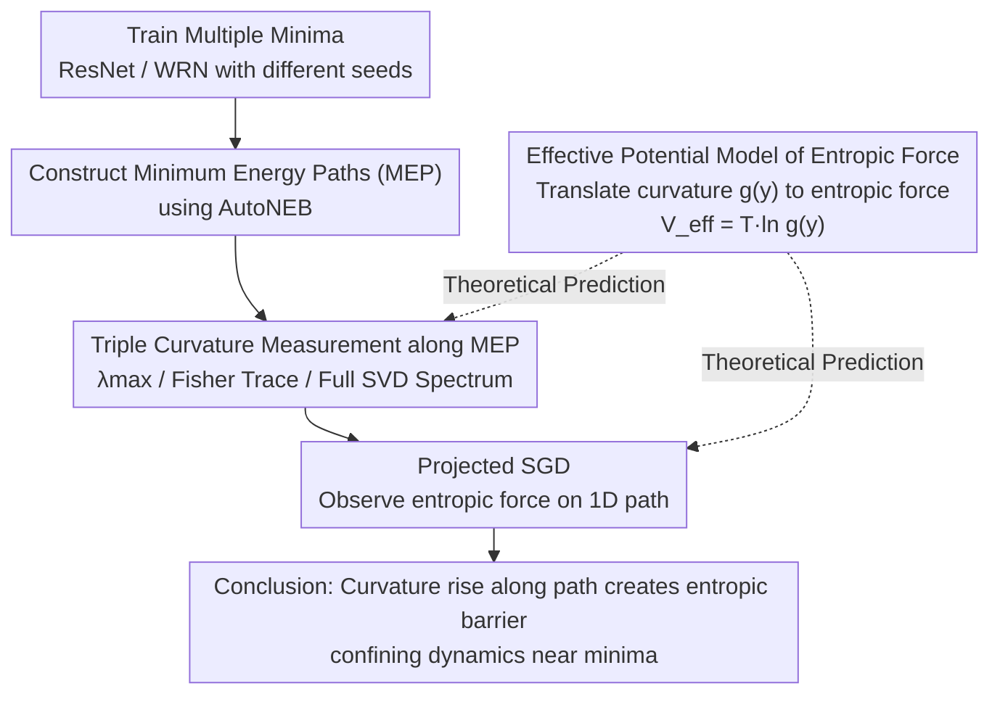

# Entropic Confinement and Mode Connectivity in Overparameterized Neural Networks

**Conference**: ICLR 2026  
**arXiv**: [2512.06297](https://arxiv.org/abs/2512.06297)  
**Code**: None (Author commits to release after de-anonymization)  
**Area**: Deep Learning Theory / Optimization  
**Keywords**: Loss Landscape, Mode Connectivity, Entropic Forces, SGD Dynamics, Overparameterization

## TL;DR
This work reveals that a systematic increase in curvature along low-loss paths generates an entropic force barrier. Even when the energy path is flat, SGD noise confines optimization dynamics to flat regions near minima, explaining the paradox of "mode connectivity vs. restricted dynamics."

## Background & Motivation

**Background**: Different minima of overparameterized neural networks can be connected via low-loss paths (mode connectivity). However, SGD training rarely explores the intermediate points of these paths and ceases movement once it converges to a specific minimum.

**Limitations of Prior Work**: Mode connectivity implies that the loss landscape is not rugged and that minima are connected by flat paths. Yet, optimizers exhibit "confined" behavior—a distinct paradox that existing theories fail to explain adequately.

**Key Challenge**: Focusing solely on loss values (energy) ignores the implicit forces generated by curvature changes—similar to entropic forces in statistical physics. In noisy optimization dynamics, these forces bias the system toward flatter regions.

**Goal**: Why are energy-connected minima dynamically disconnected? How does curvature vary along low-loss paths? How do entropic and energy barriers trade off during the training process?

**Key Insight**: Drawing from the concept of effective potential in Brownian motion (statistical physics), SGD noise is treated as an effective temperature to analyze how curvature variations constrain optimization trajectories via entropic forces.

**Core Idea**: The systematic rise in curvature along low-loss connection paths generates an entropic barrier. This confines noisy optimization dynamics near the minima, even if the energy path is perfectly flat.

## Method

### Overall Architecture
The study introduces "entropic force" from statistical physics into loss landscape analysis to resolve the paradox: if low-loss paths connect different minima, why does SGD not wander along them after convergence? The analysis follows four steps: predicting theory via an effective potential model where curvature $g(y)$ translates to entropic force; training multiple ResNet/WRN models to obtain different minima; using AutoNEB to find the minimum energy paths (MEP); and measuring curvature densely along these paths. Finally, projected SGD is used to collapse high-dimensional dynamics onto a 1-D path to observe whether curvature changes push the model back to the minima. The central thesis is: energy flatness does not imply dynamical freedom—systematic curvature increases along the path act as an entropic barrier in noisy optimization.

### Key Designs

**1. Effective Potential Model for Entropic Forces: Translating Curvature into Force**

Mode connectivity focuses only on loss (energy) but neglects that curvature itself generates force, failing to explain why "energy connectivity does not lead to dynamical connectivity." Following the effective potential logic of Brownian motion, let the potential be $V(x,y) = \frac{1}{2}g(y)x^2$. Here, $x$ represents "hard" directions (large Hessian eigenvalues) that thermalize quickly, $y$ represents "soft" directions (nearly flat curvature, constant loss) that evolve slowly, and $g(y)$ is the curvature along the soft direction. When $x$ relaxes much faster than $y$, integrating out the fast variable $x$ yields an effective potential for the slow variable $y$:

$$V_{\text{eff}}(y) = T \ln g(y),$$

The corresponding force is proportional to $-\frac{d}{dy}\ln g(y)$, pointing towards flatter regions where $g(y)$ is smaller. The effective temperature $T \propto \eta/B$ is determined by learning rate $\eta$ and batch size $B$; the entropic force vanishes as noise goes to zero. This grounds the empirical observation that "SGD prefers flat minima" into a specific mechanism: as long as curvature is non-uniform, noise pushes the system toward the flatter end, regardless of loss fluctuations—entropy may even overcome energy, driving optimization against the loss gradient.

**2. Triple Curvature Measurement along MEP: Cross-Verifying the Barrier**

To validate theoretical predictions in real networks, the curvature must be proven to rise along the path. Since single-spectrum estimates might be affected by direction selection or numerical errors, three complementary methods are used to characterize the Hessian spectrum along the MEP: power iteration for the maximum eigenvalue $\lambda_{\max}$ (requiring $\mathcal{O}(N)$ Hessian-vector products); approximating the Hessian via the Fisher Information Matrix $\mathcal{F}(\theta^\star) = \mathbb{E}_{(x,y)}[s_\theta s_\theta^\top]$ to efficiently estimate the trace near minima; and Singular Value Decomposition (SVD) on the score matrix for a small batch to observe the full spectrum. All three methods consistently show that curvature is significantly higher in the middle of the path than at the endpoints. SVD analysis indicates a collective upward shift of the entire spectrum rather than just specific directions. Notably, curvature continues to rise even after the loss stabilizes between pivots, ruling out the explanation that curvature increase is merely a byproduct of loss decrease.

**3. Projected SGD: Isolating Entropic Force on 1D Paths**

Direct observation of entropic forces in high-dimensional space is hindered by the model escaping along other directions. Standard SGD would drift away from the MEP. This work projects parameters back to the nearest segment on the path after every SGD update, strictly constraining motion. To compare different learning rates fairly, results are plotted against effective time $t_{\text{eff}} = (\text{steps}) \times \eta$. The results show that models initialized in the middle of the path are systematically pushed toward the minima at either end. Relaxation is slower deeper inside the path even when the loss is increasing in that direction—demonstrating that the system minimizes free energy rather than just energy. Quantitative results match the $T \propto \eta/B$ prediction, confirming the role of effective temperature.

### Loss & Training
Base models use standard SGD (momentum 0.9, weight decay $5 \times 10^{-4}$, learning rate 0.1) for 200 epochs with a batch size of 256, decaying the learning rate by factor 5 at 30%/60%/80%/90% of training. AutoNEB uses 4 refinement cycles, gradually reducing the learning rate from 0.1 to $10^{-3}$ to tighten the path. Projected SGD experiments use $\eta=0.02, B=16$ as a baseline, sweeping batch sizes and learning rates to verify entropic force scaling with effective temperature.

## Key Experimental Results

### Main Results

| Experimental Setup | Observation Metric | Result |
|--------|------|------|
| WRN-16-4 MEP (Multiple pairs) | Hessian Trace along path | Lowest at endpoints; 2-3x systematic rise in middle |
| WRN-16-4 MEP | $\lambda_{\max}$ along path | Middle is ~2x higher than endpoints |
| WRN-16-4 MEP | Full SVD Spectrum | Entire spectrum shifts upward deeper into the path |
| Projected SGD (B=16, η=0.02) | Relaxation Time vs. Position | Slower relaxation to endpoints the deeper the starting position |

### Ablation Study

| Configuration | Relaxation Behavior | Explanation |
|------|---------|------|
| Vanilla SGD (Baseline) | Standard relaxation | B=16, η=0.02 |
| Adam | Faster relaxation | Adaptive optimizers are more sensitive to curvature changes |
| SGD + Nesterov Momentum | Faster relaxation | Momentum also enhances entropic force effects |
| B=16 vs B=256 | ~10x difference in relaxation time | Verifies force strength is proportional to effective temperature |
| η=0.01 vs η=0.05 | Faster relaxation with large η | Higher temperature strengthens entropic force |

### Key Findings
- Curvature rises systematically even if loss remains flat or decreases along the path, ruling out curvature as a mere byproduct of loss reduction.
- Entropic barriers are more persistent than energy barriers: in linear mode connectivity experiments, loss instability disappears as the split epoch $k$ increases, but curvature instability persists longer.
- Entropic forces can drive the model in the opposite direction of the gradient—minimizing free energy rather than energy.
- These phenomena hold consistently across CIFAR-10/100 and ResNet-20/ResNet-110/WRN-16-4 architectures.

## Highlights & Insights
- Introduces the concept of entropic force from statistical physics into deep learning theory, providing a concise physical analogy for a long-standing paradox: energy connectivity does not mean dynamical connectivity. This framework elevates the empirical observation of "flat minima preference" to a mechanism-based explanation.
- Sophisticated experimental design: Projected SGD reduces high-dimensional problems to one dimension, making entropic force effects directly measurable and quantifiable, avoiding indirect inference.

## Limitations & Future Work
- Paths found by AutoNEB and linear interpolation may suffer from selection bias; a more principled path sampling method is needed.
- SGD noise is simplified as Gaussian white noise; in practice, it is neither perfectly white nor Gaussian, which may affect quantitative conclusions.
- Validated only on CIFAR-10/100 and relatively small models; generalizability to large-scale Transformers remains to be studied.

## Related Work & Insights
- **vs. Frankle et al. (2020)**: This work found that models sharing early training stages are linearly mode connected. Ours further reveals that curvature barriers on these linear paths persist longer than loss barriers, clarifying what determines the final convergence region.
- **vs. Keskar et al. (2017)**: While they noted that small-batch SGD prefers flat minima, ours provides a precise physical mechanism via entropic forces and generalizes it to curvature variations along paths.

## Rating
- Novelty: ⭐⭐⭐⭐ Unique theoretical perspective using entropic forces to explain the mode connectivity paradox.
- Experimental Thoroughness: ⭐⭐⭐⭐ Cross-validation with three curvature measurements and clever projected SGD design; consistent across architectures.
- Writing Quality: ⭐⭐⭐⭐⭐ Smooth integration of physical intuition and mathematical derivation; clear diagrams and logic.
- Value: ⭐⭐⭐⭐ High theoretical value for understanding loss landscapes and SGD behavior; provides insights for practical methods like weight-space ensembles.

<!-- RELATED:START -->

## Related Papers

- [\[ICLR 2026\] Exploring Mode Connectivity in Krylov Subspace for Domain Generalization](exploring_mode_connectivity_in_krylov_subspace_for_domain_generalization.md)
- [\[ICML 2025\] Understanding Mode Connectivity via Parameter Space Symmetry](../../ICML2025/optimization/understanding_mode_connectivity_via_parameter_space_symmetry.md)
- [\[NeurIPS 2025\] Neural Thermodynamics: Entropic Forces in Deep and Universal Representation Learning](../../NeurIPS2025/optimization/neural_thermodynamics_entropic_forces_in_deep_and_universal_representation_learn.md)
- [\[ICLR 2026\] Fast Convergence of Natural Gradient Descent for Over-parameterized Physics-Informed Neural Networks](fast_convergence_of_natural_gradient_descent_for_over-parameterized_physics-info.md)
- [\[ICLR 2026\] Neural Networks Learn Generic Multi-Index Models Near Information-Theoretic Limit](neural_networks_learn_generic_multi-index_models_near_information-theoretic_limi.md)

<!-- RELATED:END -->
