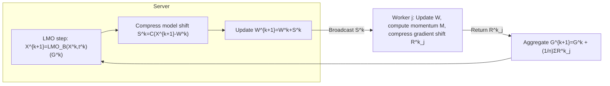

# Error Feedback for Muon and Friends

**Conference**: ICLR 2026  
**OpenReview**: [https://openreview.net/forum?id=rex7s82Iav](https://openreview.net/forum?id=rex7s82Iav)  
**Code**: To be confirmed  
**Area**: Optimization  
**Keywords**: Distributed Optimization, Communication Compression, Error Feedback, Muon, Non-Euclidean LMO

## TL;DR
The paper proposes **EF21-Muon**, the first communication-efficient distributed LMO optimizer that generalizes error feedback to non-Euclidean geometry with rigorous convergence guarantees. It reduces to Muon/Scion/Gluon when compression is disabled and achieves up to 7× communication savings on NanoGPT without accuracy loss.

## Background & Motivation
**Background**: Muon and its derivatives, Scion and Gluon, replace Adam’s global moment estimation with layer-wise, geometry-aware LMO (Linear Minimization Oracle) updates. These have advanced the state-of-the-art in large-scale deep learning, particularly LLM pre-training, and are unified as the Gluon family based on LMOs over non-Euclidean norm balls.

**Limitations of Prior Work**: Modern training is scale-driven and necessitates distributed execution. The primary bottleneck in distributed training is **communication** — the transfer of $d$-dimensional parameters/gradients between machines at each step. Currently, Muon-like methods **lack a principled distributed framework**; available variants (e.g., Distributed Muon based on ZeRO-1, MuLoCo, Dion) are heuristic and **lack convergence guarantees**.

**Key Challenge**: While communication compression combined with error feedback (EF21) is mature in Euclidean settings, Muon’s effectiveness relies on **non-Euclidean** LMO steps. Porting compression and error feedback to non-Euclidean geometry without compromising Muon's theoretical and practical advantages remains an open problem.

**Goal**: To provide a **provably convergent** and **practically effective** communication-efficient distributed version of Muon without sacrificing its theoretical or practical benefits.

**Core Idea**: By merging the "compression + error feedback" mechanism of EF21 with LMO-type updates, the paper introduces EF21-Muon with bidirectional compression (compressing gradients from worker to server and model offsets from server to worker). This marks the first generalization of the error feedback analysis framework to arbitrary norm-induced non-Euclidean settings.

## Method

### Overall Architecture
Under a client-server architecture, EF21-Muon decomposes each step into three tasks: the server performs an **LMO-type update** using the aggregated gradient estimate $G^k$ to obtain a new model $X^{k+1}$; the server compresses the "model offset" and broadcasts it to all workers; each worker calculates a stochastic gradient with momentum on the latest model, compresses the "gradient offset," and transmits it back. The server then aggregates these to update the gradient estimate. **Uncompressed messages are never transmitted**, and error feedback ensures that compression errors are corrected over time.

### Key Designs
**1. Non-Euclidean LMO-type Updates: Preserving Geometry-Awareness**
The core update is a norm-constrained Linear Minimization Oracle:
$$X^{k+1} = X^k + t^k\,\mathrm{LMO}_{B(0,1)}(G^k),\quad \mathrm{LMO}_{B(X,t)}(G):=\arg\min_{Z\in B(X,t)}\langle G,Z\rangle$$
where $B(X,t):=\{Z:\|Z-X\|\le t\}$. When $\|\cdot\|$ is the spectral norm $\|\cdot\|_{2\to2}$, $\mathrm{LMO}_{B(0,1)}(G^k)=-U^k(V^k)^\top$ (from the SVD of the momentum matrix $G^k=U^k\Sigma^k(V^k)^\top$), which recovers the original Muon. Using other operator norms yields Scion or Gluon. The framework is parameterized by the norm in the LMO, unifying a broad class of methods.

**2. Bidirectional Compression + Error Feedback: Efficient and Provable**
The worker side compresses the "momentum offset" $R^{k+1}_j=C^k_j(M^{k+1}_j-G^k_j)$, while the server side compresses the "model offset" $S^k=C^k(X^{k+1}-W^k)$. Following the offset compression logic of EF21, the difference between the current value and the previous estimate is compressed, allowing errors to be fed back into the next step and converge to zero. This is the **first generalization of error feedback beyond the Euclidean domain**, supporting standard contractive compressors and a new class of non-Euclidean compressors introduced in this work.

**3. Layer-wise Anisotropic Analysis: Fitting Deep Network Geometry**
While a simplified version (Algorithm 1) treats all parameters together, the main algorithms (Algorithms 2/3, deterministic/stochastic gradients) are designed and analyzed **layer-wise**. $X=[X_1,\dots,X_p]$ is treated as a collection of matrices $X_i\in\mathbb{R}^{m_i\times n_i}$ on a product space, with each layer having its own norm $\|\cdot\|_{(i)}$. This aligns with Muon’s practice of "layer-wise application" and allows for anisotropic smoothness assumptions, leading to tighter guarantees.

**4. Convergence Guarantees under Dual Smoothness: Aligning with Euclidean SOTA**
The theory covers two mechanisms: non-Euclidean smoothness (Theorems 3/5) and more general non-Euclidean $(L_0,L_1)$-smoothness (Theorems 4/6). It achieves $O(1/K^{1/2})$ for deterministic gradients and $O(1/K^{1/4})$ for stochastic gradients, **matching the SOTA rates of EF21 in Euclidean settings** and potentially offering faster rates under specific norms. Disabling compression recovers the SOTA guarantees of uncompressed Muon/Scion/Gluon. The layer-wise versions (Theorems 14/17/19/24) extend these results into a general anisotropic analysis.

## Key Experimental Results

### Main Results

| Dataset/Task | Metric | Ours (EF21-Muon) | Baseline (Uncompressed Muon/Scion/Gluon) | Δ |
|------------|------|------|----------|---|
| NanoGPT @ FineWeb Pre-training | Worker→Server Communication | Up to 7× saved | 1× | -7× Comm. |
| NanoGPT @ FineWeb Pre-training | Accuracy / Val Loss | On par with baseline | Baseline | No degradation |

### Ablation Study

| Configuration | Metric | Description |
|------|------|------|
| Various Compressors (inc. non-Euclidean) | Comm. vs Accuracy | Systematically compares trade-offs under the same norm |
| Disable Compression | Convergence | Reduces to Muon/Scion/Gluon, verifying framework recovery |
| Norm Selection (Spectral, etc.) | Conv. Speed | Appropriate norms yield faster convergence than Euclidean |

### Key Findings
- Bidirectional compression reduces worker-to-server communication to 1/7 on NanoGPT without dropping validation accuracy.
- Error feedback is essential for "lossless compression": it ensures that compression errors do not destroy convergence guarantees.
- Convergence rates align with Euclidean SOTA under both smoothness mechanisms, providing theoretical evidence that "compression comes at no theoretical cost."
- The framework holds under heterogeneous settings where worker objectives differ, making it suitable for multi-datacenter or federated learning.
- Norm selection serves as a "free lever": under appropriate norms, convergence constants can be better than Euclidean, translating geometric priors into speed gains.

### Convergence Guarantee Summary

| Algorithm | Smoothness | Rate | Recover Euclidean SOTA | Recover Uncompressed SOTA |
|------|----------|--------|----------------|------------------|
| Deterministic Grad | Non-Euclidean Smooth | $O(1/K^{1/2})$ | ✓ | ✓ |
| Deterministic Grad | Non-Euclidean $(L_0,L_1)$ | — | ✓ | ✓ |
| Stochastic Grad | Non-Euclidean Smooth | $O(1/K^{1/4})$ | ✓ | ✓ |
| Stochastic Grad | Non-Euclidean $(L_0,L_1)$ | — | ✓ | ✓ |

## Highlights & Insights
- **First** non-Euclidean LMO distributed optimizer with rigorous convergence guarantees, filling the theoretical gap for distributed variants of the Muon family.
- Error feedback **moves beyond the Euclidean domain for the first time**, a contribution with independent methodological value.
- Unified framework: EF21-Muon recovers Muon/Scion/Gluon through norm parameterization, providing their first communication-efficient distributed implementations.
- Layer-wise anisotropic modeling incorporates the intuition that "different layers of deep nets have different geometries" directly into the theoretical assumptions and bounds.

## Limitations & Future Work
- Experimental scale is limited to NanoGPT/FineWeb; validation in billion-parameter LLM multi-node environments is needed to confirm if 7× savings persist.
- Still follows a centralized client-server paradigm, not covering decentralized or 3D parallel scenarios (e.g., those targeted by Dion).
- Assumptions like $(L_0,L_1)$-smoothness remain somewhat theoretical regarding constant estimation and norm selection guidance.
- Comparison between the engineering overhead of new non-Euclidean compressors versus general contractive compressors could be further systematized.

## Related Work & Insights
- **vs Muon / Scion / Gluon**: These are unified as LMO instances of the Gluon family. Ours does not alter their single-machine updates but adds the layers of "distribution + compression + error feedback + proof," reducing to them when compression is off.
- **vs Distributed Muon (ZeRO-1) / MuLoCo / Dion**: These are heuristic distributed Muon variants without convergence guarantees; EF21-Muon provides the first principled, provable alternative.
- **vs EF21 (Richtárik et al.)**: Inherits the concepts of offset compression and error feedback but extends the analysis from Euclidean to arbitrary non-Euclidean (and layer-wise) settings.

## Rating
- Novelty: ⭐⭐⭐⭐⭐ First to push error feedback to non-Euclidean and provide a provable distributed framework for the Muon family.
- Experimental Thoroughness: ⭐⭐⭐⭐ Systematic comparison on NanoGPT with 7× savings, though lacking large-scale multi-node LLM validation.
- Writing Quality: ⭐⭐⭐⭐ Clear motivation, contributions, and well-structured theorem tables; high theoretical density may be challenging for non-specialists.
- Value: ⭐⭐⭐⭐⭐ Addresses the communication bottleneck in large-scale distributed training and provides a solid theoretical foundation for the Muon family.

<!-- RELATED:START -->

## Related Papers

- [\[ICLR 2026\] Composite Optimization with Error Feedback: the Dual Averaging Approach](composite_optimization_with_error_feedback_the_dual_averaging_approach.md)
- [\[ICLR 2026\] MuonBP: Faster Muon via Block-Periodic Orthogonalization](muonbp_faster_muon_via_block-periodic_orthogonalization.md)
- [\[ICLR 2026\] How Muon's Spectral Design Benefits Generalization: A Study on Imbalanced Data](how_muons_spectral_design_benefits_generalization_a_study_on_imbalanced_data.md)
- [\[ICLR 2026\] LoRA meets Riemannion: Muon Optimizer for Parametrization-independent Low-Rank Adapters](lora_meets_riemannion_muon_optimizer_for_parametrization-independent_low-rank_ad.md)
- [\[ICLR 2026\] Online Black-Box Prompt Optimization with Regret Guarantees under Noisy Feedback](online_black-box_prompt_optimization_with_regret_guarantees_under_noisy_feedback.md)

<!-- RELATED:END -->
