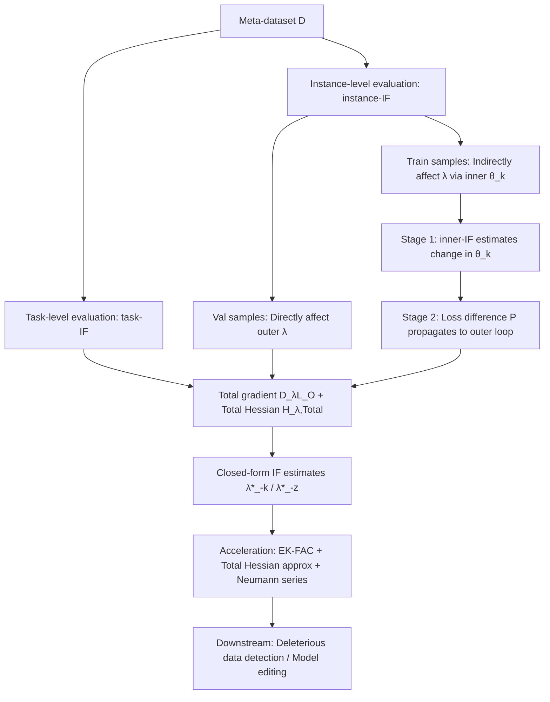

# Evaluating Data Influence in Meta Learning

**Conference**: ICLR 2026  
**OpenReview**: [https://openreview.net/forum?id=0gh7haE5tc](https://openreview.net/forum?id=0gh7haE5tc)  
**Code**: To be confirmed  
**Area**: Bi-level Optimization / Data Attribution / Meta Learning  
**Keywords**: Influence Function, Data Attribution, Meta Learning, Bi-level Optimization, MAML, Data Valuation, Model Editing  

## TL;DR
This work generalizes influence functions from single-layer M-estimators to the bi-level optimization (BLO) structure of meta-learning. It proposes two closed-form formulas, task-IF and instance-IF, which accurately characterize the direct and indirect contributions of a task or an instance to meta-parameters using the "total gradient / total Hessian." Accelerated by EK-FAC and Neumann series, the method enables retraining-free identification of deleterious data and model editing.

## Background & Motivation

**Background**: Meta-learning (represented by MAML) models "learning to learn" as bi-level optimization (BLO). The inner loop uses meta-parameter $\lambda$ to train task-specific parameters $\theta_i(\lambda)$ on small-shot tasks, while the outer loop optimizes the shared $\lambda$ by aggregating performances across all tasks on validation sets. As meta-dataset scales increase, the number of tasks becomes enormous, but their contributions are highly imbalanced, and large-scale datasets often contain noisy labels.

**Limitations of Prior Work**: Identifying "detrimental tasks/instances" requires data attribution tools. Influence Functions (IF) are an efficient attribution method—they estimate model changes after removing a point using gradient information without retraining, making them much faster than Shapley Values. However, IF was originally designed for **single-layer M-estimators**, relying on the assumption that the gradient is zero at the optimum: $\nabla L(\hat\theta)=0$.

**Key Challenge**: The bi-level structure of meta-learning invalidates this assumption. Meta-parameters $\lambda$ and task parameters $\theta_i(\lambda)$ are codependent. The total outer loss $L_{\text{Total}}$ depends on both $\lambda$ and $\{\theta_i(\lambda)\}$. At the optimum $\lambda^*$, the **direct gradient is not zero** ($\partial_\lambda L_{\text{Total}}\neq 0$), causing the classic Taylor expansion of IF to fail. More critically, training samples do not explicitly appear in the outer objective—their influence on meta-parameters is transmitted indirectly "through a layer of task parameters," making direct up-weighting impossible.

**Goal**: To establish a general, closed-form, and scalable data attribution framework for meta-learning under the BLO framework, precisely quantifying contributions at both the **task level** and the **instance level**.

**Core Idea**: **Replace the "direct gradient" with the "total gradient"**. The key observation is that while the direct gradient is non-zero, the **total gradient is zero at the optimum** ($D_\lambda L_{\text{Total}}(\lambda^*)=0$). By substituting this total gradient (including the dependency of $\theta_i(\lambda)$ on $\lambda$) and the corresponding "total Hessian" back into the IF derivation, an influence function suitable for bi-level structures is recovered. For training samples, a **two-stage closed-form estimation** is designed: first calculating the sample's influence on task parameters, then propagating this influence to the meta-parameters via the outer loss difference.

## Method

### Overall Architecture
The paper follows the natural hierarchy of meta-learning data—"Dataset = Multiple Tasks, Task = Training Set $\cup$ Validation Set"—and decomposes attribution into three scenarios with closed-form solutions: (1) **Task-level task-IF**: the effect of removing the entire $k$-th task on $\lambda^*$; (2) **Validation instance-IF**: validation samples appear only in the outer loop and directly affect $\lambda$, reusing the task-IF logic; (3) **Training instance-IF**: training samples are hidden in the inner loop and affect $\lambda$ indirectly, requiring two-stage propagation. The shared backbone for all three is the "total gradient + total Hessian" correction for the bi-level structure.

### Key Designs

**1. Total Gradient and Total Hessian: The foundation for IF in bi-level structures.** The reason classic IF can be written as $-H_{\hat\theta}^{-1}\nabla\ell(z_m;\hat\theta)$ relies entirely on $\nabla L(\hat\theta)=0$ at the optimum. The bi-level structure breaks this, but the authors found that the **total gradient** still vanishes. For the outer loss $L_O^i$ of the $i$-th task, the total gradient is $D_\lambda L_O^i = \partial_\lambda L_O^i + \frac{d\theta_i(\lambda)}{d\lambda}\cdot\partial_{\theta_i}L_O^i$, where the critical Jacobian term is given by the inner implicit function theorem: $\frac{d\theta_i(\lambda)}{d\lambda} = -\partial_\lambda\partial_{\theta_i}L_I\cdot H_{i,\text{in}}^{-1}$ ($H_{i,\text{in}}$ is the inner Hessian). This term represents the chain propagation of "how much task parameters change if meta-parameters change," which is the core missing piece in direct-IF. Consequently, the direct Hessian is upgraded to the **total Hessian** $H_{\lambda,\text{Total}}=\sum_i D_\lambda D_\lambda L_O^i$, which includes cross-terms of first, second, and even third-order partial derivatives, fully characterizing the bi-level coupling.

**2. task-IF: Up-weighting an entire task as a "single data point."** Removing the $k$-th task is equivalent to removing the term $L_O(\lambda,\theta_k(\lambda);D_k^{\text{val}})$ in the outer objective. Following the original IF perturbation $\epsilon$ and Taylor expansion, but using the corrected total gradient and total Hessian, the closed-form is $\text{task-IF}(D_k)=-(\delta I+H_{\lambda,\text{Total}})^{-1}\cdot D_\lambda L_O(\lambda^*,\theta_k(\lambda^*);D_k^{\text{val}})$. Thus, the retrained meta-parameters can be estimated as $\lambda^*_{-k}\approx\lambda^*-\text{task-IF}(D_k)$. In comparative experiments, **direct-IF** (Eq. 2, a naive extension ignoring the dependency of $\theta_i$ on $\lambda$) achieved an accuracy of only 0.54 on Omniglot, while task-IF reached 0.78, close to the 0.79 from actual retraining, validating that the "total gradient correction" is indispensable.

**3. Two-stage closed-form propagation for training samples: Solving the "samples not explicitly in the outer loop" problem.** Training samples $\tilde z$ are hidden in the inner loop and cannot directly up-weight the outer loss. The authors split this into two steps: **Stage One** uses classic IF to calculate the impact on task parameters $\text{inner-IF}(\tilde z;\theta_k)=-H_{k,\text{in}}^{-1}\nabla_{\theta_k}\ell(\tilde z;\theta_k)$ (holding $\lambda$ fixed, the inner loop is a standard single-layer problem); **Stage Two** uses a clever insight—since the outer loss does not explicitly change with $\tilde z$, estimate the "outer loss difference caused by the change in task parameters from $\theta_k$ to $\theta_k^-$": $P(\lambda,\theta_k;\tilde z)=-\nabla_\theta L_O^\top\cdot\text{inner-IF}(\tilde z;\theta_k)$. This **loss difference term** is treated as the object to be up-weighted in the outer objective with a coefficient $\zeta$. Taking the derivative as $\zeta\to0$ yields $\text{instance-IF}(\tilde z)=-H_{\lambda,\text{Total}}^{-1}\cdot D_\lambda P(\lambda^*,\theta_k(\lambda^*);\tilde z)$. Since validation samples only appear in the outer loop, they degrade to a sample-wise version of task-IF: $-(\delta I+H_{\lambda,\text{Total}})^{-1}\nabla\ell(\tilde z;\theta_k)$.

**4. 3rd-order Derivatives and iHVP Acceleration: Making the framework feasible for large models.** The total Hessian involves **third-order partial derivatives** such as $\frac{d^2\theta_i}{d\lambda^2}$, and inverse Hessian-vector products (iHVP) appear repeatedly, making direct calculation expensive and unstable. The authors use a three-pronged approach: **EK-FAC** for storage-free approximation of the inner iHVP; an **Approximation Theorem 5.1** for the total Hessian, replacing the $H'$ term (containing 3rd-order derivatives) with $\Gamma=\sum_i\|\partial_\theta L_O^i\|_1\cdot I$—since third-order information is limited compared to first/second order, a diagonal approximation based on gradient magnitude captures the primary influence while simplifying computation; and finally, **Neumann series** $\tilde H^{-1}v\approx\sum_{j=0}^J(I-\tilde H)^j v$ to expand the iHVP into term-wise accumulation, avoiding explicit storage of the large Hessian. Note that Neumann series is used here instead of EK-FAC for the total Hessian because cross-layer interactions violate EK-FAC's layer-independence assumption.

## Key Experimental Results

### Main Results (Task-level + Instance-level, 4 Datasets, Accuracy / Runtime in sec)

| Eval Level | Method | Omniglot Acc | Omniglot RT | MINI-ImageNet Acc | MINI-ImageNet RT |
|---|---|---|---|---|---|
| Task-level | Retrain (GT) | 0.7908 | 316.74 | 0.3071 | 682.56 |
| Task-level | **Task-IF** | **0.7804** | **65.69** | **0.2668** | **74.63** |
| Task-level | Direct-IF | 0.5422 | 7.46 | 0.2214 | 10.24 |
| Task-level | EKFAC IF | 0.4872 | 631.90 | 0.1868 | 1937.42 |
| Task-level | TRAK | 0.3076 | 1022.52 | 0.2592 | 1154.17 |
| Task-level | TracIn | 0.7690 | 375.42 | 0.2592 | 1154.16 |
| Instance-level | Retrain(Train) | 0.7852 | 251.76 | 0.3263 | 392.24 |
| Instance-level | **Instance-IF(Train)** | **0.7686** | **4.49** | **0.2854** | **7.17** |
| Instance-level | Retrain(Val) | 0.7895 | 260.48 | 0.3222 | 358.49 |
| Instance-level | **Instance-IF(Val)** | **0.7790** | **5.53** | **0.2767** | **7.47** |

Task setup: Accuracy after identifying and removing 40% deleterious data using attribution methods and then retraining; task-IF / instance-IF can also directly edit the model without retraining.

### Ablation Study (Deleterious task/instance detection, MNIST with 80% tasks having flipped labels)

| Data Inspected Ratio | IS (Influence Score sorting) Test Acc | Random Test Acc |
|---|---|---|
| 25% | ≈62.5% | ≈55% |
| Ratio of mislabeled tasks identified at 40% inspection | ≈100% | ≈40% |
| Ratio of mislabeled tasks identified at 95% inspection | — | ≈45% |

### Key Findings
- **Accuracy approaches retraining while saving 75%-80% of time**: task-IF yields 0.7804 vs. 0.7908 for retraining on Omniglot, with runtime cut from 316.74 to 65.69; on MINI-ImageNet, RT dropped from 682.56 to 74.63.
- **Direct-IF serves as a negative example**: Although the fastest (~7s), its accuracy crashes (only 0.54 on Omniglot), proving that ignoring "task parameter dependency on meta-parameters" is fatal; total gradient correction is essential.
- **Instance-IF is extremely efficient**: Training instance attribution takes only 4.49s (vs. 251.76s for retraining), with an accuracy of 0.7686, close to 0.7852.
- **Influence Score (IS) identifies deleterious data far better than random**: At 25% inspection, IS is 7.5 percentage points higher than random; at 40%, it identifies nearly 100% of mislabeled tasks, while random only finds ~45% even at 95% inspection.

## Highlights & Insights
- **"Total gradient over direct gradient" is the true theoretical pivot**: By capturing the observation that "direct gradient is non-zero but total gradient is zero at the bi-level optimum," this work smoothly transfers the IF mechanism to BLO, being the first to systematically introduce influence functions to bi-level optimization.
- **Clever design of two-stage propagation for training samples**: Faced with the fundamental difficulty of samples not appearing explicitly in the outer loop, the authors switch to up-weighting the "outer loss difference $P$ caused by task parameter changes" instead of the sample itself, a key trick to bypass explicit perturbations.
- **Equal emphasis on theory and engineering**: Beyond closed-form solutions, the work addresses the computational wall of 3rd-order derivatives and iHVP by using a suite of EK-FAC + total Hessian diagonal approximation + Neumann series to push the framework to a scalable size.
- **Clear downstream applications**: Deleterious task/instance identification, model editing (data removal without retraining), and meta-parameter interpretability are all derived directly from the same IF framework.

## Limitations & Future Work
- **Accuracy loss in total Hessian approximation**: Theorem 5.1 roughly replaces 3rd-order terms with a gradient magnitude diagonal matrix $\Gamma$. While practical, the theoretical error is not strictly characterized and may distort in complex tasks.
- **Smaller/Classic datasets**: Experiments are limited to few-shot benchmarks like Omniglot, MNIST, MINI-ImageNet, and FC100. Stability on large-scale modern models/data is not verified, and the paper admits that "influence estimation stability depends on model convergence behavior."
- **Accuracy gap on MINI-ImageNet**: task-IF 0.2668 vs. retraining 0.3071; the reliability of indirect influence estimation in complex feature distributions needs further improvement.
- **Limited to MAML-like optimization-based meta-learning**: Metric-based meta-learning (Prototypical / Matching Networks) does not fall under the BLO framework, so the method is not directly applicable.
- **Future Work**: Exploring tighter total Hessian approximations, extending to large model meta-finetuning scenarios, and combining with machine unlearning for verifiable data deletion.

## Related Work & Insights
- **Meta-learning**: MAML (Finn 2017) formalized meta-learning as BLO, leading to optimization-based methods like Meta-SGD, PMAML, and Warped Gradient Descent; this work performs attribution from the MAML BLO perspective.
- **Influence Functions**: Koh & Liang (2017) introduced IF to deep learning for mislabel detection, model interpretation, and machine unlearning; LiSSA, EK-FAC, and kNN provided efficiency optimizations. This paper is the **first to introduce IF to bi-level optimization**, filling the gap where IF was only applicable to single-layer M-estimators.
- **Insights**: The handling of implicit dependencies via "total gradients/total derivatives" can be transferred to other BLO applications (hyperparameter optimization, data selection, RL)—effectively any scenario where the "upper-level direct gradient is non-zero at optimum and requires propagation through lower-level optimality conditions."

## Rating
- Novelty: ⭐⭐⭐⭐ First to systematically generalize influence functions to bi-level optimization/meta-learning; the "total gradient" insight is clean and powerful, and the two-stage training instance design is clever.
- Experimental Thoroughness: ⭐⭐⭐ 4 datasets + 5 baseline comparisons + complete ablation on deleterious data; however, datasets are small/classic, and modern large-scale models are missing. Accuracy gaps on MINI-ImageNet persist.
- Writing Quality: ⭐⭐⭐⭐ Clear problem decomposition (task-level/val-instance/train-instance), smooth transition between theorems and motivation, and a natural derivation starting from "why direct-IF fails" to "total gradient correction."
- Value: ⭐⭐⭐⭐ Provides the first set of closed-form, acceleratable tools for meta-learning data attribution. The practical value for retraining-free identification of deleterious tasks/instances and model editing is clear, and the theoretical framework generalizes to broader BLO scenarios.

<!-- RELATED:START -->

## Related Papers

- [\[ICLR 2026\] Binomial Gradient-Based Meta-Learning for Enhanced Meta-Gradient Estimation](binomial_gradient-based_meta-learning_for_enhanced_meta-gradient_estimation.md)
- [\[ICLR 2026\] Generalizable Heuristic Generation Through LLMs with Meta-Optimization](generalizable_heuristic_generation_through_llms_with_meta-optimization.md)
- [\[ICLR 2026\] $\mu$LO: Compute-Efficient Meta-Generalization of Learned Optimizers](mulo_compute-efficient_meta-generalization_of_learned_optimizers.md)
- [\[ICLR 2026\] Unified Analyses for Hierarchical Federated Learning: Topology Selection under Data Heterogeneity](unified_analyses_for_hierarchical_federated_learning_topology_selection_under_da.md)
- [\[ICLR 2026\] FedDAG: Clustered Federated Learning via Global Data and Gradient Integration for Heterogeneous Environments](feddag_clustered_federated_learning_via_global_data_and_gradient_integration_for.md)

<!-- RELATED:END -->
