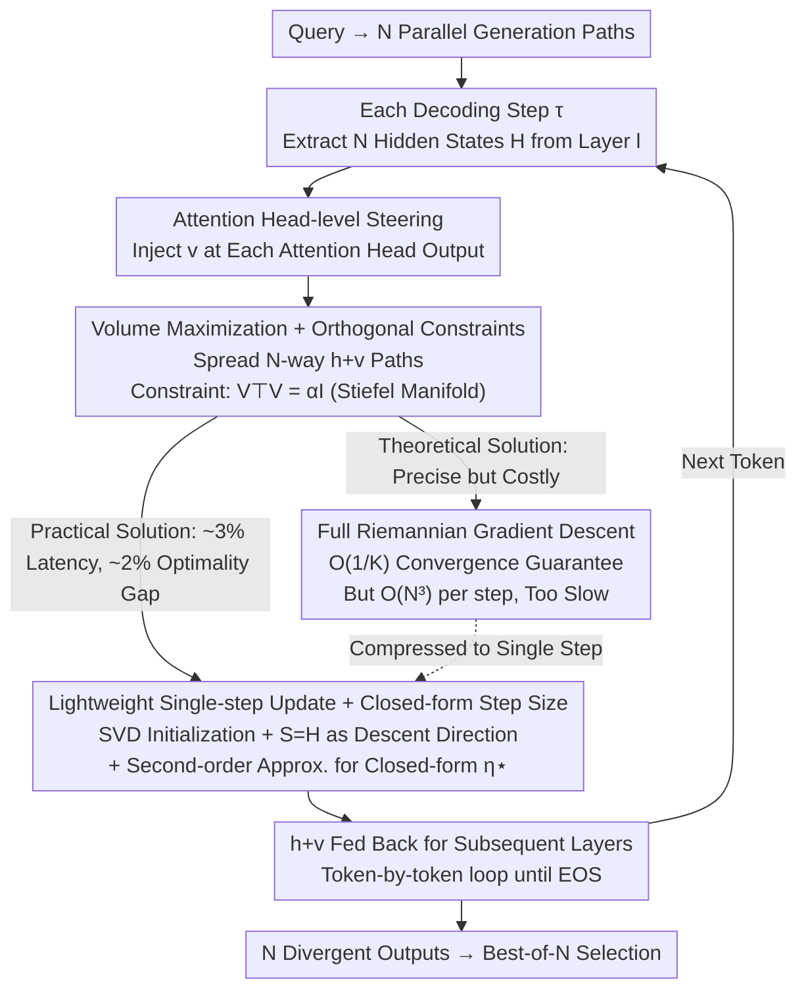

# Exploring Diverse Generation Paths via Inference-time Stiefel Activation Steering

**Conference**: ICLR 2026  
**arXiv**: [2601.22010](https://arxiv.org/abs/2601.22010)  
**Code**: [https://github.com/lythk88/STARS](https://github.com/lythk88/STARS)  
**Area**: Optimization  
**Keywords**: activation steering, Stiefel manifold, Riemannian optimization, diverse generation, inference-time intervention  

## TL;DR
The authors propose STARS (Stiefel-based Activation Steering for Diverse ReaSoning), a training-free inference-time activation steering method. By jointly optimizing $N$ parallel generation paths' orthogonal steering directions on the Stiefel manifold during each token's decoding to maximize the geometric volume of hidden states, STARS promotes divergent activation trajectories. It consistently outperforms temperature sampling in diversity across test case generation (TestEval) and scientific discovery (LiveIdeaBench) with minimal latency and no loss in quality.

## Background & Motivation
**Background**: The Best-of-N paradigm (sampling multiple candidate solutions and selecting the best) is widely used for reasoning, coding, and planning tasks. However, its effectiveness is limited by the diversity of the candidate pool. When multiple parallel generation paths converge to the same high-probability region in the latent space, outputs become mere paraphrases of the same thought, and increasing the sampling budget fails to overcome performance bottlenecks.

**Limitations of Prior Work**:
   - Methods like temperature sampling, nucleus sampling, and beam search only locally perturb the probability distribution at the token level, failing to **coordinate** between parallel runs and lacking a global diversity objective.
   - Training-time methods (such as RL with modified objective functions) require a full training pipeline, incur high computational costs, and may lack cross-domain generalization.
   - Existing activation steering techniques are designed for **convergence**—pushing a single generation towards a fixed predetermined direction—and are unsuitable for **divergent** objectives.

**Key Challenge**: Inference-time diversification must simultaneously satisfy two conflicting goals: (a) being lightweight enough for real-time intervention at every token without significant latency; (b) being powerful enough to produce meaningful divergence in the latent space rather than superficial differences.

**Key Insight**: Ours redefines activation steering from "converging toward a fixed direction" to "pushing multiple paths away from each other"—transforming it from a control tool into an exploration engine. This is achieved by jointly optimizing orthogonal steering directions on the Stiefel manifold to maximize the geometric volume of modified hidden states.

## Method

### Overall Architecture
Given a query, the model generates $N$ parallel output sequences. At each decoding step $\tau$, STARS extracts the hidden states $h_{\tau,1}^{(l)}, \ldots, h_{\tau,N}^{(l)} \in \mathbb{R}^d$ of all paths from a specified layer $l$. It then jointly solves for a set of orthogonal steering vectors $v_{\tau,i}^{(l)}$ on the Stiefel manifold and feeds the modified hidden states $h_i + v_i$ back into subsequent layers for decoding until all paths reach the EOS token. This process involves no weight modifications; it inserts a geometric optimization during the forward pass to push the $N$ paths apart in the latent space. "Where to inject" is addressed by Design 1, "what to optimize" is defined by Design 2, and "how to solve efficiently" evolves from Design 3 to Design 4—where a theoretically rigorous algorithm is compressed into a nearly free closed-form update.

### Key Designs

**1. Attention Head-level Steering: Intervening on Functionally Specialized Subspaces**

STARS does not apply a global offset to the residual stream. Instead, it injects steering vectors into the output of each head in the multi-head attention mechanism by replacing the $j$-th head's output with $\text{Attn}_j(x^{(l)}) + v^{(l,j)}$. This design leverages the fact that different attention heads often perform distinct functions (e.g., syntactic dependency, coreference resolution). Intervening at the head level is more targeted than at the mixed residual stream and more likely to guide "divergence" toward semantically meaningful directions. Concatenating the steering vectors of all $M$ heads forms the full $v^{(l)} \in \mathbb{R}^d$, where $d = d_h \times M$, allowing global geometric optimization across the entire layer's dimensions.

**2. Volume Maximization + Orthogonal Constraints: Formalizing Diversity as a Geometric Objective**

To truly separate the $N$ paths, STARS maximizes the volume of the parallelotope spanned by the modified hidden states $\{h_i + v_i\}_{i=1}^N$. A larger volume implies vectors are more spread out and independent. Letting $H$ and $V$ denote the matrices, the objective is equivalent to the constrained optimization problem $\min_{V^\top V = \alpha I} -\log\det\big((H+V)^\top(H+V)\big)$. The condition $V^\top V = \alpha I$ is a scaled Stiefel manifold constraint that serves two purposes: orthogonality ($v_i^\top v_j = 0$) ensures each path receives non-overlapping perturbations, while the fixed magnitude ($\|v_i\|_2^2 = \alpha$) prevents steering intensity from overpowering the information-carrying hidden states. The magnitude is set by $\alpha = C \cdot \|H\|_2^2$, where $C > 0$ is the sole intensity hyperparameter (taken as $C \in \{0.1, 0.5\}$ in experiments). The geometric intuition is that steering vectors are anchored to an "orthogonal frame." Since $d \gg N$ (e.g., $d = 1536$ for Qwen-2.5-1.5B and $N = 4\sim20$), the manifold dimension is much higher than the number of paths, meaning the orthogonality constraint is rarely restrictive but provides essentially different intervention directions for each path.

**3. Full Riemannian Gradient Descent: Convergence Guaranteed, but Costly**

The most direct solution is standard Riemannian optimization on the Stiefel manifold $\text{St}(d, N, \alpha)$ (Algorithm 2). Each step calculates the Euclidean gradient $\nabla\ell(V_k) = -2(H+V_k)[(H+V_k)^\top(H+V_k)]^{-1}$, projects it onto the tangent space to obtain the Riemannian gradient, uses polar decomposition as a retraction to the manifold, and applies Armijo backtracking line search to ensure sufficient descent. While Theorem 1 provides a convergence rate of $\min_{0 \le k \le K} \|\text{grad}\,\ell(V_k)\|_F^2 = O(1/K)$, the computational cost—matrix inversions, square roots, and line search at $O(N^3)$ complexity per step—is unacceptable for per-token inference. This is the core engineering challenge STARS addresses: maintaining the volume maximization goal while reducing solving costs to near zero.

**4. Lightweight Single-step Update + Closed-form Step Size: 97% Speedup via SVD**

The practical algorithm (Algorithm 3) collapses multiple iterations into a single meticulously designed step. In the initialization phase (Algorithm 1), an SVD of $H = Q\Sigma W^\top$ is performed. $N$ columns are randomly sampled from the null-space basis of $Q$ (last $d-r$ columns) and scaled to $\sqrt{\alpha}$ to obtain $V_0$. Proposition 1 constructively guarantees that $H + V_0$ is full rank and the starting point is valid. Instead of calculating a new gradient, the search direction is directly taken as $S = H$. Using the activation matrix itself as the descent direction is proven by Proposition 3 to be a valid Riemannian descent direction at $V_0$ with zero additional calculation. The step size is derived using a second-order Taylor approximation of the exact line search (Proposition 2), resulting in a closed-form solution $\eta^\star = D_1 / D_2$, where $D_1 = 2\sum_{i=1}^r \frac{\sigma_i^2}{\sigma_i^2 + \alpha}$ and $D_2 = 4\sum_{i=1}^r \frac{\sigma_i^4}{(\sigma_i^2 + \alpha)^2}$. This step size depends only on the singular values of $H$, which are already available from the initialization SVD. The final update $V_1 = \sqrt{\alpha}(V_0 + \eta^\star H) W (\alpha I + (\eta^\star \Sigma)^2)^{-1/2} W^\top$ similarly reuses the SVD results. Empirically, this single-step version has only a ~2% optimality gap compared to the iterative Algorithm 2 but takes only ~3% of the time, compressing "guaranteed but slow" optimization into a "nearly free and good enough" single step.

## Key Experimental Results

### Test Case Generation (TestEval, $N = 20$)

| Model | Temp | Method | Syntactic Correctness | Total Line Coverage | Total Branch Coverage |
|------|------|------|-----------|---------|-----------|
| Gemma-1.1-2B | 0.2 | Sampling | 95.64% | 1.44% | 1.41% |
| | 0.2 | **STARS_0.5** | 78.93% | **39.03%** | **35.05%** |
| Qwen3-1.7B | 0.2 | Sampling | 8.17% | 4.71% | 4.16% |
| | 0.2 | **STARS_0.5** | 73.40% | **91.35%** | **87.13%** |

- STARS_0.5 consistently and significantly improves coverage (diversity metric) across all temperature settings.
- For Qwen3-1.7B, STARS also increases execution correctness from ~3% to ~42%, indicating that diversified steering helps the model explore better generation paths.
- The advantage is particularly pronounced in low-temperature (T=0.2) scenarios where standard sampling diversity is near zero.

### Scientific Discovery (LiveIdeaBench, $N = 4$)

| Model | Temp | Method | Fluency (Diversity)| Average Score |
|------|------|------|-----------------|--------|
| Qwen2.5-3B | 0.2 | Sampling | 2.68 | 5.01 |
| | 0.2 | **STARS_0.5** | **5.09** | **5.59** |
| Llama-3.2-3B | 0.2 | Sampling | 3.27 | 5.27 |
| | 0.2 | **STARS_0.5** | **4.04** | **5.48** |

- Fluency (Diversity Metric): At T=0.2, STARS scores nearly double those of standard sampling (5.09 vs. 2.68).
- Key Finding: While standard sampling performance drops sharply as temperature decreases (5.71 → 5.01), STARS remains stable across temperatures.
- Qualities like Originality, Feasibility, and Clarity are largely unaffected, showing diversity gains do not come at the cost of quality.

### Running Time

| Task | Model | Standard Sampling | Algorithm 3 | Extra Overhead |
|------|------|---------|------------|---------|
| TestEval | Gemma-1.1-2B | 4.53s | 4.63s | +0.1s |
| TestEval | Qwen3-1.7B | 9.01s | 9.97s | +0.96s |
| LiveIdeaBench | Qwen2.5-3B | 3.02s | 5.01s | +1.99s |
| LiveIdeaBench | Llama-3.2-3B | 4.21s | 4.33s | +0.12s |

- The maximum overhead per problem is ~2 seconds, making deployment costs negligible.

## Highlights & Insights
- **Elegant Problem Reframing**: Formalizing "reasoning diversity" as a volume maximization problem on a Stiefel manifold provides a rigorous mathematical framework.
- **Balance of Theory and Practice**: While Algorithm 2 provides convergence guarantees, Algorithm 3 uses SVD initialization + $H$ as search direction + closed-form step size to sacrifice 2% optimality for a 97% speedup.
- **Ingenious Search Direction**: Using the activation matrix $H$ itself as the search direction is efficient (zero cost) and allows the step size to be derived solely from singular values.
- **Training-free**: The method requires no weight modifications or contrastive samples and is a plug-and-play enhancement for any pre-trained model.

## Limitations & Future Work
- Syntactic correctness drops under STARS_0.5 (e.g., Gemma from 95% to 79%), suggesting strong steering may disrupt generation fluency.
- The $\alpha$ hyperparameter requires tuning ($C = 0.1$ or $0.5$), and optimal values may vary by task and model.
- Validation is limited to small models (1.5B–3B); performance and overhead on larger models (7B+) are not yet reported.
- Selecting the layer for steering requires experimental determination (LiveIdeaBench used layer 20).
- Orthogonality constraints might become too restrictive if $N$ approaches $d$ (though $d \gg N$ in practice).
- Algorithm 3 lacks theoretical convergence guarantees, relying currently on empirical validation.

## Related Work & Insights
- **vs. Temperature/Nucleus Sampling**: These local token-level perturbations lack global coordination. STARS provides structured divergence in the latent space.
- **vs. Training-time Diversity (DPP, RL)**: STARS is an inference-time method that avoids the complexities of training pipelines.
- **vs. Traditional Activation Steering**: Conventional steering uses contrastive samples for convergence control; STARS uses orthogonal volume maximization for exploration—a fundamentally different philosophy.
- **Insight**: Orthogonal constraints on the Stiefel manifold could be extended to other scenarios requiring "structured diversity," such as ensemble learning or strategy differentiation in multi-agent cooperation.

## Rating
- Novelty: ⭐⭐⭐⭐⭐ An entirely new combination of Stiefel manifolds and activation steering.
- Experimental Thoroughness: ⭐⭐⭐⭐ Validated on two benchmarks with multiple models, but lacks large-scale model verification.
- Writing Quality: ⭐⭐⭐⭐⭐ Rigorous theoretical derivation progressing clearly from modeling to practical algorithms.
- Value: ⭐⭐⭐⭐ Provides a plug-and-play diversity enhancement tool for the Best-of-N paradigm.

<!-- RELATED:START -->

## Related Papers

- [\[ICLR 2026\] SCRAPL: Scattering Transform with Random Paths for Machine Learning](scrapl_scattering_transform_with_random_paths_for_machine_learning.md)
- [\[ICLR 2026\] COLD-Steer: Steering Large Language Models via In-Context One-step Learning Dynamics](cold-steer_steering_large_language_models_via_in-context_one-step_learning_dynam.md)
- [\[ICLR 2026\] Exploring Mode Connectivity in Krylov Subspace for Domain Generalization](exploring_mode_connectivity_in_krylov_subspace_for_domain_generalization.md)
- [\[ICLR 2026\] Toward Principled Flexible Scaling for Self-Gated Neural Activation](toward_principled_flexible_scaling_for_self-gated_neural_activation.md)
- [\[ICLR 2026\] Activation Function Design Sustains Plasticity in Continual Learning](activation_function_design_sustains_plasticity_in_continual_learning.md)

<!-- RELATED:END -->
