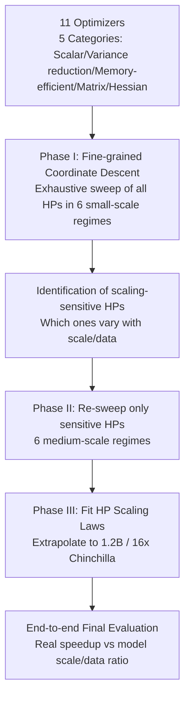

# Fantastic Pretraining Optimizers and Where to Find Them

**Conference**: ICLR 2026  
**OpenReview**: [https://openreview.net/forum?id=2J51qUZ0iG](https://openreview.net/forum?id=2J51qUZ0iG)  
**Code**: To be confirmed  
**Area**: optimization  
**Keywords**: Pretraining optimizers, Hyperparameter tuning, AdamW, Muon, Soap, Matrix Preconditioning, Speedup, Scaling Laws  

## TL;DR
Based on a unified and fair hyperparameter tuning and end-to-end evaluation protocol, this study systematically compares 11 deep learning optimizers. It reveals that the 1.4–2× speedups claimed by new optimizers largely originate from "weak baselines." True speedups do not exceed 1.4× and decay to 1.1× as model scale increases; furthermore, it confirms that matrix-based optimizers (Muon/Soap/Kron) indeed outperform scalar-based ones.

## Background & Motivation
- **Background**: Pretraining accounts for over 95% of the training cost of large models, with AdamW long serving as the de facto standard. In the past two years, numerous new optimizers have emerged (Sophia, Soap, Muon, MARS, Cautious, SWAN, DION, etc.), claiming speedups of 1.4–2× (or even 3×) compared to AdamW.
- **Limitations of Prior Work**: Despite these attractive "speedups," mainstream industrial models (DeepSeek, Llama) have rarely adopted them, with only Kimi K2 and GLM 4.5 utilizing Muon. The authors point out that the issue lies in the evaluation methodology itself: ① **Inequivalent hyperparameter tuning**—shared hyperparameters like learning rate and weight decay are often fixed to the same constant across optimizers, leaving the AdamW baseline severely undertuned; ② **Restricted or misleading evaluation settings**—most experiments are conducted only on small models with low data volumes (1× Chinchilla) and compare checkpoints mid-training.
- **Key Challenge**: A simple fact—tuning just one hyperparameter (peak LR) can grant the AdamW baseline in the GPT-3 recipe a nearly 2× speedup—suggests that many "2× speedups" from new optimizers are actually winning against an intentionally or unintentionally weakened baseline rather than representing true algorithmic advantages.
- **Goal**: To establish a strictly controlled evaluation protocol to answer two questions: (1) How to ensure every optimizer is compared fairly under its own optimal hyperparameters? (2) How does the speedup ratio change with model scale and the data-to-model ratio (Chinchilla ratio)?
- **Core Idea**: **Fair comparison requires "exhaustive tuning for each individual optimizer + cross-scale/cross-data comparison + evaluation at the end of training rather than mid-point."** Re-measuring true speedup under this protocol allows for the extraction of genuine patterns in optimizer design (matrix preconditioning superiority over scalar).

## Method

### Overall Architecture
This paper does not propose a new optimizer but designs a benchmark methodology consisting of **three-stage hyperparameter tuning + multi-dimensional scaling evaluation**. Across a grid of Llama 2 architectures (0.1B–1.2B, 4 sizes) × 4 Chinchilla ratios (1/2/4/8×), coordinate descent hyperparameter searches are performed for 11 optimizers. The primary metric is the C4-EN validation loss (a known proxy for downstream performance) at the end of training, with speedup measured by the "number of tokens required to reach a given loss." The three stages progressively condense expensive exhaustive searches into "tuning only hyperparameters that truly change with scale," followed by extrapolation to 1.2B.

### Key Designs

**1. Three-stage coordinate descent tuning: Making "optimal tuning for every optimizer" affordable.** The core difficulty of fair comparison is the explosion of tuning costs. Phase I performs coordinate descent on each hyperparameter of each optimizer in 6 small-scale regimes (130M/300M/500M at 1×, and 130M at 2/4/8×). A new value is accepted only if the validation loss improves by more than $\Delta_1=3\times10^{-3}$, iterating until convergence to find local optima. This ensures **every optimizer is compared at its own optimal point**, rather than adopting another's hyperparameters.

**2. Scaling-sensitive HP identification: Distinguishing "needed re-tuning with scale" from "tune once and for all."** The authors observe two things: loss is sensitive only to a subset of hyperparameters, and most optimal values of sensitive hyperparameters remain stable across scales. Formally, for each regime $r$, a near-optimal set is defined as $C_r=\{c: L(c)\le L^*_r+\Delta_2\}$ ($\Delta_2=6.4\times10^{-3}$). If a hyperparameter $c_h$ has a common value $v_h$ that falls within $C_r$ for all regimes, it is scaling-insensitive; otherwise, it is **scaling-sensitive**. Results show that for AdamW, LR/warmup/weight decay/batch size are sensitive, while for Muon, only LR is sensitive. Phase II continues coordinate descent only for these sensitive hyperparameters in medium-scale regimes (300M/500M at 2/4/8×), significantly saving compute.

**3. Scaling law extrapolation to 1.2B (Phase III): Avoiding blind tuning at the most expensive scales.** The optimal values of sensitive hyperparameters from Phase I/II are fitted against model scale/data ratio into scaling laws. These are extrapolated to regimes like 1.2B parameters and 16× Chinchilla—high data ratios previously untested. This allows for near-optimal hyperparameters to be used directly on large models, ensuring fair measurement of large-scale speedups.

**4. End-to-end, cross-regime speedup measurement: Distrusting misleading mid-training checkpoints.** Speedup is uniformly defined as "tokens required by AdamW to reach target loss ÷ tokens required by the tested optimizer," and it must be measured at the **end of training** (after learning rate decay). The authors show that loss curves of different optimizers cross multiple times during LR decay (Figure 6); rankings using intermediate checkpoints can invert compared to final rankings—a hidden trap in many "speedup" claims. Optimizers are categorized into 5 classes: Scalar (AdamW/Lion), Variance-reduction (NAdamW/Mars/Cautious), Memory-efficient (Lion/Adam-mini), Matrix (Muon/Scion/Kron/Soap), and Hessian-approx (Sophia). A commonality of the matrix class is using matrix multiplication to precondition gradients. For instance, Muon uses Newton-Schulz iteration $\mathrm{NS}(M)=M(aM+bM^\top M+c(M^\top M)^2)$ to approximate $\arg\max_{\|O\|_{op}=1}\mathrm{Tr}(O^\top M)$, with the update defined as $w_{t+1}=w_t-\eta\,\mathrm{NS}^{(5)}(\beta_2 m_t+(1-\beta_2)g_t)$.

## Key Experimental Results

### Main Results Settings

| Dimension | Configuration |
|------|------|
| Architecture | Llama 2, 32 layers, sequence length 4096, 130M/300M/520M/1.2B |
| Data | DCLM-baseline + StarCoder + ProofPile 2, Llama3 tokenizer, OLMo 2-style mix |
| Data Ratio | 1×/2×/4×/8× Chinchilla (optimal ≈ 20 tokens/param), extrapolated to 16× |
| Hardware | JAX + TPU v5 (fp32 parameters / bf16 activations) |
| Main Metric | C4-EN validation loss; supplemented by 10 downstream benchmarks (ARC/HellaSwag/PIQA, etc.) |
| Optimizers | 11 optimizers, divided into 5 categories |

### Main Results

| Finding | Data |
|------|------|
| Undertuned AdamW Baseline | Tuning only peak LR (6e-4 → 8e-3 in GPT-3 recipe) yields nearly 2× speedup |
| Real Speedup Upper Bound | Against a fully tuned AdamW, any alternative optimizer speedup is ≤ 1.4× (far below the claimed 2×) |
| Speedup Decay with Scale | Muon/Soap at 0.1B are ~1.3–1.4×, but only ~1.1× at 1.2B (8× Chinchilla) |
| HPs Not Blindly Transferable | Optimal weight decay for Lion is ≈0.6 vs ≈0.1 for AdamW; fixing shared HPs is unfair |
| Matrix vs Scalar | Scalar optimizers are close after full tuning (avg speedup < 1.2×); matrix optimizers consistently ~1.3× (<520M) |
| Drift of Optimal Optimizer | Muon is best at low Chinchilla ratios, but overtaken by Kron/Soap at 8× and above |

### Key Findings
- **"2× speedup" is largely a weak-baseline illusion**: Once the baseline is correctly tuned, the headroom for speedup is compressed to ≤1.4×, and this advantage continues to evaporate as the model grows.
- **Matrix preconditioning is a genuine pattern**: All the fastest optimizers (Muon, Soap, Kron) utilize matrices rather than element-wise scalars for preconditioning, and they converge to similar losses under over-training (high data ratios).
- **Evaluation timing determines conclusions**: Comparisons mid-training can yield rankings opposite to those at the end of training; many previous conclusions are contaminated by this.

## Highlights & Insights
- **Methodological contribution outweighs algorithmic contribution**: The study does not create a new optimizer but establishes a reproducible and fair evaluation yardstick for the "optimizer speedup" track, directly exposing the exaggeration in multiple papers claiming 2× speedups.
- **"Scaling-sensitive HPs" is a practical abstraction**: By explicitly identifying which hyperparameters must be retuned with scale and which can be set once, it saves compute while explaining why blind hyperparameter transfers are unfair.
- **Trend of speedup decay with scale** is particularly valuable for the industry—it indicates that for truly large-scale models, the gains from switching optimizers are far smaller than small-scale experiments suggest, explaining the hesitation in industrial adoption.

## Limitations & Future Work
- The maximum scale is 1.2B, still a gap from the true frontier (hundreds of B); whether the 1.1× trend at 1.2B decays further toward ~1× requires verification.
- Evaluation is limited to TPU v5 and large batch settings; concurrent work by Semenov et al. (2025) found Mars > Muon on small batch GPUs, suggesting conclusions are sensitive to batch size and hardware.
- The primary metric is C4-EN loss (a downstream proxy); while downstream benchmarks were tracked, the correspondence between loss and performance at extremely high data ratios still harbors some uncertainty.

## Related Work & Insights
- **Optimizer Genealogy**: From SGD/Nesterov/Adagrad to Adam/AdamW, then to variance reduction (MARS), memory-efficiency (Adam-mini), matrix preconditioning (Shampoo/Muon/Scion/Soap), and Hessian approximation (Sophia)—this paper unifies them under a single evaluation framework.
- **Heritage of Re-evaluation Methodology**: Continuing the tradition of "rigorous re-evaluation driving the community" as seen in Schmidt et al. (2021) and Kasimbeg et al. (2025), similar to the critical scrutiny of generalization metrics prior to SAM.
- **Insight**: Any optimizer paper claiming a speedup should report "baseline tuning protocol + end-point evaluation + cross-scale speedup decay curve," otherwise the conclusions are unreliable; matrix preconditioning remains the most robust source of speedup currently and warrants further stress testing at larger scales.

## Rating
- **Novelty**: ⭐⭐⭐⭐ — Not a new algorithm, but a high-quality systematic re-evaluation with conclusions (weak baseline illusion, scale-based decay, matrix preconditioning validity) that clarify the entire research area.
- **Experimental Thoroughness**: ⭐⭐⭐⭐⭐ — 11 optimizers × 4 scales × 4 data ratios × 3-stage coordinate descent; the tuning and evaluation protocols are exceptionally rigorous, making it the most complete benchmark on this problem to date.
- **Writing Quality**: ⭐⭐⭐⭐ — Motivations are clear, figures are informative, and the three-stage methodology progresses logically; high readability.
- **Value**: ⭐⭐⭐⭐⭐ — Directly impacts industrial decisions on optimizer selection and establishes standard protocols for future evaluations.

<!-- RELATED:START -->

## Related Papers

- [\[NeurIPS 2025\] Fantastic Features and Where to Find Them: A Probing Method to Combine Features from Multiple Foundation Models](../../NeurIPS2025/optimization/fantastic_features_and_where_to_find_them_a_probing_method_to_combine_features_f.md)
- [\[ICLR 2026\] Cautious Optimizers: Improving Training with One Line of Code](cautious_optimizers_improving_training_with_one_line_of_code.md)
- [\[ICLR 2026\] A Convergence Analysis of Adaptive Optimizers under Floating-Point Quantization](a_convergence_analysis_of_adaptive_optimizers_under_floating-point_quantization.md)
- [\[ICLR 2026\] Towards Dynamic Interleaving Optimizers](towards_dynamic_interleaving_optimizers.md)
- [\[ICLR 2026\] $\mu$LO: Compute-Efficient Meta-Generalization of Learned Optimizers](mulo_compute-efficient_meta-generalization_of_learned_optimizers.md)

<!-- RELATED:END -->
