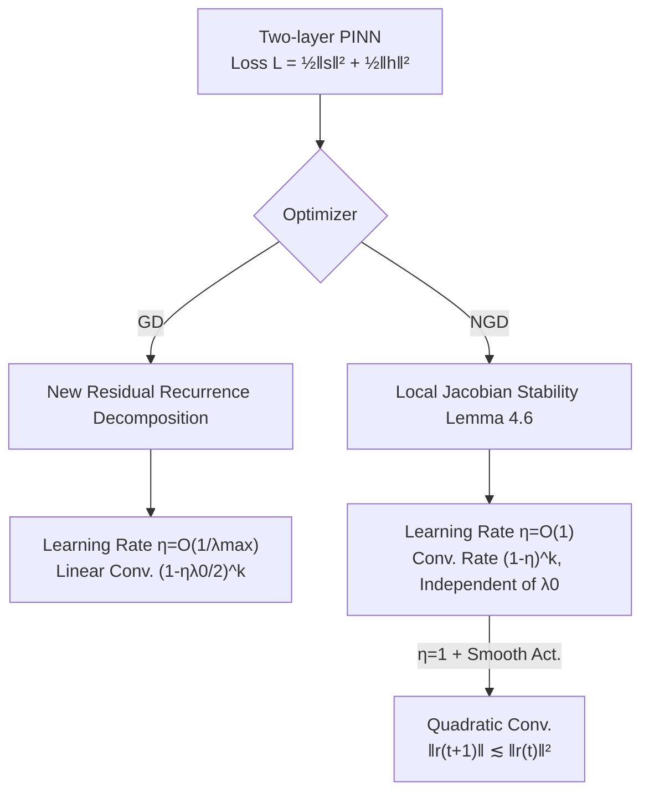

# Fast Convergence of Natural Gradient Descent for Over-parameterized Physics-Informed Neural Networks

**Conference**: ICLR 2026  
**OpenReview**: [https://openreview.net/forum?id=KWWfLgkySm](https://openreview.net/forum?id=KWWfLgkySm)  
**Code**: To be confirmed  
**Area**: Optimization Theory / Physics-Informed Neural Networks (PINN)  
**Keywords**: Natural Gradient Descent, Over-parameterization, PINN, Convergence Analysis, NTK, Gram Matrix, Second-order Optimization  

## TL;DR
This paper establishes the first convergence theory for Natural Gradient Descent (NGD) in training two-layer PINNs. It proves that the learning rate can be $O(1)$, the convergence rate is independent of the sample size and the minimum eigenvalue of the Gram matrix, and it achieves quadratic convergence under smooth activations—significantly faster than first-order gradient descent.

## Background & Motivation
**Background**: A main line of over-parameterization theory (Du et al. 2018, Gao et al. 2023, etc.) uses the Neural Tangent Kernel (NTK) to prove that Gradient Descent (GD) with random initialization converges to a global optimum at a linear rate. This framework has also been extended to PINN training for solving Partial Differential Equations (PDEs).

**Limitations of Prior Work**: Although these linear convergence conclusions are elegant, the learning rate $\eta$ is restricted to the scale of $O(\lambda_0)$, where $\lambda_0 = \lambda_{\min}(H^\infty)$ is the minimum eigenvalue of the limiting Gram matrix. $\lambda_0$ depends on the sample size and is often extremely small. Empirical data provided in the paper illustrates this: in a 1D Poisson equation, $\lambda_{\min} = 3.47 \times 10^{-11}$, meaning GD must use an extremely small learning rate to ensure convergence, making training unacceptably slow.

**Key Challenge**: The PINN loss includes first- and second-order derivative terms from the PDE operator, making the loss landscape much more ill-conditioned than in standard regression. This further tightens the learning rate constraints for first-order methods. While second-order NGD has been proven to use $O(1)$ learning rates and escape $\lambda_0$ dependence in $L^2$ regression (Zhang et al. 2019, Cai et al. 2019), **the convergence of NGD in the PINN context has remained an unresolved open problem**—because the derivative terms in the loss prevent the direct application of regression-based Jacobian stability analysis.

**Goal**: To simultaneously improve the learning rate and width requirements of GD on over-parameterized two-layer PINNs, provide the first convergence proof for NGD, and quantify its acceleration relative to GD.

**Key Insight**: **Residual Recurrence + Local Jacobian Stability**. For GD, a new residual decomposition recurrence formula is designed to raise the learning rate threshold from $O(\lambda_0)$ to $O(1/\lambda_{\max})$. For NGD, the "global" Jacobian stability of Zhang et al. is replaced with "local" stability controlled for each weight vector individually. This absorbs the perturbation amplification caused by PDE derivative terms, yielding a convergence rate independent of the Gram matrix.

## Method

### Overall Architecture
The paper focuses on two-layer neural networks $\phi(x;w,a) = \frac{1}{\sqrt m}\sum_{r=1}^m a_r\sigma(w_r^\top x)$ for PINN training. The internal PDE residual $s_p(w)$ and boundary residual $h_j(w)$ are concatenated into the loss $L(w) = \frac{1}{2}(\|s(w)\|_2^2 + \|h(w)\|_2^2)$, with the Gram matrix defined as $H(w) = JJ^\top$. The analysis progresses through three stages: improved linear convergence for GD (Section 3), Gram-matrix-independent convergence for NGD (Section 4), and finally, quadratic convergence under smooth activations when $\eta=1$. All three share an NTK-style analytical framework where the Gram/Jacobian matrices remain nearly constant during training under over-parameterization, differing only in whether control is applied to the Gram matrix (GD) or the Jacobian matrix (NGD).

### Key Designs

**1. GD Residual Recurrence: Raising the Learning Rate from $O(\lambda_0)$ to $O(1/\lambda_{\max})$**. Gao et al. (2023) followed the regression proof of Du et al. (2018), requiring $\eta = O(\lambda_0)$, which is unusable when $\lambda_0$ is near $10^{-11}$. Our key observation is that since the PINN loss is normalized by the sample size, $\|H^\infty\|_2 = \lambda_{\max}(H^\infty)$ can be controlled by the trace $\mathrm{tr}(H^\infty)$ as an explicit constant independent of the sample sizes $n_1, n_2$. Theorem 3.7 proves that if $\eta = O(1/\|H^\infty\|_2)$, then $L(k) \le (1-\eta\lambda_0/2)^k L(0)$. Since $\lambda_{\max}$ is a constant while $\lambda_0$ decays with sample size, $\eta = O(1/\lambda_{\max})$ is orders of magnitude larger than $O(\lambda_0)$ (e.g., $1/\lambda_{\max} = 5.78 \times 10^{-5}$ vs $\lambda_0 = 3.47 \times 10^{-11}$ for 1D Poisson). Additionally, the width requirement is improved from $\tilde\Omega((n_1+n_2)^4/\dots)$ to being nearly log-independent of $n_1+n_2$, depending explicitly only on dimension $d$, achieved by replacing complex Gaussian truncation/Hoeffding arguments with concentration inequalities for sub-Weibull random variables.

**2. Unified Framework for Gram Matrix Positive Definiteness under Smooth Activations**. Both GD and NGD convergence require the limiting Gram matrix $H^\infty$ to be strictly positive definite ($\lambda_0 > 0$). The paper extends this conclusion from ReLU³ to a broad class of smooth activations. As long as $\sigma$ satisfies Assumption 4.3 (bounded third derivative, Lipschitz derivatives, analytic non-polynomial, and specific decay ratio conditions), Lemma 4.4 guarantees that $H^\infty$ is strictly positive definite provided no two samples are parallel. Remark 4.5 verifies that common activations like logistic, softplus, tanh, and swish satisfy this assumption, and this framework applies naturally to other PDE forms.

**3. Per-Weight Local Jacobian Stability: Technical Core of NGD Convergence**. In regression, Zhang et al. (2019) used "global" Jacobian stability ($\|w-w(0)\|_2$ small $\Rightarrow$ $\|J(w)-J(0)\|_2$ small). However, PINN losses contain derivatives; each Jacobian block $\partial s_p/\partial w_r, \partial h_j/\partial w_r$ contains higher-order derivatives of the activation function, where small weight perturbations are amplified, violating global Lipschitz conditions. Theorem 4.6 instead constrains perturbations **for each weight vector $w_r$ individually**: when $\|w_r-w_r(0)\|_2 < R$, $\|J(w)-J(0)\|_2 \le CM\sqrt R$ for ReLU³ and $\|J(w)-J(0)\|_2 \le CdR$ for smooth activations. This more "local" and refined stability absorbs derivative term perturbations without imposing excessive constraints on the learning rate.

**4. Gram-Independent Convergence for NGD and Quadratic Convergence at $\eta=1$**. The NGD update is $w(k+1) = w(k) - \eta J(k)^\top(J(k)J(k)^\top)^{-1}\binom{s(k)}{h(k)}$. Based on local stability, Theorem 4.7 proves that for $\eta \in (0,1)$, $L(k) \le (1-\eta)^k L(0)$. The convergence rate **depends only on $\eta$, completely independent of sample size $n$ and $\lambda_0$**, which is why NGD is faster than GD (whose rate $1-\eta\lambda_0/2$ is limited by a tiny $\lambda_0$). The paper also notes NGD's equivalence to ENGD (Müller & Zeinhofer 2023) via Moore-Penrose pseudoinverse/Woodbury identities and highlights that NGD's $JJ^\top \in \mathbb R^{(n_1+n_2) \times (n_1+n_2)}$ is non-singular under over-parameterization, whereas Gauss-Newton's $J^\top J$ tends toward singularity as $m$ increases—a key numerical advantage. Furthermore, when $\eta=1$ and the activation is smooth, Corollary 4.9 provides quadratic convergence $\|r(t+1)\|_2 \le \frac{CB^4}{\sqrt{m\lambda_0^3}}\|r(t)\|_2^2$, which holds even for finite width $m$.

## Key Experimental Results

### Main Results: Relative $L^2$ Error Across Optimizers

| Equation | SGD | Adam | L-BFGS | NGD |
|---|---|---|---|---|
| 1D Poisson | 1.28e-01 | 6.46e-02 | 2.63e-04 | **1.67e-05** |
| 2D Poisson | 1.45e-01 | 5.32e-03 | 3.17e-03 | **1.12e-04** |
| 1D Heat | 5.43e-01 | 6.91e-03 | 4.98e-03 | **3.42e-04** |
| 2D Helmholtz | 8.48e+00 | 1.06e+00 | 3.35e+00 | **6.67e-03** |
| 10D Poisson | 1.35e-02 | 3.15e-03 | nan | **9.91e-04** |

NGD achieves the lowest error across all five equations, typically 1–2 orders of magnitude lower than the second-best method. L-BFGS diverged (nan) on the 10D Poisson equation.

### Learning Rate Robustness

| $\eta$ | 1.0 | 0.5 | 0.1 | 0.05 | 0.01 | 0.005 | 0.001 |
|---|---|---|---|---|---|---|---|
| SGD | nan | nan | nan | nan | 1.19e-02 | 6.91e-02 | 7.36e-02 |
| Adam | 1.01e+00 | 1.00e+00 | 1.00e+00 | 1.01e+00 | 1.64e-02 | 3.25e-02 | 1.49e-02 |
| NGD | 1.97e-03 | 1.18e-03 | 3.24e-04 | 1.87e-04 | 1.12e-04 | 1.22e-04 | 1.68e-04 |

NGD converges stably even as $\eta$ spans three orders of magnitude, while SGD/Adam diverge at large learning rates—**empirically validating the theoretical conclusion of $\eta = O(1)$**.

### Ablation Study: Network Width

| $m$ | 20 | 80 | 320 | 1280 | 2560 |
|---|---|---|---|---|---|
| NGD Error | 1.59e-03 | 5.18e-04 | 3.08e-04 | 1.78e-04 | **7.05e-05** |

Error decreases monotonically with width, verifying that stronger approximation capabilities are achieved with fuller over-parameterization.

### Key Findings
- **Convergence Speed**: While SGD/Adam require 10,000/20,000 epochs (lr=1e-3), NGD achieves superior results in only 100/200 epochs (lr=0.1), consistent with Theorems 3.7/4.7.
- NGD is highly robust to hyperparameter selection, avoiding the pain of learning rate tuning in first-order methods.

## Highlights & Insights
- **Filling Theoretical Gaps**: This is the first proof of NGD convergence in training PINNs, showing that the convergence rate decouples from the Gram matrix $\lambda_0$ and sample size, reaching quadratic convergence with smooth activations.
- **The Observation of "Normalization" is Crucial**: Because the PINN loss is normalized by sample size, $\lambda_{\max}$ becomes a constant independent of $n$, making the improved $\eta = O(1/\lambda_{\max})$ possible—an easily overlooked but decisive detail.
- **Local vs. Global Stability**: Reforming Jacobian stability into a per-weight local version is the technical key to bypassing the perturbation amplification caused by PDE derivative terms, offering methodological value for future second-order PINN optimization analysis.
- **Numerical Stability Argument**: The paper clearly explains why NGD is chosen over Gauss-Newton: $JJ^\top$ is non-singular under over-parameterization, whereas $J^\top J$ tends toward singularity.

## Limitations & Future Work
- **Limited to Two-Layer Networks**: The analytical framework is built on two-layer (single hidden layer) PINNs; NGD convergence for deep networks remains to be explored.
- **Width Dependence on Dimension $d$**: Due to the derivative terms in the loss, the width requirement's dependence on $d$ is heavier than in regression, making over-parameterization costly for high-dimensional PDEs.
- **Tension as $\eta \to 1$**: In Theorem 4.7, the width requirement diverges as $\eta$ approaches 1, requiring a separate Corollary for quadratic convergence; the transition between the two is not perfectly smooth.
- **PDE Types**: The focus is on specific convection-diffusion type PDEs (Poisson/Heat/Helmholtz); theoretical guarantees for more general nonlinear PDEs require extension.
- **Experimental Scale**: Experiments are limited to low-dimensional classical equations and lack validation on large-scale or industrial-grade PDEs.

## Related Work & Insights
- **Over-parameterization Convergence Theory**: Du et al. (2018, 2019), Allen-Zhu et al. (2019), and Arora et al. (2019) proved global GD convergence based on NTK (Jacot et al. 2018); this work provides refined improvements for GD/NGD in the PINN context.
- **PINN Optimization**: Gao et al. (2023) first analyzed GD convergence for two-layer PINNs; this work directly improves the learning rate and width based on their findings. Müller & Zeinhofer (2023) proposed energy NGD, and Rathore et al. (2024) proposed NysNewtonCG; this work adds the missing theoretical convergence guarantee for NGD on PINNs.
- **NGD Theory in Regression**: Zhang et al. (2019) (ReLU) and Cai et al. (2019) (Smooth activations, GGN) proved $O(1)$ learning rates for regression; this work extends these results to PINNs despite the complications of derivative terms.
- **Insight**: The advantages of second-order/natural gradient methods in ill-conditioned loss landscapes (like those in scientific computing with differential operators) might still be significantly undervalued. The logic chain of "Loss Normalization — Spectral Radius Constantization — LR Relaxation" is a useful template for analyzing other structured loss optimizations.

## Rating
- **Novelty**: ⭐⭐⭐⭐⭐ First to establish NGD convergence theory for PINNs, solving an open problem with an original local Jacobian stability approach.
- **Experimental Thoroughness**: ⭐⭐⭐ Five classical PDEs + LR/width ablations; results align with theory, but the equation scales are small and lack industrial-grade verification.
- **Writing Quality**: ⭐⭐⭐⭐ Rigorous theoretical derivations and clear comparisons with prior work (quantitative improvements via Remarks), though the entry barrier for theory is high.
- **Value**: ⭐⭐⭐⭐ Provides solid theoretical support for second-order optimization in scientific computing; research contribution outweighs immediate engineering impact.

<!-- RELATED:START -->

## Related Papers

- [\[ICLR 2026\] On the Convergence Direction of Gradient Descent](on_the_convergence_direction_of_gradient_descent.md)
- [\[ICLR 2026\] Fast Data Mixture Optimization via Gradient Descent](fast_data_mixture_optimization_via_gradient_descent.md)
- [\[ICLR 2026\] Directional Convergence, Benign Overfitting of Gradient Descent in leaky ReLU two-layer Neural Networks](directional_convergence_benign_overfitting_of_gradient_descent_in_leaky_relu_two.md)
- [\[ICML 2026\] On the Convergence Rate of LoRA Gradient Descent](../../ICML2026/optimization/on_the_convergence_rate_of_lora_gradient_descent.md)
- [\[ICLR 2026\] On the Convergence Behavior of Preconditioned Gradient Descent Toward the Rich Learning Regime](on_the_convergence_behavior_of_preconditioned_gradient_descent_toward_the_rich_l.md)

<!-- RELATED:END -->
