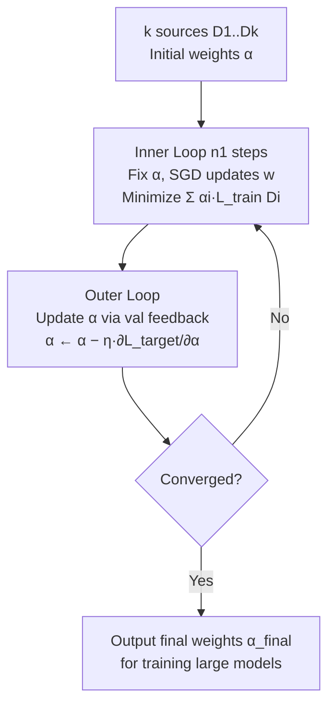

# Fast Data Mixture Optimization via Gradient Descent

**Conference**: ICLR 2026  
**OpenReview**: [https://openreview.net/forum?id=5gFKVyohGd](https://openreview.net/forum?id=5gFKVyohGd)  
**Code**: To be confirmed  
**Area**: Data Mixture Optimization / LLM Pre-training and Post-training / Bilevel Optimization  
**Keywords**: Data Mixture, Bilevel Optimization, Reparameterization, Gradient Optimization, Proxy Models, Data-centric  

## TL;DR
FASTMIX reparameterizes "selecting data mixture proportions" into "weighting losses for each data source," making mixture proportions differentiable. By training only **one** proxy model and using gradient descent to simultaneously optimize the model and proportions, it reduces search costs from several hundred GPU-hours to 1–2 GPU-hours while achieving superior performance.

## Background & Motivation
**Background**: Large Language Model (LLM) capabilities depend heavily on training data. The "mixing proportions from multiple data sources" significantly impact both pre-training and post-training (SFT) outcomes. Early methods relied on manual heuristics, while recent shifts favor automated proxy methods: training small models under candidate mixture proportions and inferring the optimal proportions for large models.

**Limitations of Prior Work**: Although mainstream proxy methods are stable and generalize well, their costs are prohibitive. DoReMi trains a small proxy model to adjust weights; RegMix requires training **hundreds** (512 in the paper) of proxy models with different proportions to fit regression extrapolations; CLIMB reduces the number of proxies to 64 using iterative search area reduction. Even so, pre-training searches still require 70–720 GPU-hours, and post-training requires 115+ GPU-hours, making them nearly unusable as model and data scales expand.

**Key Challenge**: The mixture proportion $\alpha$ is essentially a **sampling probability**, which is a non-differentiable discrete quantity that cannot be directly backpropagated like model parameters. Consequently, previous works were forced to use greedy heuristics or policy-gradient (score function) estimators to update $\alpha$, leading to low sample efficiency and failure to scale as the number of data sources increases.

**Goal**: To reduce search costs to the magnitude of "training a single model" while maintaining the reliability of proxy methods.

**Core Idea (Reparameterization for Differentiable Proportions)**: The authors prove that, under the premise of "uniformly sampling from each data source," **training by sampling according to proportion $\alpha$** is equivalent in expectation to **summing the losses from each source multiplied by coefficients $\alpha_i$**. In this way, $\alpha$ transitions from a discrete sampling probability to a continuous, differentiable loss weight, allowing it to be jointly optimized end-to-end with model parameters using SGD/Adam.

## Method

### Overall Architecture
FASTMIX formulates data mixture selection as a **weighted bilevel optimization**: the inner loop updates model parameters under the current mixture proportions, while the outer loop updates the mixture proportions based on validation set feedback. The entire process trains only one proxy model, alternating between the inner and outer loops, where the outer loop reallocates weight to the data sources that are "most helpful to the validation set."

### Key Designs

**1. Reparameterization: Transforming sampling proportions into differentiable loss weights — the fulcrum of the paper.** In the original bilevel problem (Eq. 1), the inner loop $w^*(\alpha)=\arg\min_w L_{train}(D,w\mid\alpha)$ depends on sampling according to $\alpha$, which is non-differentiable. The authors provide an equivalent reformulation (Eq. 2): $w^*(\alpha)=\arg\min_w \sum_{i=1}^k \alpha_i L_{train}(D_i,w)$, where each source is uniformly sampled at $1/k$, and $\alpha_i$ acts only as a coefficient for that source's loss. The proof is straightforward: the expected training loss when sampling by $\alpha$ is $L_{train}(D,w\mid\alpha)=\mathbb{E}_{i\sim\text{Cat}(\alpha)}\mathbb{E}_{x\sim D_i}[\ell(x,w)]=\sum_i \alpha_i L_{train}(D_i,w)$, which is exactly a convex combination of individual source losses. Thus, "adjusting sampling probability" is translated into "adjusting loss weight," making $\alpha$ immediately differentiable for joint updates.

**2. Alternating Iterative Optimization and Closed-form Outer Gradients ($n_2=1$) — making outer updates fast and stable.** Direct bilevel optimization remains difficult. The authors use Alg. 1 for alternating: the inner loop fixes $\alpha$ for $n_1$ steps of SGD to update $w$; the outer loop updates $\alpha$ using validation loss at intervals: $\alpha^{t+1}\leftarrow\alpha^t-\eta_\alpha^t\,\partial L_{target}(w^{t+n_2})/\partial\alpha^t$. A key insight is that when the outer step $n_2=1$, the outer gradient has a **closed-form solution**: $\frac{\partial L_{target}(w^{t+1})}{\partial\alpha_i^t}=-\eta_w^t\,\nabla_w\ell_{val}(V,w^{t+1})\cdot\nabla_w L_{train}(D_i,w^t)$. Its physical meaning is elegant: the gradient of $\alpha_i$ is proportional to the **alignment (dot product) between the validation set gradient and the $i$-th source training gradient**. If the directions align (positive dot product), the weight for that source is increased; otherwise, it is decreased. This automatically shifts quality toward sources whose training signals best reduce validation loss. Since $n_2>1$ lacks a closed-form solution and requires BPTT (memory explosion) or finite differences (slow and unstable), the authors **fix $n_2=1$ where possible**. Ablations confirm $n_2=1$ yields the highest performance (48.1), while $n_2=40$ drops to 44.2.

**3. Entropy Regularization + Training Loss Auxiliary Objective — preventing validation overfitting and enhancing generalization.** Relying solely on validation performance can lead to overfitting accidental characteristics of the validation set. The authors design the search objective as $L_{target}(w)=\ell_{val}(w)+\beta\,L_{train}(w)+\lambda\sum_{i=1}^k\alpha_i\log\alpha_i$. The entropy term $\sum\alpha_i\log\alpha_i$ penalizes overly sparse distributions, encouraging more uniform weights and source diversity to enhance robustness ($\lambda$ is set very small, e.g., $10^{-5}$). The training loss term $\beta L_{train}$ measures how well the model fits the overall mixture, complementing the validation signal and reducing reliance on small validation sets ($\beta$ is optimal at 0.1–0.3). Together, these ensure the discovered mixture is strong on validation benchmarks and transfers robustly to out-of-domain tasks.

**4. Handling Non-differentiable Scenarios — practical implementation for discrete metrics and long horizons.** When validation metrics are discrete (e.g., accuracy) and non-differentiable, making finite differences slow and unstable, the authors use **differentiable proxy objectives** (e.g., SFT loss as a smooth alternative for QA tasks). When an outer horizon $n_2 > 1$ is unavoidable, rather than using BPTT or finite differences, it is preferable to revert to $n_2 = 1$ to obtain closed-form gradients and the most stable optimization behavior. These engineering choices ensure the framework is applicable in real-world pre-training and post-training settings.

## Key Experimental Results

### Main Results

Pre-training (Pile 17 subset, 1M proxy search → 1B model trained on 25B tokens, average score across 14 downstream benchmarks):

| Method | Avg Score ↑ | Avg Rank | Search Cost (GPU-h) ↓ | # Proxies |
|------|---------|---------|-------------------|-----------|
| DoReMi | — | — | 7.4 | 1 |
| RegMix | 47.2 | — | 720.5 | 512 |
| CLIMB | 47.5 | — | 71.9 | 64 |
| **FASTMIX (ours)** | **48.2** | **1** | **1.3** | **1** |

Post-training SFT (Qwen2.5-Math 7B, 8 SFT domains, average of 4 benchmarks for math/code/STEM):

| Method | Avg Score ↑ | Search Cost (GPU-h) ↓ |
|------|---------|-------------------|
| DoReMi | — | 6.7 |
| RegMix | — | 115.9 |
| CLIMB | 59.9 | 117.4 |
| **FASTMIX (ours)** | **65.4 (+5.5)** | **2.2** |

Compared to RegMix, pre-training speedup is **×550** and compared to CLIMB **×55**. Post-training speedup is approximately **×52** compared to RegMix/CLIMB, with superior scores.

### Ablation Study

| Ablation | Setting | Result |
|--------|------|------|
| Inner $n_1$ | 1 → 20 → 40+ | 47.3 → Peak 48.2 → Decline after 40 |
| Outer $n_2$ | 1 / 10 / 20 / 40 | 48.1 ($n_2{=}1$ is best) → 44.2 ($n_2{=}40$) |
| Entropy $\lambda$ | $10^{-7}$ to 0.1 / 1.0 | Robust $<10^{-5}$; 1.0 fails to converge |
| Aux. Loss $\beta$ | 0.001 to 0.6 | 0.1 to 0.3 is best |
| Random Init | 11 trials (E0–E10) | Mean 48.34, Std. Dev. only 0.48 (RegMix 45.44) |

### Key Findings
- **Optimal in 9 out of 14** pre-training benchmarks, with an average rank of 1, demonstrating stable generalization.
- In post-training, using only math benchmarks (GSM8K + gaokao2023en) as search signals resulted in **optimal performance in coding (LiveCodeBench) and STEM-QA (GPQA-Diamond)** — indicating the mixture identifies "fundamental capability improvements" rather than overfitting optimization signals.
- Standard deviation across 11 random initializations was only 0.48, proving gradient search is nearly insensitive to the starting point and highly robust.

## Highlights & Insights
- **A single equivalence proof shifts the entire problem**: Rewriting "non-differentiable sampling proportions" as "differentiable loss weights" turns data mixture optimization from a black-box search into an end-to-end gradient optimization problem. This is the elegant core of the method.
- **Strong geometric intuition for closed-form gradients**: The update direction for $\alpha_i$ is effectively a "data-source-level influence score" based on gradient alignment, requiring no extra training.
- **Efficiency gains are orders of magnitude, not incremental**: Moving from training hundreds of proxies to just one makes data mixture optimization "affordable" at LLM scales for the first time.
- **Generalization as a pleasant surprise**: Mixtures found via math-only signals transfer to code/STEM, suggesting the framework finds the intrinsic value of data rather than benchmark shortcuts.

## Limitations & Future Work
- **Strong dependence on $n_2=1$**: Closed-form gradients hold only for single-step outer loops; multi-step horizons still face BPTT/finite difference issues, potentially ignoring long-term data dynamics.
- **Large proxy models for post-training**: SFT lacks 10M-scale proxies, necessitating 1.5B proxies for 7B target models; the scale gap might affect optimality and limits the fairness of baselines like RegMix (limited to 64 proxies).
- **Uniform sampling assumption**: Equivalence relies on "1/k uniform sampling." If sources are extremely imbalanced or internal distributions shift, the equivalence between loss weights and true sampling proportions may degrade.
- **Proxy objectives for discrete metrics**: Metrics like accuracy must be replaced with smooth alternatives like SFT loss, and the bias between the proxy and the real metric is not fully quantified.
- Future work: Extending closed-form gradients to stable multi-step horizons, online dynamic mixtures, and validation on larger models/more sources.

## Related Work & Insights
- **Proxy Methods**: DoReMi (proxy for domain weights), RegMix (hundreds of proxies for regression), CLIMB (clustering + iterative search) — FASTMIX belongs to the proxy paradigm but reduces the proxy count to 1.
- **Dynamic Methods**: IDEAL (influence functions for online rebalancing), Aioli, online data mixing — these eliminate the independent search stage but are usually less stable than proxy methods. FASTMIX seeks a balance of stability and efficiency.
- **Bilevel / Hyperparameter Optimization**: Differentiable bilevel optimization concepts from Maclaurin, Franceschi, Pedregosa, and DARTS (Liu et al. 2018) serve as the methodological foundation.
- **Insight**: Reparameterizing discrete choice problems into continuous differentiable objectives is a universal and powerful paradigm applicable to data pruning, curriculum learning, and RLHF data proportions.

## Rating
- **Novelty**: ⭐⭐⭐⭐ The combination of the reparameterization proof and closed-form outer gradients is clean and powerful, turning a black-box search into a differentiable optimization.
- **Experimental Thoroughness**: ⭐⭐⭐⭐ Covers pre-training and post-training, 14 downstream benchmarks, 4 ablations, and 11 random seeds. Robust comparison of efficiency and performance, though missing larger model scales and deep multi-step $n_2$ verification.
- **Writing Quality**: ⭐⭐⭐⭐ Logical progression from motivation to reparameterization to algorithm and gradient intuition. Clear derivations.
- **Value**: ⭐⭐⭐⭐⭐ Reducing data mixture search costs by orders of magnitude while improving performance offers direct and significant practical value for LLM data engineering.

<!-- RELATED:START -->

## Related Papers

- [\[ICLR 2026\] Fast Convergence of Natural Gradient Descent for Over-parameterized Physics-Informed Neural Networks](fast_convergence_of_natural_gradient_descent_for_over-parameterized_physics-info.md)
- [\[ICLR 2026\] On the Convergence Direction of Gradient Descent](on_the_convergence_direction_of_gradient_descent.md)
- [\[ICLR 2026\] Corner Gradient Descent](corner_gradient_descent.md)
- [\[ICLR 2026\] Egalitarian Gradient Descent: A Simple Approach to Accelerated Grokking](egalitarian_gradient_descent_a_simple_approach_to_accelerated_grokking.md)
- [\[ICLR 2026\] On the Convergence Behavior of Preconditioned Gradient Descent Toward the Rich Learning Regime](on_the_convergence_behavior_of_preconditioned_gradient_descent_toward_the_rich_l.md)

<!-- RELATED:END -->
