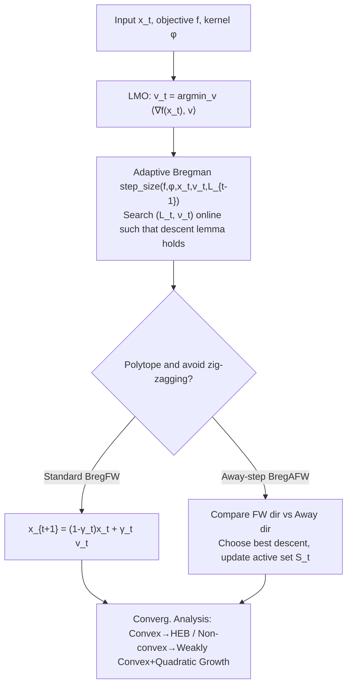

# Fast Frank–Wolfe Algorithms with Adaptive Bregman Step-Size for Weakly Convex Functions

**Conference**: ICLR 2026  
**OpenReview**: [https://openreview.net/forum?id=9asuGOncOi](https://openreview.net/forum?id=9asuGOncOi)  
**Code**: Based on [FrankWolfe.jl](https://github.com/ZIB-IOL/FrankWolfe.jl) (evaluation code included in supplementary)  
**Area**: optimization  
**Keywords**: Frank–Wolfe, conditional gradient, Bregman distance, relative smoothness (L-smad), weakly convex optimization, adaptive step-size, linear convergence  

## TL;DR
The paper liberates the Frank–Wolfe algorithm from the classical assumptions of "Lipschitz gradient + convexity." As long as the objective function satisfies "relative smoothness (L-smad)" with respect to a kernel generating distance and is weakly convex, Ours provides convergence guarantees from sublinear to linear under both convex and non-convex settings using adaptive Bregman step-sizes, and proves local linear convergence of FW for a class of non-convex problems for the first time.

## Background & Motivation
**Background**: Frank–Wolfe (FW, also known as the conditional gradient method) is a class of "projection-free" first-order methods. It does not require a projection oracle, only a linear minimization oracle (LMO). On many constraint sets (e.g., polytopes, spectrahedra), the LMO is significantly cheaper than projection, making FW faster in practice than projected gradient methods and numerically robust due to affine invariance. To accelerate it, the community has improved classical FW along two lines: refining step-size rules (short-step using Lipschitz constant $L$, or adaptive estimation of $L$ by Pedregosa et al.) and eliminating "zig-zag" oscillations when approaching an optimal face (Wolfe’s away-step FW, with linear convergence proven by Lacoste-Julien & Jaggi).

**Limitations of Prior Work**: Almost all FW convergence rates are built on two strong assumptions: the gradient $\nabla f$ is globally Lipschitz continuous ($L$-smooth), and $f$ is convex. However, many important applications do not satisfy these: $\ell_p$ losses ($f$ is $C^1$ but not $C^2$ when $1<p<2$, and the gradient is not Lipschitz even on compact sets), phase retrieval, non-negative matrix factorization, and blind deconvolution are either not $C^2$ or the $L$ obtained by forcing $L$-smoothness is too conservative, slowing down performance. For non-convex $f$, only sublinear results existed previously, and simple adaptation of existing analyses could not break the sublinear barrier.

**Key Challenge**: The theoretical framework of FW is locked into "Euclidean geometry + Lipschitz gradient + convexity," while the geometry of real-world problems is often characterized by Bregman distances and functions are frequently weakly convex or even non-convex—there is a gap between classical theory and practical utility.

**Goal**: Is it possible to relax the $L$-smooth and convexity assumptions while still obtaining linear convergence guarantees for FW?

**Core Idea**: **Replace Euclidean distance with Bregman distance and replace the $L$-smooth assumption with the broader $L$-smooth adaptable (L-smad, relative smoothness)**—meaning there exists a kernel generating distance $\phi$ such that both $L\phi-f$ and $L\phi+f$ are convex. Simultaneously, relax convexity to weak convexity ($f+\tfrac{\rho}{2}\|\cdot\|^2$ is convex). The difficulty lies in the fact that Bregman distances no longer have the nice $\nu=1$ property, necessitating the introduction and online estimation of a "scaling exponent $1+\nu$."

## Method

### Overall Architecture
Ours does not change the skeleton of FW (solve for LMO vertex → move towards a convex combination of vertices) but instead replaces two components: using the **Bregman distance $D_\phi(x,y)=\phi(x)-\phi(y)-\langle\nabla\phi(y),x-y\rangle$** to measure geometry and using an **adaptive Bregman step-size strategy** to search for the unknown $(L,\nu)$ online. Based on this, two algorithms are provided—Standard Bregman FW (BregFW) and Bregman away-step FW (BregAFW)—with full-spectrum convergence analysis conducted under both convex (HEB condition) and non-convex (weakly convex + local quadratic growth) assumptions.

### Key Designs

**1. L-smad replacing L-smooth: Trading "Lipschitz Gradient" for "Smoothness relative to $\phi$."** Classical FW relies on the descent lemma $f(x)-f(x^+)\ge\gamma\langle\nabla f(x),x-v\rangle-\tfrac{L\gamma^2}{2}\|v-x\|^2$, which essentially requires $\nabla f$ to be Lipschitz. Ours uses an extended descent lemma for L-smad: when $(f,\phi)$ is L-smad, $f(x)-f(x^+)\ge\gamma\langle\nabla f(x),x-v\rangle-L\gamma^{1+\nu}D_\phi(v,x)$, where $x^+=(1-\gamma)x+\gamma v$. A crucial structural difference is that the Bregman distance satisfies $D_\phi((1-\gamma)x+\gamma y,x)\le\gamma^{1+\nu}D_\phi(y,x)$, and **the exponent $1+\nu$ does not necessarily degenerate to 2** as in the Euclidean case (where $\nu=1$ and $\phi=\tfrac12\|\cdot\|^2$). Functions like $-\log x$ or $\tfrac14 x^4$, which are neither $L$-smooth nor necessarily $C^2$, fall into the L-smad class if $\phi$ is chosen correctly, bringing them into the analytical scope of FW.

**2. Bregman short / Adaptive step-size: Online backtracking for unknown $L, \nu$.** Maximizing the right-hand side of the extended descent lemma with respect to $\gamma$ yields the Bregman short step-size $\gamma=\min\big\{\big(\tfrac{\langle\nabla f(x),x-v\rangle}{L(1+\nu)D_\phi(v,x)}\big)^{1/\nu},\gamma_{\max}\big\}$, but this requires knowledge of $L$. Since the exact value or tight upper bound of $L$ is often unknown—and underestimating causes divergence while overestimating slows performance—Ours extends the Euclidean adaptive ideas of Pedregosa et al. to the Bregman setting. The `step_size` process starts with $M=\eta\tilde L, \kappa=1$, repeatedly calculates trial step-sizes, and checks if $D_f(x^+,x)\le M\gamma^{1+\kappa}D_\phi(v,x)$. If not, it shrinks via $M\leftarrow\tau M, \kappa\leftarrow\beta\kappa$ until the condition is met. This searches for both $L$ and $\nu$ and is guaranteed to terminate due to L-smad properties. Theoretically (Thm 3.3), the total number of evaluations $n_t$ is nearly linear in $t$; using $\eta=0.9, \tau=2$, asymptotically no more than 16% of iterations require more than one line search, keeping overhead manageable. It is "plug-and-play," fitting between two lines of Algorithm 1, and degenerates to the Euclidean adaptive step-size when $\phi=\tfrac12\|\cdot\|^2$.

**3. Bregman away-step FW: Eliminating zig-zags with Bregman geometry.** When the constraint $P$ is a polytope, standard FW suffers from zig-zagging when approaching an optimal face. Algorithm 3 maintains an active set $S_t\subset\mathrm{Vert}\,P$. Each step calculates both an FW vertex $v^{FW}_t=\arg\min_v\langle\nabla f(x_t),v\rangle$ and an away vertex $v^A_t=\arg\max_{v\in S_t}\langle\nabla f(x_t),v\rangle$. It compares the descent potential of both to decide whether to take an FW step or a "move away from bad vertex" step, updating the convex coefficients $\lambda$ and active set accordingly (including drop steps). The only substantial difference from existing away-step FW is that the step-size update is replaced with the Bregman version (Line 8 uses $D_\phi$). It includes Euclidean away-step FW as a special case where $\nu=1$.

**4. Full-spectrum convergence analysis: Explicitly linking rates to geometric parameters $(\nu, q)$.** In the convex case (Assumption HEB with parameter $q\ge1$): **total linear convergence is achieved when the HEB exponent $q$ equals the Bregman scaling exponent $1+\nu$**. If $q>1+\nu$, convergence is linear initially ($t\le t_0$) and $O(\epsilon^{(1+\nu-q)/(\nu q)})$ thereafter, which is still faster than existing sublinear rates (Thm 4.2 for standard, Thm 4.4 for away-step; the latter rate involves the pyramidal width $\delta$ of the polytope). In the non-convex case, assuming $f$ is weakly convex + local $\mu$-quadratic growth (i.e., HEB with $q=2$), **local linear convergence** is provided when $\rho/\mu<1$ (Thm 5.3/5.4). The paper emphasizes that this is the **first time** a linear rate has been proven for FW on a class of non-convex problems. Technically, this bypasses the obstacle of "unable to derive primal gap inequalities under non-convexity" via the newly introduced Proposition C.8 and Lemmas C.2/C.3 for weakly convex classes. Even in the Euclidean case, this non-convex linear result is novel. All rates recover existing Euclidean conclusions when $\nu=1$, demonstrating "strict generalization."

## Key Experimental Results

Environment: Julia 1.11 + FrankWolfe.jl, MacBook Pro (Apple M2 Max / 64GB). Parameters: $\beta=\eta=0.9, \tau=2, \gamma_{\max}=1$, termination criterion FW gap $\le10^{-7}$. Baselines include EucFW, ShortFW, OpenFW, ProjGD, MD, and their away-step variants.

### Main Results

| Problem | Setting | Key Phenomenon |
|------|------|----------|
| $\ell_p$ loss (gas sensor, $m,n=13910,128$, $p=1.1$, $\ell_2$ ball constraint $b_{\max}=130/200$) | $f$ is convex but $C^1$ non-$C^2$, $\nabla f$ not Lipschitz on compact set | ShortFW and EucFW **fail to converge**; **only BregFW has theoretical guarantees**, achieving the smallest primal and FW gaps. |
| Phase retrieval ($f=\tfrac14\sum_i(|\langle a_i,x\rangle|^2-b_i)^2$, K-sparse polytope $K=2000$) | Non-convex, weakly convex ($\rho\ge\sum_i\|a_i\|^2|b_i|$), $\phi=\tfrac14\|x\|^4+\tfrac12\|x\|^2$ | Across $(m,n)=(1000,10000)$ and $(2000,10000)$, adaptive Bregman step-size results in the smallest gap; BregFW stops before step 1000. |

### Ablation Study

| Aspect | Content | Conclusion |
|------|------|----------|
| Step-size Strategy Comparison | Adaptive Bregman vs Bregman short vs Euclidean short/open-loop | The adaptive version avoids both divergence and over-conservatism when $L, \nu$ are unknown, yielding the smallest gap. |
| Additional Tasks (App. F) | Non-negative linear inverse problems, low-rank minimization, NMF | Consistently outperforms existing FW variants. |
| Away-step Necessity | OpenAFW (open-loop away-step, no drop step) | Used as a control; lacks convergence theory, verifying the importance of drop steps for the superior properties of away-step FW. |

### Key Findings
- When classical FW (relying on Lipschitz gradients) diverges on $\ell_p$ with $p=1.1$, the Bregman version converges stably by using a $\phi$ that matches the geometry—confirming that "choosing the right kernel generating distance" is key to making unanalyzable problems analyzable.
- The early termination in non-convex phase retrieval resonates with the theoretical local linear convergence.

## Highlights & Insights
- **Relaxing assumptions is the true contribution**: L-smad ⊃ $L$-smooth, and weak convexity ⊃ convexity. Any $C^2$ function on a compact set is weakly convex—this extends the applicability of FW from "nice convex smooth problems" to a broad class of practical non-convex/non-smooth problems, where $\rho$ is only for theory and does not need to be estimated by the algorithm.
- **Precise alignment of rate and geometry**: By explicitly expressing the convergence order as a function of the HEB exponent $q$ and the Bregman scaling exponent $1+\nu$, the paper identifies $q=1+\nu$ as the "resonance point" for linear convergence, providing a design guide for "how to choose $\phi$ to match the growth of $f$."
- **First linear convergence results for non-convex FW**, which remains a novelty even when degenerated to Euclidean distance, filling a long-standing gap.
- **Engineering-friendly**: The adaptive step-size is plug-and-play and strictly recovers classical Euclidean conclusions when $\nu=1$, lowering the cost of migration.

## Limitations & Future Work
- **Need to estimate $\nu$**: Step-size depends on the scaling exponent $\nu$, which is determined by the choice of $\phi$ and requires online search, adding implementation and tuning burden. While $q=1+\nu$ is a natural "resonance" condition, only sublinear rates remain when $q>1+\nu$.
- **Strong non-convex assumptions**: Local linear convergence depends on weak convexity + local quadratic growth ($q=2$ HEB). The authors note this condition stems from the weakly convex structure and relaxation may be difficult, covering only a "relatively restricted subclass."
- **Future Work**: Introducing DC (Difference of Convex) optimization (cf. Maskan et al. 2025 integrating DC into FW) may further relax non-convex assumptions; extension to more general kernel distances or constraint geometries (e.g., uniformly convex sets).

## Related Work & Insights
- **Relative Smoothness (L-smad) Lineage**: The extended descent lemma of Bauschke–Bolte–Teboulle and the Bregman proximal gradient of Bolte et al. are the theoretical foundations for moving FW into Bregman geometry. Ours systematically incorporates these "relative smoothness" tools into the FW + away-step framework for the first time.
- **FW Acceleration Paths**: Adaptive step-size (Euclidean) by Pedregosa et al., away-step linear convergence (pyramidal width) by Lacoste-Julien & Jaggi, and rates under HEB/uniformly convex sets by Kerdreux et al.—all are unified and generalized by Ours as special cases where $\nu=1$.
- **Insight**: When a first-order method is stuck with "Euclidean + Lipschitz," switching to Bregman geometry + relative smoothness often relaxes assumptions and matches the problem's true geometry. The perspective of "writing convergence rates as a function of geometric exponents" is transferable to the analysis of other projection-free or constrained optimization methods.

## Rating
- **Novelty**: ⭐⭐⭐⭐⭐ — First linear convergence proof for non-convex FW, and systematic integration of L-smad + weak convexity + adaptive Bregman step-size into FW/away-step. Assumptions are strictly broader, and conclusions strictly generalize existing results.
- **Experimental Thoroughness**: ⭐⭐⭐ — Covers $\ell_p$, phase retrieval, and multiple appendix tasks, clearly demonstrating "classical FW diverges while Bregman converges." However, scales are small-to-medium and reports are primarily qualitative convergence curves, lacking large-scale or statistical significance reporting.
- **Writing Quality**: ⭐⭐⭐⭐ — The chain from Motivation—Assumption—Algorithm—Theory—Experiment is complete; Table 1 provides a clear overview of rates. However, technical symbols are dense ($\nu, q, t_0$, etc.), presenting a high barrier for readers without an optimization background.
- **Value**: ⭐⭐⭐⭐ — Extends projection-free methods to a large class of practical non-smooth/non-convex problems and provides an actionable guide for "choosing $\phi$ to match $f$," holding both practical and theoretical value for constrained optimization and signal processing applications.

<!-- RELATED:START -->

## Related Papers

- [\[ICLR 2026\] Beyond Short Steps in Frank-Wolfe Algorithms](beyond_short_steps_in_frank-wolfe_algorithms.md)
- [\[ICLR 2026\] Shuffling the Data, Stretching the Step-Size: Sharper Bias in Constant Step-Size SGD](shuffling_the_data_extrapolating_the_step_sharper_bias_in_constant_step-size_sgd.md)
- [\[ICLR 2026\] Derandomized Online-to-Non-convex Conversion for Stochastic Weakly Convex Optimization](derandomized_online-to-non-convex_conversion_for_stochastic_weakly_convex_optimi.md)
- [\[ICLR 2026\] Strongly Convex Sets in Riemannian Manifolds](strongly_convex_sets_in_riemannian_manifolds.md)
- [\[ICLR 2026\] High-dimensional limit theorems for SGD: Momentum and Adaptive Step-sizes](high-dimensional_limit_theorems_for_sgd_momentum_and_adaptive_step-sizes.md)

<!-- RELATED:END -->
