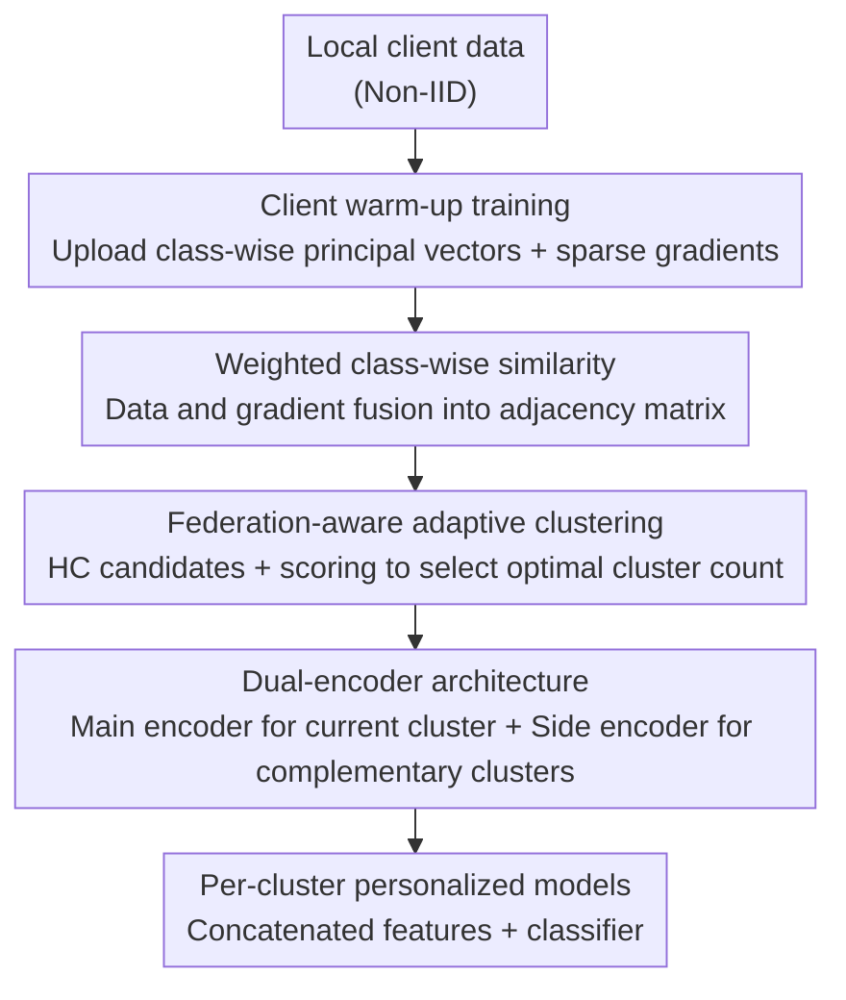

# FedDAG: Clustered Federated Learning via Global Data and Gradient Integration for Heterogeneous Environments

**Conference**: ICLR 2026  
**arXiv**: [2602.23504](https://arxiv.org/abs/2602.23504)  
**Code**: [https://tinyurl.com/2rbkb3zu](https://tinyurl.com/2rbkb3zu)  
**Area**: Optimization / Federated Learning  
**Keywords**: Clustered Federated Learning, data heterogeneity, dual-encoder architecture, cross-cluster knowledge sharing, adaptive clustering

## TL;DR
A Clustered Federated Learning (CFL) framework named FedDAG is proposed. It integrates data and gradient signals to compute weighted class-wise similarities for more accurate client clustering and utilizes a dual-encoder architecture for cross-cluster feature transfer, consistently outperforming existing baselines under various heterogeneity settings.

## Background & Motivation

**Background**: Federated Learning (FL) enables collaborative model training without sharing data; however, client data heterogeneity (non-IID) leads to slow convergence and poor accuracy. CFL addresses this by grouping similar clients to train specialized models for each cluster.

**Limitations of Prior Work**: Existing CFL methods face four primary limitations: 1) Similarity computation relies on a single signal (either data or gradients), which is insufficient; 2) Knowledge sharing is restricted withinclusters, failing to exploit diverse cross-cluster representations; 3) They primarily focus on label skew while neglecting concept drift and quantity shift; 4) They require pre-specifying the number of clusters.

**Key Challenge**: Data similarity and gradient similarity each have blind spots—gradient similarity may misjudge in high-dimensional spaces, while data similarity ignores concept drift. Relying on either signal alone fails to accurately characterize the true similarity between clients.

**Goal**: How to dynamically cluster clients by comprehensively utilizing data and gradient information while allowing for representation sharing across clusters?

**Key Insight**: Refining similarity computation to the class-wise level, automatically learning weights for data and gradient signals, and implementing cross-cluster feature transfer through a dual-encoder architecture.

**Core Idea**: Precise client clustering is achieved by fusing data and gradient similarities via class-wise weighting, while a dual-encoder architecture facilitates cross-cluster knowledge sharing while maintaining cluster specialization.

## Method

### Overall Architecture
FedDAG organizes clustered federated learning into a three-stage pipeline: First, each client performs several local warm-up training rounds to upload class-wise principal vectors and sparse gradients to the server. The server calculates data and gradient similarities respectively and fuses them into a final adjacency matrix using learned weights. Second, hierarchical clustering (HC) is performed on this adjacency matrix, using a federation-aware metric to select the optimal number of clusters from various granularities, while establishing a Complementary Cluster Graph (CC-Graph) to determine feature supplementation between clusters. Third, each cluster model is trained using a dual-encoder architecture—a main encoder learns specialized features from its own cluster data, while a side encoder introduces complementary representations from other clusters according to the CC-Graph. The concatenated features are then passed to the classifier. This maintains cluster specialization while incorporating cross-cluster complementary information.

### Key Designs

**1. Weighted Class-wise Similarity: Complementing Blind Spots between Data and Gradients**

The success of clustering depends on the accuracy of the similarity matrix. Focusing solely on the data subspace misses concept drift, while focusing solely on gradients in high dimensions is prone to misjudgment. FedDAG refines the subspace comparison of PACFL to a class-wise level—comparing principal vector subspaces only within the same category (principal angles are marked as $90°$ when a class exists in only one client and $0°$ when absent in both). Thus, concept drift (where the same label has different meanings across clients) naturally manifests as larger inter-class angles. Similarities for each category are weighted based on the difference in sample volume (addressing quantity shift). On top of the data signal, each client learns a weight $w_i$ to reconcile data and gradient signals, resulting in a final similarity:

$$S_{ij} = w_i \cdot S_{ij}^{data} + (1 - w_i) \cdot S_{ij}^{grad}$$

$w_i$ is optimized by minimizing an entropy-based loss, pushing the adjacency matrix toward a sharper, near-binary state. This weighted fusion allows each client to adaptively select the most informative signals.

**2. Fed-aware Adaptive Clustering: Automatic Determination of Cluster Counts**

In practical scenarios, the number of clusters cannot be known a priori, and hierarchical clustering under federated settings is prone to over-splitting. FedDAG generates a series of candidate partitions by scanning different merging thresholds $\alpha$ and scores each partition using a newly proposed federation-aware metric. This metric consists of two terms: a compactness loss $\mathcal{L}_1$ rewarding tight intra-cluster grouping, and a degradation penalty $\mathcal{L}_2$ suppressing excessively small clusters. Unlike traditional metrics (e.g., inertia), this loss may increase sharply as the number of clusters decreases due to the appearance of small clusters. Consequently, the optimal solution $\alpha^*$ balances sufficient granularity with the avoidance of fragmentation.

**3. Dual-encoder Architecture: Decoupling Specialization and Inter-cluster Complementarity**

Existing methods either restrict knowledge sharing within clusters or use soft clustering that mixes noise. FedDAG equips each cluster model with a main encoder $\phi^{(1)}$ and a side encoder $\phi^{(2)}$, using the CC-Graph $H$ to determine feature sources ($H_{p,q}$ indicates cluster $q$ is complementary to $p$ and well-aligned). Training alternates between two phases: In the main phase, main encoder parameters $\Theta_z^{1f}$ and the classifier $\Theta_z^c$ are trained using aggregated updates from the current cluster while the side encoder is frozen. In the secondary phase, the requesting cluster sends its side encoder to the source cluster, where it is trained on local data before returning gradients to update $\Theta_z^{2f}$. The outputs are concatenated before the classifier:

$$F_z(\cdot) = \psi\big(\phi^{(1)}(\cdot; \Theta_z^{1f}),\, \phi^{(2)}(\cdot; \Theta_z^{2f});\, \Theta_z^c\big)$$

To avoid redundant feature learning, the main encoder is initialized with the partially converged local feature extractor from the warm-up stage. Architectural separation ensures that cross-cluster knowledge is introduced in parallel rather than mixed, preserving specialization.

## Key Experimental Results

### Main Results

| Algorithm | Technique | CIFAR-10 | FMNIST |
|------|------|----------|--------|
| PACFL | Data (D) | 90.45±0.30 | 94.41±0.31 |
| CFL | Gradient (G) | 72.80±0.66 | 86.97±0.23 |
| IFCA | Gradient (G) | 89.68±0.17 | 94.03±0.09 |
| **Ours (FedDAG)** | **D+G+Global Feature Sharing** | **94.53±0.12** | **96.82±0.18** |

### Ablation Study

| Configuration | CIFAR-10 | Description |
|------|----------|------|
| FedDAG (Full) | 94.53 | Full framework |
| Data similarity only | ~91.0 | Degenerates to PACFL++ |
| Gradient similarity only | ~88.5 | Degenerates to improved CFL |
| Without dual-encoder | ~92.0 | No cross-cluster features |
| Without adaptive clustering | ~93.0 | Using pre-set cluster count |

### Key Findings
- FedDAG outperforms the strongest baseline PACFL by over 4 percentage points on CIFAR-10.
- The fusion of data and gradient signals consistently outperforms single signals, especially in concept drift scenarios.
- The dual-encoder architecture provides a 2-3% improvement over single-encoder setups, validating the value of cross-cluster knowledge sharing.
- The method is effective across four types of heterogeneity: label skew, feature skew, concept drift, and quantity shift.

## Highlights & Insights
- **Class-wise Similarity Computation**: Refining similarity to the category dimension is a natural and robust way to handle concept drift compared to global subspace comparisons.
- **Responsibility Separation in Dual-encoder**: The design ensures main and side encoders focus on different signal sources, avoiding the noise-mixing issues inherent in soft clustering methods.

## Limitations & Future Work
- The dual-encoder increases model parameters and computational overhead.
- Class-wise comparisons lead to increased computational costs as the number of categories grows.
- Dependency on clients uploading minimal information for similarity computation poses potential privacy risks despite compression.
- The framework has not yet been tested in large-scale real-world federated scenarios (e.g., cross-device FL).

## Related Work & Insights
- **vs PACFL**: While PACFL compares global subspaces via principal angles, FedDAG adopts class-wise comparison plus weighted fusion, offering a more comprehensive metric.
- **vs FedSoft/FedRC**: These methods mix multiple cluster models through soft clustering, which may introduce noise. FedDAG's dual-encoder structurally separates the two signal sources.

## Rating
- Novelty: ⭐⭐⭐⭐ Class-wise fusion and dual-encoders represent reasonable incremental innovations.
- Experimental Thoroughness: ⭐⭐⭐⭐⭐ Comprehensive evaluation across four heterogeneity types.
- Writing Quality: ⭐⭐⭐⭐ Substantial content though the structure is slightly complex.
- Value: ⭐⭐⭐⭐ Practical improvements for CFL with specific target scenarios.

<!-- RELATED:START -->

## Related Papers

- [\[ICLR 2026\] Incentives in Federated Learning with Heterogeneous Agents](incentives_in_federated_learning_with_heterogeneous_agents.md)
- [\[AAAI 2026\] SMoFi: Step-wise Momentum Fusion for Split Federated Learning on Heterogeneous Data](../../AAAI2026/optimization/smofi_step-wise_momentum_fusion_for_split_federated_learning_on_heterogeneous_da.md)
- [\[ICLR 2026\] Beyond Aggregation: Guiding Clients in Heterogeneous Federated Learning](beyond_aggregation_guiding_clients_in_heterogeneous_federated_learning.md)
- [\[ICLR 2026\] MASAM: Multimodal Adaptive Sharpness-Aware Minimization for Heterogeneous Data Fusion](masam_multimodal_adaptive_sharpness-aware_minimization_for_heterogeneous_data_fu.md)
- [\[ICML 2026\] Adaptive Estimation and Inference in Semi-parametric Heterogeneous Clustered Multitask Learning via Neyman Orthogonality](../../ICML2026/optimization/adaptive_estimation_and_inference_in_semi-parametric_heterogeneous_clustered_mul.md)

<!-- RELATED:END -->
