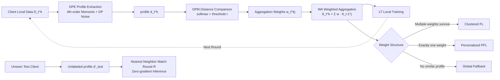

# Federated Learning with Profile Mapping under Distribution Shifts and Drifts

**Conference**: ICLR 2026  
**OpenReview**: [https://openreview.net/forum?id=thoPskdIcE](https://openreview.net/forum?id=thoPskdIcE)  
**Code**: [https://github.com/dariofenoglio98/FEROMA](https://github.com/dariofenoglio98/FEROMA)  
**Area**: Federated Learning / Distributed Optimization / Data Heterogeneity  
**Keywords**: Federated Learning, Distribution Shift, Distribution Drift, Distribution Profile, Clustered FL, Personalized FL, Test-time Adaptation  

## TL;DR
FEROMA decouples "which models to aggregate with" from "client/cluster identity" to "data distribution profiles": each client extracts a lightweight, differentially private distribution profile. The similarity between profiles automatically determines whether the current round employs clustered aggregation, personalization, or global aggregation. This enables robust operation under simultaneous distribution shift (between clients) and distribution drift (over time), with costs comparable to FedAvg.

## Background & Motivation
**Background**: Federated Learning (FL) allows multiple clients to collaboratively train models without sharing raw data. However, in real-world deployments, client data is rarely IID, exhibiting two types of heterogeneity: **distribution shift** (different distributions across clients) and **distribution drift** (the distribution of a single client evolving over communication rounds).

**Limitations of Prior Work**: Existing methods fall into three categories, each with weaknesses. Clustered FL (CFL) handles shifts but usually requires prior knowledge of the number of clusters, involves expensive clustering computation, and necessitates maintaining/transmitting multiple models per client, making it difficult to handle training or test-time drift. Personalized FL (PFL) tunes a local model for each client; while strong when local data is sufficient, models become over-specialized, generalize poorly to unseen clients, and lack mechanisms for cold-start or test-time model assignment. Test-time Adaptation FL (TTA-FL) specifically addresses test-time drift but relies on online adaptation or extra client interaction, making it impractical for deployment and often ignoring training-time shift/drift.

**Key Challenge**: Most methods are tied to a specific type of non-IID setting, require prior knowledge (number of clusters, heterogeneity type), and struggle to simultaneously achieve generalization, adaptability, and efficiency—all of which are required in real FL deployments. Crucially, the concurrent occurrence of **training-time and test-time drift**, a highly realistic setting, has not been jointly studied.

**Goal**: Design a lightweight, universal FL framework that handles both training and test-time shift and drift **without relying on client identity or prior knowledge of cluster counts/distribution types**.

**Core Idea**: **Re-bind model identity from "client/cluster" to "data distribution profiles"**. Each client compresses local data into a low-dimensional, stable, and differentially private distribution profile. The similarity between profiles drives aggregation weighting and test-time model assignment—similar distributions share models, while dissimilar ones naturally separate. This allows the framework to **automatically switch between clustered, personalized, and global aggregation strategies**.

## Method

### Overall Architecture
In each round, FEROMA performs three tasks: first, the **DPE (Distribution Profile Extractor)** compresses each client's local data into a profile vector $d_t^{(k)}$; then, the **DPM (Distribution Profile Mapping)** measures the distance between the current round's profiles and all profiles from the previous round to calculate aggregation weights $w_t^{(k,j)}$; finally, **Weighted Aggregation (WA)** is performed according to these weights to obtain the initial model, followed by **Local Training (LT)**. During the test phase, an unlabeled profile is extracted for an unseen client, and the model from the last round is matched via nearest neighbor for zero-gradient inference. The entire process requires no cluster counts, no client identities, and no test labels.

### Key Designs

**1. Distribution Profile Extractor (DPE): Compressing data into a privacy-secure distribution fingerprint using five axioms.** FEROMA does not directly compare client model parameters or gradients. Instead, it maps the dataset to a low-dimensional profile $d_t^{(k)} = \phi_\psi(D_t^{(k)}) \in \mathbb{R}^d$. The paper formalizes the requirements for an effective profile into five axioms with theoretical bounds: **(R1) Fidelity**—Euclidean distance between profiles must approximate the true distance of underlying distributions (e.g., 2-Wasserstein), $\mathbb{E}\big[|\,\|d_{t_1}^{(k_1)}-d_{t_2}^{(k_2)}\|_2 - \Delta(P_{t_1}^{(k_1)},P_{t_2}^{(k_2)})\,\big] \le \xi$; **(R2) Label-agnostic**—must be able to generate a sub-vector $d'^{(k)}_t = \phi_\psi(x_t^{(k)}, 0)$ using only features $x$ for test-time matching; **(R3) Controlled Randomness**—repeated extractions of the same data result in noisy random vectors with bounded covariance $\mathrm{Cov}(d|D)\preceq \rho^2 I_d$ to prevent precise fingerprinting across rounds; **(R4) Differential Privacy**—satisfies sample-level $(\varepsilon, \delta)$-DP using Gaussian/Laplacian mechanisms $d_t^{(k)} = \bar\phi_\psi(D_t^{(k)}) + \mathcal{N}(0,\sigma^2 I_d)$; **(R5) Compactness**—dimension $d \ll |\theta|$ (in implementation $d/|\theta|\le 3.5\times10^{-3}$), making communication/computation overhead negligible. The implementation uses a four-step extraction involving latent space 4th-order statistical moments and DP noise.

**2. Training-time Distribution Mapping: Letting aggregation weights evolve into CFL/PFL/Global using softmax similarity and thresholds.** After extracting profiles for the current round, they are mapped to the set of profiles from the previous round. Normalized distances define the association weights:
$$w_t^{(k,j)} = \frac{\exp\big(-D(d_t^{(k)}, d_{t-1}^{(j)})\big)}{\sum_{j'\in A_{t-1}}\exp\big(-D(d_t^{(k)}, d_{t-1}^{(j')})\big)}$$
where $D(\cdot,\cdot)$ is a distance function (e.g., Euclidean distance) and $A_{t-1}$ is the set of active clients from the previous round. Weakly similar profiles receive small weights that might introduce noise; thus, a threshold $\tau$ is applied to zero out small weights and re-normalize: $\tilde w_t^{(k,j)} = w_t^{(k,j)}$ if $\ge\tau$ else $0$. Updates are only shared between sufficiently similar profiles. **The elegance lies in the emergence of the aggregation strategy**: if multiple weights survive, it is equivalent to Clustered FL; if exactly one non-zero weight remains, it is Personalized FL (inheriting the most similar model); if no similar profiles exist, it falls back to a global average.

**3. Test-time Distribution Mapping: Zero-gradient nearest neighbor model assignment for unseen clients.** For a completely new, unlabeled client during testing, FEROMA uses (R2) to extract an unlabeled profile $d'^{(k)}_{\text{test}} = \phi_\psi(x_{\text{test}}^{(k)}, 0)$, then finds the nearest neighbor $j^* = \arg\min_{j\in A_R} D(d'^{(k)}_{\text{test}}, d'^{(j)}_R)$ among the profiles of the last round $R$, and directly uses model $\theta_R^{(j^*)}$ for inference. This requires **no gradient steps, no online adaptation, and no labels**. The paper notes that while unlabeled matching cannot capture "concept drift" (same X, different Y), performance can be significantly improved by using a tiny labeled validation set during testing to correct associations.

## Key Experimental Results

### Main Results
On 6 datasets (MNIST/FMNIST/CIFAR-10/CIFAR-100/CheXpert/Office-Home) across 10 SOTAs, showing unweighted averages across all drift frequencies, non-IID types, and severities:

| Method | MNIST | FMNIST | CIFAR-10 | CIFAR-100 | CheXpert | Office-Home |
|------|-------|--------|----------|-----------|----------|-------------|
| FedAvg | 71.8±5.5 | 63.7±6.4 | 33.0±5.3 | 28.2±4.7 | 59.1±3.0 | 41.0±1.3 |
| CFL | 76.6±3.9 | 65.6±4.8 | 33.9±4.7 | 28.9±3.5 | 62.3±2.2 | 34.8±1.0 |
| FedEM | 30.7±7.0 | 46.1±7.0 | 23.0±4.8 | 31.7±3.6 | 53.3±2.2 | 15.5±2.9 |
| FedDrift | 57.0±7.7 | 47.6±7.2 | 29.2±4.9 | 20.2±3.5 | 72.3±0.8 | 42.1±2.4 |
| ATP | 72.1±10.5 | 61.1±12.1 | 28.7±5.1 | 16.7±3.8 | N/A | 40.8±4.3 |
| **Ours** | **90.7±1.8** | **79.9±2.8** | **44.2±3.8** | **39.9±2.5** | **72.4±0.6** | **42.4±1.4** |

Ours outperforms the strongest baseline CFL by 14.1/14.3/10.3 percentage points on MNIST/FMNIST/CIFAR-10 respectively, and generally shows the **lowest variance** (best stability).

### Ablation Study
On MNIST across three non-IID severities (Low/Med/High) × three drift frequencies (5/10/20 drifts in 20 rounds):

| Setting | FedAvg | CFL | ATP | **Ours** |
|------|--------|-----|-----|-----------|
| Low-5/20 | 72.1±8.0 | 79.1±4.3 | 70.8±12.8 | **90.6±2.9** |
| Med-10/20 | 73.6±5.3 | 78.3±3.6 | 77.6±5.3 | **90.6±1.8** |
| High-20/20 | 68.6±6.5 | 74.5±2.9 | 70.4±8.4 | **90.8±0.8** |

Baselines degrade significantly as drift becomes more frequent and heterogeneity higher, while Ours remains stable (~90% accuracy with minimal variance). In client scaling experiments (10 to 100 clients), Ours maintains >85% accuracy at the largest scale, whereas FedDrift becomes computationally intractable.

### Key Findings
- **Automatic strategy switching is the source of robustness**: By not relying on a fixed strategy, Ours automatically recovers the appropriate structure round-by-round, maintaining performance where fixed-strategy baselines fail.
- **Efficiency stems from lightweight profiles**: Communication overhead $d/|\theta|\le 3.5\times10^{-3}$ and computation negligible compared to a local epoch keep costs at the FedAvg level.
- **Qualitative Comparison**: Ours is the only method to satisfy all properties: "Shift + Drift + TTA + Low Communication + Low Server/Client Computation + Scalable."

## Highlights & Insights
- **"Decoupling model from client identity" is a clean paradigm shift**: Once models are attached to distribution profiles, CFL/PFL/Global are no longer mutually exclusive designs but special cases of the same weighting formula under different sparsity levels.
- **Solid design of the five DPE axioms**: Satisfying Fidelity, Label-agnosticism, Controlled Randomness, DP, and Compactness concurrently ensures that using profiles instead of raw data for similarity is both secure and reliable.
- **First joint handling of training + test-time shift and drift** without requiring labels, online adaptation, or prior knowledge of heterogeneity.

## Limitations & Future Work
- **Strong dependence on DPE quality**: Profiles rely on a pre-trained model to embed data into latent space; if the model is under-trained or the task is too complex, the latent space may not reflect distributions accurately.
- **Concept drift limitations**: Purely label-agnostic matching cannot capture "same X, different Y" scenarios without a small labeled validation set.
- **Unseen global distributions**: When encountering a completely new distribution never seen during training, nearest neighbor matching can only select the "least bad" existing model, lacking a true extrapolation mechanism.

## Related Work & Insights
FEROMA connects three main threads in FL heterogeneity: **CFL** (FedRC/FedEM/FedDrift, etc.) clusters based on parameters but assumes a fixed number of clusters; **PFL** (pFedMe/FedProto, etc.) is personalized but lacks mechanisms for unseen clients; **TTA-FL** (ATP/CoLA, etc.) handles test drift but requires online adaptation. Ours uses continuous distribution profiles for soft association, avoiding explicit clustering while enabling personalization and zero-update test-time adaptation. **The paradigm of using lightweight distribution descriptors instead of parameter/gradient comparisons** is a general and privacy-friendly approach transferable to federated domain adaptation or medical modeling.

## Rating
- **Novelty**: ⭐⭐⭐⭐ —— Decoupling model identity from clients and unifying FL strategies into a single weighting formula is a clean and explanatory perspective.
- **Experimental Thoroughness**: ⭐⭐⭐⭐ —— Extensive coverage across datasets, baselines, and drift scenarios; includes scaling and overhead measurements.
- **Writing Quality**: ⭐⭐⭐⭐ —— Clear formalization of the DPE axioms and intuitive explanation of strategy emergence.
- **Value**: ⭐⭐⭐⭐ —— Significant improvements in accuracy and stability for heterogeneous dynamic scenarios with FedAvg-level overhead.

<!-- RELATED:START -->

- **FedDrift**: [arXiv:2303.13241](https://arxiv.org/abs/2303.13241) (Baseline for drift handling)
- **IFCA**: [arXiv:2006.04088](https://arxiv.org/abs/2006.04088) (Classic Clustered FL)
- **ATP**: [arXiv:2210.12644](https://arxiv.org/abs/2210.12644) (Test-time Adaptation in FL)

<!-- RELATED:END -->

## Related Papers

- [\[CVPR 2026\] Fed-ADE: Adaptive Learning Rate for Federated Post-adaptation under Distribution Shift](../../CVPR2026/optimization/fed-ade_adaptive_learning_rate_for_federated_post-adaptation_under_distribution_.md)
- [\[NeurIPS 2025\] FLUX: Efficient Descriptor-Driven Clustered Federated Learning under Arbitrary Distribution Shifts](../../NeurIPS2025/optimization/flux_efficient_descriptor-driven_clustered_federated_learning_under_arbitrary_di.md)
- [\[ICLR 2026\] Incentives in Federated Learning with Heterogeneous Agents](incentives_in_federated_learning_with_heterogeneous_agents.md)
- [\[ICLR 2026\] DeepAFL: Deep Analytic Federated Learning](deepafl_deep_analytic_federated_learning.md)
- [\[ICLR 2026\] Unified Analyses for Hierarchical Federated Learning: Topology Selection under Data Heterogeneity](unified_analyses_for_hierarchical_federated_learning_topology_selection_under_da.md)

<!-- RELATED:END -->
