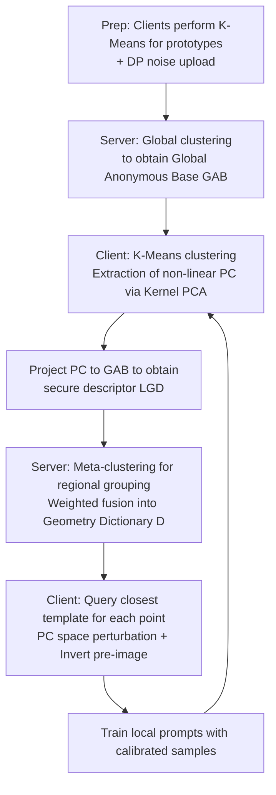

# FedMC: Federated Manifold Calibration

**Conference**: ICLR 2026  
**OpenReview**: [https://openreview.net/forum?id=rxwwncarWj](https://openreview.net/forum?id=rxwwncarWj)  
**Code**: TBD  
**Area**: Federated Learning / Data Heterogeneity / Manifold Learning  
**Keywords**: Federated Learning, Data Heterogeneity, Manifold Calibration, Kernel PCA, Federated Prompt Learning  

## TL;DR
Addressing the issue where local calibration using global linear geometric priors (points/ellipsoids) pushes samples off the manifold and generates OOD pseudo-samples in Federated Learning, FedMC utilizes local Kernel PCA on clients to learn non-linear manifold geometry. These are aggregated into a privacy-secure "Geometry Dictionary" on the server, allowing clients to perform **manifold-aligned calibration** via table lookups. This serves as a plug-and-play module that consistently enhances various FL and FPL methods.

## Background & Motivation
**Background**: Data heterogeneity (non-IID) is the primary obstacle in Federated Learning (FL). A promising direction involves sharing "global statistical priors" to guide local training—transitioning from sharing first-order moments (class prototypes/centers) to second-order moments (covariances). These methods use a global hyper-ellipsoid to characterize distribution "shapes" and calibrate along principal component directions: $x' = x + \sum_{m=1}^{d}\epsilon_m\sqrt{\lambda_m}u_m$.

**Limitations of Prior Work**: Both first and second-order methods imply a **global linear assumption**—using a single, globally consistent simple model (a point or an ellipsoid) to summarize complex distributions. However, real-world high-dimensional data typically concentrates on a low-dimensional **curved manifold** $\mathcal{M}$ rather than uniformly filling the Euclidean space.

**Key Challenge**: On curved manifolds, meaningful distance is Measured along the surface (geodesic distance), whereas PCA relies on Euclidean distance. Taking an S-shaped manifold as an example, global PCA incorrectly identifies the Euclidean "shortcuts" between the ends of the manifold as the principal component $u_1$—a path passing through empty space with no data. Calibrating along this direction results in a perturbation vector $d\in\mathrm{span}(U)$ that almost inevitably contains a normal component $d_\perp$ pushing points off the manifold. This **systematically generates OOD pseudo-samples with zero probability under the true distribution**, forcing the model to learn spurious correlations between labels and features.

**Goal**: Transition from "relying on flawed global linear models" to a new paradigm of "understanding and utilizing local, non-linear data geometry," achieving true manifold-aligned calibration under strict privacy constraints.

**Core Idea**: **[Local Non-linear Geometry]** Clients use local Kernel PCA to capture local manifold curvature; **[Global Geometry Dictionary]** The server aggregates local geometries into a "Manifold Atlas"; **[On-demand Lookup Calibration]** Clients dynamically query the dictionary for each data point to obtain context-aware geometric priors, ensuring calibration occurs on the manifold. The entire process is executed within a privacy-preserving federated framework.

## Method

### Overall Architecture
FedMC operates in the image embedding space (without modifying the original images or frozen CLIP encoders), calibrating biased local embedding sets $D_k$ into augmented sets $\hat{D}_k$ that better fit the global manifold, which are then used to train local prompts. The framework includes a preparation phase (constructing a Global Anonymous Base, GAB) and two iterative phases: (I) Server-side federated aggregation of local geometry into a Geometry Dictionary; (II) Client-side manifold-aligned calibration via dictionary lookup.

### Key Designs

**1. Global Anonymous Base (GAB): Creating a "Public Coordinate System" for federated geometric communication.** A fundamental challenge in collaborative geometry in FL is that geometric information cannot be compared without a shared coordinate system, yet sharing geometry defined by local data points directly compromises privacy. FedMC first has each client $k$ perform K-Means on local embeddings to obtain prototypes $\{c_{k,j}\}$, then adds Gaussian noise to satisfy $(\epsilon, \delta)$-Differential Privacy: $\tilde{c}_{k,j} = c_{k,j} + \mathcal{N}(0, \sigma^2 I)$, uploading only anonymous prototypes. The server aggregates thousands of these prototypes and performs global K-Means to select $N_{base}$ significant centroids as the GAB $B_g=\{b_1, \dots, b_{N_{base}}\}$. Since the GAB is distilled from a mixed and noised pool, no point can be traced back to a specific client's raw data, providing a privacy-secure geometric "lingua franca."

**2. KPCA for Local Non-linear Geometry + Secure Descriptors via GAB Projection.** Clients first partition local data $D_k$ into $m$ clusters using K-Means (each cluster approximating a geometrically consistent manifold patch). For each cluster, a Gram matrix is constructed using an RBF kernel $k(x,y)=\exp(-\gamma\lVert x-y\rVert_2^2)$, and eigen-decomposition $\bar{K}_j\alpha_{j,i}=\lambda_{j,i}\alpha_{j,i}$ is performed after centering. This implicitly defines non-linear principal components $v_{j,i}=\sum_a (\alpha_{j,i})_a\Phi(x_a)$ in a high-dimensional feature space $\mathcal{H}$—orthogonal bases describing the directions of maximum variance for the local manifold patch. To prevent privacy leaks from $\alpha_{j,i}$ and $\{x_a\}$, each principal component is **projected onto the public GAB** to obtain $N_{base}$-dimensional coefficients $(\beta_{j,i})_s=\langle v_{j,i},\Phi(b_s)\rangle_{\mathcal{H}}=\sum_a(\alpha_{j,i})_a k(x_a,b_s)$. This step transforms geometry information from private data into standardized coordinates expressed via anonymous bases, **decoupling privacy while making client reports directly comparable and aggregatable**. Clients only upload Local Geometric Descriptors $\mathrm{LGD}_j=(\tilde{c}_j, n_j, \{(\lambda_{j,i},\beta_{j,i})\}_{i=1}^{d})$.

**3. Server Fusion into Geometry Dictionary: Weighted Consensus via Regional Grouping.** The server acts as a curator, fusing LGDs into a compact, globally consistent Geometry Dictionary—not through simple averaging, but as a structured atlas mapping different manifold regions to their respective consensus geometries. Meta-clustering is performed on anonymous prototypes $\{\tilde{c}_j\}$ to identify which LGDs describe the same macro-region. Since all $\beta_{j,i}$ are standardized to the GAB coordinate system, fusion simplifies to robust weighted averaging: $\beta^*_{l,i}=\frac{\sum_{j\in l}n_j\lambda_{j,i}\beta_{j,i}}{\sum_{j\in l}n_j\lambda_{j,i}}$ and $\lambda^*_{l,i}=\frac{\sum_{j\in l}n_j\lambda_{j,i}}{\sum_{j\in l}n_j}$. Weights consider both sample count $n_j$ and local variance $\lambda_{j,i}$, ensuring regions with denser data and more prominent geometry contribute more. The paper proves this weighted average is the optimal solution to a weighted least squares problem, providing a theoretical basis for the strategy. Each entry $\mathrm{Entry}_l=(g_l,\{(\lambda^*_{l,i},\beta^*_{l,i})\}_{i=1}^{d})$ is then dispatched to clients.

**4. Client-side Manifold-Aligned Calibration: Lookup-Perturb-Invert.** Upon receiving the dictionary, calibration resembles "navigating with a map": for each local point $x$, a dynamic query finds the nearest macro-prototype $l^*=\arg\min_l\lVert x-g_l\rVert_2^2$ to lock onto the most relevant template. Calibration involves three steps in the subspace spanned by the retrieved principal components (approximating the local tangent space): calculating projections $p_i=\langle\Phi(x),v^*_{l^*,i}\rangle_{\mathcal{H}}=\sum_s(\beta^*_{l^*,i})_s k(x,b_s)$; perturbing in PC space $p'_i=p_i+\epsilon_i\sqrt{\lambda^*_{l^*,i}}$, where $\epsilon_i\sim\mathcal{N}(0,1)$; and reconstructing high-dimensional features $\Phi(x)'\approx\sum_i p'_i v^*_{l^*,i}$. Since $\Phi(x)'$ cannot be used directly, a pre-image inversion problem $x'=\arg\min_z\lVert\Phi(z)-\Phi(x)'\rVert_{\mathcal{H}}^2$ is solved. After pre-calculating target inner products $T_s$, gradient descent minimizes $\mathcal{L}(x')=\sum_s (k(x',b_s)-T_s)^2$. Because perturbations occur within the local tangent space approximated by KPCA, update directions follow the manifold's intrinsic geometry, avoiding systematic OOD samples generated by linear methods. The pair $(x',y)$ is then used to train local prompts.

## Key Experimental Results

### Main Results

Label Skew (CIFAR-100 / Tiny-ImageNet, CLIP ViT-B/16, Accuracy %):

| Method | CIFAR-100 β=0.5 | β=0.3 | β=0.1 | Tiny-ImageNet β=0.5 | β=0.3 | β=0.1 |
|------|------|------|------|------|------|------|
| FedVTP (Base) | 84.90 | 84.26 | 81.01 | 80.97 | 80.26 | 77.58 |
| GGEUR (FedVTP, Linear Baseline) | 85.21 | 84.55 | 82.55 | 81.15 | 80.35 | 78.02 |
| **FedMC (FedVTP)** | **86.72** | **85.90** | **85.08** | **81.53** | **80.85** | **80.12** |

Domain Skew (Selected results, β=0.1):

| Method | Office-31 | Office-Home | DomainNet |
|------|------|------|------|
| FedVTP (Base) | 94.58 | 88.92 | 83.82 |
| GGEUR (FedVTP) | 94.71 | 89.15 | 83.85 |
| **FedMC (FedVTP)** | **96.12** | **91.03** | **85.93** |

### Ablation Study

FedMC as a generic FL enhancement module (Office-Home-LDS, β=0.1, Accuracy %):

| FL Algorithm | Base | +GGEUR | +FedMC |
|------|------|------|------|
| FedAvg | 70.14 | 83.99 | **85.11** |
| SCAFFOLD | 74.82 | 83.96 | **85.25** |
| MOON | 76.83 | 78.08 | **80.73** |
| FedDyn | 65.99 | 84.09 | **86.32** |
| FedOPT | 65.59 | 84.20 | **86.58** |
| FedNTD | 75.46 | 82.46 | **84.91** |
| FedProto | 69.40 | 83.35 | **85.92** |

### Key Findings
- **Superiority in High Heterogeneity**: While all methods drop in performance as β decreases from 0.5 to 0.1, FedMC shows the smallest decline. On Tiny-ImageNet β=0.1, it outperforms FedVTP by 1.74%, and on CIFAR-100 β=0.1, it exceeds the linear baseline GGEUR by 2.53%, validating that "non-linear manifold modeling > global linear approximation."
- **Greater Advantage in Domain Skew**: On DomainNet β=0.1, FedMC leads GGEUR by 2.05%. Prototype averaging and linear assumptions fail under diverse client manifolds (e.g., photos vs. sketches), whereas the Geometry Dictionary captures domain-specific geometric signatures.
- **Beyond First-order Statistic Sharing**: Compared to FedProto— a strong baseline utilizing prototypes (1st moment) to mitigate heterogeneity—FedMC still provides significant gains. This indicates that sharing "data location" is insufficient; capturing higher-order "shape" provides more fundamental calibration signals.

## Highlights & Insights
- **Precise Problem Diagnosis**: Correctly attributes the failure of geometry-aware FL calibration to the implicit global linear assumption. Using the S-manifold illustration with Euclidean shortcuts, it provides an intuitive yet theoretically supported explanation for OOD sample generation via the normal component $d_\perp$.
- **Elegant Coupling of Privacy and Aggregation**: The combination of GAB and projection coefficients $\beta$ simultaneously solves for "anonymous geometry sharing" and "geometric aggregatability." Transforming data-dependent principal components into standard vectors in a public coordinate system is a standout contribution.
- **Plug-and-Play Versatility**: Effectively integrates as a calibration module into FPL (FedVTP) and 7 classic FL algorithms with consistent performance gains.

## Limitations & Future Work
- **Computational Overhead**: Each data point requires KPCA and iterative pre-image inversion (kernel trick + gradient descent). Client computational costs rise with local data volume; while scalability experiments are in the appendix, the overhead for large-scale deployment remains a concern.
- **Hyperparameter Sensitivity**: The characterization of "local scale" depends on the RBF bandwidth $\gamma$, number of clusters $m$, base size $N_{base}$, and retained principal components $d$, yet an adaptive selection mechanism is currently missing.
- **Validation Scope**: Primary evaluation is on FPL (based on frozen CLIP embedding space). Effectiveness on vision models trained from scratch or larger models requires further validation. The trade-off between DP noise intensity and geometric fidelity also warrants deeper analysis.

## Related Work & Insights
- **Geometry-aware FL**: GGEUR / Ma et al., which use global covariance hyper-ellipsoids for calibration, serve as the direct linear baselines that FedMC upgrades to non-linear.
- **Federated Prototype Methods**: Methods like FedProto share 1st moments (location priors). FedMC demonstrates the necessity of "shape priors."
- **Federated Prompt Learning (FPL)**: FedVTP / PromptFL / FedTPG / FedPR focus on prompt design/aggregation. FedMC suggests that a more fundamental problem is biased prompt learning on heterogeneous data, addressing it at the source through data calibration.
- **Inspiration**: The combination of manifold learning (Kernel PCA, pre-image inversion), Differential Privacy, and federated aggregation provides a reusable paradigm for sharing and fusing high-order geometric structures under privacy constraints. This is transferable to federated domain adaptation and representation learning.

## Rating
- Novelty: ⭐⭐⭐⭐ Clearly diagnoses global linear assumption failures and proposes a paradigm shift to non-linear manifold calibration. The privacy-aware GAB+projection aggregation is innovative.
- Experimental Thoroughness: ⭐⭐⭐⭐ Covers label, domain, and mixed heterogeneity across 6 datasets. Validates generalizability across FPL and 7 classic FL algorithms.
- Writing Quality: ⭐⭐⭐⭐ Motivation is well-developed, illustrations are intuitive, and formulae correspond clearly to the methodology.
- Value: ⭐⭐⭐⭐ Plug-and-play with stable improvements. Provides a more faithful geometric foundation for heterogeneous federated calibration.

<!-- RELATED:START -->

## Related Papers

- [\[ICLR 2026\] Enhancing Communication Compression via Discrepancy-aware Calibration for Federated Learning](enhancing_communication_compression_via_discrepancy-aware_calibration_for_federa.md)
- [\[ICLR 2026\] Riemannian Optimization on Relaxed Indicator Matrix Manifold](riemannian_optimization_on_relaxed_indicator_matrix_manifold.md)
- [\[ICLR 2026\] DeepAFL: Deep Analytic Federated Learning](deepafl_deep_analytic_federated_learning.md)
- [\[ICLR 2026\] Towards Understanding the Calibration Benefits of Sharpness-Aware Minimization](towards_understanding_the_calibration_benefits_of_sharpness-aware_minimization.md)
- [\[ICLR 2026\] Byzantine-Robust Federated Learning with Learnable Aggregation Weights](byzantine-robust_federated_learning_with_learnable_aggregation_weights.md)

<!-- RELATED:END -->
