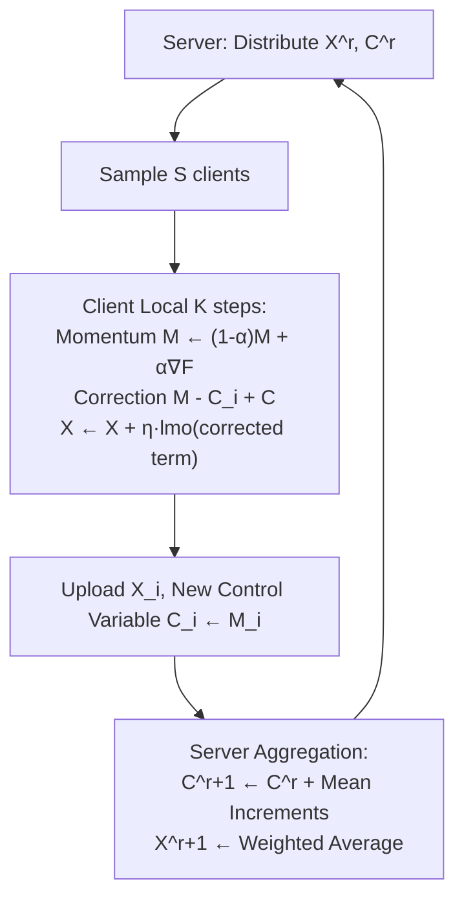

# FedMuon: Federated Learning with Bias-corrected LMO-based Optimization

**Conference**: ICLR 2026  
**OpenReview**: [https://openreview.net/forum?id=9k7bvBVenZ](https://openreview.net/forum?id=9k7bvBVenZ)  
**Code**: TBD  
**Area**: optimization  
**Keywords**: Federated Learning, Muon, LMO, Bias correction, Newton-Schulz, SCAFFOLD, Convergence analysis  

## TL;DR
This paper points out that directly using Muon (an optimizer based on the Linear Minimization Oracle, LMO) as a local optimizer for FedAvg fails to converge because LMO is a biased operator. It proposes FedMuon, which utilizes SCAFFOLD-like control variables for bias correction, and provides the first proof that it converges for any number of Newton-Schulz iterations, with faster convergence as iterations increase.

## Background & Motivation
**Background**: Muon is a recently emerged optimizer that projects the momentum of SGD onto the space of orthogonal matrices (i.e., solving LMO under the spectral norm). In large-scale model pre-training, it is faster and more accurate than AdamW and Shampoo. It has been proven equivalent to a simplified Shampoo, an LMO optimizer under specific norms, and a special case of trust-region methods. Naturally, researchers aim to adapt it to distributed and federated learning (FL) to accelerate large-scale training.

**Limitations of Prior Work**: Distributing Muon is non-trivial. Ahn et al. (Dion) can solve LMO distributively but does not support multiple local updates and incurs massive communication overhead. MuLoCo by Thérien et al. allows clients to perform multiple local steps like Local SGD, but it is only effective in homogeneous settings where all clients share the same dataset, lacking theoretical guarantees for the general case. Once client data is heterogeneous (the essential feature of FL), these direct approaches fail.

**Key Challenge**: LMO is a **biased operator**—calculating the LMO of each client's momentum and then averaging them is not equivalent to averaging the momenta first and then calculating the LMO: $\frac{1}{n}\sum_i \mathrm{lmo}(M_i) \neq \mathrm{lmo}(\frac{1}{n}\sum_i M_i)$. While momentum $M_i$ is an estimate of the local gradient $\nabla f_i(X)$, the term $\frac{1}{n}\sum_i \mathrm{lmo}(M_i)$ no longer aligns with the global gradient $\nabla f(X)$, causing optimization to stagnate under heterogeneous data. Ours formally proves this (Theorem 1): there exists a set of convex functions such that the direct approach (named LocalMuon) stays at the initial point forever, with $\|\nabla f(X^{(r)})\|^2 \geq \Omega(\zeta_\star^2)$, where $\zeta_\star^2 = \frac{1}{n}\sum_i \|\nabla f_i(X^\star)\|^2$ measures client heterogeneity.

**Goal**: Design a Muon variant that can both correct LMO bias and provably converge in heterogeneous federated settings, while characterizing the impact of approximate LMO solvers (using finite Newton-Schulz iterations) on convergence.

**Core Idea** (**Bias Correction + Convergence with Arbitrary Precision**): Borrowing the control variable idea from SCAFFOLD, LMO is applied to the "corrected momentum" rather than the raw momentum to eliminate bias. Utilizing the special properties of the spectral norm and Newton-Schulz iterations, the paper proves convergence for any iteration count $T \geq 0$.

## Method

### Overall Architecture
FedMuon maintains a control variable $C_i^{(r)}$ for each client $i$ to estimate its local gradient direction and a global control variable $C^{(r)}$ for the server to estimate the global gradient direction within the FedAvg client-server loop. During local multi-step updates, instead of applying LMO to the momentum $M_i$, it is applied to the corrected term $M_i - C_i^{(r)} + C^{(r)}$. This corrected term serves as a good estimate of the global gradient $\nabla f(X)$, thereby eliminating LMO bias. The server aggregates parameters and control variables, supporting partial client participation (sampling $S$ clients per round).

### Key Designs

**1. Control Variable Bias Correction: Applying LMO to the de-biased direction**. The core line of FedMuon is $X_i^{(r,k+1)} \leftarrow X_i^{(r,k)} + \eta\, \mathrm{lmo}\!\left(M_i^{(r,k+1)} - C_i^{(r)} + C^{(r)}\right)$. Here $C_i^{(r)}$ and $C^{(r)}$ approximate the local gradient $\nabla f_i(X)$ and global gradient $\nabla f(X)$ respectively (updated every round as $C_i^{(r+1)} \leftarrow M_i^{(r,K)}$, and on the server side $C^{(r+1)} \leftarrow C^{(r)} + \frac{1}{N}\sum_{i\in S_r}(C_i^{(r+1)}-C_i^{(r)})$). Since $M_i^{(r,k+1)} - C_i^{(r)} + C^{(r)}$ cancels the local gradient drift and aligns with the global direction, the LMO output will not pull clients toward their respective local optima. A clean degradation relationship confirms its logic: when LMO is removed and $\alpha=1$, FedMuon reduces exactly to the original SCAFFOLD. Importantly, unlike existing SCAFFOLD-momentum variants that add momentum at the server, FedMuon performs correction at the LMO input, which is key to handling LMO bias.

**2. Provable Convergence under Arbitrary Norms**. Under the smoothness assumption (measuring gradient difference with the dual norm $\|\nabla f_i(X)-\nabla f_i(Y)\|_\star \leq L\|X-Y\|$) and the unbiased bounded variance assumption, Theorem 2 provides the convergence rate for full client participation. The dominant term is $O\big((\frac{Lr_0\tilde\sigma^2}{nRK})^{1/4}\big)$, which is nearly isomorphic to FedAvg and SCAFFOLD, and improves as the number of clients $n$ increases. The only difference is an additional factor $\rho = \sup_X \frac{\|X\|_\star}{\|X\|_F}$ (since the dual norm of the gradient is analyzed). Interestingly, when using the spectral norm, its dual is the trace norm. Thus, FedMuon measures $\|\nabla f(X)\|_{\mathrm{trace}}$ while SCAFFOLD measures $\|\nabla f(X)\|_F$. When the Hessian is approximately low-rank (few dominant singular values), $L \approx L_F$, and FedMuon can converge faster than SCAFFOLD—providing a theoretical explanation for Muon's strong empirical performance.

**3. Convergence for Any Number of Newton-Schulz Iterations**. In practice, LMO is approximated via Newton-Schulz (NS) iterations (matrix multiplications only, GPU-friendly): $G^{(t+1)} = aG^{(t)} + b(G^{(t)}G^{(t)\top})G^{(t)} + c(G^{(t)}G^{(t)\top})^2 G^{(t)}$. The most surprising conclusion (Theorem 3) is that FedMuon converges for **any** $T \geq 0$. The key inequality is $-\|G\|_{\mathrm{trace}} \leq \langle G, -G^{(T)}\rangle \leq -\|G\|_p$ and $\|-G^{(T)}\|_{sp}\leq 1$, indicating that even with few iterations or $T=0$ (where the output is the normalized gradient $-G/\|G\|_F$), the direction remains a valid descent direction. The convergence metric is characterized via the Schatten $p$-norm through $T$: $p = 1 + \frac{\log(1-(1-\kappa)^{1.5^T})}{\log\kappa}$. For $T=0$, $p=2$ (Frobenius norm); as $T\to\infty$, $p\to1$ (trace norm). Thus, more iterations result in a stronger metric norm and faster convergence, with a potential improvement up to $\sqrt{\min\{d_1,d_2\}}$ times. This provides a much stronger "any $T$ converges" assertion than previous work analyzing inexact LMO (which required sufficiently many NS iterations).

## Key Experimental Results

### Main Results (FashionMNIST + LeNet / CIFAR-10 + ResNet-18, n=16 sampling S=8, K=5 local steps)

| Method | Homogeneous (β=10) | Heterogeneous (β=0.1) |
|------|------------|-------------|
| FedAvg (Momentum SGD) | Lower | Lower |
| FedAvg (Adam) | Med | Med |
| SCAFFOLD (Momentum SGD) | Med | Med |
| SCAFFOLD (Adam) | Med | Med |
| LocalMuon | Good | **Significant Lag (No convergence)** |
| **FedMuon** | **Best** | **Best** |

FedMuon achieves the highest test accuracy across all settings. LocalMuon performs decently in homogeneous settings but lags significantly in heterogeneous settings, validating Theorem 1 (LocalMuon does not converge under heterogeneity).

### Ablation Study (Newton-Schulz Iterations T, FashionMNIST + LeNet)

| Setting | Best T | Observation |
|------|--------|------|
| Homogeneous (β=10) | T=4 | Accuracy increases with T |
| Heterogeneous (β=0.1) | T=2 | Accuracy increases with T, then stabilizes |

FedMuon is trainable even at $T=0$. Increasing $T$ from 0 to 1 leads to a significant jump in accuracy, consistent with Theorem 3 (convergence for any $T$, faster with larger $T$).

### Key Findings
- Directly embedding LMO optimizers into FedAvg (LocalMuon / MuLoCo) leads to stagnation in heterogeneous FL, which is an inevitable consequence of LMO's bias.
- After bias correction, Muon's advantages transfer to federated scenarios, outperforming FedAvg(Adam) and SCAFFOLD(Adam).
- Approximate LMO solving via Newton-Schulz does not destroy convergence; it only affects the rate, offering a tunable trade-off between accuracy and computation.

## Highlights & Insights
- **Precise Diagnosis**: This work starts with a clean lower-bound theorem (Theorem 1) characterizing why direct Muon fails, accurately attributing the problem to LMO bias before providing the solution, resulting in a complete logical chain.
- **Elegant Relationship**: Removing LMO and setting $\alpha=1$ reduces the method to SCAFFOLD, showing that FedMuon naturally grafts a mature variance reduction framework onto an LMO optimizer.
- **Strong Theoretical Originality**: It is the first to prove that LMO optimizers can converge even when inexact (arbitrary Newton-Schulz counts) and continuously characterizes the relationship between "approximation precision $\leftrightarrow$ convergence norm strength" using the Schatten $p$-norm. The observation that $T=0$ reduces to a normalized gradient is intuitive.

## Limitations & Future Work
- **Small Experimental Scale**: Tested only on FashionMNIST/CIFAR-10 with LeNet/ResNet-18, not yet validated on large-scale LLM pre-training or large matrix parameters where Muon truly excels.
- **Comm./Storage Costs**: SCAFFOLD-style control variables require clients and servers to maintain and transmit additional states $C_i$. The overhead-to-benefit ratio in communication-constrained FL settings has not been meticulously evaluated.
- **$\kappa$ Worst-case Pessimism**: The term $(1-\kappa)^{1.5^T}$ in $p$ requires a very large $T$ as $\kappa\to0$. In the worst case, the impact of approximation precision on convergence might still be severe; in practice, this is compensated by empirical observations (significant jumps from $T=0$ to $T=1$).
- Theoretical results for the general case of client sampling $S<n$ are placed in the appendix, while the main text simplifies with $S=n$.

## Related Work & Insights
- **Muon and LMO Optimizers**: Liu et al. (2025), Pethick et al. (2025), and Jordan et al. (2024) use LMO for unconstrained neural network training. This work is the first to systematically introduce it to FL with provable convergence.
- **Federated Variance Reduction**: The control variables of SCAFFOLD (Karimireddy et al. 2020) are the direct source of the de-biasing mechanism; this differs from the SCAFFOLD-momentum variants (Cheng et al. 2024, etc.) that apply momentum at the server.
- **Distributed Muon**: Dion (Ahn et al. 2025) and MuLoCo (Thérien et al. 2025) are concurrent works, but the former lacks multi-step local updates and the latter is only applicable to homogeneous data. FedMuon fills the gap for heterogeneous FL.
- **Insight**: When a "non-linear/biased" operator (e.g., LMO, normalization, projection) is embedded in distributed averaging, applying control variable de-biasing before the operator is a reusable design pattern. This paper also demonstrates how to incorporate the precision of approximate solvers (Newton-Schulz) into convergence analysis.

## Rating
- Novelty: ⭐⭐⭐⭐ First to reveal Muon/LMO optimizer non-convergence in heterogeneous FL due to bias, providing a provable bias correction solution and a new analysis for arbitrary Newton-Schulz counts. Clear and original theoretical contribution.
- Experimental Thoroughness: ⭐⭐⭐ Main results and T-ablations support the theory well, but dataset/model scales are small, lacking LLM-scale validation and communication cost evaluation.
- Writing Quality: ⭐⭐⭐⭐ Smooth logic from diagnosis to method to theory to experiments. Theorem motivations are well-explained with clear descriptions of degradation relationships and intuition.
- Value: ⭐⭐⭐⭐ Extends the popular Muon optimizer to FL and solidifies its theoretical foundation, offering value to both the federated optimization and distributed Muon communities.

<!-- RELATED:START -->

## Related Papers

- [\[ICLR 2026\] Byzantine-Robust Federated Learning with Learnable Aggregation Weights](byzantine-robust_federated_learning_with_learnable_aggregation_weights.md)
- [\[ICLR 2026\] Incentives in Federated Learning with Heterogeneous Agents](incentives_in_federated_learning_with_heterogeneous_agents.md)
- [\[ICLR 2026\] DeepAFL: Deep Analytic Federated Learning](deepafl_deep_analytic_federated_learning.md)
- [\[AAAI 2026\] FedPM: Federated Learning Using Second-order Optimization with Preconditioned Mixing of Local Parameters](../../AAAI2026/optimization/fedpm_federated_learning_using_second-order_optimization_with_preconditioned_mix.md)
- [\[ICLR 2026\] Enhancing Communication Compression via Discrepancy-aware Calibration for Federated Learning](enhancing_communication_compression_via_discrepancy-aware_calibration_for_federa.md)

<!-- RELATED:END -->
