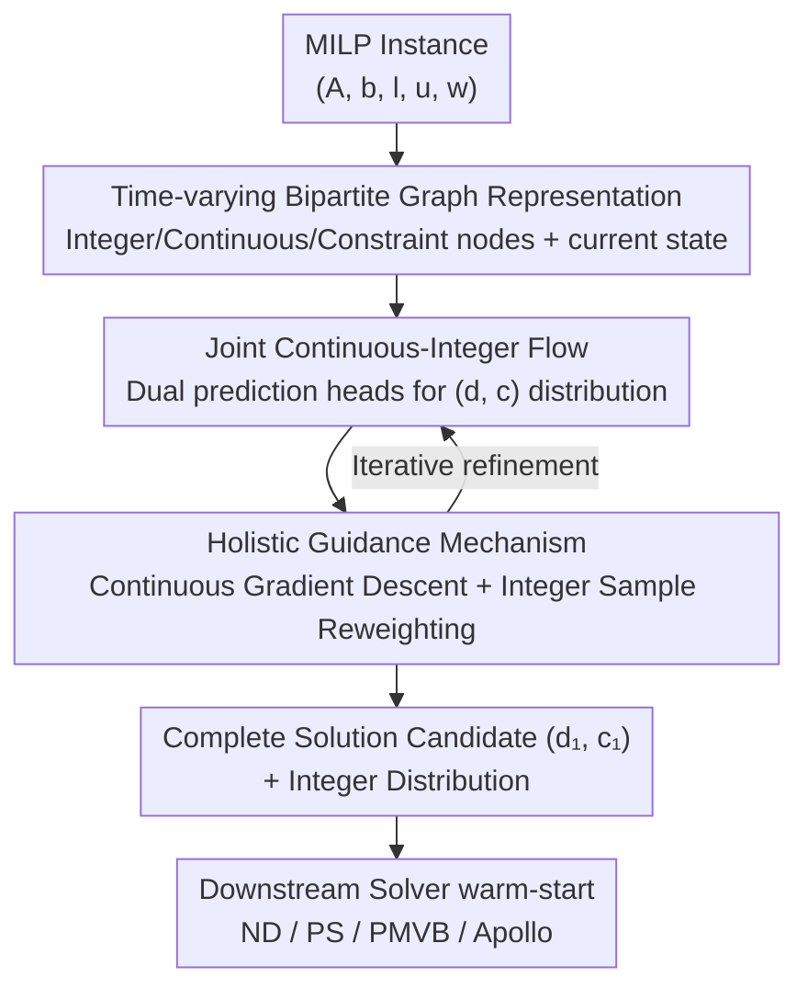

# FMIP: Joint Continuous-Integer Flow for Mixed-Integer Linear Programming

**Conference**: ICLR 2026  
**OpenReview**: [https://openreview.net/forum?id=kyvW6S0u3z](https://openreview.net/forum?id=kyvW6S0u3z)  
**Code**: https://github.com/Lhongpei/FMIP  
**Area**: Optimization / Generative Models / Flow Matching  
**Keywords**: Mixed-Integer Linear Programming, Flow Matching, Joint Distribution Modeling, Guided Sampling, Learned Heuristics

## TL;DR
Addressing the limitation that existing generative MILP heuristics only model integer variables and ignore integer-continuous coupling, FMIP utilizes flow matching to jointly model the solution distribution on the "integer + continuous" mixed solution space. Utilizing this complete solution candidate, it designs a holistic guidance mechanism to push the generation trajectory toward "better and more feasible" solutions, reducing the primal gap by an average of 41.34% across 8 standard benchmarks.

## Background & Motivation

**Background**: Mixed-Integer Linear Programming (MILP) is a fundamental tool for decision-making problems involving both discrete choices and continuous quantities. However, it is NP-hard, and exact solvers (such as Gurobi or branch-and-bound) rely heavily on heuristics to find high-quality solutions within a limited time. A promising recent direction is using deep learning to predict heuristic solutions for warm-starting downstream solvers. In particular, generative methods like diffusion models and flow matching reformulate the difficult "one-step prediction of a complete solution" into a process of "iterative refinement starting from noise," making them better at navigating complex constraint spaces.

**Limitations of Prior Work**: Existing generative methods, represented by DIFUSCO and IP-Guided-Diff, have a fatal structural flaw: they only model the distribution of **integer variables**. However, a MILP solution $x=(x_I, x_C)$ contains both an integer part $x_I$ and a continuous part $x_C$, and both the objective function $w^\top x$ and the constraints $Ax\le b$ depend on both components. Modeling only integer variables treats continuous variables as an "afterthought" appendage.

**Key Challenge**: The strong coupling between integer and continuous variables is a fundamental aspect of the MILP structure. Modeling only half of the information creates an **information bottleneck**. On one hand, it fails to express the "one-to-many" essence of MILP solutions (multiple optimal solutions), naturally limiting single-point prediction. More critically, any guidance mechanism needs the complete $x=(x_I,x_C)$ to calculate objective values and constraint violations. Without continuous variables, the guidance itself is incomplete and cannot provide instance-level optimization feedback.

**Goal**: To upgrade generative MILP heuristics from "modeling only integers" to "jointly modeling integer + continuous," and to enable the guidance mechanism to utilize complete, instance-specific objective and constraint information.

**Key Insight**: The authors point out that the transition from Pure Integer Programming (ILP) to MILP's joint modeling is a critical gap ignored by previous work, rather than a trivial extension of adding continuous variables. Filling this gap unlocks two things: a shift from single-point prediction to distribution modeling, and the utilization of instance-level optimization information for guidance.

**Core Idea**: Use flow matching to **jointly** learn the solution distribution on the mixed space of integer and continuous variables, and then use the generated complete solution candidates to drive a holistic guidance mechanism that continuously pushes the trajectory toward directions with "lower objectives and better feasibility" during sampling.

## Method

### Overall Architecture
FMIP models the task of "finding a high-quality solution for a MILP instance" as a flow matching generation process on a mixed solution space. The input is a MILP instance $M=(A,b,l,u,w)$, initially represented as a bipartite graph **distinguishing between integer and continuous variable nodes + constraint nodes**. The output is a complete solution candidate $(d_1, c_1)$ (integer + continuous) and a probability distribution over integer variables, used for warm-starting downstream solvers.

The core mechanism: Starting from pure noise $G_0$, it simulates an ODE along time $t\in[0,1]$ to gradually evolve the noise graph into a high-quality solution distribution $p_1(G_1)$. The model uses two prediction heads on a shared graph backbone—a continuous head to regress the denoised continuous values $\hat c_1(G_t)$ and an integer head to output the categorical distribution of integer solutions $\hat p(d_1\mid G_t)$—providing a **complete** solution candidate at each step. Because complete candidates are available at every step, the authors can insert holistic guidance during sampling: gradient descent for continuous variables and sampling-reweighting for integer variables, pulling the trajectory toward better and more feasible regions. The framework is backbone-agnostic and solver-agnostic.

### Key Designs

**1. Time-varying Graph Representation: Dynamic state in a static structure**

The sparse structure of the MILP instance (which variable appears in which constraint) is encoded using a bipartite graph $G=(V_I,V_C,V_{con},E)$. A key step in FMIP is **explicitly distinguishing between integer variable nodes $V_I$ and continuous variable nodes $V_C$**, making them different types of nodes processed with different parameters (a feature of the Tri-GCN backbone).

Furthermore, it injects the dynamic state of the generation process into the graph: the solution graph $G_t=(G, d_t, c_t)$ is defined at time $t$, where $d_t, c_t$ are the current values of integer and continuous variables used as additional node features. Thus, the graph carries both the static topology of the problem and the dynamic information of the current trajectory, enabling denoising and guidance to be based on the full context.

**2. Joint Continuous-Integer Flow: Modeling distributions in mixed solution space**

Addressing the information bottleneck of "integer-only modeling," FMIP constructs a probability path $p_{t\mid 1}(G_t\mid G_1)$ on the mixed $(d,c)$ space, transforming the simple noise distribution $p_0$ into the high-quality solution distribution $p_1$. Since flow matching naturally handles both continuous and discrete data, separate conditional paths are used: continuous variables use a Gaussian prior and interpolation path $c_t\mid c_1\sim\mathcal N(t c_1, (1-t)^2 I)$, corresponding to the closed-form target vector field $v_t(c_t\mid c_1)=\frac{c_1-c_t}{1-t}$; integer variables use a categorical uniform prior and a target rate matrix $R_{t\mid 1}$ (see Eq. 2 in the paper).

The model predicts the target solution $(d_1,c_1)$ from the noisy state $G_t$ using a shared backbone and two heads, minimizing a joint loss during training:

$$\mathcal L(\theta)=\mathbb E_{t,G_1}\left[\frac{\|\hat c_1(G_t)-c_1\|_2^2}{1-t}-\omega\log\hat p(d_1\mid G_t)\right]$$

This combines regression loss for continuous variables and cross-entropy loss for integer variables, with $\omega$ balancing the terms. During inference, it simulates the ODE from $t=0$ to $t=1$, using the predicted $\hat c_1$ and $\hat p(d_1\mid G_t)$ to estimate the vector field and rate matrix for state updates, with a cosine schedule allocating more steps to the low-noise region near $t=1$.

**3. Holistic Guidance Mechanism: Pushing trajectories toward optimality and feasibility**

Since joint modeling provides a complete solution candidate $(\hat d, \hat c)$ at any step $t$, FMIP can derive instance-level guidance directly from the MILP formulation—something integer-only predecessors cannot do. A function $f(d,c)$ is defined to combine objective minimization and constraint violation minimization:

$$f(d,c)=w^\top x+\gamma\sum_{i=1}^{m}\left[\max(0, A_{i,*}x-b_i)\right]^2$$

where $\gamma$ balances the objective and feasibility terms. Guidance is applied to both variable types: **continuous variables use gradient-based guidance**, performing gradient descent on $f$ with respect to predicted continuous values and projecting back to bounds via $\text{Project}_{l,u}(\cdot)$, i.e., $c_{t+\Delta t}\leftarrow\text{Project}_{l,u}(c_t-\rho_t\nabla_{c_t}f)$; **integer variables use sampling-reweighting**, sampling a batch of $B$ candidates from the current distribution and reweighting the rate matrix $\hat R$ based on their $f$ values (with temperature $\psi$) to push the distribution toward better values.

Additionally, an **Adaptive Balancing** mechanism is proposed: if the objective term dominates, $\gamma$ is increased to strengthen feasibility, and vice versa ($\gamma\leftarrow\gamma\times\alpha$ or $\gamma\leftarrow\gamma/\alpha$), stabilizing generation over long trajectories.

### Loss & Training
The training objective is the joint loss $\mathcal L(\theta)$ mentioned above: continuous regression loss (weighted by $\frac{1}{1-t}$) + integer cross-entropy, with $t\sim U(0,1)$. Inference uses cosine time discretization and holistic guidance. The method is plug-and-play for different backbones and solvers.

## Key Experimental Results

### Main Results
Evaluated on 8 standard MILP benchmarks (CA / GIS / MIS / FCMNF / SC / LB / IP / MIPLIB) with 4 downstream solvers (ND/PS/PMVB/Apollo) using the Tri-GCN backbone. The primary metric is the primal gap (lower is better). Compared to the strongest ML baseline, FMIP achieves an **average improvement of 41.34%**. The advantages are particularly significant on harder benchmarks like LB and IP.

| Benchmark (Solver ND/400s) | Metric GAP↓ | FMIP | Best Baseline | Rel. Imprv. |
|--------|------|------|----------|------|
| MIS | GAP | **0.40** | 9.70 | 95.88% |
| SC | GAP | **0.10** | 0.25 | 60.00% |
| LB | GAP | **0.40** | 6.44 | 93.79% |
| IP | GAP | **0.25** | 0.88 | 71.59% |
| MIPLIB | Rel.GAP | **5.42%** | 5.85% | 0.43% |

Results are consistently superior under other solvers: e.g., PS+IP reduces the GAP from 1.47 to **0.18** (Gain: 74.86%), and Apollo+IP reaches a GAP of **0.00** (100% gain).

### Ablation Study
Ablation on four variants using the IP dataset:

| Configuration | ND GAP↓ | PS GAP↓ | PMVB GAP↓ | Apollo GAP↓ | Description |
|------|---------|---------|-----------|-------------|------|
| Full FMIP | **0.25** | **0.18** | **0.67** | **0.00** | Full model |
| w/o Feasibility Guidance | 1.01 | 0.93 | 1.73 | 1.23 | No constraint guidance |
| w/o Objective Guidance | 0.91 | 1.02 | 8.58 | 0.79 | No objective guidance |
| w/o Guidance | 0.84 | 0.24 | 0.71 | 0.37 | No guidance mechanism |
| w/o Continuous | 0.69 | 0.54 | 1.21 | 0.71 | Back to integer-only |

### Key Findings
- **Joint modeling is the foundation; guidance is the amplifier**: The `w/o Continuous` version is significantly worse than the full model and structurally incapable of using holistic guidance, proving that capturing integer-continuous coupling is essential.
- **Objective and feasibility guidance are both indispensable**: Removing either guidance term degrades the GAP, particularly objective guidance for the PMVB solver.
- **Sampling steps have a "sweet spot"**: Too few steps result in insufficient refinement, while too many can push the distribution to be too sharp, losing diversity. Adaptive balancing ($\alpha=2.0$) helps stabilize long-trajectory generation.
- **Minimal inference overhead**: FMIP inference time is in the same magnitude as DIFUSCO and usually represents less than 1% of the total solver time.

## Highlights & Insights
- **"Modeling only half" is the real pain point**: ILP to MILP appears trivial but hides the gap of "joint modeling." Modeling only integers makes guidance inaccurate.
- **Joint modeling and guidance are a causal chain**: Because joint modeling produces complete candidates $(\hat d, \hat c)$, it "unlocks" holistic guidance using the original MILP formula.
- **Hybrid guidance paradigm**: The divide-and-conquer approach (gradient descent for continuous, reweighting for discrete) is a reusable paradigm for other generative combinatorial optimization tasks.
- **Plug-and-play engineering value**: Validated across various backbones and solvers, making it a universal enhancement layer.

## Limitations & Future Work
- Graph representation could better capture task-specific features; a downstream solver specifically tailored for FMIP is currently lacking.
- Focused on **bounded integer variables** (unbounded variables require bit-wise prediction or other extensions).
- Several hyperparameters ($\gamma$, $\rho_t$, $\psi$, steps) require tuning; the robustness of adaptive balancing across diverse datasets needs further verification.
- The non-monotonic relationship between sampling steps and solution quality requires finding the "sweet spot" for different datasets.

## Related Work & Insights
- **vs DIFUSCO / IP-Guided-Diff**: These are diffusion/guidance frameworks for integers (ILP). FMIP incorporates continuous variables to enable complete feedback using instance-level objectives and constraints.
- **vs SL (Supervised Learning)**: SL uses one-step GNN prediction; FMIP uses multi-step generative refinement, which is better at navigating complex constraint spaces.
- **vs Branch-and-Bound component learning**: That line modifies internal solver strategies; FMIP belongs to "predicting high-quality heuristic solutions for warm-start," which is decoupled from the solver.

## Rating
- Novelty: ⭐⭐⭐⭐⭐ First generative framework for joint integer-continuous modeling in MILP.
- Experimental Thoroughness: ⭐⭐⭐⭐⭐ 8 benchmarks x 4 solvers x 4 backbones plus ablation.
- Writing Quality: ⭐⭐⭐⭐ Clear motivation and methodology; some guidance formulas require careful reading.
- Value: ⭐⭐⭐⭐⭐ Universal, plug-and-play, minimal overhead, significant primal gap reduction.

<!-- RELATED:START -->

<!-- RELATED:END -->

## Related Papers

- [\[ICLR 2026\] Constraint Matters: Multi-Modal Representation for Reducing Mixed-Integer Linear programming](constraint_matters_multi-modal_representation_for_reducing_mixed-integer_linear_.md)
- [\[ICML 2026\] Provably Data-Driven Lagrangian Relaxation for Mixed Integer Linear Programming](../../ICML2026/optimization/provably_data-driven_lagrangian_relaxation_for_mixed_integer_linear_programming.md)
- [\[ICML 2025\] Integer Programming for Generalized Causal Bootstrap Designs](../../ICML2025/optimization/integer_programming_for_generalized_causal_bootstrap_designs.md)
- [\[ICLR 2026\] High-dimensional Mean-Field Games by Particle-based Flow Matching](high-dimensional_mean-field_games_by_particle-based_flow_matching.md)
- [\[ICLR 2026\] Never Saddle for Reparameterized Steepest Descent as Mirror Flow](never_saddle_for_reparameterized_steepest_descent_as_mirror_flow.md)

<!-- RELATED:END -->
