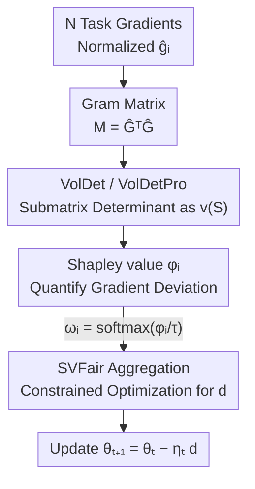

# From Gradient Volume to Shapley Fairness: Towards Fair Multi-Task Learning

**Conference**: ICLR 2026  
**OpenReview**: [https://openreview.net/forum?id=2PdLKGdtqW](https://openreview.net/forum?id=2PdLKGdtqW)  
**Code**: See supplementary material  
**Area**: Optimization / Multi-Task Learning  
**Keywords**: Multi-Task Learning, Gradient Conflict, Shapley Value, Fair Optimization, Gram Matrix

## TL;DR
Addressing the unfairness issue in multi-task learning where gradient conflicts cause "strong tasks to dominate update directions and weak tasks to be repeatedly sacrificed," this paper proposes SVFair. It uses the volume of the parallelepiped spanned by normalized gradients (Gram determinant) as the utility function for a Shapley cooperative game. This allows for calculating the degree of task gradient deviation from the whole in a single forward pass, redistributing update weights accordingly to achieve superior MR and $\Delta m\%$ across supervised and reinforcement learning benchmarks.

## Background & Motivation
**Background**: Multi-task learning (MTL) enables a single model to learn multiple tasks simultaneously, gaining efficiency and generalization benefits from shared representations. Prevailing optimization strategies are categorized into two types: loss-based (adjusting task weights at the loss level, e.g., UW, DWA) and gradient-based (directly manipulating task gradients, e.g., MGDA, PCGrad, CAGrad, Nash-MTL, FairGrad, PIVRG).

**Limitations of Prior Work**: Sharing a common set of parameters inevitably couples the optimization dynamics of all tasks. Gradients from different objectives conflict, leading some tasks to persistently dominate the update direction while others are suppressed—a phenomenon termed "task-level optimization unfairness." This not only degrades the performance of the worst-performing tasks but also compromises the reliability of MTL in safety-critical scenarios.

**Key Challenge**: Most existing methods focus solely on final performance without explicitly quantifying "how much an individual task gradient deviates from the collective gradient." Methods attempting to measure conflict (cosine similarity, inner product) only perform **pairwise** analysis and fail to capture the global conflict structure of the entire task set. Furthermore, they cannot provide a coalitional perspective on "how a **subset** of tasks interacts with others"—the level at which fairness should ideally be defined. As the number of tasks increases (e.g., 40 tasks in CelebA), pairwise metrics suffer from scalability and efficiency issues.

**Goal**: Design a framework that geometrically characterizes gradient conflict for any task **coalition** and maps this coalitional utility to a principled fair distribution rule for gradient updates.

**Key Insight**: The authors map "gradient conflict" and "fair distribution" to two established tools: the geometric volume of a parallelepiped (to measure the divergence of a set of vectors) and the Shapley value from game theory (to quantify the marginal contribution of each participant to the total utility). The key insight is using a volume metric that **depends only on gradient geometry and is independent of training outcomes** as the Shapley utility function, thereby bypassing the exponential cost of "retraining the model for every subset."

**Core Idea**: Use the Gram determinant volume as the Shapley utility function to quantify the deviation of each task gradient from the whole, then rebalance the update direction using the resulting Shapley weights to move toward a fair Pareto improvement.

## Method

### Overall Architecture
SVFair is a gradient aggregation framework compatible with any gradient-based MTL optimizer. In each training step, it samples gradients for all tasks, normalizes them, and constructs the Gram matrix $M = \hat{G}^\top \hat{G}$. For any task subset $S$, the determinant of the corresponding submatrix $M_S$, denoted by $\det(M_S)$, serves as the utility $v(S)$ for the Shapley cooperative game. This step is pivotal, as it compresses the "conflict calculation" from "model retraining" into "extracting a submatrix and calculating a determinant." Next, the Shapley value $\phi_i$ (measuring the deviation of task gradient $i$ from the whole) is calculated for each task, and the final weights $\omega_i$ are obtained via softmax. Finally, $\omega_i$ is incorporated into a constrained optimization problem to solve for the aggregated direction $d$, updating parameters as $\theta_{t+1} = \theta_t - \eta_t d$.

The entire pipeline requires only **one** gradient sampling and Gram matrix construction; $v(S)$ for all subsets is obtained by simple indexing, eliminating the need for per-subset retraining.

### Key Designs

**1. VolDet: Scaling "Pairwise Conflict" to "Coalitional Conflict" via Parallelepiped Volume**

Pairwise cosine/inner products only observe bipartite relationships, ignoring the cooperative and antagonistic structures of the entire task set, and they become computationally expensive as task counts grow. The authors adopt a geometric quantity: the $N$ normalized gradients $\hat{g}_i = g_i / \|g_i\|$ span a parallelepiped whose squared volume equals the determinant of the Gram matrix—$\mathrm{Vol}^2(\hat{g}_1, \dots, \hat{g}_N) = \det(M)$. The intuition is clear: the more aligned the gradients, the more the volume collapses toward 0; the more divergent (conflicting), the larger the volume. Thus, for any subset $S$, the determinant of the submatrix $M_S$ is used as the utility:

$$v(S) := \mathrm{Vol}^2(S) = \det(M_S).$$

The elegance of this approach lies in its natural satisfaction of the set function form required by Shapley, and its **dependence solely on gradient geometry, independent of training results or loss values**. This is the fundamental reason it reduces the Shapley utility calculation from a model-retraining complexity of $O(C \cdot 2^N)$ to a single forward pass.

**2. VolDetPro: Addressing the "Sign Blindness" of Pure Volume**

Pure volume is sign-agnostic: since $\det(M_S) = \det(\hat{G}_S^\top \hat{G}_S) = \det(\hat{G}_S)^2$, it is invariant to any column flip $\hat{g}_i \to -\hat{g}_i$. Consequently, two sets of gradients—one with obtuse pairwise angles (stronger antagonism) and another without—could yield the same volume if their orthogonal components are identical. VolDetPro addresses this by adding a lightweight penalty specifically for **negative similarity pairs** while maintaining efficiency:

$$v(S) = \det(M_S) + \frac{\sqrt{|I(S)|} + |S|}{|S|} \Big| \sum_{(i,j) \in I(S)} (M_S)_{ij} \Big|,$$

where $I(S)$ is the set of indices for negative similarity pairs (antagonistic pairs) in the strict upper triangle of $M_S$. The summation $\sum (M_S)_{ij}$ accumulates the magnitude of negative similarity (conflict intensity), while $\sqrt{|I(S)|}$ encodes the "number of antagonistic pairs" (conflict coverage) with sublinear growth to prevent the penalty from exploding as $|S|$ increases. When no antagonistic pairs exist ($I(S) = \varnothing$), it reduces to VolDet; otherwise, it increases smoothly with the number and magnitude of antagonistic pairs.

**3. SVFair: Integrating Shapley Values into Constrained Gradient Aggregation**

With $v(S)$, the classic Shapley formula (Eq. 2) yields $\phi_i$ for each task, measuring the degree to which gradient $g_i$ deviates from the collective $G$. A larger $\phi_i$ indicates a more "mismatched" task that deserves higher influence. This is converted to weights $\omega_i = \exp(\phi_i/\tau) / \sum_j \exp(\phi_j/\tau)$ and solved via a minimization problem for the aggregation direction:

$$\arg\min_{d} \; \frac{1}{N} \sum_{i=1}^{N} \frac{\omega_i}{g_i^\top d}, \quad \text{s.t.} \; g_i^\top d > 0, \; \forall i.$$

The constraint $g_i^\top d > 0$ ensures that the loss for every task decreases (first-order Taylor approximation). By constraining $d$ to a sphere of radius $\epsilon$ and using KKT conditions, the solution simplifies to $\alpha_i = \omega_i / (g_i^\top d)^2$, satisfying $(G^\top G \alpha)^2 = \omega / \alpha$ (element-wise), with $d = \sum_i \alpha_i g_i$. Theoretically (Theorem 1), this process converges to a Pareto stationary point. Unlike FairGrad/PIVRG, which use performance drop as weights, SVFair injects a **geometrically defined, coalitional, and single-pass computable** fairness signal.

### Loss & Training
Algorithm 1 proceeds step-by-step: calculate normalized gradient matrix → construct Gram matrix → use VolDet/VolDetPro as utility to compute Shapley values → solve Eq. 7 for weights $\alpha_t$ → aggregate $d_t = G(\theta_t)\alpha_t$ → update parameters. For large task sets (e.g., CelebA 40 tasks), Monte Carlo subset sampling ($K=1000$) is used to estimate Shapley values. In RL scenarios, SGD (lr=0.1, momentum=0.5, 20 epochs) is used to solve $(G^\top G \alpha)^2 = \omega / \alpha$. The temperature $\tau$ controls weight sharpness: larger $\tau$ is recommended when conflicts are sharp, while smaller $\tau$ suits more balanced tasks.

## Key Experimental Results

### Main Results
The method was compared against 13 MTL baselines in supervised learning (NYU-v2, Cityscapes, Office-31, CelebA) and reinforcement learning (MT10). Metrics used: MR (average rank, lower is better) and $\Delta m\%$ (average performance drop relative to Single-Task Learning (STL) baseline, lower is better, negative values indicate improvement over STL).

| Dataset | Metric | SVFair(VolDet) | SVFair(VolDetPro) | Prev. SOTA (PIVRG) |
|--------|------|------|------|------|
| NYU-v2 (3 tasks) | MR ↓ / $\Delta m\%$ ↓ | **1.44** / **-8.81** | 2.22 / -8.29 | 3.56 / -6.50 |
| Cityscapes (2 tasks)| $\Delta m\%$ ↓ | -2.08| **-2.40** | -0.45 |
| Office-31 (3 tasks) | MR ↓ / $\Delta m\%$ ↓ | 1.67 / -1.53 | **1.33** / **-1.62** | 6.17 / 0.68 |
| CelebA (40 tasks) | $\Delta m\%$ ↓ | **-0.63** | 0.11 | 0.37 |
| MT10 (RL) | Success rate ↑ | **0.97** | **0.97** | 0.96 |

On NYU-v2, SVFair(VolDet) achieved a near-perfect average rank (1.44) and the best $\Delta m\% = -8.81$. Notably, while previous methods improved Segmentation/Depth but failed to move Surface Normal (sometimes performing worse than STL), SVFair consistently outperformed STL across all metrics. On Cityscapes, it biased towards the harder Depth task, effectively mitigating gradient conflicts.

### Ablation Study

| Configuration | Key Findings |
|------|---------|
| VolDet vs VolDetPro | Comparable performance; VolDetPro is slightly better on Cityscapes/Office-31, while VolDet leads on NYU-v2/CelebA. |
| Temperature $\tau$ sweep | Optimal $\tau$ is dataset-dependent; larger $\tau$ (5.0) is better for Cityscapes/CelebA, while Office-31 benefits from small $\tau$ (0.5). |
| Epoch runtime | Computational overhead is acceptable; on CelebA (K=1k), SVFair takes 870s vs 810s for FairGrad. |
| Integration with RLW/DWA/UW | General improvement; using $\omega_i$ as loss weights ($L' = \omega \odot L$) in loss-based methods consistently improves $\Delta m\%$. |

### Key Findings
- **Geometric utility is the core contribution**: Replacing the Shapley utility from "performance drop $\Delta m$" (requiring $O(C \cdot 2^N)$ retraining) with "Gram determinant volume" is key to making Shapley values feasible for MTL.
- **VolDetPro's value in high-antagonism scenarios**: Pure volume cannot distinguish "obtuse angle" antagonistic configurations. The sign-aware penalty provides an advantage primarily in these cases.
- **Plug-and-play fairness module**: Shapley coalitional conflict weights can be seamlessly injected into existing methods like RLW/DWA/UW, showing that the "quantified gradient deviation" signal is universally beneficial.
- **Efficiency cost is low**: Runtime per epoch is only a few percentage points higher than FairGrad; Monte Carlo sampling (K=1000) handles the enumeration cost for large task sets.

## Highlights & Insights
- **Geometric × Game-Theoretic Dual Perspective**: Mapping "gradient conflict" to parallelepiped volume and "fair distribution" to Shapley values assigns clear roles to two established tools. The Gram determinant serves as the bridge that makes Shapley utility single-pass computable.
- **Optimization via the Identity $\mathrm{Volume}^2 = \det(M)$**: This reduces the "conflict of any subset" to "calculating the determinant of a Gram submatrix," eliminating exponential retraining—a technique transferable to any coalitional game setting requiring subset utility.
- **Identifying and Patching the Sign-Blindness**: Correctly identifying that pure volume is invariant to column flips (ignoring antagonistic directions) and using a penalty activated only on negative similarities is a clean example of a "minimal change to fix a blind spot."

## Limitations & Future Work
- **Dependency on Linear Independence Assumptions**: Convergence theorems rely on assumptions such as "task gradients are linearly independent at non-Pareto stationary points," which may not always hold in large-scale realistic models.
- **Per-Dataset $\tau$ Tuning**: Experiments show that the optimal temperature $\tau$ varies significantly (from 0.5 to 5.0), lacking an adaptive selection mechanism and requiring hyperparameter sweeps.
- **Approximation via Sampling for Large Tasks**: In scenarios like CelebA, Monte Carlo estimation ($K=1000$) is used. The impact of sampling error on final fairness and the relationship between $K$ and task count haven't been systematically characterized.
- **Uncertainty in Metric Selection**: It remains unclear when to prefer VolDet over VolDetPro, as their relative performance varies across datasets.

## Related Work & Insights
- **vs. FairGrad / PIVRG**: These also inject high-order fairness information but rely on "performance drop $\Delta m$" as utility, necessitating expensive multiple evaluations. SVFair uses geometric volume, making the high-order signal single-pass computable and decoupled from training outcomes, significantly reducing complexity.
- **vs. PCGrad / CAGrad / Cosine-based**: These only perform pairwise conflict analysis (projection/similarity) and miss the global structure of the task set. SVFair directly captures coalitional conflict via Gram submatrix determinants.
- **vs. MGDA / Nash-MTL**: While they aim for Pareto stationary points, weak tasks often stagnate once their gradients shrink, leading to poor Pareto front coverage. SVFair smoothly traverses the front and compensates weak tasks more equitably.
- **vs. Previous Shapley × MTL Attempts**: Prior work explored Shapley values in MTL but was limited by exponential complexity. This paper establishes a computationally tractable connection between Shapley values and MTL optimization via geometric utility.

## Rating
- Novelty: ⭐⭐⭐⭐⭐ Deeply integrates Shapley values into MTL gradient optimization and solves the computability issue via Gram volume.
- Experimental Thoroughness: ⭐⭐⭐⭐ Covers 5 benchmarks across supervised and RL, though the selection between metrics and $\tau$ tuning needs more systematic analysis.
- Writing Quality: ⭐⭐⭐⭐ Clear geometric intuition (Fig. 1) and motivation; notations are dense but derivations are self-consistent.
- Value: ⭐⭐⭐⭐⭐ Provides a "geometric, coalitional, and single-pass computable" fairness signal that can enhance existing methods as a plug-and-play module.

<!-- RELATED:START -->

## Related Papers

- [\[ICLR 2026\] Scaling Multi-Task Bayesian Optimization with Large Language Models](scaling_multi-task_bayesian_optimization_with_large_language_models.md)
- [\[ICLR 2026\] Gradient-Sign Masking for Task Vector Transport Across Pre-Trained Models](gradient-sign_masking_for_task_vector_transport_across_pre-trained_models.md)
- [\[ICLR 2026\] Riemannian Federated Learning via Averaging Gradient Streams](riemannian_federated_learning_via_averaging_gradient_streams.md)
- [\[ICLR 2026\] On the Convergence Behavior of Preconditioned Gradient Descent Toward the Rich Learning Regime](on_the_convergence_behavior_of_preconditioned_gradient_descent_toward_the_rich_l.md)
- [\[ICLR 2026\] Binomial Gradient-Based Meta-Learning for Enhanced Meta-Gradient Estimation](binomial_gradient-based_meta-learning_for_enhanced_meta-gradient_estimation.md)

<!-- RELATED:END -->
