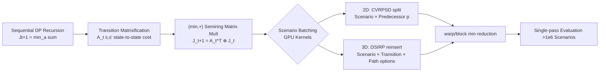

# From Sequential to Parallel: Reformulating Dynamic Programming as GPU Kernels for Large-Scale Stochastic Combinatorial Optimization

**Conference**: ICLR 2026  
**OpenReview**: [https://openreview.net/forum?id=T9FDmsmoBj](https://openreview.net/forum?id=T9FDmsmoBj)  
**Code**: [https://github.com/Jingyi-poly/2-stage-IRP-GPU](https://github.com/Jingyi-poly/2-stage-IRP-GPU)  
**Area**: Stochastic Combinatorial Optimization / GPU Parallelization / Dynamic Programming  
**Keywords**: Stochastic Programming, Sample Average Approximation (SAA), Dynamic Programming, GPU Kernels, min-plus Semiring, Vehicle Routing, Inventory Routing  

## TL;DR
The bottleneck of "sequentially solving second-stage integer subproblems per scenario" in stochastic combinatorial optimization is reformulated as matrix-vector multiplication over the $(\min, +)$ semiring. By designing hardware-aware GPU kernels for scenario batching, Bellman updates for over $10^6$ scenarios are evaluated in parallel within a single GPU pass, achieving speedups of one to five orders of magnitude.

## Background & Motivation
**Background**: Scenario-based Stochastic Programming (SP) commonly employs Sample Average Approximation (SAA), which draws $m$ scenarios and solves the second-stage (recourse) problem for each to calculate the average. Theoretically, the SAA solution converges to the true optimum at a rate of $O(1/\sqrt{m})$; more scenarios lead to lower bias and more robust decisions.

**Limitations of Prior Work**: When the second stage involves an NP-hard combinatorial structure (e.g., vehicle routing, inventory replenishment), exact integer solving for every scenario is extremely costly. To maintain computational feasibility, significant SP literature simplifies the second stage into linear or reduced models, sacrificing fidelity and degrading the quality of first-stage decisions. In real-world settings with complex demand distributions, hundreds or thousands of scenarios are insufficient.

**Key Challenge**: There is a conflict between requiring "high-fidelity integer recourse" (authentic but computationally heavy) and "large scenario sets" (statistically necessary but unaffordable). Existing GPU accelerations focus on continuous optimization, leaving a gap for discrete combinatorial scenario-based problems.

**Goal**: To make high-fidelity integer second-stage models computationally feasible for $10^6$ scenarios without relying on surrogate learning models or structural relaxations.

**Core Idea**: A key observation is that once first-stage decisions are fixed, the second-stage evaluations for each scenario are **independent**, and many rely on Dynamic Programming (DP). By **reformulating sequential DP as $(\min, +)$ matrix operations**, the dimensions of "scenario $\times$ DP transition $\times$ path/action options" are exposed to the GPU. Warp/block-level reductions with numerically safe masks are used for batch Bellman updates.

## Method

### Overall Architecture
The paper provides a general recipe: first, rewrite the forward recursion of finite-horizon DP as a "state-to-state" transition cost matrix, transforming each stage update into a matrix-vector product under the $(\min, +)$ semiring. These matrix multiplications are then mapped onto GPU threads across dimensions like "scenario" and "transition," using on-chip reductions to find the Bellman minimum for each scenario. The framework is instantiated for two representative problems: the split operator in Capacitated Vehicle Routing Problem with Stochastic Demands (CVRPSD) (2D parallelism) and inventory reinsertion DP in Dynamic Stochastic Inventory Routing Problem (DSIRP) (3D parallelism).

### Key Designs

**1. Transition Matrixification + $(\min, +)$ Semiring Reformulation: Turning sequential recursion into batchable matrix multiplication.**  
The original finite-horizon DP recursion is $J^\omega_{t+1}(s')=\min_{s,a:\,g_t(s,a)=s'}\{J^\omega_t(s)+c^\omega_t(s,a)\}$. The existence of action $a$ makes it inherently sequential and irregularly shaped. This paper folds actions into "state-to-state" transition costs $A^\omega_t(s,s')=\inf_{a:g_t(s,a)=s'} c^\omega_t(s,a)$ (infeasible transitions are $+\infty$). The recursion becomes $J^\omega_{t+1}(s')=\min_s\{J^\omega_t(s)+A^\omega_t(s,s')\}$. After indexing the state space, this is exactly a matrix-vector product $J^\omega_{t+1}=(A^\omega_t)^\top\otimes J^\omega_t$ over the $(\min, +)$ semiring, where $\otimes$ replaces standard multiplication with addition and summation with the min operator. The advantage is that infeasible transitions are unified via $+\infty$ masks, and variable-length state spaces are aligned into regular tensors via padding, allowing GPU tensor broadcasting and min-reduction to handle the entire batch of scenarios.

**2. 2D Parallelism of CVRPSD Split Operator: Scenario $\times$ Predecessor State.**  
Vehicle routing post-processing often requires splitting a "giant tour" $\sigma$ into capacity-feasible sub-tours. Define state $i$ as having served up to $\sigma_i$, with the action being selecting a split point $p < i$. The sub-tour cost $W^\omega(p,i)$ is feasible only if $\sum_{k=p+1}^{i} q^\omega_{\sigma_k}\le Q$. The update is a masked $(\min, +)$ reduction $J^\omega(i)=(A^\omega(\cdot,i))^\top\otimes J^\omega(0{:}i{-}1)$. For a fixed target state $i$, computation decomposes over the Cartesian product $\Omega\times\{p:p<i\}$. Each thread calculates one $(\omega,p)$ pair, loads $A^\omega(p,i)$ and the partial cost $J^\omega(p)$, and performs warp/block-level min-reduction over $p$ to obtain $J^\omega(i)$ for that scenario. Scenarios parallelize along columns, predecessors reduce within blocks, and state rows advance independently—forming 2D parallelism.

**3. 3D Parallelism of DSIRP Reinsertion DP: Scenario $\times$ Inventory Transition $\times$ Path Options.**  
In inventory routing, a customer $i$ at risk of stockout requires local reinsertion into the replenishment plan, balancing "early delivery (high holding cost)" vs "late delivery (high stockout probability)." Daily decisions involve whether to replenish and how much ($q^t_i\in\{0,\,U_i-I^{t-1}_i\}$). Stock evolves as $I^{t,\omega}_i=\max\{0,I^{t-1,\omega}_i+q^t_i-d^{t,\omega}_i\}$. When folding the action space into transition matrix $A^{t,\omega}_i(I,J)$, each entry may involve a min over a set of candidate paths $r\in\mathcal{R}$. Computation decomposes over the 3D Cartesian product $\Omega\times\{I\to J\}\times\mathcal{R}$. Threads calculate triplets $(\omega,I\to J,r)$, first performing a min-reduction over path options $r$, then a second-level reduction over predecessor states $I$ to obtain $J^{t+1}_i(J)$.

**4. Hardware-aware Bellman Reduction: Numerically Safe Masking + On-chip Reduction.**  
Kernels use warp/block-level reductions to keep Bellman minima on-chip, combined with coalesced memory access to increase arithmetic intensity. Infeasible transitions use $+\infty$ masks to ensure numerical safety without polluting the minimum. Memory studies show that realistic instances with $10^6$ scenarios fit into a standard 11GB GPU, confirming that memory is not the scaling bottleneck.

## Key Experimental Results

Hardware: AMD Ryzen 7 9700X (8 cores) CPU + NVIDIA RTX 2080Ti (11GB) GPU. Implementation in C++/CUDA. Baselines include single-threaded CPU, 8-threaded CPU, CPU matrix implementation, and GPU matrix implementation.

### Main Results: Speedup Ratios

| Task | Scenario Scale | GPU vs Single-thread CPU | GPU vs Multi-thread CPU | GPU vs CPU Matrix |
|------|----------------|--------------------------|-------------------------|-------------------|
| CVRPSD split | $10^6$ | ~65× (near peak) | ~15× | — |
| DSIRP reinsert | $2\times10^5$ | ~9.3×10⁴ (approx. 28370×–24744×) | ~5000–6900× | ~3.1–3.9× |

On CVRPSD, the GPU curve grows sub-linearly/linearly with scenario count, remaining at the second-level for $10^6$ scenarios. DSIRP achieves extreme speedups (4-5 orders of magnitude) due to 3D parallelism, high arithmetic intensity, and on-chip reductions.

### Decision Quality (SAA Convergence and Time Budget)

| Experiment | Conclusion |
|------------|------------|
| SAA Bias (DSIRP) | Small scenario counts systematically underestimate true expectation; stabilizes as count increases, matching consistency theory. |
| Convergence Rate | Estimated approximation converges at $O(1/\sqrt{m})$. Log plots show continuous improvement for large samples without early plateaus. |
| Fixed Scenario Count | Solving with 1/100/1000 scenarios and evaluating on $10^6$ out-of-sample shows that more scenarios lead to more robust, lower-cost solutions. |
| Fixed Time Budget | Within the same wall-clock time, GPU consistently nears the true optimum while CPU baselines stagnate or show marginal improvement. |

### Key Findings
- Large scenario sets are **statistically necessary** (reducing bias, ensuring consistency); this work proves they are **computationally feasible**.
- Computational leverage translates directly to decision quality: evaluating more scenarios/candidates within the same budget yields superior SAA solutions.
- Compared to extensive-form MILP (Gurobi) for CVRPSD and SOTA algorithms for DSIRP, this method remains solvable for larger sets and often finds better solutions.
- Huge gains in DSIRP stem from (i) 3D parallelism, (ii) high arithmetic intensity via coalesced access, and (iii) keeping minima on-chip via warp/block reductions.
- GPU matrix implementation still provides a stable ~3.1–3.9× gain over CPU matrix implementation, showing hardware-level parallelism is as vital as the algorithmic reformulation.

## Highlights & Insights
- **"Sequential DP $\to$ $(\min, +)$ Matrix Mult" is the breakthrough**: It transforms non-parallelizable recursion into batch tensor operations, with masking handling feasibility and variable states cleanly.
- **Clear hierarchical parallelism**: 2D vs 3D parallelism provides a transferable "recipe" for mapping problem dimensions to GPU threads.
- **Relating "Fast Calculation" to "Better Solutions"**: Beyond reporting speedup, the study uses SAA bias and fixed-time budget experiments to prove the computational advantage translates to decision quality.
- **Practicality**: Fitting $10^6$ scenarios into an 11GB consumer GPU demonstrates a low barrier to entry.

## Limitations & Future Work
- **Limited to two DP kernels**: Whether more general recourse structures (e.g., multi-commodity flow with complex constraints) can be similarly parallelized remains to be verified.
- **Dependence on regular $(\min, +)$ structure**: If transition costs themselves require expensive sub-optimization or if state spaces are extremely irregular, padding/masking may cause waste.
- **First-stage search**: This work accelerates the second-stage evaluation; the outer search strategy for the first stage is not deeply optimized here.
- Future work: Extending the recipe to multi-stage (>2 stages) stochastic DP on GPU, or integrating with differentiable optimization and learned warm-starts.

## Related Work & Insights
- **Stochastic Programming / SAA**: Building on foundations by Birge & Louveaux and Shapiro et al., this work breaks computational limits while maintaining theoretical consistency.
- **DP Classics**: Connects to Held–Karp (TSP), knapsack, and shortest path algorithms, specifically the split operator and resource-constrained shortest path pricing in VRP/IRP.
- **GPU Acceleration**: While previous efforts focused on continuous optimization (first-order/interior point), this fills the gap for discrete combinatorial scenario-based problems.
- **Insight**: The $(\min, +)$ semiring is a universal bridge between sequential DP and batch linear algebra on GPUs; any algorithm expressible as a semiring matrix product can leverage this parallelization.

## Rating
- **Novelty**: ⭐⭐⭐⭐ — Reformulating DP for GPU using semirings has precedence, but systematically applying it to stochastic combinatorial optimization and exposing 2D/3D parallelism is a solid, novel engineering-theoretical contribution.
- **Experimental Thoroughness**: ⭐⭐⭐⭐ — Covers two representative problems, compares with Gurobi/SOTA, and uses speedup + SAA convergence + budget-constrained evidence.
- **Writing Quality**: ⭐⭐⭐⭐ — Clear derivation, intuitive 2D/3D parallelism diagrams, and a coherent chain of motivation and verification.
- **Value**: ⭐⭐⭐⭐ — Making $10^6$ scenario high-fidelity recourse viable on consumer GPUs has direct practical value for logistics and operations research.

<!-- RELATED:START -->

## Related Papers

- [\[ICLR 2026\] FrontierCO: Real-World and Large-Scale Evaluation of Machine Learning Solvers for Combinatorial Optimization](frontierco_real-world_and_large-scale_evaluation_of_machine_learning_solvers_for.md)
- [\[ICLR 2026\] NeuCLIP: Efficient Large-Scale CLIP Training with Neural Normalizer Optimization](neuclip_efficient_large-scale_clip_training_with_neural_normalizer_optimization.md)
- [\[ICLR 2026\] Symmetry-Aware Bayesian Optimization via Max Kernels](symmetry-aware_bayesian_optimization_via_max_kernels.md)
- [\[ICLR 2026\] A Memory-Efficient Hierarchical Algorithm for Large-scale Optimal Transport Problems](a_memory-efficient_hierarchical_algorithm_for_large-scale_optimal_transport_prob.md)
- [\[ICML 2026\] Efficient Stochastic Optimisation via Sequential Monte Carlo](../../ICML2026/optimization/efficient_stochastic_optimisation_via_sequential_monte_carlo.md)

<!-- RELATED:END -->
