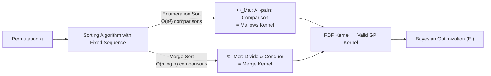

# From Sorting Algorithms to Scalable Kernels: Bayesian Optimization in High-Dimensional Permutation Spaces

**Conference**: ICLR 2026  
**OpenReview**: [https://openreview.net/forum?id=7QtKdabBP9](https://openreview.net/forum?id=7QtKdabBP9)  
**Code**: [https://github.com/XieZikai/MergeBO](https://github.com/XieZikai/MergeBO)  
**Area**: Bayesian Optimization / Permutation Space Optimization / Gaussian Process Kernel Design  
**Keywords**: Bayesian Optimization, Permutation Space, Mallows Kernel, Merge Sort, Gaussian Process, High-Dimensional  

## TL;DR
The paper reinterprets "comparison-based sorting algorithms" as feature generators for permutations. This perspective unifies the SOTA Mallows kernel as a special case of enumeration sort and derives the **Merge Kernel** with a length of only $\Theta(n\log n)$ using merge sort. It significantly outperforms Mallows kernels in high-dimensional permutation Bayesian Optimization due to its orders of magnitude smaller feature dimensionality.

## Background & Motivation
- **Background**: Bayesian Optimization (BO) utilizes Gaussian Processes (GP) as surrogate models and acquisition functions to approximate black-box optima with minimal evaluations. Extending BO to new search spaces is essentially equivalent to designing a suitable kernel function for those spaces.
- **Limitations of Prior Work**: Permutation spaces (e.g., TSP, quadratic assignment, prioritized experiments) are ubiquitous yet understudied. The current SOTA is the **Mallows kernel** used in BOPS-H, which maps permutations into feature vectors by exhaustively comparing all $\binom{n}{2}$ element pairs, resulting in $\Omega(n^2)$ complexity. While effective in low dimensions, it suffers from massive statistical redundancy ($2^{n^2}\gg n!$) and computational infeasibility as the dimension $n$ increases. General discrete BO methods (e.g., COMBO using graph encoding) often fail to capture specific structural constraints of permutations.
- **Key Challenge**: A permutation kernel must encode ordinal relationships **without information loss** while remaining **compact and computable** in high dimensions—whereas exhaustive $O(n^2)$ representations inherently violate the latter requirement.
- **Goal**: Propose a unified design framework for permutation kernels and instantiate an efficient kernel that reaches the information-theoretic lower bound for feature length, enabling BO to handle large-scale permutation problems (e.g., large-scale feature ordering, combinatorial NAS).
- **Key Insight**: **Any comparison-based sorting algorithm is defined by a fixed sequence of element comparisons; recording the binary results of these comparisons yields a permutation feature vector.** By selecting algorithms defined by comparison trees (such as merge sort), one can obtain fixed-length and compact representations, where the Mallows kernel corresponds exactly to "enumeration sort."

## Method

### Overall Architecture
The paper transforms the "permutation kernel design" problem into "selecting a comparison-based sorting algorithm as a feature generator." Given a permutation $\pi$, a sorting algorithm is executed while recording whether each comparison results in a swap, yielding a binary feature vector $\Phi(\pi)\in\{0,1\}^d$. An RBF kernel is then applied: $K(\pi,\pi')=K_{\text{RBF}}(\Phi(\pi),\Phi(\pi'))$. Since the RBF kernel is strictly positive definite and this property is preserved under deterministic mapping $\Phi$, the constructed kernel automatically satisfies Mercer's condition. The key constraint is that the sorting must execute a **fixed comparison sequence**. In this framework, the Mallows kernel (enumeration sort, $d=\binom{n}{2}$) is one endpoint, while merge sort provides an efficient alternative at $d=\Theta(n\log n)$.

### Key Designs

**1. Sorting as Features: Rewriting the Mallows Kernel as a Special Case.** The observation is that the Mallows kernel $K_{\text{Mal}}(\pi,\pi')=\exp(-l\,d(\pi,\pi'))$ (where $d$ is the Kendall-$\tau$ distance) can be equivalently rewritten as an RBF kernel applied to exhaustive pairwise comparison features $\Phi_{\text{Mal}}(\pi)\in\{0,1\}^{\binom{n}{2}}$. Under reparameterization $l=\tfrac{1}{2\ell^2}$, $K_{\text{Mal}}(\pi,\pi')=\exp\!\big(-\|\Phi_{\text{Mal}}(\pi)-\Phi_{\text{Mal}}(\pi')\|^2/2\ell^2\big)=K_{\text{RBF}}(\Phi_{\text{Mal}}(\pi),\Phi_{\text{Mal}}(\pi'))$. This implies that since Mallows equals "exhaustive pairwise comparison" + RBF, any comparison strategy can yield a valid kernel. Enumeration sort is simply the algorithm corresponding to this exhaustive strategy.

**2. Fixed Comparison Graph Constraint: Why Merge/Bitonic Sort are Required.** To ensure the coordinates of $\Phi(\pi)$ have consistent meanings and comparable distances, the sorting algorithm must execute the **same comparison sequence** for any input. This excludes adaptive algorithms like quicksort. The authors implement a **stabilized merge sort** that forces $L+R-1$ redundant comparisons in each merge step, ensuring every feature bit stably encodes the same local structural decision.

**3. Merge Kernel: Lossless Compact Encoding at $\Theta(n\log n)$.** The feature construction mirrors the recursion of merge sort: (1) Split the sequence; (2) Recursively generate features for the left and right halves $\Phi_{\text{Left}},\Phi_{\text{Right}}$; (3) Merge the sorted halves and record the binary results of comparisons in $\Phi_{\text{Merge}}$; finally, $\Phi_{\text{Mer}}=[\Phi_{\text{Left}},\Phi_{\text{Right}},\Phi_{\text{Merge}}]$. For $\pi=(1,4,3,2)$, the split yields $(1,4)$ and $(3,2)$. The left half generates $[0]$, the right generates $[1]$, and the final merge of $(1,4)$ and $(2,3)$ generates $[0,1,1,1]$, resulting in $\Phi_{\text{Mer}}=[0,1,0,1,1,1]$.

**4. Reaching Information-Theoretic Lower Bound at the Cost of Right-Invariance.** Since comparison-based sorting has a lower bound of $\Omega(n\log n)$ and lossless encoding of $n!$ permutations requires at least $\log_2(n!)=\Omega(n\log n)$ bits (Stirling's approximation), the Merge feature length hits this theoretical limit. However, there is a trade-off: traditional permutation distances satisfy **right-invariance** (distance is unchanged by a common right-multiplication of a permutation). Full right-invariance combined with lossless encoding can only be achieved by $O(n^2)$ exhaustive comparisons. The Merge kernel sacrifices partial right-invariance for efficiency, establishing a spectrum between Merge $\leftrightarrow$ Mallows where missing comparison bits can be added back to "buy" right-invariance at the cost of computational efficiency.

## Key Experimental Results

### Feature Length Comparison

| Problem | Dimension $n$ | Merge Feature Length | Mallows Feature Length |
|------|------|------|------|
| TSP | 15 | 45 | 105 |
| QAP | 15 | 45 | 105 |
| FP | 30 | 119 | 435 |
| CR | 30 | 119 | 435 |
| TTP | 280 | **2009** | **39060** |

The advantage grows with dimensionality: at $n=280$, the Merge feature is approximately 1/19 the length of Mallows.

### Main Results: Simple Final Regret (Lower is Better)

| Problem | Merge | Mallows | Random | TuRBO | Win/Tie/Loss |
|------|------|------|------|------|------|
| TSP$_{n=15}$ | 0.077±0.125 | **0.013±0.039** | 0.329 | 1.213 | 1/12/7 |
| QAP$_{n=15}$ | 14.9±5.5×10³ | **8.1±4.1×10³** | 18.1×10³ | 14.2×10³ | 1/3/16 |
| FP$_{n=30}$ | **24.0±9.7** | 30.1±12.8 | 35.7 | 20.5 | 10/4/6 |
| CR$_{n=30}$ | **6.1±2.2** | 6.1±3.0 | 52.2 | 33.9 | 9/3/8 |
| TTP1$_{n=280}$ | **23.0±11.3×10³** | 88.9×10³ | — | 54.8×10³ | 50/0/0 |
| TTP2$_{n=280}$ | **14.9±7.2×10⁴** | 56.5×10⁴ | — | 36.8×10⁴ | 50/0/0 |
| TTP3$_{n=280}$ | **8.0±3.2×10⁴** | 28.1×10⁴ | — | 19.1×10⁴ | 50/0/0 |

### Key Findings
- **Low-dimensional Parity**: On $n=15$ TSP/QAP, Mallows leads due to complete right-invariance. By $n=30$ in FP/CR, Merge catches up or surpasses, validating the central argument that its advantage emerges with higher dimensions.
- **High-dimensional Dominance**: On three $n=280$ TTP tasks, Merge beats Mallows in all 50 trials (50/0/0). Final regret is typically less than half that of Mallows and outperforms the general high-dimensional BO algorithm TuRBO.
- **Structural Integrity**: The "Random" baseline (randomly sampling Mallows features to match Merge's dimension) performs significantly worse. This demonstrates that Merge's gain stems from the **structured information** preserved by the sorting algorithm rather than simple dimensionality reduction.

## Highlights & Insights
- **Unified Concept**: The "Sorting Algorithm = Permutation Feature Generator" framework is elegant and explanatory, reclassifying the SOTA Mallows kernel as an extreme special case and opening a broad design space.
- **Theoretical Limit**: The $\Theta(n\log n)$ complexity of the Merge kernel matches both the lower bound of sorting comparisons and the information-theoretic lower bound for lossless encoding.
- **Honest Trade-off Narrative**: The paper does not hide Merge's sacrifice of right-invariance. Instead, it frames the relationship as a "feature selection" spectrum, providing a clear interface for future work.

## Limitations & Future Work
- **Low-dimension Weakness**: Mallows remains superior for small problems ($n\le15$) due to full right-invariance; Merge is explicitly intended for high-dimensional scenarios.
- **Quantifying Right-Invariance**: The benefit of incrementally adding comparison bits to recover right-invariance remains a qualitative concept. Quantifying the gain per additional comparison is left for future work.
- **Path Dependency**: The fixed comparison graph for merge sort depends on the splitting order, meaning features have a path dependency on the initial element arrangement.
- **Reproduction Discrepancies**: The authors note numerical differences from the original BOPS-H paper, attributed to implementation details (e.g., instance selection), but prioritize controlled comparisons within their unified framework.

## Related Work & Insights
- **Extended from BOPS-H / Mallows Kernel** (Deshwal et al., 2022): This work directly uses it as a baseline and conceptual foundation.
- **Comparison to General BO**: Contrast with COMBO (graph-based discrete BO) and TuRBO (continuous BO with relaxation) highlights the value of permutation-specific compact kernels.
- **Inspiration**: Reinterpreting the execution trajectory of a classic algorithm as a structured feature/embedding is a transferable strategy—any deterministic algorithm with a fixed execution path could potentially be adapted into a kernel for other combinatorial spaces like trees or graphs.

## Rating
- **Novelty**: ⭐⭐⭐⭐⭐ The unified view of "sorting as feature generation" is insightful and allows for the derivation of kernels hitting the information-theoretic lower bound.
- **Experimental Thoroughness**: ⭐⭐⭐⭐ Covers synthetic and real-world problems across diverse dimensions with rigorous statistical testing. 
- **Writing Quality**: ⭐⭐⭐⭐⭐ Clear logical flow from motivation to theory and trade-offs.
- **Value**: ⭐⭐⭐⭐ Enables high-dimensional permutation BO in scenarios previously considered computationally infeasible.

<!-- RELATED:START -->

## Related Papers

- [\[ICLR 2026\] Symmetry-Aware Bayesian Optimization via Max Kernels](symmetry-aware_bayesian_optimization_via_max_kernels.md)
- [\[ICLR 2026\] High-dimensional Mean-Field Games by Particle-based Flow Matching](high-dimensional_mean-field_games_by_particle-based_flow_matching.md)
- [\[ICLR 2026\] Local Entropy Search over Descent Sequences for Bayesian Optimization](local_entropy_search_over_descent_sequences_for_bayesian_optimization.md)
- [\[ICLR 2026\] High-dimensional limit theorems for SGD: Momentum and Adaptive Step-sizes](high-dimensional_limit_theorems_for_sgd_momentum_and_adaptive_step-sizes.md)
- [\[ICLR 2026\] Incorporating Expert Priors into Bayesian Optimization via Dynamic Mean Decay](incorporating_expert_priors_into_bayesian_optimization_via_dynamic_mean_decay.md)

<!-- RELATED:END -->
