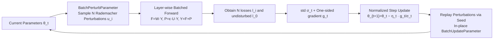

# FZOO: Fast Zeroth-Order Optimizer for Fine-Tuning Large Language Models towards Adam-Scale Speed

**Conference**: ICLR 2026  
**OpenReview**: [https://openreview.net/forum?id=NMlF3YjS8E](https://openreview.net/forum?id=NMlF3YjS8E)  
**Code**: [https://github.com/DKmiyan/FZOO](https://github.com/DKmiyan/FZOO)  
**Area**: Optimization / Zeroth-Order Optimization / LLM Efficient Fine-Tuning  
**Keywords**: Zeroth-Order Optimization, ZO, MeZO, normalized-SGD, Rademacher perturbation, Memory-efficient fine-tuning  

## TL;DR
FZOO utilizes "batched one-sided estimation + Rademacher (±1) perturbation" to bring zeroth-order optimizers close to Adam's convergence speed. By adopting adaptive step sizes based on the standard deviation of batch losses, it reduces the required forward passes by an order of magnitude. Simultaneously, ±1 perturbations allow multiple forward passes to be merged into a single batched matrix multiplication, making full-parameter LLM fine-tuning on consumer-grade memory realistic.

## Background & Motivation
**Background**: Fine-tuning LLMs is dominated by first-order optimizers like Adam. However, backpropagation requires caching all activations and gradients, leading to memory consumption often exceeding 10× that of inference—fine-tuning OPT-30B requires 633 GB of VRAM, hitting the "memory wall." Two paths exist to bypass this: PEFT (e.g., LoRA) updates few weights but still needs backpropagation and lags in difficult tasks; Zeroth-Order (ZO, e.g., MeZO) optimization eliminates backpropagation entirely, using forward differences to estimate gradients and reducing memory to inference levels.

**Limitations of Prior Work**: The memory efficiency of ZO comes at the cost of extremely slow convergence. MeZO uses a fixed learning rate and converges ~20× slower than Adam on RoBERTa-large, requiring significantly more steps. Slowness stems from three sources: (1) **Non-adaptive step sizes**—Adam uses momentum for adaptation which occupies memory, while ZO degrades to inefficient fixed steps; (2) **Expensive perturbation sampling**—Standard ZO uses Gaussian noise, requiring full matrix-vector multiplications for each estimate, which fails to benefit from hardware parallelism even when batched; (3) **Lack of engineering optimization**—Theoretically, one Adam step (≈4 forward passes) is only twice as slow as one MeZO step (2 forward passes), but due to unoptimized forward passes, MeZO is often slower per step in practice.

**Key Challenge**: The trade-off between "memory efficiency" and "slow convergence" in ZO appears inevitable. This paper asks: **Can this trade-off be fundamentally improved?**

**Goal**: To develop a professionally optimized ZO optimizer that approaches Adam-scale convergence speed within inference-level memory constraints.

**Key Insight**: **Normalized-SGD serves as the key inspiration**—it achieves effective adaptive step sizes via gradient normalization without expensive momentum, being more memory-efficient than Adam. FZOO ports normalized-SGD logic to the ZO domain: using the standard deviation of a batch of forward losses as a proxy for "gradient normalization" for adaptive steps (**reducing total forward passes needed**), and replacing Gaussian noise with ±1 Rademacher perturbations (**parallelizing batch computations**).

## Method

### Overall Architecture
FZOO performs two actions per step: first, BatchPerturbParameter calculates $N$ losses $\{l_i\}$ under Rademacher perturbations, where the standard deviation $\sigma_t$ adaptively scales the step size; then, BatchUpdateParameter replays perturbations by seed to update parameters in-place. These improvements are orthogonal: adaptive step sizing (reducing step count) × Rademacher batch parallelism (reducing per-step time), targeting both the "slow convergence" and "slow per-step" bottlenecks.

### Key Designs

**1. Batched One-Sided Estimation + Std Dev Adaptive Step: Porting normalized-SGD to the ZO domain.** MeZO uses symmetric two-sided differences $\hat\nabla L=\frac{L(\theta+\epsilon z)-L(\theta-\epsilon z)}{2\epsilon}z$, requiring two passes per estimate. FZOO uses one-sided estimation—using the undisturbed loss $l_0=L(\theta_t;B_t)$ as a baseline to calculate $l_i=L(\theta_t+\epsilon u_i;B_t)$ for $N$ Rademacher vectors. The gradient estimate is $g_t=\frac{1}{\epsilon N}\sum_{i=1}^N (l_i-l_0)u_i$. The key innovation is the step size: the batch loss variance $\sigma_t^2=\frac{1}{N-1}\sum_i (l_i-\bar l)^2$ is used for normalization: $\theta_{t+1}=\theta_t-\eta_t\frac{g_t}{\sigma_t}$. Intuitively, flat regions (low $\sigma_t$) lead to larger steps, and steep regions (high $\sigma_t$) lead to smaller steps, mimicing Adam's adaptivity without momentum. Proposition 3.2 provides theoretical support: $\sigma_t^2=|g_t|^2\cdot\epsilon^2\cdot\frac{N-1}{N}$, hence $\frac{g_t}{\sigma_t}$ is essentially a normalized stochastic gradient scaled by a constant—making FZOO a strict extension of normalized-SGD in the ZO domain. A variant, FZOO-R, reuses half the losses from the previous mini-batch to estimate variance, halving the forward passes for variance estimation.

**2. Rademacher (±1) Perturbation Collapses Multiple Forwards into One Batched Matrix Multiplication.** This is the core of per-step acceleration. Standard ZO runs each perturbation as a separate forward pass, preventing parallelism. FZOO decomposes each layer's computation into an undisturbed part $F^{(j)}=W^{(j)}Y^{(j-1)}$ and a perturbation part $P^{(j)}$. With Gaussian noise, $P^{(j)}$ remains a full matrix-vector multiplication. By using ±1 Rademacher vectors, the perturbation $P^{(j)}=\epsilon(UY^{(j-1)})$ (where $U$ is a block-diagonal sign matrix of $u_i$) only requires sign flips—degrading to bitwise sign additions/subtractions rather than a second matrix multiplication. Thus, $N$ layer-wise forward passes can be concatenated along the batch dimension for parallel execution.

**3. Triple Speedup Factor Summation Approaching Adam Wall-Clock Time.** FZOO decomposes total speedup into three multiplicative factors: one-sided estimation halving forward passes ($f$), speedup from parallel execution ($p$), and Rademacher replacing matrix multiplication with addition ($r$), combined as $f\times\min(p,r)$. On OPT-125M with $N=8$, the batched scheme alone is 1.92× faster than the "8 perturbation + 8 forward" baseline. Coupled with adaptive steps reducing total steps by an order of magnitude, FZOO's forward step count on RoBERTa-large is 18× faster than MeZO, nearing Adam's (20×) level; with 1.92× parallelism, it can potentially surpass Adam in wall-clock time.

**Theory**: Under $L$-smoothness and bounded variance assumptions, Theorem 3.6 proves FZOO satisfies $\frac{1}{T}\sum_t \mathbb{E}\|\nabla L(\theta_t)\|^2\le \frac{4\sigma^*}{\sqrt T}(\cdots)$, requiring $T=O(\varepsilon^{-2})$ to reach $\varepsilon$ accuracy, consistent with SGD's convergence rate in non-convex optimization.

## Key Experimental Results

Tests cover RoBERTa-large, the OPT family (350M–66B), Phi-2, and Llama3 across 11 tasks (classification / multiple choice / generation). All methods are evaluated under a fixed forward budget aligned with MeZO (200k steps for RoBERTa-large, 40k for others).

### Main Results

RoBERTa-large (350M, k=16, average of 5 runs):

| Method | SST-2 | SST-5 | SNLI | MNLI | RTE | TREC | Average |
|---|---|---|---|---|---|---|---|
| Zero-shot | 79.0 | 35.5 | 50.2 | 48.8 | 51.4 | 32.0 | 49.5 |
| FT (6×M) | 91.9 | 47.5 | 77.5 | 70.0 | 66.4 | 85.0 | 74.9 |
| HiZOO (2×M) | 93.2 | 46.2 | 74.6 | 64.9 | 66.8 | 79.8 | 70.9 |
| MeZO | 90.5 | 45.5 | 68.5 | 58.7 | 64.0 | 76.9 | 67.4 |
| **FZOO** | **93.3** | **47.6** | **75.9** | 64.9 | **67.9** | 78.8 | **71.4** |

FZOO is ~5.9% higher than MeZO on average, leading by over 10.7% on SNLI/MNLI, approaching HiZOO while maintaining inference-level memory.

Larger Models (1000 samples, 11-task average):

| Model | Adam | MeZO | HiZOO-L | FZOO |
|---|---|---|---|---|
| Phi-2 (2.7B) | 71.2 | 70.7 | 71.4 | **73.0** |
| Llama3 (8B) | 81.6 | 75.4 | 75.2 | **77.2** |
| OPT-13B | 74.0 | 68.8 | 67.0 | **70.7** |

FZOO outperforms MeZO by 2.75% on average. In full-parameter fine-tuning of OPT-30B/66B, FZOO is 2.43% higher than MeZO on average, with single-task gains up to +13.2% (SST-2 on 66B).

### Ablation Study

Breakdown of speedup sources and per-step cost ($N=8$):

| Task | SNLI | COPA | WIC | CB |
|---|---|---|---|---|
| FZOO Actual Speedup | 20× | 10× | 9× | 8× |
| Potential Speedup (w/ Parallelism) | 40× | 20× | 18× | 16× |

Per-step forward passes are 9 (4.5× more than MeZO), but wall-clock time only increases 3×—the parallel implementation "absorbs" the extra passes. Compared to broader ZO variants: FZOO outperforms ZO-Adam by 5.77% in full-parameter tuning and 4.21% in prefix-tuning while using only 40.5% of the memory; runtime is 0.56× that of ZO-SGD (fastest). As a "plug-and-play" replacement for MeZO in the hybrid FO-ZO framework Addax, average accuracy on OPT-2.7B improved from 72.71→74.11 (FO-heavy) and 68.37→71.16 (ZO-heavy).

### Key Findings
- **Speed-Memory Trade-off fundamental improvement**: FZOO brings ZO convergence to the Adam scale (18× vs Adam 20× on RoBERTa-large) within inference-grade memory.
- **Optimization of non-differentiable objectives**: Using F1 directly as the objective, FZOO's average F1 is 5.53% higher than MeZO across OPT scales.
- **Orthogonal and stackable**: FZOO can be paired with prefix-tuning for further memory savings and seamlessly replaces ZO components in hybrid frameworks for consistent gains.

## Highlights & Insights
- **Loss standard deviation as a free adaptive signal**: Batched forward passes calculate multiple losses anyway; using the standard deviation yields a normalized-SGD style step normalization at almost zero extra cost—an elegant migration from normalized-SGD to ZO.
- **Engineering value of Rademacher perturbations**: ±1 is not just "another noise"—it downgrades perturbations from matrix multiplication to addition, enabling batch parallelism. This is the critical insight for accelerating ZO steps that is often overlooked.
- **Theoretical and Engineering closed-loop**: The paper proves equivalence to normalized-SGD and $O(\varepsilon^{-2})$ convergence while providing wall-clock data to support real-world efficacy.

## Limitations & Future Work
- **Per-step wall-clock is slower**: Table 5 shows FZOO per-step wall-clock time is longer than Adam/MeZO (e.g., 1.66s vs MeZO 0.72s on OPT-1.3B); its advantage depends on the massive reduction in total steps. For ultra-large models where forward passes are expensive, this balance requires closer scrutiny.
- **Potential speedup not fully realized**: Table 6 shows a 2× gap between "actual vs. potential" speedup; the main experiments use non-parallel variants for fairness, so end-to-end gains from parallel implementations are not fully exploited across all tasks.
- **Task-specific performance drops**: FZOO does not always outperform MeZO on tasks like ReCoRD or DROP, suggesting variance normalization suitability for different loss landscapes requires further analysis.
- **Outlook for Pre-training**: The authors suggest this approach points toward "memory-efficient pre-training," but the paper only validates fine-tuning. Stability and convergence at pre-training scales remain open questions.

## Related Work & Insights
- **First-order Adaptive Methods**: Adam/AdamW use momentum for adaptive steps but consume memory; normalized-SGD demonstrates that gradient normalization alone can rival Adam—the direct inspiration for FZOO.
- **Zeroth-Order Optimization**: Classic SPSA estimators, MeZO (first to prove pure forward passes can fine-tune LLMs with high accuracy), and HiZOO (using diagonal Hessian cues). FZOO improves on MeZO by modifying both step sizing and perturbations.
- **Batched ZO**: ReLIZO (reusing directions for sample efficiency) and DeepZero (coordinate parallelism + feature reuse) share the philosophy of "activation reuse + batch parallelism" found in FZOO.
- **Insight**: Reinterpreting "adaptivity" from memory-heavy momentum to forward statistics (loss std dev) provides a cheap normalization method valuable for all memory-constrained optimization scenarios.

## Rating
- **Novelty**: ⭐⭐⭐⭐ Porting normalized-SGD to the ZO domain and using Rademacher perturbations to enable batch parallelism is a solid combination with theoretical backing.
- **Experimental Thoroughness**: ⭐⭐⭐⭐ Covers 350M–66B models, 11 tasks, non-differentiable objectives, and memory/wall-clock metrics, while verifying orthogonality with prefix-tuning and Addax.
- **Writing Quality**: ⭐⭐⭐⭐ Detailed three-point motivation, intuitive speedup breakdown ($f\times\min(p,r)$), and smooth transition between theory and experiments.
- **Value**: ⭐⭐⭐⭐ Enables high-speed full-parameter fine-tuning on consumer-grade hardware, providing high utility for resource-constrained scenarios and a path toward efficient pre-training.

<!-- RELATED:START -->

## Related Papers

- [\[ICML 2026\] Learning a Zeroth-Order Optimizer for Fine-Tuning LLMs](../../ICML2026/optimization/learning_a_zeroth-order_optimizer_for_fine-tuning_llms.md)
- [\[ICLR 2026\] Bi-LoRA: Efficient Sharpness-Aware Minimization for Fine-Tuning Large-Scale Models](bi-lora_efficient_sharpness-aware_minimization_for_fine-tuning_large-scale_model.md)
- [\[ICLR 2026\] HBO: Hierarchical Balancing Optimization for Fine-Tuning Large Language Models](hbo_hierarchical_balancing_optimization_for_fine-tuning_large_language_models.md)
- [\[ICLR 2026\] ViTSP: Guiding Large-Scale Traveling Salesman Problem Solving with Vision-Language Models](vitsp_a_vision_language_models_guided_framework_for_solving_large-scale_travelin.md)
- [\[ICCV 2025\] Zeroth-Order Fine-Tuning of LLMs in Random Subspaces](../../ICCV2025/optimization/zeroth-order_fine-tuning_of_llms_in_random_subspaces.md)

<!-- RELATED:END -->
