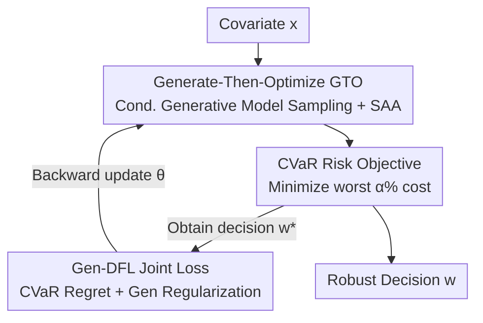

# Gen-DFL: Decision-Focused Generative Learning for Robust Decision Making

**Conference**: ICLR 2026  
**OpenReview**: [https://openreview.net/forum?id=GU2197a3Lm](https://openreview.net/forum?id=GU2197a3Lm)  
**Code**: https://github.com/kingofspace0wzz/gen_dfl  
**Area**: Decision-Focused Learning / Stochastic Optimization  
**Keywords**: Decision-Focused Learning, Robust Optimization, Generative Models, CVaR, Uncertainty Modeling

## TL;DR
Gen-DFL replaces the traditional "point prediction" in Decision-Focused Learning (DFL) with a conditional generative model. This allows the model to directly learn the full conditional distribution of optimization parameters and sample from high-risk tail regions. By using a CVaR objective for end-to-end training, it significantly reduces decision regret in high-dimensional, risk-sensitive decision-making problems.

## Background & Motivation

**Background**: Many real-world decisions (supply chains, power grid dispatch, portfolio management, traffic planning) follow a "predict-then-optimize" (PTO) paradigm: first predict unknown parameters $c$ (e.g., demand, cost, return) using machine learning, then feed the predictions into an optimizer to obtain decision $w$. The simplest approach decouples these two stages, where the predictor only focuses on minimizing MSE. Decision-Focused Learning (DFL) integrates these into an end-to-end pipeline, differentiating through the "decision regret" so that prediction serves downstream decision quality rather than just prediction accuracy.

**Limitations of Prior Work**: Although DFL outperforms PTO in low-dimensional, well-posed optimization problems, it faces two critical issues. First is **scalability**: DFL fundamentally outputs a point estimate $\hat c=g_\theta(x)$, which suffers from the curse of dimensionality in high-dimensional spaces, fails to capture complex dependencies between parameters, and tends to produce overconfident estimates. Second is **risk sensitivity**: DFL training objectives target average-case decision costs, lacking explicit modeling for tail risks (worst-case scenarios), which are critical in high-stakes fields like finance or power grids.

**Key Challenge**: Robust Optimization (RO) is the classical tool for managing risk, solving $\min_w \max_{c\in U(x)} f(c,w)$ to protect against the worst-case in an uncertainty set $U(x)$. however, RO's uncertainty sets are either manually specified using heuristics—failing to capture real data dynamics—or are **overly conservative** by focusing only on a single worst point. Consequently, there is a trade-off between "modeling tail risk" and "avoiding over-conservatism": point-based DFL is too aggressive, while RO with hard uncertainty sets is too pessimistic.

**Goal**: To provide an end-to-end framework that is more flexible than both DFL and RO, capable of explicitly managing tail risks without being overly conservative in high-dimensional, risk-sensitive settings.

**Key Insight**: Instead of using a "fixed uncertainty set" to bound possible parameter values, a deep generative model can treat uncertainty as a **learnable distribution** $p_\theta(c|x)$. High-risk samples can then be drawn as needed, softening the "worst-case" into a "worst $\alpha\%$ quantile region."

**Core Idea**: Replace "predict-then-optimize" with "generate-then-optimize" (GTO). Formulate the decision objective as a CVaR optimization over $p_\theta(c|x)$ and design a joint objective containing both decision regret and generative loss for end-to-end training.

## Method

### Overall Architecture

The input to Gen-DFL is the covariate $x$, and the output is a robust decision $w$. It replaces the "point estimation" stage of traditional DFL with "conditional generative model + CVaR optimization." The process alternates between two steps until convergence:

1.  **Generate-Then-Optimize (GTO)**: Samples a batch of scenarios $\{c_k\}_{k=1}^{K}$ from the conditional generative model $p_\theta(c|x)$, then applies Sample Average Approximation (SAA) to solve the CVaR optimization problem to obtain the current decision $w^\star_\theta$.
2.  **Model Learning**: Once $w^\star_\theta$ is obtained, the generative model parameters $\theta$ are updated via a joint loss (decision regret + generative regularization), ensuring the generated samples both fit the true data distribution and yield high-quality decisions.

The key is that the decision objective is no longer minimizing the expected cost, but minimizing the cost of the worst $\alpha\%$ scenarios, i.e., CVaR:

$$w^\star(x;\alpha) := \arg\min_w \mathrm{CVaR}_{c\sim p(c|x)}[f(c,w);\alpha].$$

The parameter $\alpha$ serves as a unified dial: it recovers robust optimization focusing on a single worst-case point as $\alpha\to 0$, and recovers standard expectation optimization as $\alpha\to 1$. Gen-DFL thus bridges "conservatism" and "probabilistic risk awareness."

### Key Designs

**1. Generate-Then-Optimize (GTO): Replacing Point Estimates with Learnable Distributions**

This design addresses the failure of DFL point predictions in high-dimensional and tail-risk scenarios. Traditional Pred-DFL outputs a single point estimate $\hat c$, which suffices for linear objectives (as they only depend on the expectation of $c$), but fails to capture necessary distributional information for risk modeling when objectives are non-linear or dimensions scale. Gen-DFL replaces deterministic prediction with a generative model $p_\theta(c|x)$, solving $w^\star_\theta(x;\alpha)=\arg\min_w \mathrm{CVaR}_{c\sim p_\theta(c|x)}[f(c,w);\alpha]$ via sampling and SAA. Unlike RO, which requires a pre-specified $U(x)$, the uncertainty here is "learned"—the model adaptively places probability mass in actual high-risk regions based on empirical data rather than relying on a fixed geometric shape.

The framework is model-agnostic; the authors utilize **Conditional Normalizing Flows (CNF)** to model $p(c|x)$. CNF transforms a simple base distribution (e.g., Gaussian) into a complex target distribution via an invertible mapping $g_\theta:\mathcal C\to\mathcal Z$, providing an exact log-likelihood $p_\theta(c|x)=p_Z(g_\theta(c;x))\,\big|\det \tfrac{\partial g_\theta(c;x)}{\partial c}\big|$. The invertibility and exact likelihood of CNF enable stable training while representing complex high-dimensional distributions (empirically outperforming VAEs approximated by ELBO).

**2. CVaR Risk Objective: Softening "Worst-case" to "Worst $\alpha\%$ Tail Region"**

This design addresses the "over-conservatism" of RO. Gen-DFL quantifies the tail using Conditional Value-at-Risk (CVaR): given a confidence level $\alpha$,

$$\mathrm{CVaR}[f(c,w);\alpha] = \mathbb E\big[f(c,w)\,\big|\,f(c,w)\ge \mathrm{VaR}_\alpha\big],$$

which represents the expected loss in the tail exceeding the VaR threshold. Minimizing this tail expectation provides a "softer" and more probabilistic characterization of uncertainty compared to the hard min-max of RO: the model is responsible for a region (the worst $\alpha\%$) rather than a single extreme point. Smaller $\alpha$ emphasizes worst-case results (more conservative), while $\alpha=1$ reverts to expected regret over the full distribution.

**3. Gen-DFL Joint Loss and Contrastive Surrogate: Data Fitting and Decision Service**

End-to-end training faces two obstacles. First, the true distribution $p(c|x)$ is usually unknown, making direct regret calculation impossible. The authors introduce an **auxiliary proxy model** $q(c|x)$, pre-trained on available data and then fixed, to estimate the CVaR regret $\mathrm{Regret}_{\theta,q}(x;\alpha)$. The total objective is a weighted sum of decision regret and generative regularization:

$$\ell_{\text{Gen-DFL}}(\theta;q,\alpha) := \beta\cdot\mathbb E_x[\mathrm{Regret}_{\theta,q}(x;\alpha)] + \gamma\cdot \ell_{\text{gen}}(\theta),$$

where $\ell_{\text{gen}}(\theta)$ is the generative loss (e.g., NLL, ELBO, or score-matching), preventing the generative distribution from deviating too far from real data. $\beta$ and $\gamma$ balance "decision-orientation" and "data-fitting" (where $\beta=0$ degrades to pure generation).

Second, backpropagating through decision regret requires calculating $\partial w^\star_\theta/\partial c$. Inspired by Mulamba et al., a **surrogate contrastive loss** is used: relative to a target solution $w^\star$, negative samples $w_s$ are pulled from a set $\mathcal S\subset \mathcal W\setminus\{w^\star\}$, and the difference in CVaR cost is minimized. This avoids direct differentiation through the combinatorial optimization mapping.

### Loss & Training

The global objective is Equation (7): a $\beta$-weighted CVaR regret term plus a $\gamma$-weighted generative loss term. In experiments, $\gamma=1$ is fixed, and $\beta$ is tuned. Training alternates between GTO and Model Learning (see Algorithm 1 in the original paper). Evaluation uses the proxy model $q(c|x)$ to compute the average relative regret. Theoretically, the authors prove that the gap between the proxy and true loss is upper-bounded by the Wasserstein-1 distance between $p$ and $q$ (Theorem 5.1). Furthermore, the regret gap between Gen-DFL and Pred-DFL increases as parameter variance $\|\mathrm{Var}[c|x]\|$ and dimensionality $d_c+d_x$ increase, or as the risk level $\alpha$ decreases (Theorem 5.4), explaining why Gen-DFL excels in "harder" problems.

## Key Experimental Results

### Main Results

Evaluated on 3 synthetic tasks (Portfolio, Fractional Knapsack, Shortest-Path) and 2 real tasks (Energy scheduling, COVID resource allocation) using **Average Relative Regret (lower is better)**. Representative results under the high-variance setting ($\sigma=20$):

| Task | SPO+ | Diff-DRO | 2Stage(PTO) | Gen-DFL |
|------|------|----------|-------------|---------|
| Portfolio Deg-2 | 6.92 | 8.30 | 16.90 | **3.71** |
| Portfolio Deg-8 | 6.98 | 8.65 | 16.17 | **3.59** |
| Shortest-Path Deg-2 | 3.23 | 2.91 | 10.07 | **1.87** |
| Shortest-Path Deg-8 | 81.78 | 39.81 | 45.75 | **13.36** |
| Knapsack Deg-4 | 20.37 | 18.45 | 16.58 | **15.21** |
| Energy | 1.56 | 1.49 | 1.91 | **1.09** |
| COVID Resource | 17.94 | 16.41 | 18.46 | 16.86 |

Ours (Gen-DFL) reduces regret by up to 58.5% compared to Diff-DRO and 48.5% compared to SPO+ in Portfolio. On the high-dimensional Shortest-Path Deg-8, regret is reduced by **83.7%** (13.36 vs 81.78) relative to SPO+, validating that modeling the full distribution $p(c|x)$ overcomes the curse of dimensionality. Gains are more modest in lower-dimensional tasks like Knapsack Deg-2 (19.6% / 10.3% over SPO+/Diff-DRO), suggesting generative modeling pays off most in high-dimensional, highly non-linear optimization landscapes.

Compared to traditional data-driven RO (LRO, E2E-CRO, E2E-Conformal), Gen-DFL maintains low regret even as polynomial degrees increase, as it avoids solving hard min-max over fixed geometric sets.

### Ablation Study

| Configuration | Phenomenon | Explanation |
|------|------|------|
| $\beta=0$ | Worst regret across risk levels | Degrades to pure generation, ignoring decision costs |
| Increasing $\beta$ | Persistent improvement in decision quality | Stronger decision-guidance yields better downstream results |
| Training $\alpha=0.5$ vs $1.0$ | $\alpha=0.5$ is superior for high risk | Training with small $\alpha$ enhances tail robustness |
| Samples 200 → 800 | Consistent drop in regret across levels | More SAA samples improve uncertainty modeling accuracy |
| CNF vs VAE | CNF outperforms VAE | Exact likelihood training is superior to ELBO approximation |

### Key Findings
- **The advantages of Gen-DFL grow with higher dimensions, larger variance, and higher risk sensitivity**: This aligns perfectly with the regret gap upper bound in Theorem 5.4, empirically evidenced by the 83.7% reduction in Shortest-Path Deg-8.
- **$\beta$ is the primary switch for decision quality**: The failure at $\beta=0$ proves that injecting decision costs into generative training, not the generative model itself, is the catalyst.
- **The contribution lies in the paradigm, not the specific generator**: While CNF is better than VAE, the value is in the "Generation + CVaR + End-to-end" paradigm.
- Performance on the COVID task is close to baselines, indicating limited gains when the uncertainty structure is simple or low-dimensional.

## Highlights & Insights
- **Unified framework for RO ($\alpha\to0$) and Expected Optimization ($\alpha\to1$) via $\alpha$**: Collapsing two disparately treated methodologies into a continuous spectrum allowed by user risk preference is an elegant and transferable perspective.
- **Paradigm shift from "fixed uncertainty sets" to "learnable distributions"**: Gen-DFL allows data to speak for itself, adaptively placing probability mass in high-risk zones, thus avoiding the over-conservatism of heuristic uncertainty sets.
- **Bypassing combinatorial optimization gradients with contrastive loss**: Using negative sample contrast for training avoids complex chain-rule dependencies for $\partial w^\star/\partial c$, a trick applicable to other end-to-end discrete/combinatorial tasks.
- **Theory-Experiment alignment**: The theoretical regret bounds based on variance/dimension/risk are accurately reflected in the observed experimental gains in the most difficult settings.

## Limitations & Future Work
- **Dependency on Proxy Model $q(c|x)$**: When the true distribution is unavailable, the entire regret evaluation relies on $q$. Theorem 5.1 shows error is bounded by $W(p,q)$; if $q$ fits poorly, Gen-DFL's advantage may erode.
- **Computational Overhead of Generation + SAA**: Every step requires sampling and solving a CVaR optimization, which is costlier than point-based Pred-DFL.
- **Limited Gains in Simple Scenarios**: Results on the COVID task suggest the framework is best suited for high-dimensional, strongly non-linear scenarios.
- **Generator Selection**: Only CNF and VAE were compared; other generators like Diffusion models remain to be explored.

## Related Work & Insights
- **vs Pred-DFL (SPO+ / NCE / MAP)**: These rely on point prediction + average-case regret. Gen-DFL models the full $p(c|x)$, providing a significant edge in high-dimensional risk-sensitive scenarios.
- **vs Diff-DRO**: Diff-DRO embeds DRO as a differentiable layer but still tends toward constructing uncertainty balls. Gen-DFL directly characterizes uncertainty via generation, leading by up to 58.5% in Portfolio.
- **vs Traditional/Data-driven RO**: RO tends toward over-conservatism due to hard min-max over fixed geometries; Gen-DFL minimizes CVaR over the full learned distribution, remaining robust as non-linearity increases.

## Rating
- Novelty: ⭐⭐⭐⭐⭐ Clear paradigm shift by embedding generative models into DFL and unifying RO/Expectation via CVaR.
- Experimental Thoroughness: ⭐⭐⭐⭐ Good coverage of synthetic and real tasks with ablation, though lacks computational cost and proxy mismatch analysis.
- Writing Quality: ⭐⭐⭐⭐ Strong logic loop (motivation-method-theory-experiment), though symbols are somewhat dense.
- Value: ⭐⭐⭐⭐ Directly useful for high-dimensional risk-sensitive decisions in finance, power grids, and scheduling.

<!-- RELATED:START -->

## Related Papers

- [\[ICLR 2026\] Diffusion-DFL: Decision-focused Diffusion Models for Stochastic Optimization](diffusion-dfl_decision-focused_diffusion_models_for_stochastic_optimization.md)
- [\[ICLR 2026\] Conformal Robustness Control: A New Strategy for Robust Decision](conformal_robustness_control_a_new_strategy_for_robust_decision.md)
- [\[ICLR 2026\] Distributionally Robust Optimization via Generative Ambiguity Modeling](distributionally_robust_optimization_via_generative_ambiguity_modeling.md)
- [\[ICLR 2026\] Generative Bayesian Optimization: Generative Models as Acquisition Functions](generative_bayesian_optimization_generative_models_as_acquisition_functions.md)
- [\[ICML 2026\] Bulk-Calibrated Credal Ambiguity Sets: Fast, Tractable Decision Making under Out-of-Sample Contamination](../../ICML2026/optimization/bulk-calibrated_credal_ambiguity_sets_fast_tractable_decision_making_under_out-o.md)

<!-- RELATED:END -->
