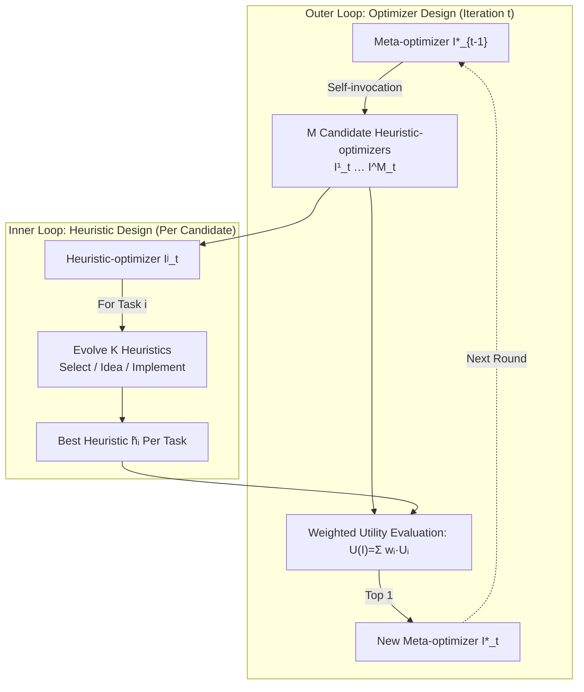

# Generalizable Heuristic Generation Through LLMs with Meta-Optimization

**Conference**: ICLR 2026  
**Code**: [https://github.com/yiding-s/MoH](https://github.com/yiding-s/MoH)  
**Area**: optimization  
**Keywords**: Combinatorial Optimization, Heuristic Generation, Large Language Models, Meta-Optimization, Meta-Learning, LLM-EC, Cross-scale Generalization

## TL;DR
MoH elevates LLM-based heuristic generation from "evolving heuristics with a fixed evolutionary algorithm" to "iteratively building optimizers." By using self-invocation to generate diverse heuristic optimizers and selecting the best one based on multi-task utility as the next round's meta-optimizer, MoH breaks free from manually designed evolutionary frameworks and significantly enhances cross-scale generalization.

## Background & Motivation
**Background**: Automatically designing heuristics for Combinatorial Optimization Problems (COP) using LLMs is a prominent research direction. Since FunSearch demonstrated feasibility, mainstream approaches have evolved into the LLM-EC framework (e.g., EoH, ReEvo, HSEvo, MCTS-AHD), where LLMs act as crossover and mutation operators to iteratively evolve heuristic code for NP-hard problems like TSP, BPP, and CVRP.

**Limitations of Prior Work**: Existing methods are restricted by two issues. First, the **search space is constrained by manually predefined evolutionary frameworks** (e.g., a fixed "crossover then mutation" workflow), limiting the exploration of diverse heuristics and making it difficult to discover superior algorithms. Second, the **optimization process targets a single task** (fixed-scale COP), resulting in poor generalization. Experiments using EoH on TSP (Fig. 1) show that heuristics trained on TSP100 suffer from a sharp increase in optimality gaps when tested on scales of 500 or 1000; even with multi-scale training data, performance on large-scale instances remains limited.

**Key Challenge**: The heuristic-optimizer (the evolutionary framework itself) is manually fixed, yet the "optimal framework for a given COP cluster" should ideally be searchable. Current works treat this layer as an immutable constant.

**Goal**: To enable LLMs to not only generate heuristics but also **automatically design the optimizers that generate them**. By training in a multi-task setting, the learned optimizer (and the heuristics it produces) can robustly generalize to larger, unseen task scales.

**Core Idea**: **[Meta-Optimization + Self-Invocation]** The system splits optimizers into two levels: the "heuristic-optimizer" (responsible for evolving heuristics for specific COPs) and the "meta-optimizer" (responsible for adapting and improving these heuristic-optimizers). MoH allows the meta-optimizer to generate a set of candidate heuristic-optimizers via **(self-)invocation**. These candidates evolve heuristics across all downstream tasks and are scored by weighted utility. The winner becomes the meta-optimizer for the next round, forming an outer loop of "evolution at the optimizer level."

## Method

### Overall Architecture
MoH is a nested two-level optimization loop: an outer loop for "building optimizers" and an inner loop for "building heuristics." In the outer loop, the current meta-optimizer $I^*_{t-1}$ uses self-invocation to generate $M$ candidate heuristic-optimizers. Each candidate enters the inner loop to evolve $K$ heuristics for each of the $N$ downstream tasks. The total utility for an optimizer is the weighted sum of the best heuristics' utilities across tasks, and the highest-scoring candidate becomes the new meta-optimizer $I^*_t$. The key insight is that heuristics and optimizers share the same "individual structure + population management + function signature," allowing the meta-optimizer to recursively improve itself by taking its own implementation as input.

**N.1 Two-level Optimization Objective: Elevating "Finding Heuristics" to "Finding Optimizers"**. Traditional LLM-EC solves single-task heuristic design: using a fixed optimizer $I$ to find $\tilde{h}^I_i = \arg\max_{h^I_i \in \mathcal{H}_i} U_i(h^I_i, D_i)$ in search space $\mathcal{H}_i$, where utility $U_i$ is the negative optimality gap. MoH treats $I$ as a variable, rewriting the objective as $I^* \leftarrow \tilde{I} = \arg\max_I \sum_{i=1}^N w_i \cdot U_i(\tilde{h}^I_i, D_i)$. Task weights $w_i = s_i / \sum_j s_j$ are proportional to problem scale $s_i$, giving large-scale tasks more influence. This is the source of generalization: the optimizer is selected by multi-task utility biased toward large scales. Simple data mixing fails because the No Free Lunch theorem suggests a single heuristic rarely fits diverse tasks simultaneously; mixing often degrades overall performance.

**N.2 Unified Structure & Recursive Optimizer Signature**. MoH defines heuristics and optimizers using a unified "individual" structure: a triplet of (Code Implementation String, Core Strategy Description String, Utility Score Float). Both heuristic populations $\mathcal{H}$ and optimizer populations $\mathcal{P}$ maintain 10 individuals. An optimizer is expressed as a callable function with a unified signature `optimize_algorithm(population, utility, language_model, subtask_prompt, subtask)`. This allows the meta-optimizer to pass its own implementation through the `population` parameter, enabling the LLM to refine or rewrite the optimizer code recursively. Population management uses a heap to ensure elite retention based on utility.

**N.3 Three-step Generation Process: Selection → Idea → Implementation**. Regardless of whether the loop is for optimizers or heuristics, LLM generation follows three steps: **① Individual Selection**: The current (meta-)optimizer uses its LLM-generated strategy to pick promising candidates, balancing exploitation and exploration. **② Idea Generation**: The LLM proposes algorithmic concepts in natural language—a critical step as LLM iteration relies on articulating reasoning; sampling directly in code space is too restrictive. **③ Implementation Generation**: Guided by the idea and task-specific prompts, the LLM generates new code via self-invocation. The loops differ mainly in objectives (outer for optimizers, inner for heuristics) and call frequencies (outer loop is less frequent than inner loop). MoH naturally emerges diverse meta-optimizers resembling EC, Ant Colony Optimization, Particle Swarm, Simulated Annealing, or hybrid strategies.

## Key Experimental Results

### Main Results
TSP (Training on 20/50/100/200, generalizing to 500/1000), optimality gap (lower is better):

| Method | Type | TSP100 Gap | TSP500 Gap | TSP1000 Gap | Avg Gap |
|------|------|-----------|-----------|------------|---------|
| EoH | Construction | 12.974% | 15.196% | 16.390% | 13.420% |
| ReEvo | Construction | 13.133% | 15.232% | 16.076% | 13.343% |
| MCTS-AHD | Construction | 12.499% | 15.240% | 16.060% | 12.568% |
| **MoH (Ours)** | Construction | **11.444%** | **14.224%** | **15.049%** | **11.792%** |
| ReEvo-KGLS | Improvement | 0.003% | 0.976% | 1.595% | 0.466% |
| MCTS-AHD-KGLS | Improvement | 0.006% | 0.867% | 1.389% | 0.411% |
| **MoH-KGLS (Ours)** | Improvement | **0.002%** | **0.805%** | **1.363%** | **0.391%** |

Online BPP (Excess bins %, lower is better): MoH averages **0.453%**, significantly outperforming EoH (0.680%), HSEvo (1.125%), MCTS-AHD (1.006%), and ReEvo (1.240%). For CVRP/Offline BPP, MoH achieves optimal or near-optimal values across almost all scales.

### Ablation Study
TSP (GLS setting, trained on TSP100/200), MoH-GLS gap:

| Setting | 100 | 200 | 500 | 1000 |
|------|-----|-----|-----|------|
| Pop=1, w. idea | 0.120% | 0.563% | 2.355% | 3.300% |
| Pop=5, w. idea | 0.058% | 0.337% | 1.475% | 2.338% |
| Pop=10, **w/o idea** | 0.043% | 0.390% | 1.644% | 2.420% |
| **Default (Pop=10, w. idea)** | **0.035%** | **0.332%** | **1.045%** | **1.710%** |

Different LLMs (MoH-GLS): 4o-mini (1.710%) outperformed stronger models like o1-mini (2.119%), Deepseek-V3 (2.527%), and Qwen-Plus (3.277%) on TSP1000.

### Key Findings
- **Cross-scale Generalization**: The advantage increases with scale (TSP1000 gaps are significantly lower than baselines), proving that scale-weighted multi-task utility pushes the optimizer toward generalizable strategies.
- **Natural Language Ideas are Essential**: Removing the "idea" step degrades large-scale performance, indicating that LLM algorithmic exploration is driven by linguistic reasoning rather than code-space sampling.
- **Stronger LLM $\neq$ Better Heuristics**: o1-mini tends to produce complex optimization strategies that do not necessarily translate to better downstream heuristics; 4o-mini is more robust for large-scale tasks.
- **Emergent Diverse Paradigms**: MoH "invents" meta-heuristics like ACO, PSO, and Tabu Search, verifying that moving up an abstraction level successfully opens the search space.

## Highlights & Insights
- **Upward Shift in Abstraction**: The core contribution is moving from "LLM + Fixed EC -> Heuristic" to "LLM -> Optimizer -> Heuristic," incorporating the human-designed evolutionary workflow into the search.
- **Recursive Self-invocation**: Recursive structures and unified signatures make "optimizers improving optimizers" elegant and implementable with nearly zero additional abstraction cost.
- **Mechanism of Generalization**: Multi-task weighting embeds an inductive bias for large-scale friendly strategies directly into the optimizer selection phase.

## Limitations & Future Work
- **Computational Overhead**: While evaluation counts are limited (e.g., 1000), searching for optimizers is inherently more expensive than single-layer evolution.
- **Stability of Self-invocation**: Optimizer behavior is sensitive to prompts, history, and LLM versions, leading to lower determinism compared to fixed frameworks.
- **Manual Task Selection**: Downstream task sets and weights are still manually defined; unified meta-optimization across problem types (TSP vs BPP) is currently only preliminary.
- **Utility Function Limits**: Currently focused on optimality gap; multi-objective scenarios (e.g., latency, interpretability) are not yet integrated.

## Related Work & Insights
- **Heuristic Generation Lineage**: MoH extends the line of FunSearch, EoH, and ReEvo by turning the "optimizer" into a searchable object.
- **Meta-learning Transfer**: The nested structure mimics learning-to-optimize/meta-learning within the context of LLM code generation.
- **Implications for AAD**: Demonstrates that LLMs can effectively search at high levels of abstraction, providing a template for future work where LLMs design entire solvers.

## Rating
- **Novelty**: ⭐⭐⭐⭐⭐ Moving the abstraction from "evolving heuristics" to "evolving optimizers" using recursive meta-optimization is a significant conceptual advancement.
- **Experimental Thoroughness**: ⭐⭐⭐⭐ Covers multiple problem types (TSP, BPP, CVRP), construction/improvement heuristics, multiple LLMs, and cross-scale generalization.
- **Writing Quality**: ⭐⭐⭐⭐ Clear motivation-formalization-implementation chain; intuitive diagrams and rigorous problem formulation.
- **Value**: ⭐⭐⭐⭐ Offers a reproducible and generalizable paradigm for automated algorithm design, beneficial to both COP and meta-learning communities.

<!-- RELATED:START -->

## Related Papers

- [\[AAAI 2026\] Instance Generation for Meta-Black-Box Optimization through Latent Space Reverse Engineering](../../AAAI2026/optimization/instance_generation_for_meta-black-box_optimization_through_latent_space_reverse.md)
- [\[ICML 2026\] PathWise: Planning through World Model for Automated Heuristic Design via Self-Evolving LLMs](../../ICML2026/optimization/pathwise_planning_through_world_model_for_automated_heuristic_design_via_self-ev.md)
- [\[ICLR 2026\] AutoEP: LLMs-Driven Automation of Hyperparameter Evolution for Metaheuristic Algorithms](autoep_llms-driven_automation_of_hyperparameter_evolution_for_metaheuristic_algo.md)
- [\[ICLR 2026\] Binomial Gradient-Based Meta-Learning for Enhanced Meta-Gradient Estimation](binomial_gradient-based_meta-learning_for_enhanced_meta-gradient_estimation.md)
- [\[ICLR 2026\] Landing with the Score: Riemannian Optimization through Denoising](landing_with_the_score_riemannian_optimization_through_denoising.md)

<!-- RELATED:END -->
