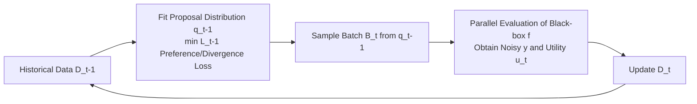

# Generative Bayesian Optimization: Generative Models as Acquisition Functions

**Conference**: ICLR 2026  
**OpenReview**: [https://openreview.net/forum?id=GBWkRRJrdu](https://openreview.net/forum?id=GBWkRRJrdu)  
**Code**: To be confirmed  
**Area**: Optimization / Bayesian Optimization / Generative Models  
**Keywords**: Bayesian Optimization, Generative Models, DPO, Black-box Optimization, Batch Optimization, Protein Design  

## TL;DR
GenBO trains a generative model directly as a proposal distribution whose sampling density is proportional to the acquisition function. By leveraging DPO-style logic to train in a single step using noisy utility values, it bypasses the need to fit surrogate regression or classification models, making it simple and scalable for high-dimensional, combinatorial, and large-batch black-box optimization (e.g., protein design).

## Background & Motivation
**Background**: Bayesian Optimization (BO) relies on probabilistic surrogate models like Gaussian Processes and constructs acquisition functions (e.g., PI, EI) based on posterior uncertainty, which are then maximized to select the next query points. When tasks allow for parallel evaluation, a batch can be submitted at once; however, classical BO struggles to scale when facing high-dimensional, combinatorial, or discrete design spaces (e.g., proteins, molecules).

**Limitations of Prior Work**: A promising direction is training generative models as proposal distributions to directly sample candidate batches, avoiding the difficulty of "globally optimizing the acquisition function." However, existing generative black-box optimization methods (e.g., CbAS, VSD, LaMBO-2) are almost all **two-stage**: first fitting a regression or classification surrogate (approximating $p(y\ge\tau|x)$ or $f$) and then training a generator on top of it.

**Key Challenge**: The two-stage pipeline stacks the approximation errors of both models and consumes additional computational power—not only increasing the sources of error but also raising costs—while surrogate models themselves are often inaccurate in high-dimensional spaces.

**Goal**: Propose a **single-model** framework that trains a generative model directly from (noisy) observed utility values, causing its density to approximate a target distribution proportional to the acquisition function, completely removing the intermediate surrogate.

**Core Idea**: **"Generative Model as Acquisition Function"**—treat the BO acquisition function $a_t(x)=\mathbb{E}[u_t(y)|x,D_t]$ as a pseudo-likelihood, with the target distribution $p^*_t(x)\propto p_0(x)a_t(x)$; **Eliminate the surrogate via DPO**—similar to how DPO uses the language model itself as a reward model, train the generator directly using pairwise preference loss or divergence loss to approximate the target, without an explicit reward/classification model.

## Method

### Overall Architecture
GenBO reinterprets BO as direct inference on the "optimal solution location $x^*$": using $p_0$ as the prior and the acquisition value $a_t(x)$ as a utility-based pseudo-likelihood, the target distribution is $p^*_t(x)\propto p_0(x)a_t(x)$. Each round, the algorithm first fits the proposal distribution $q_{t-1}=\arg\min_q L_{t-1}(q)$ using historical data, samples a batch from it, evaluates the utility after feedback, and updates the data over $T$ iterations. The key lies in the design of the loss $L_t$, categorized into **Preference-based** (DPO-style, using the sign of utility differences) and **Divergence-based** (direct matching of $p^*_u$, using utility magnitudes).

### Key Designs

**1. Utility as Acquisition, Density as Proposal: A Unified Target Distribution.** GenBO no longer approximates $f$; instead, it treats any acquisition function that can be written as an expected utility $a_t(x)=\mathbb{E}[u_t(y)|x,D_t]$ directly as a training signal. Using PI as an example, from Bayes' rule $a(x)=p(y\ge\tau|x)\propto p(x|y\ge\tau)/p_0(x)$, thus "learning a generative model to sample $p(x|y\ge\tau)$" is equivalent to "learning a classifier for improvement events," but the generative model can sample directly in high-density (high-utility) regions, bypassing the global optimization of non-convex acquisition surfaces. Generalizing to arbitrary non-negative utilities yields the target $p^*_t(x)\propto p_0(x)a_t(x)$ (or $\propto p_0(x)\exp a_t(x)$ for negative utilities). Common utilities include PI $u=\mathbb{I}[y\ge\tau]$, EI $u=\max(y-\tau,0)$, smoothed sEI $u=\mathrm{softplus}(y-\tau)$, and the mean $u=y$.

**2. Preference Loss (PL / Robust rPL): Bringing DPO to BO.** The partition function in standard classification losses cannot be eliminated like in DPO, thus requiring pairwise contrastive objectives. Organizing data into pairs $(x_{i,1},x_{i,2})$ with utilities $u_{i,j}=u(y_{i,j})$, the model is trained with the Bradley-Terry preference loss:
$$\ell^{PL}_i(q)=-\log\sigma\!\Big(\eta\,\mathrm{sign}(\Delta u_i)\big[\log\tfrac{q(x_{i,1})}{p_0(x_{i,1})}-\log\tfrac{q(x_{i,2})}{p_0(x_{i,2})}\big]\Big)$$
where $\Delta u_i=u_{i,1}-u_{i,2}$. This forces the generative model to approximate $p^*_u(x)\propto p_0(x)\exp(\tfrac1\eta\mathbb{E}[u(y)|x])$ without requiring a reward model. Since BO only observes noisy $y$, the sign of the utility difference may flip with probability $p_\mathrm{flip}$, making the original DPO loss biased; GenBO adopts the robust version from Chowdhury et al., weighting losses in positive and negative directions: $\ell^{rPL}_i=\frac{(1-p_\mathrm{flip})\ell^{PL}(q,\Delta u_i)-p_\mathrm{flip}\ell^{PL}(q,-\Delta u_i)}{1-2p_\mathrm{flip}}$, which is unbiased under mild assumptions and robust to observation noise.

**3. Divergence Loss (Forward KL / Balanced Forward KL): Utilizing Utility Magnitudes.** Preference losses only consider signs and discard utility magnitudes; divergence-based losses make $q$ match $p^*_u\propto p_0(x)a(x)$ directly. Since samples from $p^*_u$ are unavailable, adaptive importance sampling using samples from the current proposal $q_{t-1}$ yields the unbiased objective $\ell^{fKL}_i(q)=-\tfrac{p_0(x_i)}{q_{i-1}(x_i)}u(y_i)\log q(x_i)$, which theoretically converges to $p^*_u$. However, PI/EI have zero utility where $y<\tau$, failing to penalize low-utility regions, which may lead to high density in poor areas; hence, **Balanced Forward KL** is derived from Bregman divergence (the convex function $u\log u$), adding a soft penalty term $\ell^{bfKL}_i(q)=-\tfrac{p_0(x_i)}{q_{i-1}(x_i)}u(y_i)\log q(x_i)+\tfrac{q(x_i)}{q_{i-1}(x_i)}$, showing significant gains in long-sequence high-dimensional tasks. In practice, importance weights $1/q_{i-1}$ are often dropped to promote posterior concentration toward the optimum (guaranteed by monotonic utility improvement in reward-weighted regression).

**4. Convergence Guarantees: Approximating the Target and Converging to Optimum.** Theoretical analysis assumes the log-density $g_\theta$ of the model falls within an RKHS shared with the truth $g^*$, with the loss being strictly convex in its first parameter and strongly convex under regularization. Lemma 1 provides strong convexity and a unique minimum; Theorem 1 shows that approximation errors for the optimal parameters concentrate like kernel methods, where the $\|m\|_{H_n^{-1}}$ term corresponds to GP-style predictive variance, vanishing when density is bounded below. Leveraging results from reward-weighted regression (where training a proposal to maximize $\mathbb{E}[u(y)\log q(x)]$ produces monotonically increasing expected utility), the proposal is shown to concentrate gradually in the global optimal region of $f$, allowing simple regret to vanish.

## Key Experimental Results

### Main Results Table
Evaluation metrics include simple regret $r_t=f(x^*)-\max_{i\le n_t}f(x_i)$ and cumulative maximum, averaged over 5 random seeds.

| Task | Setting | GenBO Performance | Primary Competitors |
|------|------|-----------|---------|
| ALOHA Text Opt | 5 letters, $\lvert\mathcal{X}\rvert>1.18\times10^7$, $D_0{=}64,B{=}8,T{=}10$ | rPL+EI shows fastest improvement; PI reaches exact optimum late-stage | VSD performs well late-stage; CbAS lags due to using only final batch data |
| Ehrlich Protein (Closed) | $M{=}15/32/64$, $D_0{=}128,B{=}128,T{=}32$ | KL-type losses perform best; bfKL+exponential regularization superior in long sequences | Matches/exceeds VSD, CbAS, LaMBO-2, Random |
| FoldX Stability | mRouge protein $M{=}228$, $D_0{=}88,B{=}64,T{=}20$ | GenBO struggles slightly | VSD/CbAS are better (dominated by low-diversity pure exploitation) |
| FoldX SASA | Same as above | Most GenBO variants lead by large margins and faster | Outperforms all baselines; uninformative prior benefits extrapolation |

### Ablation Study Table

| Ablation Dimension | Key Findings |
|---------|---------|
| Threshold $\tau_t$ Annealing | Tasks prefer aggressive exploitation (final quantile >90%); GenBO is insensitive to annealing schemes, while VSD requires steep increases to >95% |
| Prior $p_0$ | Uninformative prior $p_0\propto1$ performs best on ALOHA and SASA, suggesting Benefits for extrapolation |
| Batch size $B$ | Performance improves monotonically; significant gains for large batches $B\ge32$ |
| Runtime | By bypassing the intermediate surrogate, GenBO is approximately **3x faster** than VSD on average |
| Diversity | Stability tasks favor low diversity (pure exploitation); SASA tasks favor high diversity (exploration) |

### Key Findings
- **No Surrogate = Fast and Accurate**: The single-model approach not only reduces approximation error but also reduces runtime to roughly 1/3 of VSD.
- **Each Loss Has Strengths**: Preference-based loss (rPL) is robust to noise and converges quickly on text tasks; divergence-based losses (KL/bfKL) utilize utility magnitudes and are stronger in high-dimensional long-sequence protein tasks.
- **Priors Must Be Chosen Carefully**: Expert knowledge can be injected, but uninformative priors are best for extrapolation-heavy tasks, indicating that incorrect priors can hinder performance.
- **Balanced KL Density Penalty is Critical in High Dimensions**: In long sequences ($M=64$), the soft penalty of bfKL on low-utility regions prevents the model from stacking density in poor areas, with benefits increasing as dimensionality rises.
- **Large Batches are an Advantage, Not a Burden**: Performance improves monotonically with batch size, aligning with the design philosophy that "generative proposals are naturally suited for producing large candidate batches."

## Highlights & Insights
- **Unified Perspective of "Generative Model as Acquisition Function"**: Treating the BO acquisition function as a pseudo-likelihood and the generative model as the proposal distribution provides a unified explanation for a wide class of generative black-box optimization methods (CbAS/VSD/LaMBO-2).
- **DPO Cross-over**: Systematically migrates the "self-as-reward-model" reparameterization from DPO into BO for the first time, removing surrogates and bringing Bradley-Terry theoretical guarantees, while using robust versions to handle intrinsic BO observation noise.
- **Generic rather than Diffusion-specific**: Unlike diffusion-bound methods like LaMBO-2, the framework is general for any generative model with a density and provides interfaces for extending to diffusion/flow matching via proper scoring rules.

## Limitations & Future Work
- **Sensitivity to Prior and Hyperparameters**: Some variants require fixing the prior $p_0$ before optimization; the utility function and temperature $\eta$ settings significantly impact results, requiring deeper theoretical exploration.
- **Limited Acquisition Strategies**: The current framework requires acquisition functions to be representable as expected utility, precluding direct coverage of non-expected utility forms like Thompson Sampling or UCB.
- **Incomplete Regret Bounds**: Theory proves convergence of the target distribution and vanishing simple regret, but rate control required for sublinear cumulative regret is left for future work.
- **Performance on Stability Tasks**: On tasks like FoldX Stability where pure exploitation dominates, GenBO underperforms compared to VSD/CbAS, suggesting exploration-exploitation balance still needs tuning.

## Related Work & Insights
- **Latent Space BO (LSBO, LaMBO-2, etc.)**: Performs BO on a learned low-dimensional manifold; limited by sample inefficiency and reconstruction error due to fixed latent spaces. GenBO performs inference in the observation space, avoiding these issues.
- **Diffusion for BBO**: Uses utility-guided diffusion processes derived from regression surrogates; GenBO is generic for any generative model.
- **LLM + BO**: Uses LLMs to inject priors or adaptively select acquisition functions. The most related approach uses LLM preference modeling for reward-model-free protein engineering, but it relies on general LLMs, while GenBO targets task-specific generative optimization without a language interface.
- **Insight**: Migrating mature DPO/preference optimization tools from the "alignment" field to decision and optimization problems is a cross-domain path worth further exploration—it can be applied wherever one "wants the sampling density to be proportional to a score."

## Rating
- Novelty: ⭐⭐⭐⭐ — The unified view of "Generative Model as Acquisition Function" + DPO surrogate removal is novel and combines theory with practice effectively.
- Experimental Thoroughness: ⭐⭐⭐⭐ — Covers text, closed-form protein, and real FoldX tasks with multi-dimensional ablations (annealing/prior/batch/time); however, validation is limited to protein and text domains, lacking broader mixed-space verification.
- Writing Quality: ⭐⭐⭐⭐ — Derivations from DPO to BO are clear, and the loss family is well-structured; theoretical sections are dense with engineering details in the appendix.
- Value: ⭐⭐⭐⭐ — Single-model, 3x faster, and scalable to large-batch high-dimensional combinatorial optimization; directly attractive for practical scenarios like protein/molecule design.

<!-- RELATED:START -->

## Related Papers

- [\[ICLR 2026\] Distributionally Robust Optimization via Generative Ambiguity Modeling](distributionally_robust_optimization_via_generative_ambiguity_modeling.md)
- [\[ICLR 2026\] Adaptive Acquisition Selection for Bayesian Optimization with Large Language Models](adaptive_acquisition_selection_for_bayesian_optimization_with_large_language_mod.md)
- [\[ICLR 2026\] Gen-DFL: Decision-Focused Generative Learning for Robust Decision Making](gen-dfl_decision-focused_generative_learning_for_robust_decision_making.md)
- [\[ICLR 2026\] Scaling Multi-Task Bayesian Optimization with Large Language Models](scaling_multi-task_bayesian_optimization_with_large_language_models.md)
- [\[ICLR 2026\] Symmetry-Aware Bayesian Optimization via Max Kernels](symmetry-aware_bayesian_optimization_via_max_kernels.md)

<!-- RELATED:END -->
