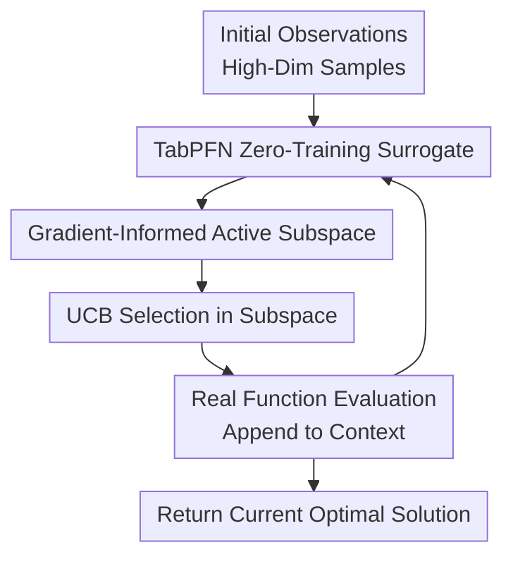

# GIT-BO: High-Dimensional Bayesian Optimization with Tabular Foundation Models

**Conference**: ICLR2026  
**OpenReview**: [https://openreview.net/forum?id=9iTdKS4SRQ](https://openreview.net/forum?id=9iTdKS4SRQ)  
**Code**: To be released  
**Area**: High-Dimensional Bayesian Optimization / Tabular Foundation Models  
**Keywords**: High-Dimensional Bayesian Optimization, TabPFN, Tabular Foundation Models, Active Subspace, UCB

## TL;DR
GIT-BO utilizes a frozen TabPFN v2 as a zero-training Bayesian optimization surrogate model, estimates a low-dimensional active subspace from the gradients of its predictive mean, and performs point selection using UCB within this subspace. It achieves a superior performance-time trade-off compared to various GP-based high-dimensional BO methods on synthetic and engineering optimization tasks up to 500 dimensions.

## Background & Motivation
**Background**: Bayesian Optimization (BO) is frequently used for optimizing expensive black-box functions, such as machine learning hyperparameters, engineering designs, material searches, and control policy searches. Classical BO typically relies on Gaussian Processes (GP) as surrogate models, using posterior means and uncertainties to decide the next query point, making it attractive in low-dimensional, small-sample scenarios.

**Limitations of Prior Work**: As problems reach hundreds of dimensions, the advantages of GP surrogates diminish rapidly. On one hand, the overhead of kernel matrix training and hyperparameter updates increases with sample size and dimensionality. On the other hand, choices such as kernel functions, length scales, sparse priors, trust region sizes, or embedding dimensions significantly impact results. Methods like SAASBO, TuRBO, BAxUS, random embeddings, and additive decomposition attempt to alleviate this, but they still incur parameter tuning and computational costs to balance "discovering low-dimensional structure" and "maintaining a reliable surrogate."

**Key Challenge**: High-dimensional BO requires two capabilities simultaneously: the surrogate model must quickly absorb existing observations to provide useful uncertainty, and the search strategy must identify promising directions for exploration. Tabular Foundation Models (TFM), particularly TabPFN v2, provide the former by treating observation history as context to output predictive means and variances in a single forward pass. However, performing global BO directly in high-dimensional space with a frozen TFM often leads to degradation due to excessive irrelevant dimensions.

**Goal**: The authors aim to answer a specific question: can frozen tabular foundation models like TabPFN truly be used for high-dimensional black-box optimization? If so, must they be combined with the structural discovery ideas of traditional high-dimensional BO? The ultimate goal is not just to prove that TabPFN inference is fast, but to enable it to stably find high-quality solutions in real-world engineering tasks ranging from 100 to 500 dimensions.

**Key Insight**: The paper observes that although TabPFN weights are frozen, its predictive mean for candidate points remains differentiable with respect to the input. This gradient field reflects the directions the model considers most sensitive for the target function under the current context. By aggregating these gradients into a Fisher-information-style matrix, a gradient-informed active subspace can be extracted, concentrating the search on a few effective directions.

**Core Idea**: Utilize TabPFN v2 for "zero-training posterior prediction," use predictive mean gradients for "active subspace discovery," and then employ UCB to select the next query point within that subspace. This combines the fast in-context inference of foundation models with the low-dimensional structure assumptions of high-dimensional BO.

## Method

### Overall Architecture
The input to GIT-BO is a $D$-dimensional black-box optimization problem and a set of initial observations. The output is the best sample found within a fixed query budget. In each iteration, it uses existing observations as context for TabPFN v2 to simultaneously predict the mean and variance of a large number of candidate points. Subsequently, it computes gradients of the predictive mean with respect to the input, estimates the active subspace using the outer product of gradients, and finally samples candidates in this low-dimensional subspace to select the next evaluation point via UCB.

The primary contributions lie in three nodes: the TabPFN zero-training surrogate, the gradient-informed active subspace, and UCB selection within the subspace. Initial sampling, evaluation, and returning the optimum are standard BO components; the core shift is the elimination of iterative GP training in favor of differentiable posteriors from a frozen TabPFN, which are converted into low-dimensional search directions.

### Key Designs
**1. TabPFN Zero-Training Surrogate: Turning optimization history into an in-context posterior**

Traditional BO often requires refitting a GP or re-estimating kernel hyperparameters whenever a new observation is added; in high dimensions, this step is slow and fragile. GIT-BO directly employs TabPFN v2 as the surrogate model, treating the current observation set $D_{obs}=\{(x_i,y_i)\}_{i=1}^n$ as context and the candidate set $X_{cand}=\{x_j\}_{j=1}^m$ as query inputs. A single forward pass of the frozen TabPFN $q_\theta$ yields predictive means and variances for all candidates: $\mu_m(x), \sigma_m^2(x) \sim q_\theta(Y_{cand}\mid X_{cand},D_{obs})$.

The key here is not simply "changing the regressor," but transforming posterior updates from an online training problem into a context-based inference problem. As new samples are appended to $D_{obs}$, the TabPFN parameters remain unchanged, but the predictions evolve with the context, approximating a Bayesian update. This reduces costs associated with GP retraining and manual kernel/prior tuning while providing a unified, differentiable, and reusable surrogate for gradient-based subspace estimation.

**2. Gradient-Informed Active Subspace: Finding the directions worth searching**

Applying TabPFN directly in $D$-dimensional space is insufficient because most directions are irrelevant to the target function. GIT-BO starts from the TabPFN predictive mean $\mu_m(x)$, calculates the gradient with respect to the input $\nabla_x\mu_m(x)$, and approximates the Fisher information matrix using the expectation of gradient outer products: $H=\mathbb{E}_\mu[\nabla_x\mu_m(x)\nabla_x\mu_m(x)^\top]$. Higher gradients in certain directions suggest the surrogate deems the target function more sensitive along those axes.

After obtaining $H$, the algorithm selects its top $r$ eigenvectors to form the gradient-informed subspace $V_r$. In main experiments, $r$ is fixed at 10 to avoid problem-specific tuning across 60 tasks. The search then occurs within a low-dimensional hypercube $z\sim U([-1,1]^r)$ mapped back to the original space via $X_{GI}=x_{ref}+V_rz$, where $x_{ref}=\bar{x}_{obs}$ is the center of existing observations. This centralized mapping ensures the search expands around explored regions while moving along directions judged most sensitive by the model.

**3. UCB Selection in Subspace: Using TabPFN mean and uncertainty for the next query**

Once subspace candidates $X_{GI}$ are generated, GIT-BO uses the Upper Confidence Bound (UCB) to choose the next point for evaluation. For each candidate, TabPFN provides the predictive mean $\mu(x)$ and standard deviation $\sigma(x)$, with the acquisition function defined as $\alpha_{UCB}(x)=\mu(x)+\beta\sigma(x)$. The mean term encourages the exploitation of promising areas, while the variance term encourages exploration of uncertain regions. The main experiments use a fixed exploration coefficient, approximately $\beta=2.33$, while the appendix discusses the relationships between sampling-UCB and quantile-UCB.

This UCB maximization is not performed blindly across the entire high-dimensional space but is restricted to the low-dimensional candidate set spanned by $V_r$. Thus, while uncertainty still originates from the TabPFN posterior-like output, the candidates have been filtered by the gradient subspace. In other words, GIT-BO delegates "where to search" to the gradient active subspace and "which point to pick" to UCB, preventing vanilla TabPFN from being diluted by irrelevant dimensions.

### Mechanism
Consider optimizing a 300-dimensional engineering target. Initially, 200 design points are evaluated using Latin Hypercube Sampling. In the first round, GIT-BO places these 200 $(x,y)$ pairs into the TabPFN context while drawing a batch of Sobol candidate points from the original search domain. TabPFN produces $\mu(x)$ and $\sigma^2(x)$ for these candidates via a forward pass. Subsequently, the algorithm backpropagates the predictive mean $\mu(x)$ with respect to the 300 input dimensions, yielding 300-dimensional gradients.

These gradients are aggregated into a $300\times300$ matrix $H$. If the top 10 eigenvectors explain the primary directions of variation, they form $V_{10}$. Multiple $z$ values are sampled uniformly in the 10-dimensional space and projected back to 300 dimensions via $x_{ref}+V_{10}z$, creating candidate designs that resemble "perturbations along important directions." Finally, UCB selects the point with the highest $\mu(x)+\beta\sigma(x)$ for evaluation, and the new sample is appended to the context. This process repeats, with the subspace updating alongside new TabPFN gradients.

This mechanism distinguishes the approach from random embedding methods: the subspace is neither fixed a priori nor obtained through auxiliary model training, but is re-estimated each round from the gradients of the current TabPFN posterior mean. It also differs from standard TabPFN-BO by using the foundation model as a fast, differentiable posterior engine rather than forcing it to handle all high-dimensional search pressure alone.

### Loss & Training
GIT-BO involves no online training loss, as TabPFN v2 maintains fixed weights during the BO process. Each "update" results from context expansion: the newly evaluated $(x_{next},y_{next})$ is added to $D_n$. In the next forward pass, TabPFN outputs new predictive means, variances, and gradients based on the extended context.

Key algorithmic hyperparameters include the number of initial samples, iteration budget, subspace dimension $r$, candidate sample size, and UCB exploration intensity $\beta$. Main experiments use 200 LHS initial samples, a 500-iteration budget, and a fixed $r=10$ across all comparisons on identical hardware. The appendix indicates that while $r=40$ may dilute the search, smaller or adaptively determined $r$ values often perform better; however, $r=10$ was fixed to avoid unfair per-task tuning.

## Key Experimental Results

### Main Results
GIT-BO was evaluated on 60 problem variants, including 9 scalable synthetic functions, multi-dimensional Rover, and real-world engineering tasks like Power Systems, MOPTA08, Mazda, and Walker. All methods ran with 200 initial samples, 20 random seeds, and a 500-iteration budget on H100 GPU nodes.

| Evaluation Dimension | GIT-BO | Main Baselines | Conclusion |
|----------------------|--------|----------------|------------|
| Overall Rank (60 tasks) | 1.92 | SAASBO / TuRBO / Vanilla BO / BAxUS / Random | GIT-BO achieved the best overall ranking and most stable solution quality. |
| Performance-Runtime Pareto | On Pareto frontier | TuRBO also on frontier | GIT-BO favors performance while TuRBO favors speed. |
| Synthetic Tasks Subset | Not first in all | BAxUS stronger on specific synthetic tasks | GIT-BO is robust, but tasks like Styblinski-Tang reveal distribution limits. |
| Engineering Tasks Subset | Rank 1 | BAxUS rank dropped | GIT-BO generalizes better to Power Systems and Automotive Design. |
| Dimension Range | Up to 500D | Same budget comparison | Maintains stable convergence as dimensionality increases. |

Convergence curves show that while GIT-BO does not always lead initially in Ackley 100-500D, its relative advantage grows with dimensionality. It achieves strong results on synthetic tasks like Rosenbrock 200D, Dixon-Price 400D, and Rastrigin 500D. In engineering tasks, it excels in Power Systems and Mazda design but shows weaker performance on Rover.

Regarding wall-clock time, while BAxUS sometimes achieves comparable or better final regret, it typically requires approximately an hour more; GIT-BO usually reaches competitive regret within minutes. This supports the core value proposition: providing a superior performance-time trade-off in high-dimensional expensive optimization.

### Ablation Study
| Configuration | Key Metric | Description |
|---------------|------------|-------------|
| vanilla TabPFN v2 + EI/UCB | Slow convergence, poor final regret | Frozen TabPFN alone is insufficient for high-dim search. |
| GIT-BO + GI subspace | Regret improved ~8.6x vs no GI subspace | Gradient-informed active subspace is the primary contributor. |
| Subspace dim $r=5$ | Avg Rank 3.25 | Small subspaces are often effective but conservative. |
| Subspace dim $r=10$ | Avg Rank 5.5 | Fixed for main experiments to emphasize fairness/no-tuning. |
| Subspace dim $r=40$ | Avg Rank 8.0 | Excessive subspace width dilutes the search. |
| Adaptive $r$ (92.5% variance) | Avg Rank 1.75 | Adaptive selection has potential to outperform fixed $r$. |
| UCB $\beta=1.65$ or $1.96$ | Avg Rank 2.0 / 2.25 | Moderate exploration is optimal. |
| UCB $\beta=2.45$ | Avg Rank 4.75 | Excessive exploration degrades performance. |
| uniform / random / Sobol | No clear winner | Uniform is stable; random/Sobol have higher variance. |

### Key Findings
- The gradient-informed active subspace is the key to GIT-BO's success, rather than TabPFN v2 alone. Vanilla TabPFN v2 with EI or UCB fails to handle high-dimensional BO stably; stability is regained only with the GI subspace.
- Rankings differ significantly between synthetic and real engineering benchmarks. BAxUS is strong on synthetic functions but drops on engineering tasks, whereas GIT-BO excels on the latter, suggesting synthetic tuning does not fully reflect real-world optimization capacity.
- Fixed $r=10$ is not the optimal hyperparameter. The appendix shows smaller $r$ or variance-based thresholds can be superior, but $r=10$ was used to avoid per-task tuning. This suggests room for improvement via automated subspace dimension selection.
- UCB exploration intensity needs to be moderate. Main experiments used a conservative fixed setting, but ablations found smaller $\beta$ values often performed better, indicating the current version might be slightly over-explorative.

## Highlights & Insights
- The most ingenious aspect is converting the "differentiable predictive mean" of TabPFN into a structural signal for high-dimensional BO. While many TFM-for-BO works focus on fast forward inference, this work utilizes gradients to discover effective low-dimensional directions, making the foundation model both a surrogate and a search space compressor.
- GIT-BO offers a pragmatic critique of GP-based high-dim BO: rather than claiming GPs are inherently flawed, it points out that repeated training, kernel selection, and trust region management are expensive in high dimensions. TabPFN eliminates online training costs via in-context inference, while the active subspace compensates for its lack of high-dimensional structural awareness.
- The experimental design is robust, covering 60 variants and reporting performance ranks, runtime ranks, Pareto frontiers, and iterative vs. runtime convergence. This is more persuasive than regret curves on a few synthetic functions.
- Negative results, such as those on Rover or Styblinski-Tang, provide value by highlighting how the pre-training distribution and bias of TabPFN affect surrogate quality. TFMs are not universal surrogates; their benefit depends on whether the in-context predictions and gradient fields accurately reflect the target function's structure.
- This methodology is transferable to other foundation-model surrogate scenarios. As long as a surrogate provides uncertainty and gradients, one can apply the "frozen model + gradient structure discovery + acquisition search" combination for material design, simulation calibration, or control policy search.

## Limitations & Future Work
- TabPFN v2 still has input dimensionality limits; experiments here peaked at 500D. Tasks involving thousands of dimensions or complex discrete/mixed variables may not be directly applicable to the current implementation.
- Memory consumption is a practical bottleneck. TabPFN inference requires significant GPU memory, and even without training, inference can be slower than simple GP fitting in TuRBO or Vanilla BO for small sample sizes.
- Subspace dimension $r$ and UCB exploration intensity $\beta$ currently require manual specification. While fixed values were used for fairness, automated dimension selection and adaptive $\beta$ are obvious directions for future improvement.
- Theoretical analysis relies on assumptions such as TabPFN approximating GP posteriors, bounded RKHS, and effective gradient subspaces. While useful for explanation, mismatches between TabPFN's pre-training distribution and engineering tasks may exist.
- Current experiments treat constrained and multi-objective problems as single-objective unconstrained via penalty transforms or weighted averaging. Natural extensions would include constrained BO, mixed-variable BO, and multi-objective BO.

## Related Work & Insights
- **vs SAASBO**: SAASBO uses sparse axis-aligned priors to automatically discover relevant dimensions, following the GP surrogate route. GIT-BO replaces online GP training with TabPFN and constructs subspaces using gradient directions. The former is more interpretable as a GP, while the latter performs better on engineering tasks and runtime.
- **vs TuRBO**: TuRBO employs local trust regions to avoid fitting global high-dim GPs, serving as a strong speed baseline. GIT-BO does not rely on trust regions but shrinks search directions via gradient subspaces. Results show TuRBO remains attractive for speed, while GIT-BO favors final performance.
- **vs BAxUS / random embedding BO**: BAxUS starts with low-dim embeddings and expands the subspace, which is effective for synthetic problems with low-dim structure. GIT-BO's subspace is data-driven, derived from surrogate gradients, and updates with observations. GIT-BO's directions are more adaptive but depend on gradient quality.
- **vs PFNs4BO / TabPFN-based BO**: Early PFN-for-BO works demonstrated that in-context Bayesian inference speeds up BO; this paper scales TabPFN v2 to 500D and demonstrates that vanilla TabPFN is insufficient without combination with an active subspace mechanism.
- **Insight**: For high-dimensional optimization, "foundation model surrogate + classical optimization structure" appears more reliable than simply replacing the surrogate. Future methods may follow this pattern: using pre-trained models for fast posteriors and traditional optimization theory for search constraints and interpretable structures.

## Rating
- Novelty: ⭐⭐⭐⭐☆ Combines TabPFN v2, predictive gradients, and active subspaces naturally. Individual components aren't new, but the combination effectively addresses high-dim BO pain points.
- Experimental Thoroughness: ⭐⭐⭐⭐⭐ 60 problem variants, 20 random seeds, real engineering tasks, and extensive ablations are comprehensive, reporting both performance and runtime.
- Writing Quality: ⭐⭐⭐⭐☆ Clear main narrative; algorithm diagrams and pseudocode are easy to follow. Some theoretical assumptions are strong, and implementation details rely heavily on the appendix.
- Value: ⭐⭐⭐⭐⭐ High practical value for expensive engineering optimization and high-dimensional BO, providing a clear paradigm for integrating tabular foundation models into optimization loops.

<!-- RELATED:START -->

## Related Papers

- [\[ICLR 2026\] From Sorting Algorithms to Scalable Kernels: Bayesian Optimization in High-Dimensional Permutation Spaces](from_sorting_algorithms_to_scalable_kernels_bayesian_optimization_in_high-dimens.md)
- [\[ICLR 2026\] DiffBED: Scaling Bayesian Experimental Design to High-Dimensions](diffbed_scaling_bayesian_experimental_design_to_high-dimensions.md)
- [\[ICLR 2026\] Scaling Multi-Task Bayesian Optimization with Large Language Models](scaling_multi-task_bayesian_optimization_with_large_language_models.md)
- [\[ICLR 2026\] Adaptive Acquisition Selection for Bayesian Optimization with Large Language Models](adaptive_acquisition_selection_for_bayesian_optimization_with_large_language_mod.md)
- [\[ICLR 2026\] DES-LOC: Desynced Low Communication Adaptive Optimizers for Foundation Models](des-loc_desynced_low_communication_adaptive_optimizers_for_foundation_models.md)

<!-- RELATED:END -->
