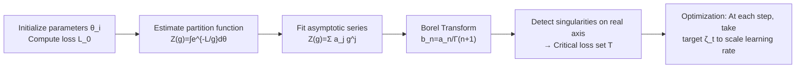

# Globally Aware Optimization with Resurgence

**Conference**: ICLR 2026  
**OpenReview**: [https://openreview.net/forum?id=dhnyoea2Qj](https://openreview.net/forum?id=dhnyoea2Qj)  
**Code**: To be confirmed  
**Area**: optimization  
**Keywords**: Non-convex optimization, resurgence theory, Borel transform, partition function, learning rate adaptation, global information  

## TL;DR
This paper introduces **resurgence theory** from mathematical physics into neural network optimization: it first calculates the divergent asymptotic series of the parameter space partition function $Z(g)=\int e^{-L(\theta)/g}\,d\theta$, then utilizes the Borel transform to map the singularities of this series to the values of the loss function at all critical points. This provides "target loss values" as **global information** to local gradient optimizers, packaged as a plug-and-play learning rate scheduler named SURGE.

## Background & Motivation
- **Background**: Modern non-convex optimization is almost entirely dominated by gradient-based methods (SGD, Adam, AdamW, Muon). Finding the global optimum in high-dimensional parameter spaces is NP-hard ($O(2^d)$ for exhaustive search); gradient methods are essentially "step-by-step local solutions" to this difficult problem.
- **Limitations of Prior Work**: Gradient methods are **inherently nearsighted**—they focus only on local curvature and remain oblivious to the global structure (where critical points are and what their values are). This leads to persistent issues such as sensitivity to initialization, convergence to suboptimal solutions, and the need for extensive hyperparameter tuning. While methods like the Polyak step use "known optimal loss values" to adjust step sizes, these optimal values are unattainable during neural network training.
- **Key Challenge**: The core objective of optimization is the **loss values at critical points**, which are global quantities; local computations (gradients) naturally fail to provide them. How can global structures be inferred using only locally computable information?
- **Goal**: To identify a "computable" channel that extracts global critical values from local information and feeds them to any gradient optimizer with minimal overhead.
- **Key Insight**: **[Divergent series hide global information]** In physics, perturbative expansions often yield factorially divergent series ($\sum n!g^n$), but their Borel transform $\sum \zeta^n=\frac{1}{1-\zeta}$ converges, and its singularities in the complex plane precisely encode non-perturbative information of the original function. This paper maps this mechanism such that: Borel singularities of the partition function's asymptotic series = loss values at the critical points of the loss function.

## Method

### Overall Architecture
SURGE (Singularity Unified Resurgent Gradient Enhancement) operates in two stages: an **analysis phase** (completed once at initialization) to calculate the set of global target values, and an **optimization phase** that uses these targets to dynamically scale the learning rate of any optimizer.

### Key Designs

**1. Partition function as a bridge: Framing optimization landscapes as statistical mechanics problems.** For parameters $\theta\in\mathbb{R}^d$ and loss $L(\theta)$, define a partition function $Z(g)=\int_{\mathbb{R}^d} e^{-L(\theta)/g}\,d\theta$ with "temperature" coupling $g>0$. As $g\to 0^+$, it possesses an asymptotic expansion $Z(g)\sim\sum_{n=0}^\infty a_n g^n$, where the coefficients $a_n$ encode the geometry of the landscape near critical points. For cross-entropy, $Z(g)=\int\prod_i p_\theta(y_i|x_i)^{1/g}d\theta$; for MSE, it becomes a Boltzmann distribution over Gaussian likelihood $\mathcal N(y;f_\theta(x),\sigma^2=g)$. This encapsulates "global landscape information" into a series that, while divergent, has computable coefficients.

**2. Borel singularities correspond to critical loss values: The theoretical anchor.** Given an asymptotic series, its Borel transform $B[Z](\zeta)=\sum_n \frac{a_n}{\Gamma(n+1)}\zeta^n$ converts the factorially divergent series into a convergent function, and its singularities on the positive real axis correspond to non-perturbative effects. The paper proves (Critical Point Correspondence): if $\theta^\*$ satisfies $\nabla L(\theta^\*)=0$, then $L(\theta^\*)$ is exactly a singularity of $B[Z](\zeta)$, providing a level-set expression $B[Z(g)](t)=\int_{t=L(x)}\frac{d\sigma(x)}{|\nabla L(x)|}$. Due to the constraint $t=L(x)$, **the singularity position $t_i$ is the loss value at the critical point itself**, which transforms "searching for critical points in exponentially large parameter space" into "searching for singularities on the $O(1)$ real axis of the Borel plane."

**3. Practical numerical pipeline: Variational lower bounds for $Z$ + Least squares series fitting + Singularity detection.** Estimating $Z(g)$ via Monte Carlo in high dimensions suffers from the curse of dimensionality. The authors use a sampler $q_\psi(\theta|g)$ with a concave lower bound $-\log\int e^{E}dq\ge -c-e^{-c}\int e^{E}dq+1$ to train an auxiliary network maximizing $J(\psi,c,g)=-c-\mathbb E_{q_\psi}[\exp(-E_\psi-c)]+1$. At optimality, $c^\*(g)=\log Z(g)$ provides a robust estimate. Subsequently, weighted least squares $\min\sum_s w_s(Z(g_s)-\sum_j a_j g_s^j)^2$ (where $w_s=1/(g_s+\epsilon)$ emphasizes small couplings) fits the coefficients. $b_n=a_n/\Gamma(n+1)$ is then used with the ratio criterion $R=\lim b_n/b_{n+1}$ or threshold $|\sum b_n\zeta_k^n|>\tau$ to locate singularities. The overall complexity is $O(N^2 Bp)$, which is linear with respect to network size.

**4. SURGE learning rate wrapper: Converting global targets into step-size scaling.** Define the critical target set $T=\{\zeta\in S(B[Z]):\zeta\in\mathbb R^+,\zeta<L_0\}$. At step $t$, select the nearest target below the current loss $\zeta_t=\max\{\zeta\in T:\zeta<L_{\text{current}}\}$, then update $\theta^{(t+1)}=\theta^{(t)}-\eta\cdot\alpha(k)\cdot\nabla L$, where $\alpha(k)=1+\lambda\cdot\min\!\big(\frac{L(\theta^{(t)})-\zeta_t}{L(\theta^{(t)})},1\big)$. The semantics are intuitive: when trapped in a local minimum far from the target, the second term approaches $\lambda$, amplifying the learning rate by $1+\lambda$ to facilitate escape; as $L \approx \zeta_t$, it reverts to the original optimizer. If Borel analysis fails, the algorithm **degrades gracefully** to a standard adaptive optimizer.

## Key Experimental Results

### Main Results

| Task | Architecture | Dataset | Baseline Optimizers |
|---|---|---|---|
| 1D Function Fitting | FC (12,10,8) | $f(x)=\sin 2x+0.5\cos 5x+0.3\sin 10x+0.1x^2$ | SGD/Adam/... |
| Classification | MLP | MNIST | SGD, Adam, AdamW, Muon |
| Text Generation | Small Transformer (~10k params) | Shakespeare | Adam, etc. |

### Key Findings
- The abstract reports consistent improvements of **15–30%** in final target loss across various tasks.
- The SURGE-wrapped versions (dashed lines) demonstrate **accelerated early convergence** and the ability to **rapidly escape local minima** compared to standalone optimizers.
- Side effects: "Aggressive" amplification of the learning rate can lead to training **instability**; if the original optimization process has poor generalization, SURGE may **accelerate overfitting**.
- Ablation studies (Appendix E, Fig. 5) replacing SURGE targets with random targets confirm that Borel targets are "meaningful" rather than arbitrary scalars providing speedup.

## Highlights & Insights
- **Elegant Interdisciplinary Synthesis**: Porting resurgence/Borel-Écalle tools from quantum field theory to optimization with a clear "asymptotic series singularity ↔ critical loss value" mapping supported by theorems.
- **Global Information at $O(1)$ Cost**: The search space is compressed to the positive real axis $(0,L_0)$, and analysis is performed only once at initialization. During optimization, it functions as a simple multiplier, making it **optimizer-agnostic** and plug-and-play.
- **Honest "Proof of Concept" Positioning**: The authors emphasize that this is a "coarse usage" of global targets, leaving more sophisticated applications as an open invitation to the community.

## Limitations & Future Work
- **Small Experimental Scale**: Experiments are limited to MNIST, small Transformers (~10k parameters), and 1D fitting, lacking head-to-head comparisons on modern large models with strong baselines, leaving the universality of the 15–30% improvement in question.
- **Stability and Overfitting Risks**: Violent learning rate scaling causes training oscillations and might amplify poor generalization, lacking an automatic stabilization mechanism.
- **Partition Function Estimation as a Bottleneck**: Reliable extraction of Borel coefficients in high dimensions depends on the numerical stability of the auxiliary network and series fitting; "degradation upon analysis failure" implies that valid targets may not be obtained for difficult landscapes.
- **Simple Target Utilization**: Currently, critical values are only used for linear learning rate scaling, without utilizing more structure of critical points (e.g., distinguishing between saddle points and minima).

## Related Work & Insights
- **Adaptive Optimization**: While Adam/AdamW/Muon use heuristic momentum and schedules, they are blind to global geometry. Polyak step and D-Adaptation use loss values for step sizing but require a known optimum—SURGE fills the gap by providing "computable optimal/critical values."
- **Non-convex Optimization via Sampling**: Langevin dynamics, Gibbs sampling, and SGLD also utilize the Boltzmann form $e^{-L/g}$ to explore landscapes; this work reuses the partition function but shifts the goal from "sampling" to "extracting singularities."
- **Mathematical Physics in ML**: This paper demonstrates the possibility of using Borel-Écalle resurgence, trans-series, and Lefschetz thimbles—tools previously used in field theory—to analyze high-dimensional optimization landscapes.

## Rating
- **Novelty**: ⭐⭐⭐⭐⭐ Using resurgence theory to map "divergent series singularities" to "critical loss values" is highly novel with almost no precedent.
- **Experimental Thoroughness**: ⭐⭐ Limited to toy or small-scale tasks, lacks comparison against large models/strong baselines, and relies mostly on curves rather than hard data tables.
- **Writing Quality**: ⭐⭐⭐⭐ Strong mathematical intuition (starting from the $\sum n!g^n$ example), clear connection between theorems and algorithms, and honest positioning.
- **Value**: ⭐⭐⭐⭐ As a proof of concept, it opens a new path for "guiding local optimization with global critical values" and introduces a versatile mathematical toolbox.

<!-- RELATED:START -->

## Related Papers

- [\[ICLR 2026\] Symmetry-Aware Bayesian Optimization via Max Kernels](symmetry-aware_bayesian_optimization_via_max_kernels.md)
- [\[ICLR 2026\] Non-Convex Federated Optimization under Cost-Aware Client Selection](non-convex_federated_optimization_under_cost-aware_client_selection.md)
- [\[ICML 2026\] Cost-Aware Stopping for Bayesian Optimization](../../ICML2026/optimization/cost-aware_stopping_for_bayesian_optimization.md)
- [\[ICLR 2026\] Deep-ICE: The First Globally Optimal Algorithm for Minimizing 0–1 Loss in Two-Layer ReLU and Maxout Networks](deep-ice_the_first_globally_optimal_algorithm_for_empirical_risk_minimization_of.md)
- [\[ICLR 2026\] Towards Understanding the Calibration Benefits of Sharpness-Aware Minimization](towards_understanding_the_calibration_benefits_of_sharpness-aware_minimization.md)

<!-- RELATED:END -->
