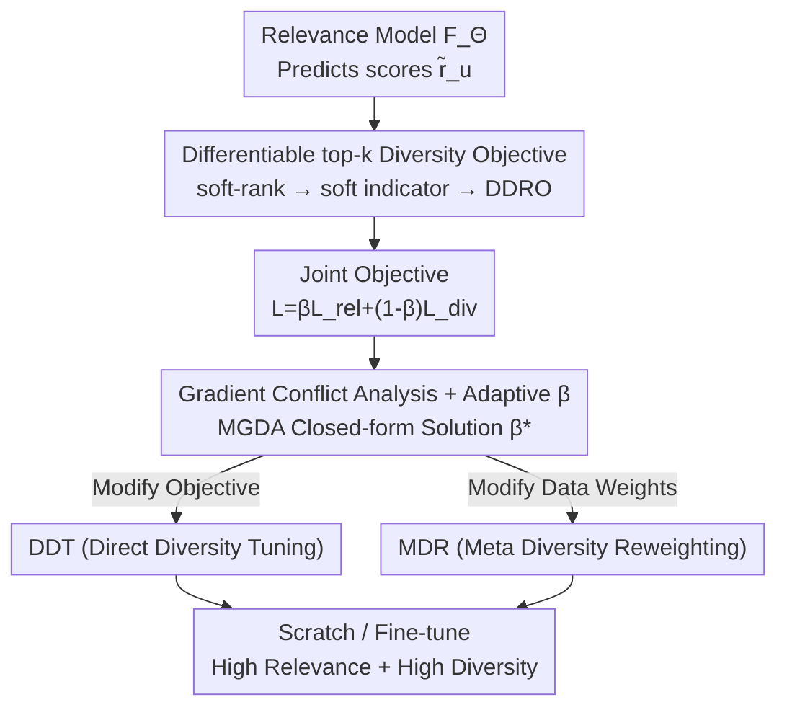

# Gradient-Based Diversity Optimization with Differentiable Top-$k$ Objective

**Conference**: ICLR 2026  
**OpenReview**: [https://openreview.net/forum?id=cuzWopwoZG](https://openreview.net/forum?id=cuzWopwoZG)  
**Code**: To be confirmed  
**Area**: Optimization / Multi-objective Learning / Differentiable Ranking  
**Keywords**: Differentiable Ranking, Top-k Diversity, Multi-objective Optimization, MGDA, Recommender Systems

## TL;DR
This work relaxes the inherently non-differentiable "top-$k$ set diversity" objective into a differentiable loss using soft-rank, enabling its integration into gradient-based training. By employing Multiple Gradient Descent Algorithm (MGDA) to adaptively balance the conflicting gradients of "relevance vs. diversity," the framework optimizes both objectives simultaneously without altering model architectures or requiring post-processing. It achieves significant diversity gains across five recommendation datasets with negligible loss in accuracy.

## Background & Motivation
**Background**: In tasks such as recommendation, retrieval, and ranking that involve selecting a top-$k$ set from a large pool of candidates, models are predominantly trained to optimize "relevance/accuracy" (using MSE or ranking losses to fit ground-truth ratings). Diversity is typically addressed as an afterthought, using either **post-processing re-ranking** (e.g., MMR, DPP) to refine the initial relevance-based ranking, or **model-specific learning methods** that hard-code diversity objectives into specific architectures.

**Limitations of Prior Work**: While post-processing methods (MMR/DPP) are model-agnostic and easy to implement, their performance is capped by the quality of the initial relevance ranking. Furthermore, increasing diversity almost invariably leads to a drop in accuracy—a phenomenon widely observed in the literature (Chen et al., 2017). Learning-based methods perform better but often require architectural changes or adversarial training, making them model-specific, slow to converge, and highly sensitive to the "relevance-diversity trade-off" hyperparameter. Data-side debiasing or re-weighting addresses distributional shifts but does not directly target top-$k$ diversity.

**Key Challenge**: The root problem lies in the dual challenge of **non-differentiability and multi-objective conflict**. Diversity is defined over the `topk(·)` discrete selection operator, which precludes gradient computation and end-to-end optimization alongside relevance. Even if differentiable, the gradients for relevance and diversity often point in opposing directions, meaning simple linear weighting inevitably sacrifices one for the other.

**Goal**: To develop a **unified, differentiable, and model-agnostic** framework that allows "relevance + top-$k$ diversity" to be optimized simultaneously during standard gradient training, supporting both training from scratch and fine-tuning of pre-trained relevance models.

**Key Insight**: The authors leverage "differentiable ranking" (specifically, the soft-rank by Blondel et al., 2020). Since discrete ranking can be relaxed as a projection onto the permutahedron, the top-$k$ indicator function can be relaxed into a differentiable soft indicator. This naturally makes the diversity objective differentiable. MGDA from multi-objective optimization is then employed to resolve gradient conflicts.

**Core Idea**: Use soft-rank to transform top-$k$ diversity into a differentiable proxy objective (DDRO). This is combined with the relevance loss into a joint objective, where MGDA adaptively solves for the trade-off coefficient $\beta$, ensuring both objectives descend towards a Pareto-stationary point.

## Method

### Overall Architecture
The method addresses how to incorporate a non-differentiable, conflicting diversity objective into standard gradient training. The mechanism is as follows: The model first predicts relevance scores $\tilde r_u$ for all candidates $\rightarrow$ soft-ranking transforms these scores into soft ranks, then into differentiable top-$k$ soft indicators $\tilde l_u$ $\rightarrow$ the differentiable diversity objective (DDRO) is calculated using these indicators $\rightarrow$ DDRO (negated) and relevance loss form a joint loss $\rightarrow$ MGDA identifies the optimal trade-off $\beta^\star$ online for the gradient update. Based on this differentiable objective, the authors propose two complementary strategies: **DDT** (modifying the training objective) and **MDR** (modifying data weights). Both can be used for training from scratch or fine-tuning.

### Key Designs

**1. Differentiable top-$k$ Diversity Objective (DDRO): Relaxing Discrete Selection**

The diversity objective is defined over the "selected top-$k$ set." However, selection is a discrete operation that blocks gradients. Consider the discrete version: given an item affinity matrix $S$, the diversity of a top-$k$ set $Z_u(k)$ is the average pairwise dissimilarity:

$$D_S(Z_u(k)) = \frac{2}{k(k-1)}\sum_{i=1}^{m}\sum_{j=1}^{m} l_u(i)\,l_u(j)\,(1-S_{i,j})$$

where $l_u=\mathrm{topk}(\tilde r_u)$ is a 0/1 indicator vector. The authors replace this with a soft indicator using differentiable ranking. Predicted scores $\tilde r_u$ are projected onto the permutahedron $P_m$ (the convex hull of all permutations of $(1,\dots,m)$) to obtain entropy-regularized soft ranks:

$$\tilde z_u^{(\varepsilon)} = \mathrm{softrank}(\tilde r_u) := \arg\min_{r\in P_m}\Big(\tfrac{1}{\varepsilon}\langle \tilde r_u, r\rangle + H(r)\Big),$$

A scaled sigmoid then converts "whether the soft rank falls within the top $k$" into a continuous indicator $\tilde l_u(i)=\sigma_\tau(k-\tilde z_u(i))$, where $\sigma_\tau(x)=[1+\exp(-x/\tau)]^{-1}$. Replacing the hard indicator in $D_S$ with $\tilde l_u$ yields DDRO. This is effective because soft-rank maintains $O(n\log n)$ time and $O(n)$ space complexity while providing approximation guarantees—as $\varepsilon\to 0$, soft ranks converge to true discrete ranks (Lemma 1). Experiments confirm that with $\varepsilon=1/n$, the ranking error is near zero.

**2. Gradient Conflict Analysis and Adaptive $\beta$: Ensuring "Common Descent"**

The authors formulate the relevance and diversity goals as a joint loss:

$$L_{\mathrm{JOINT}}(\beta,\Theta) = \beta\,L_{\mathrm{rel}}(\Theta) + (1-\beta)\,L_{\mathrm{div}}(\Theta),$$

where typically $L_{\mathrm{rel}}=L_{\mathrm{MSE}}$ and $L_{\mathrm{div}}=-L_{\mathrm{DDRO}}$. Since these objectives are often in conflict, any fixed linear combination might favor one over the other. Let $a=\|g_{\mathrm{rel}}\|$, $b=\|g_{\mathrm{div}}\|$, and $\rho$ be their cosine similarity. The authors define a feasible interval for $\beta$ such that the combined gradient $g_\beta=\beta g_{\mathrm{rel}}+(1-\beta)g_{\mathrm{div}}$ ensures descent for both losses (Lemma 3). To find a balanced update, they maximize the "minimum descent per step," yielding a closed-form solution for MGDA:

$$\beta^\star = \frac{b(b-a\rho)}{a^2+b^2-2ab\rho}.$$

This $\beta^\star$ equalizes the first-order descent of relevance and diversity, ensuring convergence to a Pareto-stationary point under decreasing step sizes (Corollary 4).

**3. DDT (Direct Diversity Tuning): Modifying the Training Objective**

DDT performs gradient optimization directly on $L_{\mathrm{JOINT}}$ using $\beta^\star$. Unlike existing learning methods that require specific architectures, DDT is completely model-agnostic, adding only a joint loss term. It supports both training from scratch and fine-tuning.

**4. MDR (Meta Diversity Reweighting): Modifying Objective via Data Distribution**

MDR preserves the standard relevance-only training loop but learns a weight $w_{u,i}\in[0,1]$ for each user-item pair to optimize a weighted relevance loss:

$$L^{w}_{\mathrm{MSE}} = \sum_{(u,i)\in B} w_{u,i}\,(R_{u,i}-\tilde R_{u,i})^2.$$

This uses meta-learning: the inner loop computes a temporary model $\Theta'$, while the outer loop uses $L_{\mathrm{JOINT}}$ as the **meta-objective** to compute gradients for $w$. This automatically assigns higher weights to "niche/long-tail" items to improve their exposure.

### Loss & Training
The framework is compatible with various relevance losses (MSE, BPR, etc.). Two deployment settings were tested: (i) Training from scratch; (ii) Fine-tuning on a pre-trained relevance model. Fine-tuning generally preserves relevance better, whereas training from scratch may converge to a less optimal relevance point.

## Key Experimental Results

### Main Results
Evaluation across five datasets (Coat, Yahoo-R2, Netflix, MovieLens, KuaiRec) using MF and NCF models. The affinity matrix $S$ used Jaccard similarity of genres/categories. Results for $k=10$ and fine-tuned MF (100 epochs) show:

| Method | MovieLens Div. | MovieLens Rel. | KuaiRec Div. | KuaiRec Rel. | Yahoo-R2 Div. | Yahoo-R2 Rel. |
|------|------|------|------|------|------|------|
| NMF (Rel. only) | 0.62 | 0.98 | 0.89 | 0.84 | 0.09 | 0.76 |
| DPP (Post-proc.) | 0.98 | 0.95 | 1.00 | 0.75 | **1.00** | 0.58 |
| DGRec (Graph) | 0.73 | 0.47 | 0.91 | 0.18 | 0.33 | 0.83 |
| **DDT (Ours)** | **1.00** | **1.00** | 0.98 | **0.95** | 0.98 | **0.85** |
| **MDR (Ours)** | 0.97 | 0.99 | 0.97 | 0.85 | 0.86 | 0.82 |

DDT achieves the best or second-best results across almost all metrics, significantly boosting diversity while maintaining relevance. In contrast, methods like DPP or DGRec often suffer from severe relevance degradation.

### Key Findings
- **Gain "Spillover" Effect**: Optimizing for top-$k$ diversity also improves diversity in deeper positions (e.g., $k+1$ to $2k$). This suggests gradient optimization reshapes the global ranking structure rather than just locally manipulating the top $k$ items.
- **Fine-tuning > Scratch**: Fine-tuning preserves the relevance of the pre-trained model. Training from scratch involves a harder convergence path where diversity regularization may impede relevance optimization.
- **Sensitivity to $\varepsilon$**: Accuracy depends on $\varepsilon$. While $\varepsilon=1/n$ is generally effective, larger $k$ requires smaller $\varepsilon$ to avoid distortion in the diversity measure.
- **Robustness of Fixed $\beta$**: Performance is stable across a wide range of $\beta$, only dropping when $\beta \to 0$ (omitting relevance).

## Highlights & Insights
- **Paradigm for Differentiable Set Objectives**: Combining soft-rank with sigmoid indicators provides a template for making any metric defined over discrete top-$k$ selection (e.g., coverage, exposure) differentiable.
- **Pareto Guarantees via MGDA**: The closed-form $\beta^\star$ provides a principled way to balance conflicting objectives, eliminating the need for exhaustive hyperparameter tuning.
- **Generalization through Optimization**: The "spillover" effect indicates that gradient-based tuning learns a more generalized representation of diversity compared to discrete re-selection.
- **Dual Perspectives (DDT vs. MDR)**: Shows that diversity can be achieved either by modifying the objective or the data distribution, with MDR being particularly effective for low-rank models.

## Limitations & Future Work
- **Reliance on $S$**: Diversity "meaning" is tied to the pre-defined affinity matrix $S$. Performance in scenarios with noisy or missing item attributes is unexplored.
- **Task Scope**: Evaluation is limited to Recommendation. The model-agnostic claim for tasks like document retrieval or active learning requires further empirical validation.
- **Numerical Stability of $\varepsilon$**: Very small $\varepsilon$ (needed for large $k$) can lead to numerical instability and vanishing gradients.
- **Scratch Training Convergence**: The drop in relevance when training from scratch suggests the need for better initialization or curriculum learning strategies.

## Related Work & Insights
- **vs. Post-processing (MMR/DPP)**: Post-processing is limited by the initial ranking. This work moves diversity directly into the gradient flow, allowing the model to learn a ranking that is inherently diverse.
- **vs. Model-specific Methods (DGRec)**: These require specific graph architectures or complex training. The proposed framework is architecture-neutral.
- **vs. Multi-objective Optimization**: While MGDA has been used for fairness or revenue, this is a novel application to the "relevance vs. diversity" trade-off facilitated by a differentiable top-$k$ proxy.

## Rating
- Novelty: ⭐⭐⭐⭐ Clean and generalizable combination of soft-rank and MGDA.
- Experimental Thoroughness: ⭐⭐⭐⭐ Strong results across multiple datasets, though limited to the recommendation domain.
- Writing Quality: ⭐⭐⭐⭐ Clear theoretical derivation and intuitive explanation.
- Value: ⭐⭐⭐⭐ Provides a reusable paradigm for optimizing top-$k$ set metrics.

<!-- RELATED:START -->

## Related Papers

- [\[ICML 2026\] Diversity-Driven Offline Multi-Objective Optimization via Nested Pareto Set Learning](../../ICML2026/optimization/diversity-driven_offline_multi-objective_optimization_via_nested_pareto_set_lear.md)
- [\[ICLR 2026\] Neural Multi-Objective Combinatorial Optimization for Flexible Job Shop Scheduling Problems](neural_multi-objective_combinatorial_optimization_for_flexible_job_shop_scheduli.md)
- [\[ICML 2026\] Accelerated Multiple Wasserstein Gradient Flows for Multi-objective Distributional Optimization](../../ICML2026/optimization/accelerated_multiple_wasserstein_gradient_flows_for_multi-objective_distribution.md)
- [\[ICML 2026\] A Fully First-Order Layer for Differentiable Optimization](../../ICML2026/optimization/a_fully_first-order_layer_for_differentiable_optimization.md)
- [\[ICLR 2026\] Gradient-Normalized Smoothness for Optimization with Approximate Hessians](gradient-normalized_smoothness_for_optimization_with_approximate_hessians.md)

<!-- RELATED:END -->
