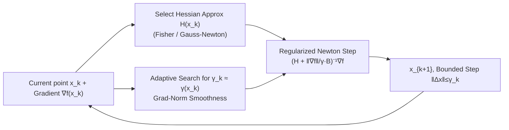

# Gradient-Normalized Smoothness for Optimization with Approximate Hessians

**Conference**: ICLR 2026  
**OpenReview**: [https://openreview.net/forum?id=Epu8Lm6VMK](https://openreview.net/forum?id=Epu8Lm6VMK)  
**Code**: [https://github.com/epfml/grad-norm-smooth](https://github.com/epfml/grad-norm-smooth)  
**Area**: optimization  
**Keywords**: second-order optimization, approximate Hessian, gradient-regularized Newton method, global convergence, adaptive step size, Fisher/Gauss-Newton  

## TL;DR
This paper proposes "Gradient-Normalized Smoothness," a problem-agnostic local characterization that enables gradient-regularized Newton-type methods using approximate Hessians to automatically adapt to the correct smoothness class, recovering optimal global convergence rates of exact Newton methods on both convex and non-convex objectives.

## Background & Motivation
- **Background**: Second-order methods (Newton-type) leverage curvature information to significantly accelerate convergence. When combined with cubic or gradient regularization, they achieve strong global complexity guarantees. However, practical large-scale deployment requires substituting the exact Hessian with **approximate Hessians** such as Fisher, Gauss-Newton, or quasi-Newton matrices.
- **Limitations of Prior Work**: Convergence theory for approximate Hessians is limited. There is a general concern that Hessian errors might degrade the convergence rate to the slow $O(1/\varepsilon^2)$ of gradient descent. Furthermore, each new smoothness class (Hölder Hessian, Quasi-Self-Concordant, $(L_0,L_1)$-smoothness, etc.) often requires a uniquely designed method and separate convergence proof.
- **Key Challenge**: The need for a universal method that automatically adapts to various problem classes and Hessian approximations while maintaining the optimal rates of exact Newton methods, rather than being limited by approximation errors.
- **Goal**: Establish a **problem-agnostic** unified framework that translates local gradient field information and Hessian approximation errors into global algorithmic behavior, providing universal global convergence guarantees for approximate second-order methods.
- **Core Idea**: **[Local Radius Characterization]** Define a new quantity $\gamma(x)$—the maximum radius of a ball around the current point where the relative error of the linear approximation of the gradient field $\nabla f(x+h)\approx\nabla f(x)+H(x)h$ remains small. Using this directly as the second-order step size allows the method to automatically adapt to the optimal smoothness class and approximation level.

## Method

### Overall Architecture
The method itself is minimal: it stabilizes a Newton step with an approximate Hessian using a scalar regularization term composed of the "gradient norm / step size." The iteration is:
$$x_{k+1}=x_k-\Big(H(x_k)+\tfrac{\|\nabla f(x_k)\|_*}{\gamma_k}B\Big)^{-1}\nabla f(x_k).$$
where $H(x_k)\succeq 0$ is the Hessian approximation and $\gamma_k>0$ is the second-order step size (ensuring $\|x_{k+1}-x_k\|\le\gamma_k$). The theoretical core lies in "how to choose $\gamma_k$": the ideal value is the newly defined gradient-normalized smoothness $\gamma(x_k)$, which is approximated via adaptive search in practice.

### Key Designs

**1. Gradient-Normalized Smoothness γ(x,g): Quantifying "Reliability Radius of Linear Approximation" as Step Size.** This is the conceptual foundation. For a point $x$ and direction $g$, it is defined as:
$$\gamma(x,g):=\max\Big\{\gamma\ge 0:\ \|\nabla f(x+h)-\nabla f(x)-H(x)h\|_*\le\tfrac{\|g\|_*\|h\|}{\gamma},\ \forall h\in B_\gamma\cap O_{x,g}\Big\},$$
denoting the maximum radius $\gamma$ of a Euclidean ball (intersected with a local ellipsoidal region $O_{x,g}$ for directional constraints) where the relative error of the linearization does not exceed $\|g\|_*\|h\|/\gamma$. Setting $g=\nabla f(x)$ yields $\gamma(x):=\gamma(x,\nabla f(x))$ used in the algorithm. A large $\gamma(x)$ indicates high reliability and low regularization (approaching pure Newton steps near minima for quadratic convergence); a small $\gamma(x)$ indicates a need for stronger regularization. This characterization **does not depend on specific problem class parameters** but encodes both local geometry and Hessian approximation into the step size.

**2. Unified Absorption of Two Error Types via γ(x): Inexact Hessian + Taylor Truncation.** The authors prove that $\gamma(\cdot)$ behaves well under common operations, such as scale invariance, affine transformation, function summation, and Hessian perturbation (satisfying a "harmonic mean" type lower bound). The inexact Hessian property is critical: if the exact Hessian is replaced by an approximation $H_2$ satisfying $\|H_1(x)-H_2(x)\|\le\|\nabla f(x)\|\cdot\gamma_{12}(x)^{-1}$, then $\gamma_2(x)\ge[\gamma_1(x)^{-1}+\gamma_{12}(x)^{-1}]^{-1}$. This implies that Taylor approximation errors (from smoothness) and Hessian approximation errors are merged into the **same scalar** $\gamma$ via a harmonic mean. Their shared nature allows for a "dominance relationship": when smoothness degree $\alpha \ge$ Hessian approximation degree $\beta$ and $C_1 \approx 0$, smoothness dominates, and the method achieves the **same global rate as exact Newton methods** (see phase diagram in Figure 1).

**3. Structural Lower Bounds of γ(x) → Automatic Recovery of Optimal Rates.** The authors express classic problem classes through a unified "harmonic mean of gradient norm monomials" lower bound:
$$\gamma(x)\ \ge\ \pi(\|\nabla f(x)\|_*):=\Big(\sum_{i}M_{1-\alpha_i}\|\nabla f(x)\|_*^{-\alpha_i}\Big)^{-1}.$$
The smallest exponent $\alpha=\min_i\alpha_i$ determines the smoothness class, while other exponents contribute to Hessian inexactness. This covers: Hölder continuous Hessian ($\tfrac12\le\alpha\le1$), Hölder third derivatives ($\tfrac13\le\alpha\le\tfrac12$), Quasi-Self-Concordant ($\alpha=0$), $(L_0,L_1)$-smoothness, and generalized self-concordant functions. For example, Lipschitz Hessian gives $\gamma(x)\ge\sqrt{2\|\nabla f(x)\|_*/L_{2,1}}$, corresponding to the $O(1/\varepsilon^{1/2})$ rate of cubic regularized Newton. Since $\gamma$ is local, it automatically selects the optimal class when multiple apply.

**4. Verifiable Conditions and Instantiations for Approximate Hessians.** In practice, most useful approximations satisfy a simple condition:
$$\|\nabla^2 f(x)-H(x)\|_*\le C_1+C_2\|\nabla f(x)\|_*^{1-\beta},\quad 0\le\beta\le1.$$
The authors provide several approximations satisfying this: **Fisher approximation** $H=\sum_i\nabla f_i\nabla f_i^\top$ for finite-sum structures (for logistic/softmax, $\beta=0, C_1=f^\star$, where $f^\star$ is small or zero for separable data); **Gauss-Newton** for non-linear operator combinations ($f=\tfrac1p\|u(x)\|^p$ or LogSumExp $f=s(u(x))$ with $C_1=0, \beta=0$). Combined with the harmonic property of $\gamma$, the total complexity equals the exact Newton complexity plus two additional terms determined by $C_1, C_2, \beta$ (Corollary 2). This elevates approximate Hessian methods for logistic regression and softmax to **global linear rates**, which is significant for first-order oracle access.

## Key Experimental Results
Code is open-sourced at `epfml/grad-norm-smooth`. Experiments validate the theory using convex and non-convex benchmarks, including Rosenbrock extensions and Chebyshev polynomial challenges.

### Main Results (Convergence Comparison)

| Setting | Problem | Comparison Object | Conclusion |
|---|---|---|---|
| Exact Hessian + Search $\gamma_k=\gamma(x_k)$ | LogSumExp (Softmax linear model) | Adaptive rules $\gamma_k=1/M_k$, $\gamma_k=\|\nabla f\|_*/M_k$ from Doikov et al. 2024a | Ours predicts optimal values and serves as upper bound for other heuristics. |
| Inexact Hessian + Search | LogSumExp | Same as above | Nearly identical speed to exact Hessian, validating error absorption by $\gamma$. |
| Exact Hessian | Non-linear systems (Example 7) | Gradient Method | Second-order method converges significantly faster ($\sim 100$ steps to $10^{-9}$ vs. stalling gradient method). |

### Complexity Comparison (Convex, Approx. Hessian, Ours vs. Exact Case)

| Problem Class | Exact Case $(C_1=C_2=0)$ | Ours (Approx. Hessian) |
|---|---|---|
| Bounded Hess. variation | $O(M_0D^2/\varepsilon)$ | $O((M_0+C_2)D^2/\varepsilon+C_1D^2/\varepsilon)$ |
| Lipschitz Hessian | $O(M_{1/2}D^{3/2}/\varepsilon^{1/2})$ | $O((M_{1/2}+C_2)D^{3/2}/\varepsilon^{1/2}+C_1D^2/\varepsilon)$ |
| Gen.-SC, $0<\alpha\le1/2$ | $O(M_{1-\alpha}D^{1+\alpha}/\varepsilon^\alpha)$ | Same + additional $C_1, C_2$ terms |
| Quasi-SC, $\alpha=0$ | $\tilde O(M_1D)$ | $\tilde O((M_1+C_2)D+C_1D^2/\varepsilon)$ |

### Key Findings
- **Phase Diagram (Figure 1)**: When smoothness degree $\alpha \ge$ Hessian approximation degree $\beta$, the problem class dominates, errors are absorbed, and the method matches the rate of full Newton; otherwise, Hessian inexactness dominates.
- A single adaptive step size rule reproduces both exact Newton and gradient descent limits and automatically lands on the correct intermediate rate.

## Highlights & Insights
- **Unified Scalar for Two Errors**: Encoding both Taylor truncation and Hessian approximation errors into $\gamma(x)$ reveals their intrinsic commonality, providing an elegant conceptual simplification.
- **Problem-Agnostic Adaptation**: Without prior knowledge of the target's smoothness class or parameters, the local $\gamma(x)$ automatically selects the optimal rate, eliminating the need for category-specific methods.
- **Alignment of Theory and Practical Approximation**: Fisher and Gauss-Newton approximations satisfy the required conditions. Consequently, logistic regression and softmax gain global linear rates while remaining computationally first-order (requiring only Hessian-vector products).

## Limitations & Future Work
- Theory assumes exact linear system solving (or CG approximation). The impact of linear solver overhead and precision on total complexity in large-scale settings requires further characterization.
- The quantity $\gamma(x)$ requires adaptive search. While search costs and stability are discussed in the appendix, scalability for ultra-high-dimensional problems remains to be fully demonstrated.
- When $C_1 > 0$ (e.g., logistic regression $C_1=f^\star$), an $O(1/\varepsilon)$ term remains, degrading to linear rates only when data is well-separable ($f^\star \approx 0$).
- Experiments focus on small-to-medium scale synthetic/classic challenges; validation on large-scale real-world tasks like deep networks is currently absent.

## Related Work & Insights
- **Gradient-Regularized Newton Methods** (Polyak 2009; Doikov & Nesterov 2023; Doikov et al. 2024a; Doikov 2023) form the basis for the algorithm's format and exact-case rates.
- **Cubic Regularization / Trust Region** (Nesterov & Polyak 2006; Cartis et al. 2011; Conn et al. 2000) are the two classic globalization routes; the step size boundedness in this work shares intuition with trust regions.
- **Hessian Approximation Taxonomy**: Quasi-Newton, spectral preconditioning, Fisher/Gauss-Newton, and sketching/subspace methods. This work provides unified global rates for approximations satisfying condition (12).
- **Emerging Problem Classes**: Relative smoothness, $(L_0,L_1)$-smoothness, generalized self-concordance. This paper suggests that "natural optimization formats are universal," adapting automatically without extra parameters.
- Insight: Instead of proving convergence separately for every Hessian approximation, algorithm designers should seek a "geometric radius" that absorbs both approximation and smoothness errors, delegating adaptation to the step size rule.

## Rating
- **Novelty**: ⭐⭐⭐⭐⭐ Gradient-normalized smoothness is a truly new, problem-agnostic local characterization that unifies two error types into a single scalar and recovers multiple optimal rates.
- **Experimental Thoroughness**: ⭐⭐⭐ Experiments focus on theoretical validation (LogSumExp, non-linear systems). Coverage of convex/non-convex benchmarks is complete but small-scale, lacking large-scale deep learning validation.
- **Writing Quality**: ⭐⭐⭐⭐ Theoretical flow is clear. The phase diagram and complexity table intuitively explain the dominance relationship between approximation and smoothness.
- **Value**: ⭐⭐⭐⭐ Provides a unified global convergence theory for approximate second-order methods, achieves global linear rates for logistic/softmax, and offers guidance for both theory and practice.

<!-- RELATED:START -->

## Related Papers

- [\[ICML 2026\] RMNP: Row-Momentum Normalized Preconditioning for Scalable Matrix-Based Optimization](../../ICML2026/optimization/rmnp_row-momentum_normalized_preconditioning_for_scalable_matrix-based_optimizat.md)
- [\[ICLR 2026\] Gradient-Based Diversity Optimization with Differentiable Top-$k$ Objective](gradient-based_diversity_optimization_with_differentiable_top-k_objective.md)
- [\[ICLR 2026\] Nesterov Finds GRAAL: Optimal and Adaptive Gradient Method for Convex Optimization](nesterov_finds_graal_optimal_and_adaptive_gradient_method_for_convex_optimizatio.md)
- [\[ICLR 2026\] Fast Data Mixture Optimization via Gradient Descent](fast_data_mixture_optimization_via_gradient_descent.md)
- [\[NeurIPS 2025\] Learning Sparse Approximate Inverse Preconditioners for Conjugate Gradient Solvers on GPUs](../../NeurIPS2025/optimization/learning_sparse_approximate_inverse_preconditioners_for_conjugate_gradient_solve.md)

<!-- RELATED:END -->
