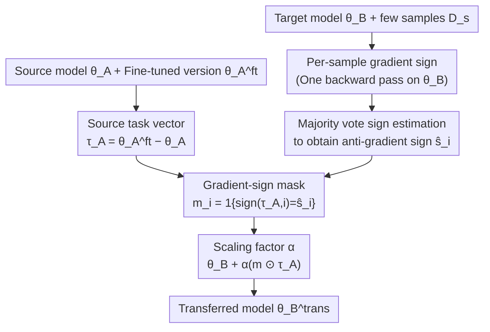

# Gradient-Sign Masking for Task Vector Transport Across Pre-Trained Models

**Conference**: ICLR 2026  
**arXiv**: [2510.09658](https://arxiv.org/abs/2510.09658)  
**Code**: [GitHub](https://github.com/fillo-rinaldi/GradFix)  
**Area**: Self-Supervised Learning / Model Merging / Transfer Learning  
**Keywords**: Task Vectors, Model Merging, gradient masking, Foundation Models, Transfer Learning

## TL;DR

The proposed GradFix method constructs a binary mask using the signs of gradients computed from a very small number of samples on a target pre-trained model. This mask filters the source model’s task vector coordinate-wise, retaining only components aligned with the descent direction of the target loss landscape. It achieves cross-model task knowledge transfer without any fine-tuning, theoretically provides a strict first-order descent guarantee, and significantly outperforms naive transfer and few-shot fine-tuning on both vision and language benchmarks.

## Background & Motivation

**Background**: Deep learning has shifted to a "pre-train + fine-tune" paradigm. Task Arithmetic has demonstrated that task vectors (the difference between fine-tuned and pre-trained parameters $\tau = \theta^{ft} - \theta^{0}$) can combine multiple capabilities on the same pre-trained model through linear arithmetic operations. Research in Model Rebasin attempts to map different pre-trained models into the same loss basin via permutation alignment, enabling cross-model parameter comparisons.

**Limitations of Prior Work**: Foundation models are iteratively updated (more data, better training strategies). After each update, users must repeat fine-tuning on the new model, as previous results accumulated on older models cannot be directly reused. Naively adding the old model's task vector $\tau_A$ to the new model $\theta_B$ is largely ineffective, performing close to zero-shot levels. This is because the parameter spaces are not aligned, and many components in the task vector act as "harmful directions" on the new model's loss landscape, increasing rather than decreasing loss.

**Key Challenge**: The task vector $\tau_A$ encodes valuable task adaptation information, but "good components" and "bad components" are intermixed. Existing methods like TransFusion attempt parameter alignment via permutation matching, but the improvements are limited and the computational complexity is high. The core problem is: **how to efficiently identify which coordinates are transferable and which will cause negative transfer?**

**Key Insight**: The authors draw a critical insight from distributed optimization literature; SignSGD shows that the sign information of the gradient is sufficient to indicate a reliable descent direction. Since the anti-gradient direction $-\mathbf{g}$ on the target model $\theta_B$ indicates the local optimal parameter update direction, retaining only coordinates in the task vector with signs consistent with $-\mathbf{g}$ filters out harmful components. Furthermore, majority voting allows stable estimation of gradient signs using only a very few labeled samples.

**Core Idea**: Use gradient signs estimated from a small number of samples on the target model as a binary mask. Retain components in the source task vector where signs align and discard those that are misaligned, achieving cross-model task transfer in a "one-step" fashion.

## Method

### Overall Architecture

The input consists of three parts: the source pre-trained model $\theta_A$ and its fine-tuned version $\theta_A^{ft}$, the target pre-trained model $\theta_B$, and a few labeled samples $\mathcal{D}_s$ for the target task. The workflow converges from two branches: the source branch performs a single subtraction to obtain the task vector $\tau_A = \theta_A^{ft} - \theta_A$; the target branch computes per-sample gradient signs on $\theta_B$ using $\mathcal{D}_s$ and applies majority voting to obtain the anti-gradient sign estimate $\hat{s}_i$ for each coordinate. The branches meet at the "Gradient-Sign Mask," where $\text{sign}(\tau_{A,i})$ is compared with $\hat{s}_i$ coordinate-wise to form a binary mask $\mathbf{m}$. This is multiplied by a scaling coefficient $\alpha$ and added back to the target model to obtain the transferred model $\theta_B^{trans} = \theta_B + \alpha(\mathbf{m} \odot \tau_A)$. The entire process involves no parameter updates or fine-tuning, requiring only a single forward-backward pass to collect signs.

### Key Designs

**1. Gradient-Sign Mask: Coordinate-wise filtering of components that increase target loss**

The root cause of naive transfer failure is that $\tau_A$ contains numerous coordinates pointing "uphill" on the $\theta_B$ loss landscape. Ideal filtering would require the true task vector $\tau_B$ (oracle) for sign comparison, but obtaining $\tau_B$ requires full fine-tuning of the target model, which is the exact cost to be avoided. The authors' breakthrough is: if the target model performs only one step of full-batch gradient descent, its task vector would be proportional to the anti-gradient $-\mathbf{g}$. Thus, anti-gradient signs act as a cheap proxy for $\tau_B$ signs. The binary mask is constructed as:

$$m_i = \mathbb{1}\{\text{sign}(\tau_{A,i}) = \text{sign}(-g_i)\},$$

where coordinates with aligned signs are retained, and misaligned ones are zeroed. This filtering is reliable as it provides a strict first-order descent guarantee: every retained coordinate satisfies $g_i \cdot (m_i \tau_{A,i}) = -|g_i||\tau_{A,i}| \leq 0$. Summing these yields the overall dot product $\mathbf{g}^\top \delta^A = -\alpha \sum_i m_i |g_i||\tau_{A,i}| \leq 0$. Thus, for a sufficiently small $\alpha$, the masked update direction inevitably reduces the target loss—no harmful components are included to push the loss higher.

**2. Majority Vote Sign Estimation: Stabilizing gradient signs with 1-5 samples per class**

The true gradient $\mathbf{g}$ requires data for estimation, yet the advantage of cross-model transfer is requiring "minimal labeled data." Sign estimation must therefore be stable even with few samples. The approach computes single-sample gradients independently for each sample in $\mathcal{D}_s$, takes the sign as a "vote," and performs majority voting per coordinate:

$$\hat{s}_i = \text{sign}\Big(-\sum_n \text{sign}\big(\nabla_\theta \ell(f_{\theta_B}(x_n), y_n)\big)\Big).$$

This is fundamentally different from "averaging gradients before taking signs"—it only considers the count of positive/negative votes per coordinate, ignoring magnitudes. Consequently, occasional outlier gradients cannot flip the outcome, enhancing robustness. Theoretically, using Hoeffding's inequality, it can be proven that if the probability of a single-sample sign being correct is $p_i > 1/2$, the probability of majority voting recovering the true sign converges exponentially with the number of samples $N$ as $1 - \exp(-2N(p_i - 1/2)^2)$. This explains why only 1-2 samples per class are sufficient for a usable mask.

**3. Scaling Factor $\alpha$: Balancing transfer magnitude and first-order approximation validity**

While the mask determines "which coordinates to keep," $\alpha$ determines "how far to move along them." The final update is $\theta_B^{trans} = \theta_B + \alpha(\mathbf{m} \odot \tau_A)$, with $\alpha \in (0, 1]$ selected via a validation set. The descent guarantee strictly holds for "sufficiently small $\alpha$"; if the step is too large, it exceeds the first-order approximation, and higher-order terms may increase the loss. However, combined with majority voting, performance remains stable across a wide range of $\alpha$ values without sharp drops. In contrast, mean aggregation methods suffer sudden performance degradation at larger $\alpha$ due to sign flips. Thus, the practical usable range for $\alpha$ is quite broad, minimizing the need for fine-tuning.

### Loss & Training

GradFix does not strictly involve a "training" process—it is a single-step transfer method without parameter updates. The entire procedure only requires one forward-backward pass for $|\mathcal{D}_s|$ samples on $\theta_B$ to collect gradient signs, followed by coordinate-wise masking and addition. Compared to few-shot fine-tuning, GradFix does not require setting learning rate schedules or iteration counts, and its computational cost is lower by one to two orders of magnitude.

## Key Experimental Results

### Main Results: Vision Cross-Model Transfer (ViT-B/16, 2 samples per class)

| Method | EuroSAT | SVHN | GTSRB | RESISC45 | DTD | Notes |
|------|---------|------|-------|----------|-----|------|
| $\theta_B$ zero-shot | 49.41 | 50.58 | 48.29 | 67.98 | 55.96 | Lower bound |
| $\theta_B + \tau_A$ (Direct) | 49.58 | 50.84 | 49.31 | 67.87 | 56.27 | Nearly ineffective |
| TransFusion | 50.12 | 53.26 | 50.24 | 67.99 | 56.70 | Permutation alignment, minimal gain |
| Few-shot FT $\theta_B^{opt}$ | 59.49 | 62.01 | 61.70 | 71.20 | 57.00 | FT with same data volume |
| **GradFix** $\theta_B + \delta^A$ | **65.07** | **70.19** | **64.33** | **71.42** | **58.51** | Outperforms few-shot FT |
| Oracle $\theta_B + \delta^\star$ | 95.06 | 92.04 | 82.92 | 87.06 | 71.44 | Upper bound (requires $\tau_B$) |
| $\theta_B$ Full FT | 98.70 | 97.45 | 98.65 | 95.66 | 83.19 | Theoretical upper bound |

### NLP Cross-Model Transfer (T5v1.1 → FLAN-T5, 50 samples per class)

| Method | SNLI | MNLI | RTE | QNLI | SCITAIL | AVG |
|------|------|------|-----|------|---------|-----|
| $\theta_B$ zero-shot | 34.24 | 35.21 | 47.20 | 50.54 | 50.38 | 43.51 |
| $\theta_B + \tau_A$ | 31.61 | 30.75 | 47.36 | 50.52 | 50.46 | 42.12 |
| Few-shot FT | 35.09 | 26.05 | 47.29 | 51.45 | 51.78 | 42.33 |
| **GradFix** | **68.06** | **49.68** | **54.25** | **60.50** | **59.89** | **58.48** |
| $\theta_B$ Full FT | 88.20 | 86.30 | 84.40 | 92.79 | 95.32 | 89.40 |

### Ablation Study: Masking Strategies (ViT-B/16, 1 sample per class)

| Mask Strategy | EuroSAT | GTSRB | SVHN | AVG | Notes |
|---------|---------|-------|------|-----|------|
| Sign Consistency (GradFix) | 61.94 | 60.89 | 71.07 | 64.45 | Retain aligned signs only |
| Forced Sign | 61.32 | 60.91 | 70.52 | 64.18 | Flip inconsistent signs, amplifies noise |
| Magnitude Weighting | 49.51 | 49.20 | 50.71 | 54.70 | Match magnitudes, over-filtering |
| Random Mask | 49.49 | 48.41 | 50.54 | 54.50 | No-signal baseline |

### Key Findings

- **Naive transfer completely fails**: Directly adding $\tau_A$ to $\theta_B$ yields performance similar to zero-shot, confirming that parameter space misalignment causes negative transfer.
- **GradFix outperforms few-shot fine-tuning**: With the same labeling budget, GradFix exceeds few-shot FT $\theta_B^{opt}$ on both ViT-B/16 and ViT-L/14, exhibiting lower variance and higher robustness.
- **Greater improvements in NLP**: In the T5v1.1 → FLAN-T5 transfer, GradFix provides a more significant Gain over naive transfer, suggesting sign filtering is more valuable when source-target pre-training differences are larger.
- **Magnitudes are not transferable**: Even in Oracle settings, masking strategies utilizing magnitudes performed worse than pure sign masking. This reveals a deep insight: direction information is transferable across pre-trained models, but magnitudes are highly dependent on individual loss geometries.
- **Majority vote superior to mean**: Performance remains consistent across a wide range of $\alpha$, avoiding sign flips caused by outlier gradients.
- **Compatible with model merging**: GradFix can be combined with Task Arithmetic and TIES-Merging. In multi-task settings, Merge-then-Mask performs best (AVG 66.02); in multi-source settings, Mask-then-Merge performs best (AVG 67.41).

## Highlights & Insights

- **Perfect theoretical-practical closure**: The first-order descent guarantee is derived from a few lines of Taylor expansion but accurately predicts experimental behavior—all retained coordinates successfully reduce loss. This "simple theory + strong validation" style is noteworthy.
- **"Directions transfer, magnitudes do not"**: This is one of the paper's most profound discoveries. it suggests that different pre-trained models learn similar "which direction should the task move" information in parameter space, yet "how far to move" is highly localized to their respective loss basins. This insight can guide future parameter-based model merging and transfer methods.
- **Zero-fine-tuning design for practical utility**: The method requires no parameter update loops, using only one forward-backward pass. This is highly valuable for resource-constrained scenarios or rapid adaptation, such as updating tasks after foundation model refreshes in edge deployment.

## Limitations & Future Work

- **Filtering without correction**: GradFix discards all sign-inconsistent coordinates, though some may contain valuable info requiring magnitude or direction adjustment. Future work could explore "soft masks" or direction correction instead of simple removal.
- **Architecture constraints**: Source and target models must share the same architecture (identical parameter counts and structures), limiting applicability to cross-architecture transfer.
- **$\alpha$ still requires a validation set**: While sensitivity is low for majority voting, the scaling factor remains the sole hyperparameter needing validation data.
- **Significant Oracle gap**: A gap of 20+ percentage points remains between GradFix (AVG ~65) and Oracle (AVG ~86), indicating few-shot gradient sign estimation is a coarse approximation. Better estimation strategies could further bridge this gap.
- **Integration with PEFT**: Task vectors are currently from full-parameter fine-tuning; the transferability of low-rank task vectors (e.g., from LoRA) warrants further study.

## Related Work & Insights

- **vs TransFusion**: TransFusion attempts parameter space alignment (rebasin) via permutation matching, which is computationally complex and yields minimal gains (only slightly better than naive addition). GradFix bypasses alignment, performing local filtering on the target loss landscape—simpler and more effective.
- **vs TIES-Merging**: TIES resolves parameter conflicts in multi-task merging through sign consistency, but its "signs" come from the task vectors themselves. GradFix's "signs" originate from the target model's gradient—a fundamental difference: the former resolves task conflicts, the latter resolves cross-model alignment.
- **vs SignSGD**: GradFix can be viewed as an innovative application of SignSGD principles to model merging/transfer. While SignSGD uses sign info to compress gradient communication, GradFix uses it to filter task vectors; both leverage the insight that "signs are more robust than magnitudes."

## Rating

- Novelty: ⭐⭐⭐⭐ The gradient-sign mask is elegant and simple, though essentially a transfer application of SignSGD principles.
- Experimental Thoroughness: ⭐⭐⭐⭐⭐ Comprehensive coverage across Vision and NLP domains, single/multi-task/multi-source settings, and extensive ablation of masking strategies with solid theoretical analysis.
- Writing Quality: ⭐⭐⭐⭐⭐ Clear logical flow from motivation to theory to experiments, with a natural transition from Oracle derivation to the practical method.
- Value: ⭐⭐⭐⭐ Highly practical and lightweight, though limited to same-architecture transfer and still trailing the Oracle significantly.

<!-- RELATED:START -->

## Related Papers

- [\[ICML 2025\] Adjustment for Confounding using Pre-Trained Representations](../../ICML2025/optimization/adjustment_for_confounding_using_pre-trained_representations.md)
- [\[ICLR 2026\] LMask: Learn to Solve Constrained Routing Problems with Lazy Masking](lmask_learn_to_solve_constrained_routing_problems_with_lazy_masking.md)
- [\[ICLR 2026\] HOTA: Hamiltonian Framework for Optimal Transport Advection](hota_hamiltonian_framework_for_optimal_transport_advection.md)
- [\[ICML 2025\] Provable In-Context Vector Arithmetic via Retrieving Task Concepts](../../ICML2025/optimization/provable_in-context_vector_arithmetic_via_retrieving_task_concepts.md)
- [\[ICLR 2026\] ConRep4CO: Contrastive Representation Learning of Combinatorial Optimization Instances across Types](conrep4co_contrastive_representation_learning_of_combinatorial_optimization_inst.md)

<!-- RELATED:END -->
