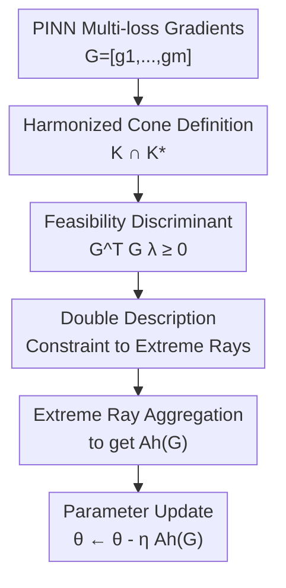

# Harmonized Cone for Feasible and Non-conflict Directions in Training Physics-Informed Neural Networks

**Conference**: ICLR2026  
**OpenReview**: [https://openreview.net/forum?id=PRYl1mO1go](https://openreview.net/forum?id=PRYl1mO1go)  
**Code**: Reproducible experimental code provided in supplementary materials  
**Area**: Optimization / Physics-Informed Neural Networks  
**Keywords**: PINN Training, Multi-Objective Optimization, Gradient Conflict, Loss Reweighting, Cone Geometry  

## TL;DR
The paper unifies "implementability by non-negative loss weights" and "avoiding loss increase for any component" into a harmonized cone. It proposes HARMONIC, which uses the Double Description method to construct update directions within this cone, consistently outperforming existing reweighting and multi-objective gradient methods across multiple PDE / IDE benchmarks.

## Background & Motivation
**Background**: Physics-Informed Neural Networks (PINNs) represent PDE solutions through neural networks and integrate PDE residuals, initial conditions, boundary conditions, and auxiliary physical constraints into the training loss via automatic differentiation. A typical training objective is not a single loss but a combination of several physics-related losses; for instance, a single equation might involve PDE residuals, initial loss, and boundary loss, while complex tasks may add integral constraints, observational data, or auxiliary variable constraints.

**Limitations of Prior Work**: Multi-loss setups often lead to ill-conditioned gradient dynamics in PINN training. One category of methods employs adaptive reweighting (e.g., LRA, NTK, ReLoBRaLo) to mitigate scale imbalance by adjusting loss coefficients; however, these only guarantee that updates originate from a non-negative weighted sum and do not ensure that the direction actually reduces every loss simultaneously. Another category draws from multi-objective optimization (e.g., MGDA, PCGrad, CAGrad, Aligned-MTL, ConFIG), attempting to make update directions non-conflicting with each individual loss gradient. Yet, when pursuing non-conflict alone, the resulting direction may not be representable as a non-negative combination of gradients, potentially corresponding to implicit objectives with "negative weights," causing the training to deviate from the original PINN physical constraints.

**Key Challenge**: PINNs do not follow the "trade-off between tasks" setting typical in standard multi-task learning. PDE residuals, boundary conditions, and initial conditions must all converge to zero. Therefore, a high-quality update direction must satisfy two criteria: first, it should be feasible, meaning it is explainable as $\nabla_\theta \sum_j \lambda_j L_j$ with $\lambda_j \ge 0$; second, it should be non-conflicting, meaning its inner product with each individual gradient $g_j=\nabla_\theta L_j$ is non-negative, ensuring that updating in the negative direction does not satisfy one constraint at the expense of another. Previous methods often maintain only one of these properties.

**Goal**: The authors aim to answer a geometric question: Given the set of gradients for all losses, which directions are simultaneously "producible by non-negative reweighting" and "non-conflicting for every loss"? If such a region exists, "how can a training direction be computationally selected from it?" Furthermore, they seek to prove that this strategy possesses Pareto-stationary convergence properties for non-convex objectives and verify that it does not introduce significant overhead to PINN training.

**Key Insight**: The paper analyzes multi-loss gradients through the lens of cone geometry. All non-negatively weighted gradients span a primal gradient cone $K$, representing feasible directions. All directions having non-negative inner products with every loss gradient constitute a dual gradient cone $K^*$, representing non-conflicting directions. Consequently, a "good direction" is naturally defined by the intersection $K \cap K^*$. This intersection is not a heuristic weight or a pairwise projection but a direct characterization of the optimal direction set for PINN multi-loss training.

**Core Idea**: Define the harmonized cone $H$ as the intersection of the primal and dual cones, then transform current gradient constraints into extreme rays and aggregate them to update PINN parameters within this "feasible and non-conflicting" region.

## Method

### Overall Architecture
The input to HARMONIC is the gradient matrix $G=[g_1,\ldots,g_m]$ of all losses with respect to network parameters at the current iteration, and the output is an update direction $A_h(G)$ to replace standard weighted gradients. It first formulates "non-negative loss weights" and "non-conflict across all losses" as a single cone constraint, then utilizes the Double Description method to convert the constraint form into generating rays, and finally maps these rays back to the parameter space for normalized aggregation. The focus is not on redesigning PINN architectures but on correcting how multi-loss gradients are synthesized after each backpropagation.

The nodes in this diagram correspond to the key designs below: the harmonized cone defines the target region, the feasibility discriminant converts the region into operable constraints, and the Double Description with extreme ray aggregation handles the actual generation of the update direction. The innovtion is the synthesis of gradients rather than the sampling points, network structure, or the Adam/SGD optimizer framework.

### Key Designs
**1. Harmonized Cone: Unifying Feasibility and Non-conflict into One Geometric Region**

The paper defines the gradient matrix for $m$ losses as $G=[g_1,\ldots,g_m]$, where $g_j=\nabla_\theta L_j$. All non-negative reweighting directions form the primal gradient cone: $K=\{G\lambda\mid \lambda\in\mathbb{R}_+^m\}$. If an update direction falls within $K$, it can be interpreted as the gradient of a non-negatively weighted total loss, satisfying the feasibility requirement in PINN training.

Conversely, the dual gradient cone is defined as $K^*=\{y\in\mathbb{R}^d\mid G^\top y\ge 0_m\}$. When a direction $y$ lies in $K^*$, its inner product with every loss gradient is non-negative; using $-y$ for updates ensures no loss is pushed higher under first-order approximation. The key definition is the harmonized cone $H=K\cap K^*$, which can be written as $H=\{z\mid G^\top z\ge 0_m, D^\top z\ge 0_m\}$, where $D$ is the Moore-Penrose pseudo-inverse of $G^\top$. This merges the "reweighting" and "non-conflict" lines of research into a single criterion.

**2. Feasibility Discriminant: Checking Conflict via $G^\top G\lambda\ge 0$**

In practice, the most natural feasible direction is $G\lambda$. While $G\lambda$ automatically belongs to $K$, it does not necessarily belong to $K^*$; a valid loss weighting might still result in a negative inner product with a specific loss gradient. Theorem 1 provides a concise condition: for $\lambda\ge 0$, $G\lambda\in H$ if and only if $G^\top G\lambda\ge 0_m$.

This reduces the high-dimensional check in parameter space to an $m$-dimensional constraint in the loss space. $G^\top G$ is the Gram matrix of gradients, recording alignment or conflict between losses. If a weight $\lambda$ results in any negative component in $G^\top G\lambda$, the synthesized direction conflicts with a specific loss despite having non-negative weights. Theorem 2 provides the dual side $D^\top D w\ge 0_m$, explaining why purely non-conflicting directions may be infeasible.

**3. Double Description and Extreme Ray Aggregation: Implementing Cone Constraints**

Instead of solving a black-box optimization at each step, HARMONIC converts the half-space representation of the harmonized cone into an extreme ray representation. It constructs a constraint matrix $A=[I_m; G^\top G/\|G\|^2]$ for $\lambda$, where $I_m$ ensures $\lambda\ge 0$ and the Gram constraint ensures no conflict. The Double Description method processes these constraints row-by-row, generating new candidate rays from positive and negative sides of new constraints and pruning duplicates to obtain $\Pi=[\pi_1,\ldots,\pi_p]$.

The algorithm then maps each ray back to parameter space: $r_j=G\pi_j$. These $r_j$ are the extreme rays of the harmonized cone. HARMONIC sums these normalized rays to obtain $\hat d$ and scales it by the total projection of loss gradients: $A_h(G)=(\mathbf{1}_m^\top G^\top \hat d)\hat d$. This prevents degradation to a single ray and ensures the update remains within the harmonized cone.

**4. Non-degeneracy and Convergence: Preventing Loss Sacrifice**

Many multi-objective methods might satisfy geometric properties but degenerate by only serving one loss (e.g., MGDA might align entirely with the smallest gradient). This paper emphasizes non-degenerate scaling, ensuring every loss retains a non-trivial contribution. In PINNs, ignoring initial, boundary, or residual terms can destroy the physical solution.

Theoretically, the authors prove $H$ is non-empty and contains non-trivial elements. Theorem 4 shows that the minimum norm point $u^*$ in the convex gradient hull $U$ belongs to $H$ and $\|u^*\|>0$ under full-rank assumptions. Theorem 3 provides convergence bounds for non-convex settings: if the total gradient is Lipschitz and the step size $\eta\le 2/\mu$, HARMONIC converges to a Pareto-stationary point or ensures the average total gradient norm decreases as $O(1/\sqrt{T})$.

### Loss & Training
The physics-informed loss functions remain unchanged. The method replaces the synthesis strategy of multi-loss gradients. For a PINN with PDE, initial, boundary, and auxiliary losses, HARMONIC computes $g_j=\nabla_\theta L_j$ and uses $A_h(G)$ to update parameters: $\theta^{(t+1)}=\theta^{(t)}-\eta^{(t)}A_h(G^{(t)})$.

Experiments follow the PINNacle / A-PINN benchmarks: a 3-layer network with 50 neurons per layer, trained for 50,000 iterations using tanh activation, Glorot normal initialization, and default optimizer settings. Results are compared at learning rates of $10^{-3}$ and $10^{-4}$, reporting the best results. For Navier-Stokes problems with up to 8 losses, the method demonstrates that the Double Description step remains computationally feasible.

## Key Experimental Results

### Main Results
Experiments cover Wave1d-C, Poisson2d-C, HNd, HInv from PINNacle, and Volterra1d from A-PINN. The metric is relative L2 error (lower is better) across 5 seeds. Poisson2d-C shows the most significant gap: while many baselines stagnate around $0.5$ to $0.7$, HARMONIC reaches $0.0214$.

| Dataset | Metric | HARMONIC | Strongest/Representative Baseline | Gain Interpretation |
|--------|------|----------|----------------|----------|
| Wave1d-C | relative L2 error | 0.0655 (0.0293) | ConFIG 0.0668 (0.0279) | Comparable to the strongest non-conflict method. |
| Poisson2d-C | relative L2 error | 0.0214 (0.0179) | Aligned-MTL 0.2847 (0.2363) | Significant reduction; highlights importance of feasibility. |
| HNd | relative L2 error | 0.0005 (0.0000) | ReLoBRaLo 0.0004 (0.0000) / CAGrad 0.0005 (0.0001) | Near optimal; differences are negligible. |
| Volterra1d | relative L2 error | 0.0003 (0.0001) | ReLoBRaLo 0.0002 (0.0000) | Near optimal; consistently better than most MOO methods. |
| HInv | relative L2 error | 0.0461 (0.0098) | ConFIG 0.0466 (0.0068) | Slightly better than ConFIG; significantly better than reweighting failures. |

The baselines include MultiAdam, LRA, ReLoBRaLo, MGDA, PCGrad, CAGrad, IMTL-G, Aligned-MTL, and ConFIG. Generally, non-conflict methods outperform simple reweighting, but standalone non-conflict methods still suffer from infeasible updates in specific datasets.

### Ablation Study
Rather than standard module removal, the authors performed intervention experiments: when a baseline direction $A(G)$ leaves the harmonized cone $H$, it is pulled back into $H$ using HARMONIC. Results show adding the harmonized cone constraint improves performance across ReLoBRaLo, CAGrad, and ConFIG, particularly in Poisson2d-C.

| Configuration | Poisson2d-C relative L2 | Notes |
|------|-------------------------|------|
| ReLoBRaLo | 0.6602 (0.0221) | Pure adaptive reweighting; prone to conflict. |
| H-ReLoBRaLo | 0.0948 (0.1763) | Switched to HARMONIC when leaving $H$; error drops significantly. |
| CAGrad | 0.7806 (0.1553) | Pulled by mean gradient; may not satisfy all conditions. |
| H-CAGrad | 0.0312 (0.0122) | Approached HARMONIC results after cone constraint. |
| ConFIG | 0.6954 (0.4296) | Guaranteed non-conflict, but potentially infeasible. |
| H-ConFIG | 0.0094 (0.0022) | Significantly more stable than original ConFIG on this task. |

### Key Findings
- Poisson2d-C is the most compelling case: ReLoBRaLo and ConFIG repeatedly exit $H$ during training, leading to stagnation; correctives via HARMONIC allow error to converge toward zero.
- Toy examples demonstrate that feasible conic combinations are dominated by large-norm losses, while purely non-conflict directions can converge prematurely outside the Pareto front; HARMONIC converges to the Pareto front from multiple initials.
- Computational overhead is contained. HARMONIC's time per 100 epochs is comparable to ConFIG/Aligned-MTL and significantly faster than MGDA/CAGrad which require iterative optimization per step.
- In two-loss settings, HARMONIC, DCGD, and ConFIG perform similarly due to simpler geometric conditions; the value of HARMONIC lies in PINNs with three or more losses.

## Highlights & Insights
- The most elegant aspect of this work is the clear separation of the two often-conflated issues in PINN training: "non-negative weight interpretability" (reweighting) and "no loss increase" (MOO). The $K\cap K^*$ formulation makes baseline failures intuitive.
- The critique of methods like ConFIG is insightful: an update can have positive projections on all gradients but still fall outside the primal cone. For PINNs, this means the update no longer corresponds to the original physical constraint combination, causing poor generalization or test error despite short-term loss reduction.
- The use of Double Description is clever. It exploits the structure where the number of losses $m$ is much smaller than parameter dimension $d$, finding extreme rays in $m$-dimensional space.
- The harmonized cone is transferable to other multi-loss scenarios where all objectives must be met simultaneously rather than traded off, such as learning with conservation laws or constrained reinforcement learning.

## Limitations & Future Work
- The method requires independent gradients for each loss, incurring per-loss gradient memory and backpropagation scheduling costs, which may be significant for massive models.
- The complexity of the Double Description method grows with the number of losses. While tested on up to 8 losses, its practicality for tasks with dozens of objectives is not yet proven.
- Experiments focus on small-to-mid-sized PINNacle / A-PINN benchmarks with small networks. Real-world engineering PDEs with complex geometries and high-dimensional coupling may involve additional variables like gradient noise or sampling strategies.
- HARMONIC assumes all losses should be maintained equally; however, some tasks may require preferences (e.g., boundary conditions being strictly more important than auxiliary regularizers).

## Related Work & Insights
- **vs LRA / NTK / ReLoBRaLo**: These focus on scaling; updates remain in the primal cone $K$ but do not check for conflict. HARMONIC adds the non-conflict requirement.
- **vs MGDA**: MGDA finds the minimum norm point in the convex hull, providing a feasible and non-conflicting direction, but may degenerate and ignore certain gradients. HARMONIC preserves non-degenerate scaling.
- **vs PCGrad / CAGrad / IMTL-G**: These use projections or mean-gradient searches to mitigate conflict but are often heuristic and do not simultaneously guarantee feasibility, non-conflict, and non-degeneracy.
- **vs Aligned-MTL / ConFIG**: These prioritize non-conflict, but their directions may fall outside the primal cone, losing interpretability as non-negative reweighting. HARMONIC fixes this via the $K\cap K^*$ intersection.
- **vs DCGD**: DCGD also uses dual cone geometry but does not extend easily beyond two losses. HARMONIC's Double Description approach handles multi-loss PINN scenarios.

## Rating
- Novelty: ⭐⭐⭐⭐⭐ Effectively unifies reweighting and non-conflict via the harmonized cone, specifically targeting PINN pain points.
- Experimental Thoroughness: ⭐⭐⭐⭐ Extensive coverage of benchmarks, intervention experiments, and timing; however, massive engineering cases are pending.
- Writing Quality: ⭐⭐⭐⭐ Clear logic and intuitive geometric explanations, though proofs are dense.
- Value: ⭐⭐⭐⭐⭐ Highly practical for PINN multi-loss training and provides a reusable perspective for constrained multi-objective optimization.

<!-- RELATED:START -->

## Related Papers

- [\[ICLR 2026\] Fast Convergence of Natural Gradient Descent for Over-parameterized Physics-Informed Neural Networks](fast_convergence_of_natural_gradient_descent_for_over-parameterized_physics-info.md)
- [\[ICLR 2026\] Difference Predictive Coding for Training Spiking Neural Networks](difference_predictive_coding_for_training_spiking_neural_networks.md)
- [\[ICLR 2026\] Rapid Training of Hamiltonian Graph Networks using Random Features](rapid_training_of_hamiltonian_graph_networks_using_random_features.md)
- [\[ICLR 2026\] Directional Convergence, Benign Overfitting of Gradient Descent in leaky ReLU two-layer Neural Networks](directional_convergence_benign_overfitting_of_gradient_descent_in_leaky_relu_two.md)
- [\[ICLR 2026\] LDT: Layer-Decomposition Training Makes Networks More Generalizable](ldt_layer-decomposition_training_makes_networks_more_generalizable.md)

<!-- RELATED:END -->
