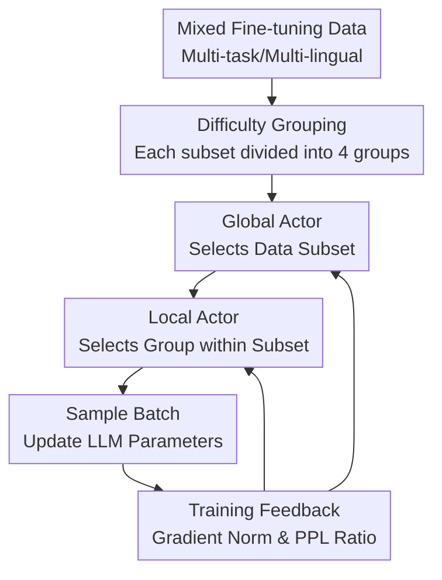

# HBO: Hierarchical Balancing Optimization for Fine-Tuning Large Language Models

**Conference**: ICLR2026  
**OpenReview**: [https://openreview.net/forum?id=JnhahbMvRE](https://openreview.net/forum?id=JnhahbMvRE)  
**Code**: https://github.com/weixuan-wang123/HBO  
**Area**: LLM Fine-tuning Optimization / Data Sampling / Multi-task Training  
**Keywords**: Hierarchical Sampling, Bi-level Optimization, Data Mixing, LLM Fine-tuning, Dynamic Curriculum Learning

## TL;DR
HBO decomposes the data mixing problem in LLM instruction fine-tuning into two levels: "how to sample across datasets" and "how to sample within each dataset according to difficulty." Using Global and Local Actors to dynamically update sampling probabilities based on the training state, HBO consistently outperforms static sampling and existing dynamic data mixing methods in multilingual and multi-task fine-tuning.

## Background & Motivation
**Background**: Supervised fine-tuning (SFT) of large models no longer relies on a single dataset but mixes instruction-response data from various tasks, domains, and languages. This mixed data enhances generalization: the model encounters general chat data alongside specialized data (mathematics, finance, medicine, etc.) in multiple languages, making it less likely to be limited to a single capability in downstream tasks.

**Limitations of Prior Work**: The challenge of data mixing lies in determining "which data the model should see more." Simple proportional sampling allows large datasets to naturally dominate the training budget, potentially overwhelming low-resource languages, niche domains, or rare tasks. Conversely, uniform sampling may over-amplify small datasets, leading to noise or overfitting. Existing dynamic data mixing methods primarily adjust weights between different datasets (global balancing) but often assume that data within a single dataset is relatively homogeneous.

**Key Challenge**: Real-world instruction data is not homogeneous. Even within the same language or task, samples vary in difficulty, quality, and learning progress. Reallocating sampling probabilities only at the dataset level addresses "which bucket of data to sample more" but fails to address "which samples within the bucket are more suitable for the current training stage." This limitation restricts the potential of dynamic sampling.

**Goal**: The authors aim to enable LLMs to automatically determine data usage strategies based on their training state during fine-tuning. This involves allocating training budgets across datasets to prevent dominant sources from monopolizing training, while also distributing probabilities within each dataset based on sample difficulty and learning progress. This ensures the model neither abandons easy samples prematurely nor ignores difficult areas that remain unlearned.

**Key Insight**: HBO observes that data mixing is not a single-level selection problem but possesses a natural hierarchical structure: first selecting a data subset, and then selecting difficulty groups within that subset. By treating the LLM and its data as the environment and the sampling distribution as a learnable policy, lightweight actors can use real-time feedback from the model to update sampling probabilities instead of relying on manually predefined temperatures.

**Core Idea**: Using bi-level optimization and REINFORCE, "cross-dataset sampling" and "within-dataset difficulty sampling" are assigned to Global and Local Actors, respectively. Gradient norms and perplexity improvement ratios serve as two-level rewards to guide the LLM in adaptively balancing data mixing during fine-tuning.

## Method

### Overall Architecture
The input for HBO is a set of mixed training data $D=\{D_i\}_{i=1}^{N}$. Each subset $D_i$ corresponds to a language, task, or domain. Within each subset, samples are divided into several difficulty groups (the main experiments use 4 groups, from easiest to hardest) based on signals like SuperFiltering or IFD.

During training, instead of sampling batches directly from all samples, the Global Actor first samples a subset $\tilde{i}$, and the corresponding Local Actor then samples a difficulty group $\tilde{j}$. Finally, a batch is drawn from $D_{\tilde{i},\tilde{j}}$ to update the LLM. At fixed intervals, rewards are calculated for each subset and difficulty group, and the actors are updated via policy gradient, shifting the sampling distribution toward regions "more worth learning" in the next stage.

Formally, HBO treats the training of model parameters $\theta$ as the inner optimization and the learning of sampling strategy parameters $\psi_{global}$ and $\psi_{local}$ as the outer optimization. The inner goal is to minimize SFT loss under the current sampling distribution, while the outer goal is to find strategies that maximize model performance on the mixed data. Since "which subset/group to sample" is not directly differentiable, the actors are updated using REINFORCE: $\psi \leftarrow \psi + \gamma R \nabla_{\psi}\log p_{\psi}(\cdot)$.

### Key Designs
**1. Hierarchical Sampling: Decomposing weights into "Subset-Group" levels**

Previous dynamic mixing methods typically only learn sampling probabilities for each dataset. For example, in multilingual fine-tuning, an actor might decide the volume for English, Chinese, Russian, and Swahili. HBO argues this is insufficient due to learning value variances within datasets. It further partitions each $D_i$ into $M_i$ groups (the main experiment uses 4 difficulty levels based on SuperFiltering: Group 1 as easiest, Group 4 as hardest).

This hierarchical structure refines decisions: the Global Actor determines "which subset needs more budget," while the Local Actor determines "whether to focus on easy, transitional, or difficult samples within that subset." This dual-layer approach can express richer strategies, such as reducing the overall sampling of English while specifically increasing the proportion of difficult English samples.

**2. Global Actor: Measuring learnable content via Gradient L2 Norm**

A signal is needed to tell the Global Actor which subset is currently more deserving of sampling. HBO uses the L2 norm of the loss gradient from a random batch in subset $D_i$ as the global reward: $R_{global}(i)=\|\nabla_{\theta}L(B_i;\theta)\|_2$. The intuition is that if the model has already fitted a subset well, the gradient will be small; if there is significant learning space, the gradient norm will be larger.

This metric reflects "learning dynamics" better than raw loss. High loss might stem from noise or task difficulty, but gradient norm emphasizes the strength of the update push provided by the current parameters. Larger $R_{global}$ values increase subset sampling probability; as the model masters the subset, the gradient decreases, and the sampling focus naturally shifts to other sources.

**3. Local Actor: Measuring progress via Perplexity (PPL) Ratios**

At the local level, the goal is not simply "more difficult samples." Exclusively sampling the hardest instances may lead to training instability, while ignoring easy samples sacrifices coverage and foundational capabilities. HBO designs the local reward as the ratio of current perplexity to initial perplexity: $R_{local}(i,j)=\frac{1}{K}\sum_{k=1}^{K}\frac{PPL(y_k;x_k,\theta)}{PPL(y_k;x_k,\theta_0)}$.

This ratio calculates "how much remains unlearned relative to the starting point." If the PPL of a difficulty group significantly drops, it indicates rapid progress, resulting in a smaller reward and decreased sampling by the Local Actor. If improvement is limited and the ratio remains high, the actor provides more opportunities. This prevents a rigid curriculum, allowing the model to rotate between easy and hard groups based on actual improvement.

**4. Lightweight Actors and Periodic Updates: Learning strategies without modifying the main model**

Both actors in HBO are two-layer fully connected networks that output probability distributions for sampling units. They do not participate in inference nor serve as reward models in RLHF. Every training step samples data based on the actor distribution to update the LLM; every $F_{global}$ or $F_{local}$ steps, rewards are calculated and actors are updated via REINFORCE. In the main experiments, actors are updated every 200 steps with a learning rate of $1\times10^{-4}$, while the LLM undergoes full parameter fine-tuning with AdamW ($1\times10^{-5}$ learning rate, batch size 16, 3 epochs).

This design ensures manageable implementation costs: the additional training time is approximately 15% compared to static sampling. It avoids complex sample scorers and does not alter the primary LLM loss function, shifting optimization pressure toward more intelligent data selection.

### Loss & Training
The foundational SFT objective remains standard negative log-likelihood. For a pair $(x_k,y_k)$, the model minimizes $-\log p(y_k|x_k;\theta)$. In the multi-dataset setting, HBO does not change the token-level loss but rather the origin (subset and group) of each batch.

Static temperature sampling probabilities are defined as $q(i)=M_i/\sum_n M_n$, adjusted to $q_{\tau}(i)=q(i)^{1/\tau}/\sum_n q(n)^{1/\tau}$. HBO initializes both actors with $\tau=1$ and updates them dynamically. The actor update follows $\psi \leftarrow \psi + \gamma R \nabla_{\psi}\log p_{\psi}(\cdot)$, where $R$ is either the global gradient norm or the local PPL ratio.

Difficulty grouping utilizes SuperFiltering, effectively using a small model to calculate IFD scores. IFD compares the perplexity of generating a response with and without the instruction context: $IFD(y_i|x_i)=PPL(y_i|x_i)/PPL(y_i)$. Higher scores indicate difficult samples where the instruction provides little help; lower scores indicate easier samples. The authors use Qwen2.5-0.5B for this signal.

## Key Experimental Results

### Main Results
The paper validates HBO in two settings. The Multilingual setting uses the Aya Dataset and WildChat, covering 8 languages evaluated on MMMLU, XCOPA, XStoryCloze, XNLI, and MGSM. The Multitask setting mixes General, Math, Finance, and Medical data, evaluated on MMLU, GSM8K, MultiFin-EN, and MedMCQA. Backbones include EuroLLM-9B, Llama-3.1-8B, and Qwen2.5-7B.

| Backbone | Setting | HBO Avg | Strongest Baseline Avg | Gain |
|----------|------|------------|----------------------|------|
| EuroLLM-9B | Multilingual $\mu_{ML}$ | 49.37 | 48.50 | +0.87 |
| EuroLLM-9B | Multitask $\mu_{MT}$ | 50.16 | 49.10 | +1.06 |
| Llama-3.1-8B | Multilingual $\mu_{ML}$ | 48.07 | 46.94 | +1.13 |
| Llama-3.1-8B | Multitask $\mu_{MT}$ | 52.28 | 50.94 | +1.34 |
| Qwen2.5-7B | Multilingual $\mu_{ML}$ | 55.21 | 54.26 | +0.95 |
| Qwen2.5-7B | Multitask $\mu_{MT}$ | 60.37 | 59.27 | +1.10 |

HBO outperforms all baselines across all backbones and settings with statistical significance. Detailed task results show that improvements are broad-based; for instance, HBO achieves 56.94 on GSM8K in the Llama-3.1-8B multitask setting, and increases MGSM from the 40-46 range to 48.07 in the Qwen2.5-7B multilingual setting.

| Method | Llama-3.1-8B $\mu_{ML}$ | MMMLU | MGSM | XCOPA | XStoryCloze | XNLI |
|------|--------------------------|-------|------|-------|-------------|------|
| Prop. | 46.25 | 40.78 | 18.00 | 62.70 | 64.63 | 45.11 |
| MoS | 46.44 | 42.60 | 17.87 | 64.30 | 65.58 | 41.86 |
| MoS+ | 46.94 | 41.25 | 17.73 | 64.10 | 64.96 | 46.64 |
| HBO | 48.07 | 44.28 | 20.40 | 63.00 | 65.98 | 46.67 |

### Ablation Study
Ablations confirm that both Global and Local Actors are essential. Full HBO achieves 48.07 in the Llama-3.1-8B multilingual setting; removing the Local Actor drops it to 47.22, removing the Global Actor drops it to 47.46, and removing both reverts it to 46.25 (equivalent to proportional sampling).

| Global Actor | Local Actor | $\mu_{ML}$ | MMMLU | MGSM | XNLI | Note |
|--------------|-------------|------------|-------|------|------|------|
| ✓ | ✓ | 48.07 | 44.28 | 20.40 | 46.67 | Full HBO |
| ✓ | ✗ | 47.22 | 43.15 | 19.47 | 45.14 | Global balance only |
| ✗ | ✓ | 47.46 | 43.43 | 19.13 | 46.44 | Within-dataset balance only |
| ✗ | ✗ | 46.25 | 40.78 | 18.00 | 45.11 | Prop. Sampling (Baseline) |

The number of difficulty groups also significantly impacts results. Using 1 group (no local partition) yields 47.22; 2 groups yield 47.09; 4 groups yield 48.07; while 8 and 16 groups drop to 47.45 and 47.87, respectively. This supports the author's claim: too few groups fail to capture heterogeneity, while too many groups fragment the learning signal. 4 is the optimal trade-off.

### Key Findings
- The sampling distribution learned by the Global Actor is not statically biased toward small or large data but shifts across training stages (e.g., from high-resource to low-resource languages).
- The Local Actor exhibits cyclic curriculum behavior. For English sub-sets, sampling probabilities for hard and easy groups alternate roughly every 800 steps, indicating that HBO does not simply follow a "easy-to-hard" monotonic curriculum but compensates for learning gaps across levels.
- HBO is robust to initial sampling priors. Performance remains consistent across different initial temperatures ($\tau=1, 10, \infty$), significantly outperforming proportional sampling.
- Easy samples are not useless. Gradually discarding the easiest samples while maintaining compute drops performance from 48.07 to 46.55 (when 75% are discarded), approaching the baseline. Easy samples contribute to diversity and foundational stability.

## Highlights & Insights
- HBO's highlight is advancing "data mixing" from the dataset level to within-dataset heterogeneity. While many SFT works discuss data proportions, few handle internal difficulty variance simultaneously.
- The semantic division between global and local rewards is clear: Gradient norm identifies which dataset still drives model learning; PPL ratio identifies which group is lagging relative to its starting point.
- The analysis of "easy samples" is valuable. Unlike methods that exclusively highlight hard or high-quality samples, HBO demonstrates that easy samples provide coverage and stable gradients, and discarding them hurts overall capability.

## Limitations & Future Work
- HBO incurs additional overhead (~15% total training time) due to periodic reward calculations and actor maintenance. This cost may become more pronounced in massive pre-training scenarios.
- Local grouping relies on pre-scoring metrics (e.g., IFD). If difficulty scores are misaligned with actual learning value, the Local Actor's strategy will be constrained.
- Experiments focus on SFT. The appropriateness of the reward definitions and update frequencies for RLHF, DPO, long-context training, or multimodal fine-tuning requires further verification.

## Related Work & Insights
- **vs. Static/Temperature/Uniform Sampling**: Static methods fix probabilities upfront. HBO initializes with the same distribution but dynamically adapts based on learning progress.
- **vs. MultiDDS / MultiUAT**: These focus on global balancing. HBO introduces Local Actors to handle within-dataset heterogeneities.
- **vs. MoS / MoS+**: While MoS optimizes fine-tuning data, HBO provides a clearer hierarchical structure and reward semantics (Gradient L2 norm and PPL ratio), outperforming the MoS series in all tests.

## Rating
- Novelty: ⭐⭐⭐⭐☆ The hierarchical global-local dynamic sampling is logic-clear and advances data mixing optimization.
- Experimental Thoroughness: ⭐⭐⭐⭐☆ Solid results across three backbones and multiple tasks, though missing non-SFT scenarios.
- Writing Quality: ⭐⭐⭐⭐☆ Clear motivation and designs; some tables are dense but the narrative is cohesive.
- Value: ⭐⭐⭐⭐☆ Highly applicable to real-world LLM fine-tuning where data sources vary significantly in scale and domain.

<!-- RELATED:START -->

## Related Papers

- [\[ICLR 2026\] FZOO: Fast Zeroth-Order Optimizer for Fine-Tuning Large Language Models towards Adam-Scale Speed](fzoo_fast_zeroth-order_optimizer_for_finetuning_large_language_models_towards_ad.md)
- [\[ICLR 2026\] Adaptive Acquisition Selection for Bayesian Optimization with Large Language Models](adaptive_acquisition_selection_for_bayesian_optimization_with_large_language_mod.md)
- [\[ICLR 2026\] Scaling Multi-Task Bayesian Optimization with Large Language Models](scaling_multi-task_bayesian_optimization_with_large_language_models.md)
- [\[ICLR 2026\] Bi-LoRA: Efficient Sharpness-Aware Minimization for Fine-Tuning Large-Scale Models](bi-lora_efficient_sharpness-aware_minimization_for_fine-tuning_large-scale_model.md)
- [\[ICLR 2026\] Arbitrary-Order Block SignSGD for Memory-Efficient LLM Fine-Tuning](arbitrary-order_block_signsgd_for_memory-efficient_llm_fine-tuning.md)

<!-- RELATED:END -->
