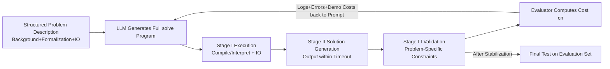

# HeuriGym: An Agentic Benchmark for LLM-Crafted Heuristics in Combinatorial Optimization

**Conference**: ICLR 2026  
**OpenReview**: [https://openreview.net/forum?id=HWxHUO15Yy](https://openreview.net/forum?id=HWxHUO15Yy)  
**Code**: Open-source benchmark (link in the paper repository)  
**Area**: Combinatorial Optimization / LLM Agent / Evaluation Benchmark  
**Keywords**: Combinatorial Optimization, Heuristic Generation, Agentic Benchmark, LLM Evaluation, Iterative Refinement, Quality-Yield Index  

## TL;DR
HeuriGym places LLMs into an agentic closed loop of "problem reading—code writing—execution feedback—iterative refinement," requiring them to write complete heuristics from scratch for 9 real-world combinatorial optimization (CO) problems (EDA, biology, logistics, etc.). It uses a new metric, QYI, to measure solution quality and feasibility—results show that even the strongest GPT-o4-mini-high and Gemini-2.5-Pro score only 0.6 (where experts score 1.0), exposing weaknesses in tool usage, long-range planning, and adaptive reasoning.

## Background & Motivation
**Background**: Mainstream benchmarks for evaluating LLM reasoning and agent capabilities fall into two categories: objective questions with standard answers (AIME, HumanEval, GPQA Diamond, HLE) and subjective preference scoring (Chatbot Arena, LLM-as-a-judge).

**Limitations of Prior Work**: Objective benchmarks are saturating rapidly—SOTA models have exceeded 80% on AIME/HumanEval, and even the "PhD-level" HLE surged from 3% to 25% within months. Static test banks also face risks of training data contamination. Subjective preference evaluations exhibit high variance; judgments are often biased by superficial factors like response structure or emojis, making them unreliable for technical tasks requiring specialized knowledge.

**Key Challenge**: Real-world engineering tasks require **iterative reasoning, creative algorithm design, and adaptive tool use**, where solutions are neither unique nor predefined. This represents a blind spot that neither existing benchmark category covers.

**Goal**: Construct an evaluation paradigm featuring both **clear objective functions** and **massive search spaces** to simultaneously examine four dimensions: tool-augmented reasoning, multi-step planning, instruction following, and iterative refinement based on runtime feedback.

**Core Idea**: **Combinatorial optimization naturally possesses the dual characteristics of "clear objectives" and "massive search spaces"**, making it an ideal vehicle. The authors deliberately avoid classic problems like TSP/SAT that are overrepresented in pre-training corpora. Instead, they select niche but realistic CO problems with <1000 citations to force the model to **actually reason rather than memorize**. Furthermore, the evaluation is transformed from single-turn static tasks into an **interactive agentic closed loop**, requiring models to generate complete, self-contained optimization programs (custom data structures + end-to-end pipelines) rather than filling templates as in FunSearch or ReEvo.

## Method

### Overall Architecture
HeuriGym is a three-stage pipeline with a feedback loop: after reading a structured problem description, the model generates a complete heuristic program following a standard function signature `solve(input_file, solution_file)`. After compilation or interpretation and execution, a **Validator** checks constraints, and an **Evaluator** computes the target cost. Execution logs, validation results, and costs on a small-shot demo set are fed back into the prompt to drive the next iteration of refinement.

### Key Designs

**1. Scaffolding-free Generation from Scratch: Providing interfaces, not templates.** Unlike previous work that provides partial implementations or restricts the design space, HeuriGym's user prompt only exposes function names, input paths, and output paths, **offering no data structures or algorithmic hints**. The model must reason holistically—parsing inputs, building internal representations, and designing heuristics from the ground up. The system prompt injects environmental constraints such as hardware configuration (CPU cores, memory limits), available libraries/versions, and execution timeouts, forcing models to generate realistic solutions that are both correct and compliant with runtime limits. This design aligns the benchmark with real-world CO scenarios where success depends on capturing problem-specific structures.

**2. SOLVEs@i: Decomposing Capability into Three Milestones.** Traditional PASS@k metrics only check if a standard answer is hit and cannot characterize multi-turn agentic reasoning. The authors define $\text{SOLVEs@}i := \frac{1}{N}\sum_{n=1}^{N}\mathbb{1}(\text{Passed Stage } s \text{ within } i \text{ rounds})$, where $s\in\{\text{I},\text{II},\text{III}\}$ corresponds to **Execution Passed** (normal compilation/IO), **Solution Generated** (compliant output within timeout), and **Validation Passed** (all constraints met). This allows for precise identification of where the agent fails, revealing "debugging capability," "constraint understanding," and "iterative fixing" step by step.

**3. Quality-Yield Index: Harmonic Mean of Feasibility and Quality.** Since SOLVEs@i does not reflect solution quality, the authors introduce two additional metrics: $\text{QUALITY}=\frac{1}{\hat N}\sum_{n=1}^{\hat N}\min(1, c^\star_n/c_n)$ measures the proximity of the LLM solution cost $c_n$ to the expert solution cost $c^\star_n$ (capped at 1.0, where equaling expert performance is a full score), and $\text{YIELD}=\hat N/N$ is the proportion of instances passing validation. The final QYI is the weighted harmonic mean of the two: $\text{QYI}=\frac{(1+\beta^2)\cdot\text{QUALITY}\cdot\text{YIELD}}{\beta^2\cdot\text{QUALITY}+\text{YIELD}}$, with default $\beta=1$. This F-score-like design penalizes imbalances such as "high quality but low yield" or "high yield but poor quality." The expert baseline is anchored at QYI=1.0 to highlight the gap.

**4. Anti-Memorization Problem Selection + Human-in-the-Loop Verification.** Candidate problems must meet the following: highest-cited paper <1000 times (excluding textbook problems in training data), unambiguous natural language + LaTeX description, massive search space (single instances up to $10^{65000}$), a demo set at least an order of magnitude smaller than the evaluation set, and reproducible expert baselines. Problem descriptions are annotated by humans, and then weaker models (DeepSeek-V3) are used to identify and resolve ambiguities iteratively—assuming that "if a weak model can confirm the description is clear, a strong model certainly can." This process is used strictly for clarification and never to enhance solver performance.

## Key Experimental Results

### Main Results
The evaluation includes 9 problems and 218 instances, assessing 9 SOTA models released between late 2024 and mid-2025 at temperature 0. Selected SOLVEs@i results:

| Model | SOLVE_III@10 | SOLVE_III@1 | SOLVE_II@1 |
|------|---|---|---|
| GPT-o4-mini-high | **74.8%** | **53.2%** | **93.1%** |
| DeepSeek-R1 | 73.4% | 44.0% | 60.6% |
| Gemini-2.5-Flash | 67.4% | 25.2% | 56.4% |
| Gemini-2.5-Pro | 65.1% | 20.2% | 42.7% |
| Claude-3.7-Sonnet | 60.1% | 9.2% | 41.3% |
| LLaMA-4-Maverick | 35.8% | 6.0% | 13.3% |

The upper bound for QYI is only **0.62 (Gemini-2.5-Pro)**, meaning the best model averages ~60% of expert performance; LLaMA-3.3/4-Maverick scores QYI < 0.30. Iteration is significantly effective: GPT-o4-mini-high's SOLVE_III increases from 53.2% at @1 to 74.8% at @10.

### Comparison of Evolutionary Frameworks
Using Gemini-2.5-Pro as the backbone with 10 evolution cycles and a population of 10:

| Framework | SOLVE_III@10 | QYI |
|------|---|---|
| Gemini-2.5-Pro (Baseline) | **0.6514** | **0.6170** |
| HSEvo | 0.5000 | 0.4491 |
| EoH | 0.4954 | 0.4492 |
| ReEvo | 0.4771 | 0.4486 |

Evolutionary frameworks performed worse than the naked baseline. The root cause is that they **do not incorporate program execution feedback** and break context across iterations, leading to repetitive patching of flawed initial programs. Additionally, these frameworks were designed for toy problems (<20 lines), whereas HeuriGym often requires 300+ lines of code.

### Ablation Study (Pickup and Delivery, QYI)

| Configuration | QYI |
|------|-----|
| 5 demos / 10 rounds of feedback | **0.4196** |
| 3 demos / 10 rounds | 0.2829 |
| 0 demos / 10 rounds | 0.2351 |
| 5 demos / 5 rounds | 0.3330 |
| 5 demos / 1 round | 0.2350 |

Both the number of demos and iteration rounds contribute significantly to performance.

### Key Findings
- **Quality-Yield Tradeoff**: Increasing temperature (T=0→1) improves diversity and quality but reduces feasibility (more invalid outputs); greedy decoding yields the highest feasibility but suboptimal quality—a fundamental contradiction LLMs must face.
- **Error Attribution**: Primary failure modes include hallucinating APIs (non-existent/outdated libraries), algorithmic logic errors, constraint misunderstanding, and timeouts.
- **Case Study (Technology Mapping)**: GPT-o4-mini-high evolved from naive 6-LUT mapping to DP heuristics with pruning, achieving the best balance between yield and quality, proving LLMs can learn and refine heuristics but still remain ~40% behind expert tools.

## Highlights & Insights
- **Precise Paradigm Selection**: Using "clear objectives + massive search spaces" in CO resolves the dilemma between saturated objective tests and high-variance subjective tests. The "<1000 citations" rule clearly separates "reasoning" from "memorization."
- **Diagnostic Power of Metrics**: The 3-stage breakdown of SOLVEs@i makes it immediately apparent whether an agent fails at execution, generation, or constraint satisfaction. QYI uses a harmonic mean to simultaneously account for both "quality" and "yield," offering more information than simple ELO or PASS@k.
- **Scaffolding-free as the "Real Exam"**: Requiring the generation of 300+ lines of self-contained code rather than template filling exposes the weakness of FunSearch-style evolutionary frameworks—context fragmentation and failure to incorporate execution feedback.

## Limitations & Future Work
- **Python Centric**: Easy to implement but carries execution overhead. C++ only has preliminary results due to dependencies on domain libraries and the difficulty of generating high-performance, correct parallel C++ code.
- **Pipeline as a Baseline**: Advanced prompting, multi-agent systems, context compression, and automated prompt engineering have not yet been integrated, which the authors identify as future directions for exploration on HeuriGym.
- **Real-world Gap of Proxy Metrics**: Currently, efficient formal proxy metrics are used, but scientific fields require physical verification and EDA requires backend synthesis confirmation. A gap exists between proxy scores and true quality.
- **Test-time Scaling Space**: Iterative self-refinement can be viewed as a form of test-time scaling. Future integration with best-of-N, beam search, evolutionary algorithms, external autotuners, and self-verification mechanisms is possible.

## Related Work & Insights
- **Distinction from ALE-Bench / CO-Bench**: The latter focus on metaheuristic score optimization and ELO ratings for classic CO problems. HeuriGym targets high-impact, practical CO problems in science and engineering that require discovering problem-specific structures, using granular SOLVEs@i / QYI to reveal failure stages and distance from experts.
- **Critique of LLM-for-CO Routes**: Compared to "formalization + reliance on exact solvers" and "template-filling heuristic discovery" (FunSearch, ReEvo), HeuriGym removes templates and scaffolding, bringing it closer to real CO engineering.
- **Insights**: This "Validator + Evaluator + Feedback Loop" serves as a shared testbed for researching LLM self-verification, test-time scaling, and multi-agent collaboration, providing a ready-made "hard" benchmark for researchers in agentic science/engineering reasoning.

## Rating
- **Novelty**: ⭐⭐⭐⭐⭐ The use of CO as an evaluation vehicle, combined with anti-memorization rules, scaffolding-free settings, and the SOLVEs@i / QYI dual metrics, is highly original.
- **Experimental Thoroughness**: ⭐⭐⭐⭐ Solid coverage across 9 problems and 218 instances with 9 models, including framework comparisons, temperature/demo/feedback ablations, and error attribution. One point deducted as most ablations were limited to a single representative model due to budget.
- **Writing Quality**: ⭐⭐⭐⭐ The logic chain from motivation to paradigm to metrics to experiments is clear. Table 1 positioning and metric formulas are well-explained.
- **Value**: ⭐⭐⭐⭐⭐ Exposes the 40% performance gap between SOTA LLMs and experts on real CO problems. The open-source benchmark provides lasting value as a public testbed for agentic reasoning and scientific/engineering LLM evaluation.

<!-- RELATED:START -->

## Related Papers

- [\[NeurIPS 2025\] Evaluating LLMs for Combinatorial Optimization: One-Phase and Two-Phase Heuristics for 2D Bin-Packing](../../NeurIPS2025/optimization/evaluating_llms_for_combinatorial_optimization_one-phase_and_two-phase_heuristic.md)
- [\[ICLR 2026\] ConRep4CO: Contrastive Representation Learning of Combinatorial Optimization Instances across Types](conrep4co_contrastive_representation_learning_of_combinatorial_optimization_inst.md)
- [\[AAAI 2026\] Pareto-Grid-Guided Large Language Models for Fast and High-Quality Heuristics Design in Multi-Objective Combinatorial Optimization](../../AAAI2026/optimization/pareto-grid-guided_large_language_models_for_fast_and_high-quality_heuristics_de.md)
- [\[ICLR 2026\] NExCO: Native Solution Expansion for Diffusion-based Combinatorial Optimization](nexco_native_solution_expansion_for_diffusion-based_combinatorial_optimization.md)
- [\[ICLR 2026\] Multi-Action Self-Improvement for Neural Combinatorial Optimization](multi-action_self-improvement_for_neural_combinatorial_optimization.md)

<!-- RELATED:END -->
