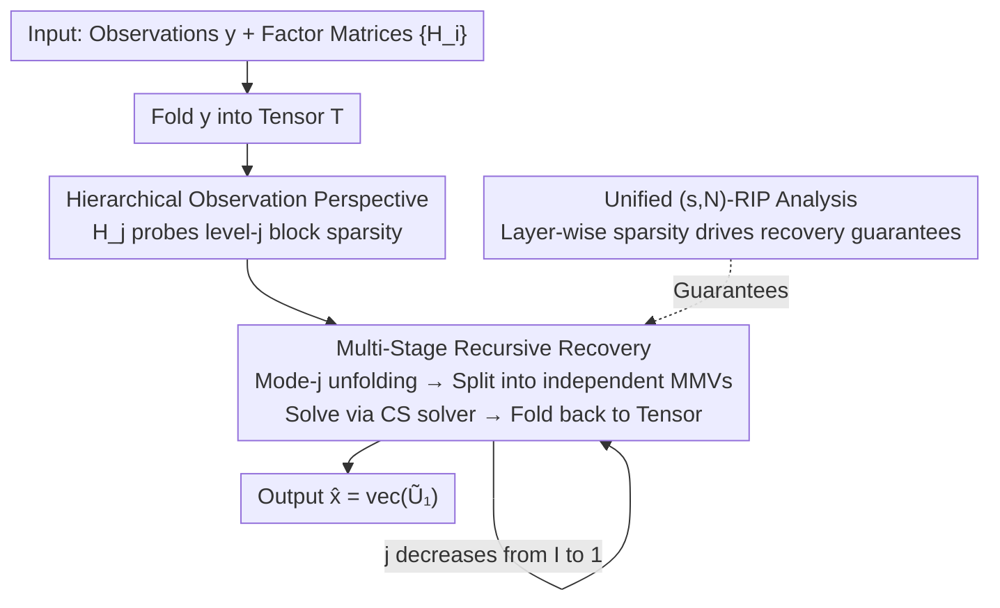

# Hierarchical Multi-Stage Recovery Framework for Kronecker Compressed Sensing

**Conference**: ICLR 2026  
**OpenReview**: [https://openreview.net/forum?id=40e58sTE5F](https://openreview.net/forum?id=40e58sTE5F)  
**Area**: Optimization and Sparse Recovery  
**Keywords**: Kronecker Compressed Sensing, Sparse Recovery, Hierarchical Sparsity, RIP Analysis, Tensor Unfolding  

## TL;DR
This paper proposes a "hierarchical observation" perspective for Kronecker Compressed Sensing (KCS), noting that each factor matrix of the Kronecker product measurement matrix actually probes signal sparsity at different levels. Based on this, it designs a Multi-Stage Recovery (MSR) framework that decomposes high-dimensional recovery into layer-wise MMV subproblems. MSR uniformly handles standard, hierarchical, and Kronecker support sparsity models with a unified $(s,N)$-RIP theoretical guarantee. While maintaining accuracy comparable to SOTA, it reduces runtime by one to three orders of magnitude.

## Background & Motivation
**Background**: KCS uses the Kronecker product of multiple factor matrices $H=\otimes_{i=I}^{1}H_i$ as the measurement matrix to recover a sparse vector $x$ from noisy linear observations $y=Hx+n$. It naturally fits multi-dimensional signal acquisition (sensor arrays in communications, separable filters in imaging) and reduces sampling complexity while capturing multi-dimensional structures. Beyond the standard "sparse at any position" model, actual signals often exhibit more structured patterns: hierarchical sparsity (e.g., in massive machine-type communications where an active device is selected first, then sends sparse signals) and Kronecker support sparsity (where the support set itself is a Kronecker product of binary support vectors, common in radar imaging/wireless communications).

**Limitations of Prior Work**: First is the **dimensionality explosion**—the length of $x$ grows exponentially with the number and size of factor matrices (reaching $O(N^I)$ when $N_i=O(N)$). General solvers take the entire $H$, leading to prohibitive complexity (e.g., KroOMP is still $O(N^I)$, while KroSBL is $O(M^I N^I)$ in both time and space). Second is **insufficient structure utilization**: most KCS methods ignore the Kronecker structure of $H$ and degrade to general sparse recovery, while methods like HiHTP that exploit hierarchical structure do not use the Kronecker structure, remaining costly. Third is **fragmentation**: existing algorithms are mostly tailored for a single sparsity model, lacking a unified framework and a unified RIP analysis with guarantees across all three models.

**Key Challenge**: The Kronecker product brings both the "curse of dimensionality" and "exploitable structure." Existing methods either avoid the structure (simple but slow and without guarantees) or only exploit one type of structure (specialized but not versatile), failing to simultaneously achieve low complexity, cross-model universality, and theoretical guarantees.

**Goal**: To find a unified framework that leverages Kronecker structure to reduce complexity, works across standard/hierarchical/Kronecker support sparsity models, and provides provable recovery guarantees.

**Key Insight**: The authors observe that after writing $y=Hx$ in tensor-to-matrix format, performing a mode-$j$ unfolding on the tensor reveals that the factor matrix $H_j$ acts on a matrix $U_j$, where "entire rows of zero" in $U_j$ correspond exactly to "entire blocks at level $j$ of $x$ being zero." In other words, **each factor matrix is responsible for probing block sparsity at a specific level**.

**Core Idea**: Use a "hierarchical observation perspective" to decompose a high-dimensionally coupled recovery problem into a sequence of low-dimensional Multi-Measurement Vector (MMV) subproblems along the factor matrices, solving them stage by stage.

## Method

### Overall Architecture
The method consists of two parts: a re-interpretation of Kronecker measurements using the "hierarchical observation perspective," and the design of the **Multi-Stage Recovery (MSR)** algorithm, backed by a unified RIP theoretical analysis.

The intuition of the recovery process is: fold the measurement $y$ into a tensor $T$ according to the dimensions of each factor matrix, then **descend from the highest level $j=I$ down to $j=1$**, processing only one factor matrix $H_j$ at each stage. In stage $j$, perform a mode-$j$ unfolding of the current tensor to get $T_{(j)}=H_j U_j + N_{(j)}$. According to Lemma 1, this equation can be decomposed into $\prod_{i=I}^{j+1}N_i$ **independent** MMV subproblems (or a single shared-support MMV for Kronecker support sparsity). Use any off-the-shelf compressed sensing solver to solve for $\tilde U_j$, fold it back into a tensor, and proceed to the next layer. Finally, output $\hat x=\mathrm{vec}(\tilde U_1)$. Since each stage only handles a small factor matrix and a set of low-dimensional MMVs, the overall complexity is reduced from $O(N^I)$ to $O(MN^I)$.

### Key Designs

**1. Hierarchical Observation Perspective: Each factor matrix probes one level of block sparsity**

Addressing the pain point that "existing methods treat $H$ as a black box and ignore Kronecker structure," the authors first apply **hierarchical block partitioning** to the sparse vector $x$: first slice it into $N_I$ equal-length "level-$I$ blocks," then slice each into $N_{I-1}$ level-$(I-1)$ blocks, recursively down to individual elements. Writing the noiseless version as tensor-matrix multiplication $T=X\times_1 H_1\cdots\times_I H_I$, the mode-$j$ unfolding yields:

$$T_{(j)}=H_j\, X_{(j)}\Big(I_{\prod_{i=I}^{j+1}N_i}\otimes \textstyle\bigotimes_{i=j-1}^{1}H_i^\top\Big)=H_j U_j + N_{(j)}.$$

The key conclusion (Lemma 1) is: $U_j$ can be partitioned into column blocks, and **the number of non-zero rows in a column block equals the number of non-zero blocks in the corresponding set of sibling blocks**. In other words, a zero row in $U_j \iff$ a corresponding block of $x$ at level $j$ is entirely zero. Thus, $H_j$ captures the sparsity pattern of level-$j$ blocks. The value of this perspective is that it reinterprets "one $H$ measuring one high-dimensional $x$" as "$I$ factor matrices measuring block sparsity at $I$ levels," providing a unified metric for different sparsity models—the differences between the three models ultimately fall on whether the layer-wise MMV has independent or shared support.

**2. Multi-Stage Recovery (MSR) Algorithm: Decomposing high-dimensional recovery into layer-wise independent MMV subproblems**

With the hierarchical perspective, recovery does not require solving for high-dimensional $x$ all at once. MSR (Algorithm 1) folds $y$ into a tensor and iterates through $j=I, I-1, \dots, 1$. Step $j$ performs a mode-$j$ unfolding, solves $T_{(j)}=H_j U_j+N_{(j)}$ to get estimate $\tilde U_j$, and folds it back for the next layer. Per Lemma 1, under standard/hierarchical sparsity, this decomposes into $\prod_{i=I}^{j+1}N_i$ **independent MMVs** (parallelizable); under Kronecker support sparsity, it reduces to a single MMV due to support sharing. The flexibility lies in the **pluggability** of the MMV solver. Combining with SBL/IHT/HTP/OMP yields four variants: MSSBL, MSIHT, MSHTP, and MSOMP. The complexity gains are direct—for Kronecker support sparsity, complexity drops from $O(M^I N^I)$ in time and space (KroSBL) to $O(MN^I)$ time and $O(N^I)$ space (MSSBL). For hierarchical sparsity, MSHTP yields $O(MN^I)$ time and $O(M^{I-1}N)$ space, outperforming HiHTP.

**3. Unified $(s,N)$-RIP Analysis: Recovery guarantees driven by layer-wise sparsity**

To fill the gap that "existing methods handle only one model and lack theoretical guarantees," the authors propose a generalized $(s,N)$-sparsity model and $(s,N)$-RIP condition, where $s=(s_I,\dots,s_1)$ denotes the sparsity at each level. Standard, hierarchical, and Kronecker support sparsity are all special cases. The core theorem provides a Restricted Isometry Constant (RIC) upper bound:

$$\delta_{(s,N)}(H)\le \prod_{i=I}^{1}\big(1+\delta_{s_i}(H_i)\big)-1,$$

which indicates that **what truly drives recovery is the sparsity $s_i$ at each level, rather than total sparsity $s$**. Since $\delta_s$ is non-decreasing with respect to $s$, this bound is tighter than the standard sparsity RIC bound $\prod_i(1+\delta_s(H_i))-1$. Based on this, iterative error bounds for MSIHT/MSHTP are derived, proving that error converges to a constant multiple of noise power as $k\to\infty$. Notably, it provides recovery guarantees for the Kronecker support sparsity model, which classic IHT/HTP cannot handle (as the thresholding operator is NP-hard, equivalent to the maximum weight biclique problem for $I=2$). The trade-off is that layer-wise solving causes error propagation, potentially requiring more iterations or factor matrices with smaller RIC—though experiments show this amplification is negligible in practice.

## Key Experimental Results

Experiments evaluated three sparsity models on synthetic data using runtime and Normalized Squared Error $\text{NSE}=\|x-\hat x\|_2^2/\|x\|_2^2$, with SNR from 3 dB to 25 dB. Standard/hierarchical settings: $I=2, M=64, N=80, s=15$; Kronecker support: $I=3, M=15, N=18, s=4$.

### Main Results
In terms of accuracy (NSE), MSR variants are **comparable to or better than** SOTA, while leading significantly in speed. Average runtime (seconds) selection:

| Sparsity Model | Method | 7 dB | 15 dB | 23 dB |
|:---:|:---:|:---:|:---:|:---:|
| Standard | MSOMP (Ours) | 0.41 | 0.33 | **0.057** |
| Standard | KroOMP | 108.05 | 39.98 | 0.75 |
| Standard | MSSBL (Ours) | 1.10 | 0.22 | 0.114 |
| Hierarchical | MSHTP (Ours) | **0.031** | **0.025** | **0.017** |
| Hierarchical | HiHTP | 0.549 | 0.544 | 0.457 |
| Hierarchical | HTP | 1.717 | 0.845 | 0.531 |
| Hierarchical | MSIHT (Ours) | 0.051 | 0.051 | 0.043 |
| Hierarchical | IHT | 8.241 | 8.292 | 8.279 |
| K-Support | MSSBL (Ours) | 0.059 | 0.028 | 0.005 |
| K-Support | SVD-KroSBL | 26.x | — | — |

Observation: For standard sparsity, MSOMP is one to three orders of magnitude faster than KroOMP with similar NSE. For hierarchical sparsity, MSHTP is two orders of magnitude faster than HTP and one order faster than HiHTP. For Kronecker support sparsity, MSSBL is two to three orders of magnitude faster than AM-/SVD-KroSBL.

### Extension: Scalability with Dimension
| Configuration | Observation | Explanation |
|:---:|:---:|:---:|
| $I=3$, SNR=20 dB, $N\in\{50,\dots,110\}$ | Stable NSE, moderate runtime growth | Verifies efficiency of MSR variants as $\bar N=N^I$ increases |
| Theoretical error vs. Practical | No significant amplification | Supports the claim that error propagation is not severe in practice |

### Key Findings
- **Speed advantage stems from structure utilization**: Complexity reduction from $O(N^I)$ to $O(MN^I)$ is a direct result of layer-wise MMV decomposition and tensor dimensionality reduction.
- **Accuracy is not sacrificed for speed**: NSE remains parity with SOTA across all models, implying the decomposition does not degrade quality.
- **Theoretical-practical gap**: While error bounds suggest accumulation across stages, scaling experiments show little practical amplification, suggesting worst-case analysis is conservative.

## Highlights & Insights
- **"Complexity reduction via perspective"**: The paper does not invent a new solver but reorders a high-dimensional coupled problem into independent low-dimensional MMVs. It is an exemplar of treating "problem structure" rather than "algorithmic tricks" as a first-class citizen.
- **Pluggability of the framework**: MMV kernels can be swapped (SBL/IHT/HTP/OMP), allowing one framework to cover three sparsity models, offering high engineering reuse value.
- **Hierarchical RIP rewriting**: Refining "total sparsity" into "layer-wise sparsity" provides tighter bounds and, for the first time, offers guaranteed recovery paths for structured sparsity (like Kronecker support) that classic methods struggle with.

## Limitations & Future Work
- **Stage-wise error propagation**: Theoretical error bounds accumulate and scale with problem dimension; though not obvious in experiments, extreme noise or deep ($I > 2$) scenarios may require more iterations.
- **Tightness of MMV RIP**: For Kronecker support sparsity, despite the joint sparsity structure, worst-case RIP analysis does not yet yield a tighter bound.
- **Synthetic data validation**: Experiments are restricted to synthetic signals; end-to-end validation on real imaging/communication data is missing. Furthermore, IHT/HTP variants require true sparsity $s$ as input.

## Related Work & Insights
- **vs. KroOMP / KroSBL (He & Joseph 2025a, Caiafa & Cichocki 2013)**: These also use tensor operations but remain high-complexity ($O(N^I)$) and lack unified guarantees. This work achieves speedups of 1-2 orders of magnitude and adds RIP guarantees.
- **vs. HiHTP / HTP / IHT (Roth et al. 2020)**: HiHTP uses hierarchical thresholding but neglects Kronecker structure; MSHTP/MSIHT uses both, achieving much higher speeds.
- **vs. He & Joseph 2025c ($I=2$ analysis)**: Their analysis is decoupled from the algorithm and relies on specific matrix properties hard to generalize beyond $I=2$. This work provides a unified framework for any $I$.

## Rating
- Novelty: ⭐⭐⭐⭐ (Hierarchical perspective mapping factors to level-wise sparsity is a novel unification).
- Experimental Thoroughness: ⭐⭐⭐ (Covers three models, but limited to synthetic data).
- Writing Quality: ⭐⭐⭐⭐ (Sectional progression from perspective to algorithm to theory is clear).
- Value: ⭐⭐⭐⭐ (Significant speedup and theoretical framework for tensor-structured inverse problems).

<!-- RELATED:START -->

## Related Papers

- [\[ECCV 2024\] Handling the Non-smooth Challenge in Tensor SVD: A Multi-objective Tensor Recovery Framework](../../ECCV2024/optimization/handling_the_non-smooth_challenge_in_tensor_svd_a_multi-objective_tensor_recover.md)
- [\[ICLR 2026\] The Power of Small Initialization in Noisy Low-Tubal-Rank Tensor Recovery](the_power_of_small_initialization_in_noisy_low-tubal-rank_tensor_recovery.md)
- [\[AAAI 2026\] MOTIF: Multi-strategy Optimization via Turn-based Interactive Framework](../../AAAI2026/optimization/motif_multi-strategy_optimization_via_turn-based_interactive_framework.md)
- [\[ICLR 2026\] HOTA: Hamiltonian Framework for Optimal Transport Advection](hota_hamiltonian_framework_for_optimal_transport_advection.md)
- [\[CVPR 2026\] Beyond Single Solution: Multi-Hypothesis Collaborative Deep Unfolding Network for Image Compressive Sensing](../../CVPR2026/optimization/beyond_single_solution_multi-hypothesis_collaborative_deep_unfolding_network_for.md)

<!-- RELATED:END -->
