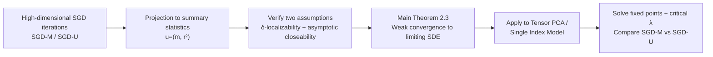

# High-dimensional limit theorems for SGD: Momentum and Adaptive Step-sizes

**Conference**: ICLR 2026  
**OpenReview**: [https://openreview.net/forum?id=5OJLOwwXV4](https://openreview.net/forum?id=5OJLOwwXV4)  
**Code**: TBD  
**Area**: Optimization Theory / High-dimensional Stochastic Optimization  
**Keywords**: High-dimensional scaling limits, SGD Momentum, Adaptive step-sizes, Gradient normalization, Spiked Tensor PCA, Single Index Models  

## TL;DR
Ours extends the "effective dynamics" high-dimensional scaling limit framework by Ben Arous et al. to SGD with Polyak momentum (SGD-M) and adaptive step-size SGD with scalar preconditioning. It proves that at the critical step-size, SGD-M amplifies high-dimensional fluctuations and differs from online SGD only by a time rescaling, whereas a simple preconditioner that normalizes the gradient to unit norm (SGD-U) can broaden the range of convergent step-sizes and push fixed points closer to the population optimum.

## Background & Motivation
**Background**: The fixed-dimension asymptotic theory of online SGD is classic (starting from Robbins-Monro), where small step-size limits converge to the gradient flow of the population loss. Recently, high-dimensional scaling limits (where dimension $d \to \infty$ while step-size $\delta \to 0$) have become a hotspot. Ben Arous et al. (2022/2024) provided a unified framework: using a set of low-dimensional "summary statistics" to characterize the trajectory of high-dimensional SGD. Under the critical step-size scaling, an emergent "population corrector" term appears in the dynamics in addition to the gradient flow drift.

**Limitations of Prior Work**: This framework only covers vanilla online SGD. However, in practice, momentum-based SGD and adaptive methods like Adam/RMSProp are truly used. There is a lack of rigorous characterization of how these variants perform—better or worse than online SGD—under the **high-dimensional critical scaling**. Previous studies either focused on ballistic continuous limits in fixed dimensions or required scaling the momentum parameter $\beta$ with the dimension, avoiding the most practical case of "fixed $\beta$."

**Key Challenge**: While momentum is intuitively thought to "accelerate convergence and escape saddle points" in low dimensions, does it amplify or suppress the emergent population corrector under high-dimensional critical scaling? Can adaptive step-sizes truly "stabilize dynamics"? These empirical phenomena have lacked provable high-dimensional theoretical support.

**Goal**: To rigorously extend the effective dynamics framework to SGD-M with fixed $\beta$ and scalar adaptive step-sizes, and precisely calculate the limiting ODEs/SDEs, fixed points, and convergent step-size ranges for two standard high-dimensional inference problems (Spiked Tensor PCA and Single Index Models).

**Core Idea**: **[Momentum = Amplified Fluctuations + Time Rescaling]** SGD-M is essentially equivalent to online SGD in high dimensions, with momentum merely amplifying the relative weight of "corrector vs. signal"; **[Preconditioning = Broadening Stability Region]** SGD-U, which normalizes the gradient, can rigorously improve both the upper bound of convergent step-sizes and the quality of the fixed point.

## Method

### Overall Architecture
The paper focuses on building a "high-dimensional scaling limit" analysis machinery rather than designing new algorithms: it projects the high-dimensional SGD iterations $x_\ell$ onto a set of low-dimensional summary statistics $u_n(x)=(u_1,\dots,u_k)$ (e.g., the alignment $m=\langle x,v\rangle$ with the true signal direction $v$ and the orthogonal residual $r^2=\|x\|^2-m^2$). Under the critical scaling where dimension $n \to \infty$ and step-size $\delta_n \to 0$, it proves that the stochastic trajectories of these statistics weakly converge to a low-dimensional stochastic differential equation (SDE). The core lies in adapting the two technical assumptions of online SGD ($\delta_n$-localizability and asymptotic closeability) to the cases of momentum and preconditioning to derive the "drift term + fluctuation term" of the limiting dynamics.

### Key Designs
**1. Main Theorem for Effective Dynamics of SGD-M: Momentum modifies the scaling of drift and fluctuations.** For Polyak momentum SGD ($p_\ell=\beta p_{\ell-1}-\delta_n\nabla L,\ x_\ell=x_{\ell-1}+p_ell$) with learning rate $\delta_n$ and fixed momentum $\beta\in[0,1)$, the paper first requires summary statistics to satisfy localizability and closeability assumptions more general than $L$-smoothness/convexity. A key modification is the need to additionally control the correlation between different samples $\nabla H(x_1,y_i)$ and $\nabla H(x_2,y_j)$ ($i\ne j$) because momentum couples past gradients, and the first-order drift operator $A_n=\langle\nabla\Phi,\nabla\rangle$ and second-order operator $L_n=\tfrac12\langle V,\nabla^2\rangle$ **scale differently** with respect to $\beta$. Theorem 2.3 provides the limiting SDE:
$$du_t = h(\beta,u_t)\,dt + \frac{1}{1-\beta}\sqrt{\Sigma(u_t)}\,dB_t,$$
which precisely recovers the online SGD results of Ben Arous et al. when $\beta=0$.

**2. Equivalence of Momentum and Online SGD + Fluctuation Amplification.** Further decomposing the drift into the "signal term" $f$ (direction of population loss descent) and the emergent "population corrector" $g$ (the variance term arising at critical scaling), the theorem gives:
$$du_t=\Big[-\tfrac{1}{1-\beta}f(u_t)+\tfrac{1}{(1-\beta)^2}g(u_t)\Big]dt+\tfrac{1}{1-\beta}\sqrt{\Sigma}\,dB_t.$$
Note that $g$ carries a $(1-\beta)^{-2}$ factor while $f$ only carries $(1-\beta)^{-1}$. Consequently, as $\beta \to 1$, the corrector $g$ is **amplified** relative to the signal $f$, potentially overwhelming the signal and leading the dynamics further away from the population gradient. However, conversely, if online SGD is configured with a step-size $\hat\delta_n=\delta_n/(1-\beta)$, its limiting dynamics after a time rescaling $t\mapsto t/(1-\beta)$ are identical to SGD-M. This indicates that any trajectory of SGD-M on an interval $[0,T]$ can be replicated by online SGD (with the effective number of iterations $T/\delta$ remaining constant); thus, there is "no free lunch" for momentum in high dimensions.

**3. Scaling Limits for Scalar Adaptive Step-sizes: Decoupling preconditioning and step-size.** For updates $x_\ell=x_{\ell-1}-\delta\,\eta(x_{\ell-1},y_\ell)\nabla L$ with a scalar preconditioner $\eta_n(x,y)$, the paper decouples the step-size $\delta$ from the data-dependent $\eta$. By defining $\nabla\tilde H=\eta\nabla L-\nabla\tilde\Phi$ and $\nabla\tilde\Phi=E[\eta\nabla L]$ as analogues to $\nabla H$ and $\nabla\Phi$, Theorem 2.3 ($\beta=0$) naturally extends to the preconditioned case as long as $\tilde H$ and $\tilde\Phi$ satisfy the same two assumptions. Specifically taking gradient normalization $\eta(x,Y)=\sqrt{n}/\|\nabla L(x,Y)\|$ (where $\sqrt n$ maintains a non-trivial limit when $\|\nabla L\|=O(\sqrt n)$), denoted as **SGD-U**, this corresponds to the early normalization/clipping ideas proposed to combat gradient explosion.

**4. Explicit calculation of fixed points and critical SNR in two standard problems.** In Spiked Matrix/Tensor PCA ($Y=\lambda v^{\otimes k}+W$, with loss $\|Y-x^{\otimes k}\|^2$) and Single Index Models ($y=f(a\cdot v)+\epsilon$, with quadratic loss), the paper reduces the abstract limiting SDE to explicit ODEs for $(m, r^2)$. It solves for fixed points away from $m=0$ (i.e., learning the signal), which only appear when the signal-to-noise ratio $\lambda$ exceeds a critical value $\lambda_{\text{crit}}(k,\beta,c_\delta)$. A key conclusion is $\lambda^U_{\text{crit}}<\lambda^M_{\text{crit}}$—there exists a range of $\lambda$ where SGD-U is supercritical and can learn the direction while SGD-M/online SGD remain stuck at $m=0$. Furthermore, the maximum allowable step-size $c_\delta$ for SGD-U is larger (when $\lambda>(1-\beta)^2/8$), significantly broadening the feasible step-size interval for "stable and high-quality solutions." The paper also provides the SDE for the diffusive limit near the $m=0$ equator, showing that fluctuations in SGD-M intensify as $\beta$ increases.

## Key Experimental Results
As a theoretical paper, the "experiments" consist of numerical simulations used to verify that the limiting ODEs/SDEs match the actual algorithm trajectories.

### Main Results: Ballistic Phase of Matrix PCA

| Setting | $\lambda=0.8$ | $\lambda=1.2$ | $\lambda=2.2$ |
|------|-----|-----|-----|
| Dimension / Steps | $n=10000$, $20n$ steps, $c_\delta=1$ | Same | Same |
| Supercritical Methods (Learning $v$) | **Only SGD-U** | SGD-U and Online SGD (SGD-U has better alignment) | All supercritical except SGD-M with $\beta=0.9$ |
| Phenomenon | SGD-M/Online SGD stuck at $m=0$ | SGD-U alignment $|m|/R$ is higher | Alignment order matches theoretical predictions |

The predicted ODEs (dashed lines) closely fit the actual algorithm trajectories (solid lines) under all three values of $\lambda$.

### Single Index Model Experiment

| Setting | Content |
|------|------|
| Model | $f(x)=x^2, x^3, x^7+4x^4$, varying additive noise $\sigma^2$ |
| Scale | $n=10000$, $\delta=c_\delta/n$, 1 million steps total |
| Key Findings | SGD must use a very small $c_\delta$ ($10^{-k}$) to avoid being destroyed by gradient explosion; SGD-U still converges to a near-optimal fixed point in settings where SGD-M diverges (where $dr^2>0$ always holds). |

### Key Findings
- **Equatorial Diffusion Phase**: Diffusion limit fluctuations of SGD-M near $m=0$ increase significantly with $\beta$ (consistent with the $\tfrac{1}{1-\beta}$ theoretical factor); SGD-U becomes "mean-repelling" at smaller $\lambda$ (beginning to escape $m=0$ toward the signal).
- **Problem-dependent critical $\lambda=1/8$**: When $\lambda>(1-\beta)^2/8$, SGD-U is superior to online SGD/SGD-M.
- $c_\delta$ cannot be arbitrarily small: The number of iterations increases with $1/c_\delta$, and if it is too small, insufficient steps are taken to reach the stable basin.

## Highlights & Insights
- **Strict version of "No Free Lunch for Momentum"**: Under high-dimensional critical scaling, SGD-M is equivalent to online SGD with "rescaled step-size + rescaled time," keeping the effective number of iterations constant. This unifies fragmented observations from fixed dimensions (Kovachki-Stuart) and high-dimensional linear regression (Paquette-Paquette) into a general theorem.
- **Quantification of Momentum's "Downside"**: The scaling difference of $(1-\beta)^{-2}$ vs. $(1-\beta)^{-1}$ cleanly explains why large $\beta$ amplifies emergent variance terms and may harm performance—a high-dimensional effect invisible to low-dimensional intuition.
- **Vindicating "Early Preconditioners"**: Simple techniques like gradient normalization are theoretically proven to broaden convergent step-sizes and improve fixed-point quality in high dimensions, providing provable support for the empirical motivation of "preconditioning to mitigate gradient explosion/vanishing."
- **Reusable Framework**: The technique of decoupling $\delta$ and $\eta$ allows the entire machinery to be directly applied to a broad class of scalar preconditioned methods.

## Limitations & Future Work
- **Preconditioning limited to scalars (specifically gradient normalization)**: Coordinate-wise diagonal preconditioning (vector-valued) like Adam/RMSProp is not within the current framework and is a natural next step.
- **Example focus on Spiked PCA and Single Index Models**: While these satisfy the localizability/closeability assumptions, they are well-structured problems with "low-dimensional sufficient statistics"; whether real deep network loss landscapes can be adapted remains to be verified.
- **Stability analysis primarily completed for $k=2$ (matrix case)**: Fixed-point stability for higher-order tensors and general link functions $f$ only provides partial conclusions.
- **SGD-U fixed points are not necessarily the population optimum**: (In the Single Index case as $\sigma^2\to 0$, $(1,0)$ is a fixed point for SGD-M but not for SGD-U), they are just "close enough"; engineering utility depends on the task.

## Related Work & Insights
- **Direct Foundation**: The effective dynamics/localizability framework of Ben Arous et al. (2022/2024)—Ours is an extension into the domains of momentum and adaptive step-sizes.
- **High-dimensional Momentum Dynamics**: Paquette & Paquette (2021) and Ferbach et al. (2025) study cases where momentum scales with dimension; Ours fills the gap for "fixed $\beta$."
- **Theory of Adaptive/Preconditioned Methods**: Continuous-time analyses by da Silva-Gazeau, Barakat-Bianchi, Malladi et al. are mostly in fixed dimensions; Ours provides a high-dimensional scaling version.
- **Gradient Normalization/Clipping**: The original motivations of Mikolov (2012) and Pascanu et al. (2013) (combatting gradient explosion) are rigorously confirmed here by high-dimensional theory.
- **Insights**: When analyzing the high-dimensional behavior of new optimizers (e.g., Adam, Muon), "projection to low-dimensional sufficient statistics + solving limiting SDEs" is a generalizable paradigm; when comparing two optimizers, "whether they differ only by time/step-size rescaling" is a good tool for judging essential differences.

## Rating
- **Novelty**: ⭐⭐⭐⭐ Rigorously extending the mature high-dimensional scaling limit framework to fixed $\beta$ momentum and scalar adaptive step-sizes, and providing a clean characterization of momentum as "amplified fluctuations + time rescaling," makes a clear theoretical contribution.
- **Experimental Thoroughness**: ⭐⭐⭐ As a theoretical paper, numerical simulations are only for verification (Matrix PCA + Single Index Models). Limiting ODEs/SDEs align well with trajectories, but the problem scope is narrow and lacks verification on real networks.
- **Writing Quality**: ⭐⭐⭐⭐ Assumptions, theorems, and corollaries proceed step-by-step. Remarks clearly explain comparisons between high-dim vs. fixed-dim and SGD-M vs. SGD-U, highlighting the scaling differences.
- **Value**: ⭐⭐⭐⭐ Provides provable answers to long-standing empirical questions such as "is momentum useful in high dimensions" and "why preconditioning stabilizes dynamics," offering guiding significance for both optimization theory and algorithmic intuition.

<!-- RELATED:START -->

## Related Papers

- [\[ICLR 2026\] SGD with Adaptive Preconditioning: Unified Analysis and Momentum Acceleration](sgd_with_adaptive_preconditioning_unified_analysis_and_momentum_acceleration.md)
- [\[ICLR 2026\] High-dimensional Mean-Field Games by Particle-based Flow Matching](high-dimensional_mean-field_games_by_particle-based_flow_matching.md)
- [\[ICLR 2026\] High-Probability Bounds for the Last Iterate of Clipped SGD](high-probability_bounds_for_the_last_iterate_of_clipped_sgd.md)
- [\[ICLR 2026\] Gradient Descent with Large Step Sizes: Chaos and Fractal Convergence Region](gradient_descent_with_large_step_sizes_chaos_and_fractal_convergence_region.md)
- [\[ICLR 2026\] From Sorting Algorithms to Scalable Kernels: Bayesian Optimization in High-Dimensional Permutation Spaces](from_sorting_algorithms_to_scalable_kernels_bayesian_optimization_in_high-dimens.md)

<!-- RELATED:END -->
