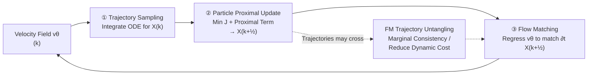

# High-dimensional Mean-Field Games by Particle-based Flow Matching

**Conference**: ICLR 2026  
**OpenReview**: [https://openreview.net/forum?id=WA0AYaYAtS](https://openreview.net/forum?id=WA0AYaYAtS)  
**Code**: [https://github.com/jiajia-yu/mfg_flow_matching](https://github.com/jiajia-yu/mfg_flow_matching)  
**Area**: Optimization / Mean-Field Games / Generative Modeling  
**Keywords**: Mean-Field Games, Flow Matching, Fictitious Play, Optimal Transport, Lagrangian Coordinates, Convergence Analysis  

## TL;DR
The authors reformulate the solution of high-dimensional Mean-Field Games (MFG) as a particle optimization problem in Lagrangian coordinates. By employing an alternating iteration of "particle proximal descent + Flow Matching for velocity field fitting" to approximate fictitious play, the method can solve both potential and non-potential games with high-dimensional scalability while providing provable convergence rates.

## Background & Motivation
**Background**: Mean-Field Games study the Nash equilibrium of "continuous multi-agent systems," where each indistinguishable agent seeks an optimal strategy $\hat v$ given a population distribution $\rho$, and the population distribution is in turn determined by the strategies of all agents. The equilibrium is defined as a fixed point where the "optimal control solution $\hat\rho$ is self-consistent with the population $\rho$." It unifies optimal control, Wasserstein gradient flows (JKO), and normalizing flows with transport regularization, with applications spanning economics, generative modeling, and reinforcement learning.

**Limitations of Prior Work**: The difficulty in solving high-dimensional MFGs stems from their **fixed-point structure**. Naive fixed-point iteration $\rho^{(k+1)}=\hat\rho^{(k)}$ may fail to converge. Classic fictitious play uses $\rho^{(k+1)}=(1-\alpha_k)\rho^{(k)}+\alpha_k\hat\rho^{(k)}$ for stability, but every step requires computing the **exact best response**, which is computationally infeasible in high dimensions. Two mainstream implementation approaches have significant drawbacks: (1) The PDE approach converts the equilibrium into coupled HJB-FP equations, relying on grid-based solvers that suffer from the **curse of dimensionality**; (2) Variational/flow methods require the MFG to have a variational form (existing only in special cases like potential games/MFC) and involve non-linear coupling of the objective with $\rho$, making training expensive due to **backpropagation through PDE/ODE solvers**.

**Key Challenge**: To achieve the convergence guarantees of fictitious play without the cost of computing exact best responses at each step, and without being restricted by a required variational structure.

**Goal**: Propose a high-dimensionally scalable neural solver for MFGs that does not rely on variational structures and includes convergence proofs.

**Core Idea**: **[Proximal Best Response]** Instead of seeking a global best response, the method finds a "proximal best response" within the **local neighborhood** of the current state—paralleling the insight that "exact response is unnecessary" when fictitious play uses small step sizes. **[Particle + Flow Matching Dual Update]** In Lagrangian coordinates, each iteration first updates particle trajectories using first-order gradient information, and then trains a Flow Matching neural network to fit the velocity field of the updated trajectories. The "trajectory untangling" effect of FM ensures marginal distribution consistency and averages crossing trajectories, which accelerates convergence via batch training and theoretically bridges Lagrangian and Eulerian coordinates.

## Method

### Overall Architecture
The method reformulates the MFG (1) into **Lagrangian coordinates**: using a characteristic map $X(x,t)$ to represent the trajectory of a single particle starting from $x$, and expressing the individual cost $\mathcal J(\tilde X;\rho)$ as an expectation over the initial distribution $\mu$ (dynamic cost $\frac12\|\partial_t X\|^2$ + interaction cost $F[\rho_t]$ + terminal cost $G[\rho_1]$). A **proximal fixed-point scheme** is then used with three alternating steps: ① sampling trajectories by integrating the ODE with the current velocity field $v^{(k)}$ → ② performing gradient descent with a proximal term on the particles (proximal best response) → ③ regressing a neural velocity field $v_\theta$ using Flow Matching to match the velocity of the updated trajectories. This three-step loop approximates fictitious play, moving only a small step at a time instead of seeking the exact best response.

### Key Designs

**1. Lagrangian Reformulation: Converting MFG into a particle problem with sampleable expectations to bypass grids.** Eulerian coordinates $v(x,t)$ depend on fixed spatial grids, which is infeasible in high dimensions. This work shifts to Lagrangian coordinates $X\in C_X=H^1(0,1;L^2(\mu))$, where each trajectory $X(x,\cdot)$ is a differentiable curve starting from $x$. The individual cost is written as $\mathcal J(\tilde X;\rho)=\mathbb E_{x\sim\mu}\big[\int_0^1(\frac12\|\partial_t\tilde X\|^2+F[\rho_t](\tilde X))dt+G[\rho_1](\tilde X(x,1))\big]$. The objective becomes an expectation over particles, which can be estimated directly using finite samples and time discretization, making it naturally suited for high dimensions. The trade-off is that while each trajectory must be differentiable, **trajectories are allowed to cross**—in which case a velocity field $v$ satisfying the ODE constraint $(X,v)$ might not exist. This gap is filled by the third point.

**2. Proximal Best Response: Replacing expensive exact responses with insights from fictitious play.** Directly applying fictitious play requires calculating the exact best response $\hat X^{(k)}$ and then averaging, which is too costly. This study observes that "as long as there is a small improvement relative to the current objective in each step, one can converge to a fixed point even if the objective itself is changing." Thus, the best response is replaced by a local descent with a proximal regularizer:
$$X^{(k+\frac12)}=\arg\min_{X\in C_X}\ \mathcal J(X;\rho^{(k)})+\frac{1}{2\alpha_k}\big(\|X-X^{(k)}\|^2_{\mu\otimes[0,1]}+\|X_1-X_1^{(k)}\|^2_\mu\big)$$
In implementation, this consists of several gradient descent steps. The descent direction can be derived from first-order expansion: particles at intermediate times evolve along $(\partial_{tt}X)_t-\nabla F[\rho_t](X_t)$, and at the terminal time along $-((\partial_t X)_1+\nabla G[\rho_1](X_1))$. Each step only requires evaluating $F[\rho_t], G[\rho_1]$ and their (sub-)gradients—for example, a KL terminal cost $G(\rho)=\mathrm{KL}(\rho\|\nu)$ can be approximated using a neural classifier for $\log\frac{d\rho}{d\nu}$ with automatic differentiation (Example 3.1), and non-local kernel coupling $F[\rho](x)=\int w(x,y)d\rho(y)$ can be estimated using particle empirical means (Example 3.2).

**3. Flow Matching Trajectory Untangling: Closing the "particle ↔ velocity field" gap and reducing costs.** After particle updates, trajectories may cross, lacking an associated velocity field. This work uses FM to regress a neural velocity field:
$$v^{(k+1)}=\arg\min_v\ \mathbb E_{x\sim\mu}\int_0^1\big\|v(X^{(k+\frac12)}(x,t),t)-\partial_t X^{(k+\frac12)}(x,t)\big\|^2 dt$$.
Key property (Lemma 4.1): For any $\tilde X$, the $(\tilde\rho,\tilde v)$ obtained from FM satisfies the continuity equation, the **marginal density $\tilde\rho_t=(\tilde X_t)_\#\mu$ is preserved**, and $\mathcal J(\tilde\rho,\tilde v;\rho)\le\mathcal J(\tilde X;\rho)$. That is, "averaging velocities" at crossing points **lowers the dynamic cost while keeping interaction/terminal costs unchanged**. This ensures the three steps together lead to a monotonic objective decrease. Since it primarily matters when trajectories cross, FM can be **performed at a lower frequency** in practice (once every few steps). Theoretically, this property bridges Eulerian and Lagrangian perspectives: under regularity conditions, solutions in both coordinates can induce each other, and the optimal values for potential MFGs are equal across both systems (Theorem 4.3).

**4. Convergence Rate Proof: From sublinear to linear.** Under the optimal control setting (where $F, G$ are independent of $\rho$), Lemma 4.4/4.5 proves that both the particle proximal step and the FM step cause the objective to decrease monotonically. This further provides (Theorem 4.6) a **sublinear convergence** rate $\min_{k\le K}\{\|X^{(k+\frac12)}-X^{(k)}\|^2+\dots\}\le 2\alpha(\mathcal J(X^{(0)})-\underline{\mathcal J})/K$. If $F, G$ are additionally $\lambda$-strongly convex, this upgrades to **linear (exponential) convergence** $\|X^{(k)}-X^*\|^2\le\frac{1}{(1+2\lambda\alpha)^k}\|X^{(0)}-X^*\|^2$. While full convergence for general MFG remains an open question, some intermediate results (descent property) already apply.

## Key Experimental Results

### Main Results (Image-to-image translation FID, lower is better)
The task formulates image-to-image translation as an MFG transport problem with a KL terminal cost. Images are first encoded into latent space using a VAE before learning the transport dynamics.

| Method | Handbag→Shoes | Male→Female |
|------|---------------|-------------|
| **Ours** | **12.44** | **9.68** |
| Q-Flow* | 12.34 | 9.66 |
| OT-CFM | 13.01 | 12.88 |
| SI | 15.87 | 16.39 |
| Rectified Flow | 13.91 | 14.01 |
| SB-CFM | 12.70 | 11.55 |
| Disco GAN* | 22.42 | 35.64 |
| Cycle GAN* | 16.00 | 17.74 |
| NOT* | 13.77 | 13.23 |

The FID of the proposed method is essentially on par with the strong Q-Flow baseline and significantly outperforms other OT/Flow/GAN baselines (especially on Male→Female).

### Ablation Study and Mechanism Verification
- **Trajectory Untangling (Figure 1)**: In early training, particle trajectories cross frequently. After 20 outer loops, FM untangles the trajectories, and the velocity field resamples smooth trajectories—providing direct visual evidence for the "FM reduces dynamic cost while preserving marginals" theory.
- **Non-potential MFG (Figure 3, §5.2)**: A non-potential game is constructed on $\mathbb R^2$ using an asymmetric kernel $w(x,y)=\exp(a^\top(x-y))$. The terminal cost $G(x)=\lambda_G(a^\top x-c)^2$ pushes players toward the hyperplane $a^\top x=c$. The algorithm converges to an equilibrium with a residue of approximately $10^{-1}$. The density compresses along the $a$ direction and diffuses along $a^\perp$, aligning with the intuition of "matching population rhythm while advancing toward the target line."
- **Toy (§5.1)**: $4\times4$ checkerboard → Isotropic Gaussian in $\mathbb R^2$. The learned transport map continuously interpolates between source and target (Figure 2).

### Key Findings
- Even with only proximal best responses (rather than exact responses) at each step, the method converges stably, validating that the core insight of fictitious play can be approximated cheaply.
- The FM step contributes improvement only when trajectories cross, allowing it to be executed at a low frequency. This repurposes Flow Matching from a generative modeling tool into a "trajectory regularizer" rather than a traditional endpoint interpolator.

## Highlights & Insights
- **Perspective Shift**: Moving MFG solving entirely from "solving HJB-FP PDEs" to "Lagrangian particle optimization + expectation estimation" fundamentally avoids the curse of dimensionality, providing high-dimensional scalability.
- **Unconventional Use of FM**: Whereas standard Flow Matching interpolates between given source/target distributions, here the endpoint distributions are unknown. FM is used as an operator for "trajectory untangling + marginal consistency," and its cost-reducing property is integrated directly into the convergence proofs.
- **Universality**: A single framework covers Optimal Control (OC), potential MFG/MFC (including normalizing flows with transport regularization, JKO formats), and general non-potential MFGs.
- **Rigorous Theory**: Beyond the algorithm, the authors establish Euler-Lagrangian equivalence and sublinear/linear convergence rates, which is rare for high-dimensional neural MFG solvers.

## Limitations & Future Work
- **High Memory Overhead**: When the number of particles and time steps is large, the memory cost of storing all trajectories becomes significant.
- **Convergence Gaps**: Theoretical convergence only covers the optimal control setting; full convergence for general MFG remains an open question (with only intermediate results like the descent property).
- **Idealized Analysis**: Convergence analysis assumes an ideal proximal fixed-point scheme and does not account for practical error sources like sampling error, finite differences, or FM fitting inaccuracies.
- **Limited Experimental Scale**: Validated only on toy examples, a 2D non-potential scenario, and two image translation tasks; larger-scale real-world applications are missing.

## Related Work & Insights
- **Fictitious Play Lineage**: From Brown (1949) to Cardaliaguet & Hadikhanloo (2017) proving MFC convergence via PDE, Lavigne & Pfeiffer (2023) revealing equivalence to generalized Frank-Wolfe, and Yu et al. (2024) extending to non-potential MFGs—this work continues this line in the "high-dimensional + neural + Lagrangian" direction.
- **Flow/Simulation-free Methods**: Compared to Ruthotto et al. (2020) and Huang et al. (2023), which require variational structures and backprop through PDE/ODE, this method uses FM to match sample velocities directly, avoiding solver backprop. Compared to control matching/adjoint matching in SOC (Domingo-Enrich et al.), this method handles a broader class of first-order MFGs and allows $F, G$ to depend on $\rho$.
- **Insight**: Repurposing Flow Matching from the generative modeling community as a "trajectory regularization operator within optimization iterations" is a transferable paradigm. This "particle descent + FM untangling" structure could be reused in any scenario where Lagrangian particle trajectories might cross and require recovery of a deterministic velocity field (e.g., trajectory optimization, sampling, inverse dynamics).

## Rating
- **Novelty**: ⭐⭐⭐⭐ — Reinterprets Flow Matching as a trajectory untangling operator for MFG solving and embeds it into proximal fictitious play, a fresh perspective with tightly integrated theory and algorithms.
- **Experimental Thoroughness**: ⭐⭐⭐ — Toy examples, non-potential MFG, and two image translation tasks verify mechanisms and scalability, but the number of tasks and scale are modest; FID is on par with, but not significantly leading, the strongest baseline.
- **Writing Quality**: ⭐⭐⭐⭐ — Clearly organized motivation, coordinate transformation, three-step algorithm, and convergence proofs; theoretically rigorous.
- **Value**: ⭐⭐⭐⭐ — Provides a rare "scalable + provable" solver for high-dimensional MFG, uniformly covering OC, potential, and non-potential games; highly relevant for both computational optimal transport and generative modeling.

<!-- RELATED:START -->

## Related Papers

- [\[ICLR 2026\] Convergence of Regret Matching in Potential Games and Constrained Optimization](convergence_of_regret_matching_in_potential_games_and_constrained_optimization.md)
- [\[ICML 2026\] Mirror Mean-Field Langevin Dynamics](../../ICML2026/optimization/mirror_mean-field_langevin_dynamics.md)
- [\[ICLR 2026\] High-dimensional limit theorems for SGD: Momentum and Adaptive Step-sizes](high-dimensional_limit_theorems_for_sgd_momentum_and_adaptive_step-sizes.md)
- [\[ICLR 2026\] From Sorting Algorithms to Scalable Kernels: Bayesian Optimization in High-Dimensional Permutation Spaces](from_sorting_algorithms_to_scalable_kernels_bayesian_optimization_in_high-dimens.md)
- [\[ICLR 2026\] Never Saddle for Reparameterized Steepest Descent as Mirror Flow](never_saddle_for_reparameterized_steepest_descent_as_mirror_flow.md)

<!-- RELATED:END -->
