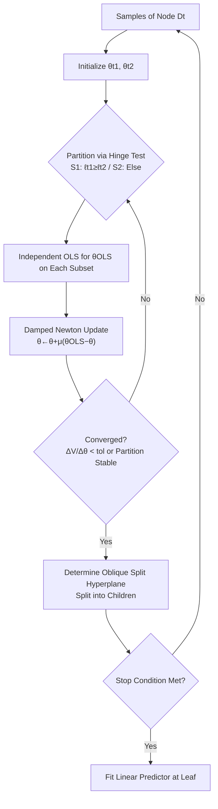

# Hinge Regression Tree: A Newton Method for Oblique Regression Tree Splitting

**Conference**: ICLR 2026  
**Code**: [https://github.com/Hongyi-Li-sz/Hinge-Regression-Tree](https://github.com/Hongyi-Li-sz/Hinge-Regression-Tree)  
**Area**: optimization / explainable machine learning  
**Keywords**: oblique decision trees, regression tree, Newton's method, Gauss-Newton, hinge function, piecewise linear, universal approximation  

## TL;DR
This work rewrites the splitting of each node in an oblique regression tree as a nonlinear least squares problem of "taking the max/min envelope of two linear predictors." It proves that alternating fitting is exactly equivalent to the **damped Newton (Gauss-Newton) method** under a fixed partition. By using iterative updates with backtracking line search, the authors obtain compact oblique regression trees that are both fast and stable, with an $O(\delta^2)$ universal approximation rate.

## Background & Motivation
**Background**: Decision trees are among the most influential models in supervised learning due to their interpretability and ability to characterize nonlinearity. The axis-aligned recursive partitioning of classic CART remains a cornerstone. Oblique decision trees upgrade the "single-feature threshold" to a "hyperplane of linear feature combinations," allowing for better prediction with more compact structures when features are correlated or rotated.

**Limitations of Prior Work**: Finding the optimal oblique hyperplane is NP-hard. Practical methods rely on either slow searches (OC1 random search, evolutionary algorithms) or heuristics and convex proxies lacking theoretical guarantees. Recent optimization-based approaches—such as differentiable oblique trees DGT (over-parameterization + straight-through estimation) and DTSemNet (representing oblique trees as neural networks)—enable end-to-end training but rely on approximations or specific network structures and lack a clear characterization of node-level optimization itself.

**Key Challenge**: Oblique splitting must be **highly expressive** (able to fit complex nonlinearities) while being **efficiently optimized with theoretical support**. Existing methods often force a choice between the two—either convergence behavior is unclear, or expressivity is limited by axis-alignment or approximate training.

**Goal**: To provide a node-splitting algorithm for oblique regression trees that allows direct optimization, offers theoretical guarantees for both convergence and approximation, and produces more compact models.

**Core Idea**: **[Splitting = Nonlinear Least Squares]** Instead of "selecting a threshold," each node learns two linear functions $\ell_{t1}, \ell_{t2}$ and fits the data using their hinge envelope ($\max/\min$) as a basis function; **[Emergent Splitting Hyperplane]** The boundary where the two lines are equal, $\tilde x^\top(\theta_{t1}-\theta_{t2})=0$, naturally forms the oblique split boundary; **[Alternating Fitting = Damped Newton]** Since the hinge function is piecewise linear with zero second derivatives within a fixed partition, the Gauss-Newton approximation holds exactly, and iterations degenerate into "taking a step towards the current OLS solution."

## Method

### Overall Architecture
HRT constructs the tree recursively top-down: each internal node subjects the samples falling into it to a "node-level Newton iteration." This process alternates between "splitting the data into two halves based on current parameters (hinge test)" and "fitting a linear model on each half (OLS)." Once converged, an oblique splitting hyperplane is determined to split the node into left and right children until stopping conditions (max depth / min samples / RMSE threshold) are met. The composite hinge gates from root to leaf are equivalent to a circuit of linear mappings and ReLU gates, thus achieving ReLU-like expressivity.

### Key Designs

**1. Hinge Basis Function: Casting Node Splitting as Nonlinear Least Squares.** At internal node $D_t$, the goal is not to pick a feature and threshold, but to find two sets of parameters $\theta_{t1}, \theta_{t2} \in \mathbb{R}^{d+1}$ defining two linear functions $\ell_{t1}(x)=\tilde x^\top\theta_{t1}$ and $\ell_{t2}(x)=\tilde x^\top\theta_{t2}$ to minimize the nonlinear least squares objective $V(\theta)=\tfrac12\sum_{x_j\in D_t}(y_j-h(x_j,\theta))^2$, where the basis function is $h(x_j,\theta)=\max(\tilde x_j^\top\theta_{t1}, \tilde x_j^\top\theta_{t2})$ or the corresponding $\min$. This hinge inherently contains a decision boundary—the hyperplane where the two lines are equal $\tilde x^\top(\theta_{t1}-\theta_{t2})=0$. Samples are predicted using the line corresponding to the side they fall on. Thus, the "splitting hyperplane" and the "linear models in the leaves" are solved simultaneously by a single optimization problem. This max/min envelope allows the node to fit both local convex and concave structures.

**2. Mechanism: Gauss-Newton Approximation is Exact within Fixed Partitions.** Minimizing $V$ directly is difficult due to non-differentiability. The authors decompose it into an alternating process: first, partition data into $S_1(\theta)=\{x_j:\tilde x_j^\top\theta_{t1}\ge\tilde x_j^\top\theta_{t2}\}$ and $S_2$ based on current parameters. Within a fixed partition, $V$ is differentiable with respect to each parameter. A key observation is that because the hinge is locally linear with zero second derivatives within a fixed partition, the Gauss-Newton approximation of the Hessian is not an approximation but **exact**. Following the gradient structure, the Newton update collapses into a concise form:
$$\theta^{(k+1)}=\theta^{(k)}+\mu\big(\theta^{(k)}_{\text{OLS}}-\theta^{(k)}\big),$$
where $\theta^{(k)}_{\text{OLS}}$ is the OLS optimal solution calculated independently for the current subsets, and $(\theta^{(k)}_{\text{OLS}}-\theta^{(k)})$ is exactly the Newton direction $-[\nabla^2V]^{-1}\nabla V$ under the fixed partition. After the update, partitions are reassigned. When the step size $\mu=1$, this simplifies to $\theta^{(k+1)}=\theta^{(k)}_{\text{OLS}}$, i.e., a single-step Newton—grounding the "seemingly heuristic alternating fitting" as a formal second-order optimization method.

**3. Step Size Strategy: Fixed Damping vs. Auto Backtracking Line Search.** Two ways to select $\mu^{(k)}$ are provided: (i) fixed damping factor $\mu\in(0,1]$ (e.g., 0.1/0.5/1), which is simple and efficient; (ii) automatic backtracking line search (labeled "auto" in experiments), which decays geometrically from $\mu^{(k)}=1$ until an effective split causing a strict decrease in node-level RMSE is found. Theoretical analysis is conducted for the line search variant: under mild assumptions, damped Newton produces a **monotonically decreasing and convergent** sequence of node-level objectives, converging to the corresponding OLS local minimum once partitions stabilize. Experiments confirm the necessity of damping—on unstable problems like "sinc" with sharp oscillations, a single step $\mu=1$ causes partitions to collapse into poor global linear fits, while $\mu=0.5$ can fall into limit cycles. Only small step sizes ensure robust convergence. On smooth problems, $\mu=1$ reaches the optimum in few steps, reflecting the classic speed-stability trade-off.

**4. Design Motivation: Ridge Regularization and $O(\delta^2)$ Approximation Rate.** All OLS fits can optionally be replaced by ridge regression, changing the closed-form solution to $(X_i^\top X_i+\alpha I_0)^{-1}X_i^\top y$. This stabilizes the normal equations by increasing the minimum eigenvalue when there is strong collinearity or few samples in a leaf. If no progress is made within $T_{\max}$ steps, the algorithm falls back to a median split to ensure tree growth. Theoretically, this piecewise linear model class is proven to be a universal approximator for continuous functions: for a $C^2$ function $g$, if domain $K$ is partitioned into regions of diameter $\le\delta$ with design matrices satisfying a minimum eigenvalue bound $\lambda_{\min}(X_i^\top X_i)\ge cN_i$, there exists a tree function $f$ such that $\sup_{x\in K}|f(x)-g(x)|\le C\delta^2$. This explicit $O(\delta^2)$ rate quantifies how "finer trees lead to more accurate fits" and explains why the eigenvalue bound assumption is key to matching approximation and estimation errors.

## Key Experimental Results

### Synthetic Function Approximation (2D/3D, RMSE↓ / R²↑, vs. CART and XGBoost)

| Function | CART RMSE | XGB RMSE | HRT RMSE | HRT R² |
|------|-----------|----------|----------|--------|
| sinc | 0.0325 | 0.0289 | **0.0280** | 0.9876 |
| twisted sigmoid | 0.0312 | 0.0286 | **0.0258†** | **0.9983†** |
| f1(x1,x2) | 0.8552 | 0.3018 | **0.1646†** | **0.9998†** |
| f2(x1,x2) | 0.2721 | 0.0859 | **0.0757†** | **0.9946†** |
| f3(x1,x2) | 0.0752 | 0.0537 | **0.0528†** | 0.9917 |
| f4(x1,x2) | 0.0789 | 0.0556 | 0.0555 | 0.9973 |

As a **single tree**, HRT matches or significantly exceeds XGBoost ensembles on most synthetic tasks († indicates $p<0.05$ over the best baseline), with a substantial RMSE lead on 3D oscillating surfaces (f1/f2).

### Main Results on Real Datasets (RMSE↓, vs. 8 Baselines)

| Dataset (Nf, Ns) | DTSemNet | DGT | TAO-O | XGB | HRT (Ours) |
|------|----------|-----|-------|-----|-----------|
| Abalone (8, 4k) | 2.14 | 2.15 | 2.18 | 2.20 | **2.11** |
| CPUact (21, 8k) | 2.65 | 2.91 | 2.71 | 2.57 | **2.56** |
| Ailerons (40, 14k) | 1.66 | 1.72 | 1.76 | 1.72 | **1.64†** |
| YearPred (90, 515k) | 8.99 | 9.05 | 9.11 | 9.01 | **8.97** |
| Airfoil (5, 2k) | 3.83 | 3.72 | 3.13 | 2.77 | **2.63** |
| Fried (10, 41k) | 1.51 | 2.27 | N/A | 1.09 | **1.09†** |

HRT, as a **single oblique tree**, outperforms single-tree baselines like differentiable oblique trees (DTSemNet/DGT), TAO, CART, M5, and linear-tree on most real datasets and matches XGBoost ensembles on several.

### Key Findings
- **Step Size = Speed/Stability Knob**: Unstable problems (sinc) require $\mu<1$ to prevent partition collapse; smooth problems (twisted sigmoid) converge in few steps with $\mu=1$ (single-step Newton).
- **Compactness**: HRT achieves comparable or better accuracy than ensembles with a smaller structure, validating the efficiency of oblique splitting combined with local linear fitting.
- **Theory-Practice Alignment**: Both the monotonic descent of damped Newton and the $O(\delta^2)$ approximation rate are empirically verified.

## Highlights & Insights
- **"Heuristic Alternating Fitting" Formalized as Second-Order Optimization**: Pointing out that zero second derivatives of the hinge within fixed partitions make the Gauss-Newton approximation exact is a key insight that upgrades "alternating OLS" to a convergent Newton method.
- **Single Least Squares for Both Boundary and Model**: The splitting hyperplane emerges naturally from $\theta_{t1}=\theta_{t2}$, avoiding the disconnect of "splitting then fitting" stages.
- **Dual Theoretical Guarantees**: Combining node-level convergence proofs with a global $O(\delta^2)$ universal approximation rate is rare in oblique tree literature.
- **Interpretability**: Compared to the additive superposition in hinging hyperplanes, HRT maintains tree structure with explicit sub-region expressions, preserving tree interpretability.

## Limitations & Future Work
- **Regression Only**: The method centers on least squares and linear leaves; classification tasks require additional adaptation.
- **Eigenvalue Bound Assumption**: The universal approximation rate depends on $\lambda_{\min}(X_i^\top X_i)\ge cN_i$, which might fail with strong collinearity or small leaves, requiring ridge regression (introducing hyperparameter $\alpha$).
- **Single Tree vs. Ensemble**: While compact, HRT is not always superior to XGBoost on large-scale data; using HRT as a base learner for boosting/bagging is a natural progression.
- **Local Optima**: Alternating optimization is essentially coordinate descent, ensuring only node-level convergence to local OLS solutions; the global tree structure is still limited by greedy construction.

## Related Work & Insights
- **Oblique Regression Trees**: OC1 (random search), GUIDE (stat tests for feature selection), TAO (alternating optimization), DGT, and DTSemNet (differentiable/neural). HRT differs by formulating the split as direct nonlinear least squares using damped Newton.
- **Piecewise Linear and Hinge**: These fall into the same lineage as hinging hyperplanes (Breiman 1993), SVM hinge loss, and ReLU activations. By using $\max(a,b)=a+\sigma(b-a)$, HRT equates the hinge gate to a single ReLU unit, bridging the expressivity analysis of trees and neural networks.
- **Insight**: When a "seemingly engineered alternating update" can be proven equivalent to a well-known optimization method, it often inherits theoretical dividends regarding convergence and rates—this "mapping heuristics to classical optimization" approach is worth applying to other structural learning problems.

## Rating
- **Novelty**: ⭐⭐⭐⭐ — Re-framing "node split = nonlinear least squares + exact Gauss-Newton" is a clean and rare reconstruction of oblique tree optimization.
- **Experimental Thoroughness**: ⭐⭐⭐ — Comprehensive across synthetic and real datasets against 8 strong baselines, though mostly limited to single-tree regression.
- **Writing Quality**: ⭐⭐⭐⭐ — Smooth transitions between motivation, method, theory, and experiments with clear theoretical statements.
- **Value**: ⭐⭐⭐⭐ — Provides a practical tool for explainable oblique regression trees with high efficiency and dual theoretical guarantees, directly valuable for scenarios preferring interpretable models.

<!-- RELATED:START -->

## Related Papers

- [\[ICLR 2026\] Towards Better Branching Policies: Leveraging the Sequential Nature of Branch-and-Bound Tree](towards_better_branching_policies_leveraging_the_sequential_nature_of_branch-and.md)
- [\[ICLR 2026\] Birch SGD: A Tree Graph Framework for Local and Asynchronous SGD Methods](birch_sgd_a_tree_graph_framework_for_local_and_asynchronous_sgd_methods.md)
- [\[ICLR 2026\] Non-Asymptotic Analysis of Efficiency in Conformalized Regression](non-asymptotic_analysis_of_efficiency_in_conformalized_regression.md)
- [\[ICLR 2026\] Distributionally Robust Linear Regression with Block Lewis Weights](distributionally_robust_linear_regression_with_block_lewis_weights.md)
- [\[ICLR 2026\] Newton Method Revisited: Global Convergence Rates up to $O(1/k^3)$ for Stepsize Schedules and Linesearch Procedures](newton_method_revisited_global_convergence_rates_up_to_o1k3_for_stepsize_schedul.md)

<!-- RELATED:END -->
