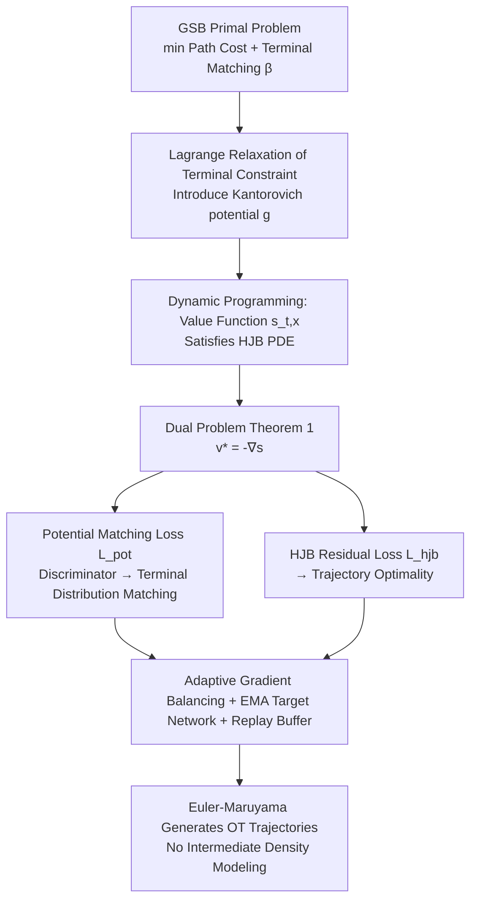

# HOTA: Hamiltonian Framework for Optimal Transport Advection

**Conference**: ICLR 2026  
**OpenReview**: [https://openreview.net/forum?id=Og1klGbvlM](https://openreview.net/forum?id=Og1klGbvlM)  
**Code**: [https://github.com/nazarblch/HOTA](https://github.com/nazarblch/HOTA)  
**Area**: Optimization / Optimal Transport / Dynamic Generative Modeling  
**Keywords**: Generalized Schrödinger Bridge, Hamilton-Jacobi-Bellman, Optimal Transport, Kantorovich Potential, Non-smooth Potential Functions  

## TL;DR
HOTA reformulates the dual problem of the Generalized Schrödinger Bridge (GSB) as a joint optimization of "Kantorovich potential + HJB value function." By employing RL-style replay buffers, target networks, and adaptive gradient balancing, it achieves stable training without modeling intermediate densities, handles non-smooth potential functions, and strictly guarantees terminal distribution matching.

## Background & Motivation
**Background**: Optimal Transport (OT) has become a natural framework for guiding probability flows. Static Monge-Kantorovich OT only concerns boundary coupling and produces linear paths, completely ignoring the geometry of the data manifold. Benamou-Brenier's dynamic OT reformulates this as a temporal variational problem on probability paths, allowing trajectories to operate on non-trivial geometries with curvature, obstacles, or potential fields. This is closely linked to the Generalized Schrödinger Bridge (GSB) problem in Stochastic Optimal Control (SOC).

**Limitations of Prior Work**: GSB typically introduces a state potential function $U(x)$ to encode spatial geometry and physical constraints (e.g., hard-core repulsion or steric clashes in molecular simulations), which are inherently discontinuous or non-smooth. Mainstream solutions follow the HJB dual route (DeepGSB, NLSB) but suffer from two major flaws: (1) Unstable optimization dynamics with high gradient variance and poor sample efficiency in high dimensions; (2) Lack of strict terminal distribution matching criteria, leading to inaccurate coupling. Another line, GSBM, uses alternating optimization (fixing the marginal to learn the drift, then updating the marginal) but **requires the potential function to be differentiable everywhere** and involves extremely expensive alternating iterations (slow convergence).

**Key Challenge**: Retaining the theoretical rigor of HJB and its ability to handle non-smooth potentials while solving its inherent training instability and terminal inaccuracy—two requirements that were previously difficult to satisfy simultaneously.

**Goal**: Propose a new HJB framework for GSB problems between two measures, where geometry is defined by potential functions, that explicitly solves the GSB, fixes learning stability issues, and ensures precise terminal distribution matching via a theoretically grounded objective.

**Core Idea**: **[Dual Binding]** Reorganize the dual form of GSB into a binding of the Kantorovich potential and the HJB value function. By turning the HJB constraint into a built-in regularization term, a stable objective is obtained that is gradient-friendly and inherently independent of density estimation.

## Method

### Overall Architecture
HOTA starts from the GSB primal problem (minimizing path integral cost $L=\|v_t\|^2+U(x_t)$ while matching terminal distributions) and uses a Lagrange multiplier (the Kantorovich potential $g$) to relax the terminal constraint, resulting in a saddle-point problem. Dynamic programming is then used to define the value function $s(t,x)$, proving it satisfies the HJB Partial Differential Equation (PDE), and the inner minimization over control is solved analytically as $v_t^*=-\nabla_x s(t,x_t)$. The final dual problem (Theorem 1) turns the potential matching term into a discriminator for terminal distribution matching, while the HJB residual term ensures trajectory optimality. Training is treated as a hybrid of "Optimal Control + RL": trajectories are simulated via Euler-Maruyama, a replay buffer stores history, an EMA target network stabilizes regression, and adaptive gradient balancing manages the two losses.

### Key Designs

**1. Dual Binding: Internalizing the HJB constraint as regularization.** This is the theoretical pivot of the paper. By introducing the Kantorovich potential $g$ through terminal constraint relaxation and using the boundary condition $s(1,x)=-g(x)$, the potential function and value function are "welded" into the same network. In the dual objective given by Theorem 1:
$$\max_{s(1,\cdot)}\ \mathbb{E}_{x_0\sim\alpha}\Big[\int_0^1 L(t,x_t,-\nabla_x s)\,dt + s(1,x_1)\Big] - \mathbb{E}_{y\sim\beta}\big[s(1,y)\big]$$
The first term acts as a discriminator forcing $T_\#\alpha=\beta$, while the second term (HJB constraint) accounts for trajectory optimality. A key practical insight is that when the HJB constraint is satisfied, the integral cost is already "accounted for" and minimized; thus, the **potential matching loss can omit the explicit integral term**, requiring only the terminal potential difference $L_{\text{pot}}=\frac{1}{n}\sum_k s_\theta(1,x_T^k)-\frac{1}{n}\sum_k s_\theta(1,y^k)$. The resulting objective requires no modeling of intermediate densities at $t\in(0,1)$, which is fundamental to bypassing density estimation and handling non-smooth potentials.

**2. Bi-directional Symmetric HJB Residual Loss + Angular Acceleration Regularization.** To approximate the viscosity solution of the HJB PDE, the loss directly penalizes the PDE residual:
$$\frac{\partial s_\theta}{\partial t}-\frac{1}{2}\|\nabla_x s\|^2+U(x)+\frac{\sigma^2}{2}\mathrm{tr}\{\nabla^2 s\}+\lambda_a\|a\|$$
This is written as a **sum of two terms pairing the main network $s_\theta$ and the target network $s$** (one using the target for $\nabla_x s$ and one using the main network), making optimization resemble supervised regression rather than self-bootstrapping. $U(x)$ enters the residual directly without requiring derivatives of $U$, allowing its use even if non-differentiable. The second-order term $\mathrm{tr}\{\nabla^2 s\}$ is calculated via JAX automatic differentiation with $<5\%$ overhead. An optional angular acceleration term $a=\frac{d}{dt}\frac{\nabla s_\theta}{\\|\nabla s_\theta\|}$ with coefficient $\lambda_a$ encourages straight trajectories.

**3. RL-style Trio for Stable High-Dimensional Training: Replay Buffer + EMA Target Network + Data Replay.** Since intermediate densities are not modeled, training points must fall in regions where the "flow (trajectories) concentrates" to be effective. HOTA initially uses linear interpolation between $\alpha$ and $\beta$ to estimate flow regions, then switches to sampling historical trajectory points from a replay buffer $\mathcal{B}$. Each round, a trajectory generated by the current policy $v_t=-\nabla s$ is stored. The target network $s$ updates parameters via EMA $\theta\leftarrow\gamma\theta+(1-\gamma)\theta$, replicating the DQN approach of fixing the bootstrap target to turn unstable PDE fitting into stable regression.

**4. Adaptive Gradient Balancing: Automatically aligning gradient scales.** $L_{\text{pot}}$ (potential matching) and $L_{\text{hjb}}$ (HJB residual) vary greatly in units and scales. HOTA uses the EMA of the ratio of their gradient norms as a scaling factor:
$$\nabla_\theta L_{\text{pot}}+\lambda_{\text{hjb}}\,\mathrm{EMA}\!\Big(\frac{\|\nabla_\theta L_{\text{pot}}\|}{\|\nabla_\theta L_{\text{hjb}}\|}\Big)\nabla_\theta L_{\text{hjb}}$$
The HJB gradient is dynamically scaled to same order of magnitude as the potential matching gradient, ensuring stable convergence toward both optimality and boundary constraints.

## Key Experimental Results

### Main Results: Low-dimensional Geometrically Constrained Benchmarks (lower feasibility/optimality is better)
Across 6 datasets—the first three (Stunnel/Vneck/GMM) are smooth, the latter three (BabyMaze/Slit/Box) are nearly non-differentiable:

| Metric | Method | Stunnel | Vneck | GMM | BabyMaze | Slit | Box |
|------|------|---------|-------|-----|----------|------|-----|
| Feasibility $W_2$ | NLSB | 30.54 | 0.02 | 67.76 | >1 | 0.013 | 0.024 |
| | GSBM | 0.03 | 0.01 | 4.13 | 0.01 | 0.01 | 0.02 |
| | **HOTA** | **0.006** | **0.002** | **0.19** | **0.004** | **0.0004** | **0.002** |
| Optimality (Integral Cost) | GSBM | 460.88 | 155.53 | 229.12 | 6.5 | 4.9 | 3.8 |
| | **HOTA** | **383.25** | **115.09** | **80.44** | **4.87** | **3.06** | **2.84** |

HOTA **leads comprehensively** in feasibility and optimality. On GMM, optimality drops from 229 to 80, reflecting superior trajectory separation for adjacent points. In terms of efficiency, it is **50–100× faster** than GSBM.

### High-dimensional Scalability (Sphere Dataset, Normalized $W_2$ / Optimality)

| Dim | HOTA $W_2$ | GSBM $W_2$ | HOTA Opt | GSBM Opt |
|------|-----------|-----------|----------|----------|
| 10 | 0.001 | 0.99 | 3.37 | 20.9 |
| 1000 | 0.051 | 0.21 | 3.17 | 22.1 |

Stability is maintained up to 1000 dimensions; additional effectiveness is shown on 1000D opinion depolarization tasks.

### Image Translation (FID, lower is better)

| Task | HOTA | Top Baseline |
|------|------|---------------|
| CelebA Male→Female (64×64) | **6.28** | EUOT 8.44 |
| CelebA Female→Anime (64×64) | **11.67** | ENOT 13.12 |

### Ablation Study (Stunnel/Vneck/GMM, feasibility)

| Variant | Stunnel | Vneck | GMM |
|------|---------|-------|-----|
| HOTA Full | **0.006** | **0.002** | **0.19** |
| w/o buffer | 0.076 | 16.47 | 1.248 |
| w/o Gradient Balance | 3.60 | 0.026 | 2.64 |
| w/o EMA Target Net | 0.018 | 0.004 | 0.65 |

### Key Findings
- The replay buffer is most critical for feasibility; without it, Vneck diverges (16.47).
- Gradient balancing has the largest impact on Stunnel feasibility (rising from 0.006 to 3.60 without it).
- All three components are necessary, though their relative importance varies by dataset.

## Highlights & Insights
- **Elegant Theoretical Loop**: Directly using the Kantorovich potential's boundary condition as the HJB value function's terminal condition allows one network to serve as both "discriminator" and "value function." The dual objective naturally decomposes into feasibility and optimality.
- **Insight on Omitting Integrals**: Since the integral cost is implicitly minimized when HJB constraints are met, potential matching only requires terminal differences—a key step in bypassing density estimation.
- **Transferring RL Engineering to OT**: Deploying DQN stability tricks like replay buffers and EMA target networks to stabilize HJB residual fitting is a prime example of cross-domain synergy.
- **Non-smooth Potentials as a Real-world Need**: Since $U(x)$ enters the residual without differentiation, non-differentiable constraints like molecular hard-cores, black-box LLM potentials, or LiDAR point cloud surfaces can be integrated.

## Limitations & Future Work
- **Sensitivity to Network Design**: Choice of architecture, such as Fourier feature encoding for time, is sensitive as the value function must support both optimal control estimation and serve as the Kantorovich potential.
- **Strong Theoretical Assumptions**: Currently relies on $s\in C^{1,2}$ regularity; the authors plan to relax these to weaker regularity assumptions.
- **Architectural Scaling**: Future work involves introducing more structured neural architectures to further improve scalability and stability.
- Validation was limited to single A100 80GB GPUs; performance in larger industrial scenarios remains to be tested.

## Related Work & Insights
- **Dynamic OT Lineage**: Benamou-Brenier Dynamic OT → Schrödinger Bridge → GSB (with state potential $U$). HOTA follows the HJB dual approach, competing with DeepGSB, NLSB, and GSBM.
- **Contrast with GSBM**: GSBM requires differentiable potentials and expensive alternating optimization; HOTA uses joint single-objective optimization, handles non-smooth potentials, and is 50–100× faster.
- **Connection to SOC**: Unlike SOC methods like Adjoint Matching or SOCM which face variance instability, HOTA uses Kantorovich potentials to guarantee feasibility.
- **Inspiration**: For tasks where constraints are given as potentials (potentially non-differentiable), treating constraints as PDE residuals rather than requiring differentiability is a reusable strategy. RL stabilization techniques remain highly effective in continuous control and PDE solving.

## Rating
- **Novelty**: ⭐⭐⭐⭐ — Dual binding (Kantorovich = HJB terminal) turns HJB into a built-in regularizer; the combination with RL stability tricks for GSB is novel and self-consistent.
- **Experimental Thoroughness**: ⭐⭐⭐⭐ — Covers 6 low-D benchmarks, 1000-D scalability, and image translation; clear ablation of the "trio"; however, some baseline results are cited from originals and a few tasks lack complete control groups.
- **Writing Quality**: ⭐⭐⭐⭐ — Clear derivation from primal problem to dual theorem; performance metrics are well-defined with complete pseudocode.
- **Value**: ⭐⭐⭐⭐ — Addresses non-smooth potentials, terminal matching, and high-D stability simultaneously with 50-100× speedup; highly relevant for OT applications in computational biology, robotics, and generative modeling.

<!-- RELATED:START -->

## Related Papers

- [\[ICLR 2026\] Neural Hamilton–Jacobi Characteristic Flows for Optimal Transport](neural_hamilton--jacobi_characteristic_flows_for_optimal_transport.md)
- [\[ICLR 2026\] Elastic Optimal Transport: Theory, Application, and Empirical Evaluation](elastic_optimal_transport_theory_application_and_empirical_evaluation.md)
- [\[ICLR 2026\] A Scalable Constant-Factor Approximation Algorithm for $W_p$ Optimal Transport](a_scalable_constant-factor_approximation_algorithm_for_w_p_optimal_transport.md)
- [\[ICLR 2026\] Neural Optimal Transport Meets Multivariate Conformal Prediction](neural_optimal_transport_meets_multivariate_conformal_prediction.md)
- [\[ICLR 2026\] A Memory-Efficient Hierarchical Algorithm for Large-scale Optimal Transport Problems](a_memory-efficient_hierarchical_algorithm_for_large-scale_optimal_transport_prob.md)

<!-- RELATED:END -->
