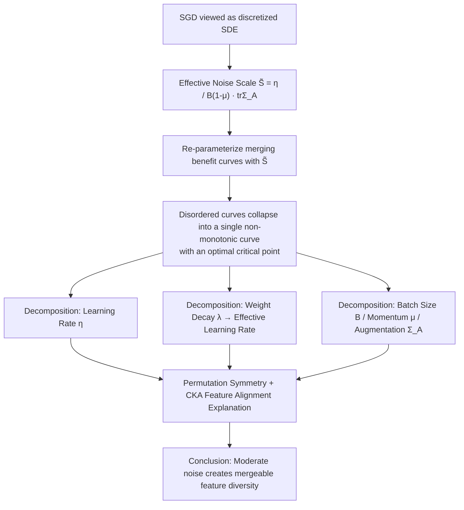

# How does the optimizer implicitly bias the model merging loss landscape?

**Conference**: ICLR 2026  
**OpenReview**: [https://openreview.net/forum?id=RU76KTF1Da](https://openreview.net/forum?id=RU76KTF1Da)  
**Code**: To be confirmed  
**Area**: optimization  
**Keywords**: model merging, loss landscape, implicit optimizer bias, effective noise scale, linear mode connectivity, task arithmetic  

## TL;DR
This paper proposes using a single physical quantity, "effective noise scale," to uniformly characterize the impact of optimization hyperparameters—such as learning rate, weight decay, batch size, momentum, and data augmentation—on **model merging**. It proves that merging benefits are a **non-monotonic** function of this noise (with an optimal critical point), thereby extending the implicit bias of the optimizer from "flatness of a single minimum" to the "global loss landscape geometry between different solutions."

## Background & Motivation
**Background**: Model merging fuses the capabilities of multiple models without increasing inference costs by performing weight averaging (linear interpolation) or task vector addition (task arithmetic) on independently trained models. This technique is widely used for leaderboard climbing and multi-task fusion. Its theoretical foundation is "mode connectivity"—the existence of low-loss paths between independent solutions—especially "Linear Mode Connectivity" (LMC) discovered by Frankle et al., where solutions sharing an initial optimization trajectory can be connected by a linear low-loss path.

**Limitations of Prior Work**: Whether merging succeeds in practice depends heavily on repeated trial and error—practitioners must train and evaluate a large number of candidate models to identify which ones are mergeable. A fundamental unanswered question is: **Why can some models with similar performance be merged while others fail?**

**Key Challenge**: The discovery of LMC implies that "optimization dynamics (rather than just final convergence points) shape the landscape geometry between solutions." However, the effects of learning rate, weight decay, and batch size—factors acknowledged to influence optimization dynamics—on the **merging loss landscape** have not been clarified. Existing work only links optimization noise to the flatness/generalization of a single minimum; none have studied how it affects the global landscape **between solutions**.

**Goal**: Systematically characterize how various optimizer components implicitly determine whether independently trained solutions fall into a "merging compatibility zone."

**Core Idea**: **[Unified Variable]** Instead of treating hyperparameters as independent knobs, this work discovers that they collectively modulate the same underlying quantity—the **effective noise scale** $\tilde S = \frac{\eta}{B(1-\mu)}$ (superimposed with the gradient covariance $\mathrm{tr}\,\Sigma_A$ brought by data augmentation)—and uses this to predict merging success.

## Method

### Overall Architecture
This paper is a **mechanistic empirical study** rather than a new algorithm. Its framework is as follows: first, from the perspective of Stochastic Differential Equations (SDE), SGD is viewed as a stochastic process with a diffusion term to derive a scalar "effective noise scale" $\tilde S$ that absorbs all noise sources. Then, using $\tilde S$ as the horizontal axis to re-parameterize the merging benefit curves, it is discovered that multiple originally disordered curves collapse into a single **non-monotonic** curve (with an optimal critical point). Finally, each optimization component (learning rate, weight decay, batch size, momentum, augmentation) is decomposed to verify that they all exhibit the same qualitative trend through $\tilde S$ across four scenarios—vision, language, transfer learning, and task arithmetic—while explaining the representation-level mechanism of "why moderate noise is most conducive to merging" using permutation symmetry and Centered Kernel Alignment (CKA).

### Key Designs

**1. Effective Noise Scale: Compressing all optimization components into a single scalar.** Following the stochastic optimization framework of Mandt et al., the paper writes the minibatch gradient as $g_t = \nabla L(\theta_t) + \xi_t$, where the noise covariance $\mathrm{Cov}[\xi_t] \approx \Sigma_A(\theta_t)/B$. Viewing the SGD update as a discretized SDE, its diffusion strength is proportional to the learning rate $\eta$, inversely proportional to the batch size $B$, and further amplified by $(1-\mu)^{-1}$ under momentum parameterization, with the remaining magnitude determined by the trace of the task/data-dependent gradient covariance $\mathrm{tr}\,\Sigma$. Thus, all effects are summarized as $S_{\text{eff}} \propto \frac{\eta}{B(1-\mu)}\mathrm{tr}\,\Sigma_A(\theta_t)$. When augmentation $A$ is fixed across experiments, $\mathrm{tr}\,\Sigma_A$ is approximately constant, leading to a practical proxy $\tilde S = \frac{\eta}{B(1-\mu)}$ for direct comparison. The key observation is that merging benefits appear irregular when looking at learning rate or batch size individually (Fig 1a/b)—for the same increase in LR, the benefit monotonically decreases at $B=16$ but increases at $B=128/256$. However, once the horizontal axis is replaced by $\tilde S$ (Fig 1c), all curves align into a single **non-monotonic** curve, where benefits rise with noise up to a critical point and then decline, proving that $\tilde S$ is the true unified control variable.

**2. Weight decay injects noise via "effective learning rate" and only works for scale-invariant networks.** Traditionally, weight decay $\lambda\|\theta\|_2^2$ is seen as suppressing overfitting. However, modern networks frequently use normalization layers and are thus **weight scale-invariant** ($f(x,\alpha\theta)=f(x,\theta)$). In scale-invariant networks, if $\lambda=0$, the gradient norm decays as the weight norm grows ($\|\nabla L\|_2^2 \propto 1/\|\theta\|_2^2$), forcing the effective learning rate toward zero. Increasing $\lambda$ prevents this decay, thereby maintaining the stochastic noise. The paper predicts "large weight decay $\Rightarrow$ easier merging" based on this, verifying a +1.2% median gain at $\lambda=5\mathrm{e}{-4}$ over other values on TinyImageNet. Conversely, for non-scale-invariant MLPs, different $\lambda$ values make almost no difference to merging, cleanly supporting the mechanism that weight decay affects merging via the effective learning rate rather than direct regularization.

**3. Batch size, momentum, and augmentation are different entry points for the same noise.** Small batch sizes increase the gradient variance $\mathrm{Var}(\hat g)\propto \sigma^2/B$ ($B=16$ yields +1% median gain, while $B=256$ yields nearly zero); large momentum $\mu=0.9$ alters the effective noise characteristics of SGD, leading to a +1.0% merging gain, far exceeding the +0.2% of low momentum; data augmentation injects additional variance into the gradient covariance $\Sigma_A$ through random transformations, improving both single-model accuracy and merging benefits, even when a positive benefit can be achieved with only a high learning rate in the absence of augmentation. These three factors complement learning rate noise to shape local and global landscapes—elevating "optimization noise" from a single knob to a systemic variable controlled by multiple components.

**4. Task arithmetic landscape is sensitive to initialization, revealing that "large learning rates require good initialization."** In transfer learning (pre-trained initialization, e.g., CLIP/ConvNeXt), solutions trained with large learning rates are more robust to the task arithmetic interpolation coefficient $\alpha$ and exhibit flatter landscapes (Fig 7a). However, in non-transfer (same task) settings, the trend reverses: large learning rates fall into sharper minima (Fig 7b). This suggests that $\theta_{\text{base}}$ is crucial—large learning rates must be paired with appropriate initialization to shape smooth landscapes. Furthermore, when merging models from different tasks (CLIP fine-tuned on FMoW and RESISC45 using TA/TIES), a moderately large learning rate ($\eta=3\mathrm{e}{-5}$) provides the best normalized accuracy but loses compatibility with models at other noise levels; TIES also cancels out noise introduced by large learning rates more effectively than TA (best point 88.0% vs 85.9%, +2%).

**5. Mechanistic explanation: Moderate noise creates "exploitable feature diversity."** Using weight-matching-based re-basin to align two independently initialized ResNet18s, it was found that large effective noise makes minima wider and the permutation alignment path flatter, making it easier to satisfy linear mode connectivity. Simultaneously, using linear CKA to measure the feature alignment of activations in the penultimate layer of the two branches, it was found that increasing effective noise **simultaneously** increases merging benefits and **decreases** feature alignment—that is, low-noise training produces highly aligned, redundant representations (no merging gain), while moderate/critical noise creates mutually complementary diverse features, which are the source that merging can exploit. This representation-level evidence maps the "non-monotonic benefit curve" to the tradeoff between "feature diversity vs. redundancy."

## Key Experimental Results

### Main Results (Linear interpolation merging, fixed $\alpha=0.5$, median accuracy gain)

| Setting | High Noise/LR Gain | Low Noise/LR Gain | Remarks |
|------|------|------|------|
| CIFAR100 / ResNet18 | $\eta=2\mathrm{e}{-1}$: +1.2% | $\eta=1\mathrm{e}{-2}$: +0.2% | Single model accuracy ≈75% |
| TinyImageNet / DenseNet121 (WD) | $\lambda=5\mathrm{e}{-4}$: +1.2% | Other $\lambda$: +0.5% | Only for scale-invariant nets |
| CIFAR100 / Batch Size | $B=16$: +1% | $B=256$: ≈0 | Fixed 200k steps |
| CIFAR100 / Momentum | $\mu=0.9$: +1.0% | Low/Zero momentum: +0.2% | — |
| TinyStories / 2-layer GPT (Lang) | Large $\eta$/$\lambda$ better loss gain | Small values negligible | $\eta=1\mathrm{e}{-3}$ converges to loss 2.20 |

### Ablation Study

| Analysis Dimension | Key Results |
|------|------|
| LR vs Batch Size (Fig 1) | No trend individually; curves align and show non-monotonicity (critical point) when using $\tilde S$ |
| Transfer Learning (CLIP ViT-B/16 → FMoW) | Accuracy gain Pearson correlation with LR $r=0.981$; but best merged model uses moderate $\eta=3\mathrm{e}{-5}$ |
| Task Arithmetic Init. Comparison (Fig 7) | Transfer: Large $\eta$ is flatter; Non-transfer: Large $\eta$ is sharper |
| Cross-task Merging TA vs TIES (Fig 8) | Best point TIES 88.0% vs TA 85.9% (+2%); similar and moderately large $\eta$ pairs best |
| Feature Alignment (CKA) | Noise ↑ $\Rightarrow$ Merging gain ↑ and Feature alignment ↓ (Higher diversity) |

### Key Findings
1. **Non-monotonicity and Critical Points**: Merging benefits first rise and then fall with effective noise, with a clear optimal critical point—either too little or too much noise results in almost no merging benefit.
2. **Large LR/Weight Decay identifies more compatible solutions**: Even if two sets of solutions have similar generalization on the test set, solutions obtained from high-noise training are easier to merge.
3. **Large LR $\neq$ Always Better**: In transfer learning, accuracy gain is nearly perfectly linearly correlated with learning rate ($r=0.981$), but the **best post-merge performance** comes from a moderate learning rate (the single model with the highest learning rate performs worst).
4. **Mechanism**: Moderate noise $\Rightarrow$ wider basins + easier permutation alignment + more diverse (low alignment) features $\Rightarrow$ maximum diversity exploitable by merging.

## Highlights & Insights
- **Strong Unification**: Compressing five or six seemingly independent optimization hyperparameters into a single scalar $\tilde S$ and proving its explanatory power through the clean empirical phenomenon of "curve collapse" is the most elegant aspect of this work.
- **Expansion of Theoretical Perspective**: It extends the classic understanding of "optimization noise $\rightarrow$ single-minima flatness/generalization" to "optimization noise $\rightarrow$ global landscape between solutions $\rightarrow$ merging compatibility," providing a substantial addition to the mode connectivity literature.
- **Actionable Practical Insights**: Instead of blindly trying to pick mergeable models, one can directly adjust $\tilde S$ to the critical region; it also reveals heuristics such as "large learning rates need good initialization" and "TIES is more noise-resistant than TA."
- **Mechanistic Closed-loop**: Using CKA feature alignment to correspond "non-monotonic benefits" with the trade-off between "feature diversity vs. redundancy" provides causal intuition at the representation level rather than just correlation.

## Limitations & Future Work
- **Small Experimental Scale**: Validated primarily on ResNet18/DenseNet121/Small GPT and CIFAR/TinyImageNet/TinyStories, lacking evidence on contemporary SOTA models like large LLMs or diffusion models.
- **$\tilde S$ as an Approximate Proxy**: $\mathrm{tr}\,\Sigma_A$ is treated as a constant; this approximation may fail across different tasks or architectures, and the absolute position of the critical point depends on the specific setup, making it difficult to provide a priori.
- **Lack of Directly Optimizable Algorithms**: This work is "explanatory + predictive" and has not yet provided a specific optimizer/scheduler that "automatically pushes training dynamics to the merging-optimal noise," which the authors list as a future direction.
- **Initialization-dependent Task Arithmetic Conclusions**: The opposite trends in flatness for large learning rates under transfer vs. non-transfer settings suggest that the single scalar $\tilde S$ cannot completely determine the task arithmetic landscape, and initialization is another key variable not yet incorporated.

## Related Work & Insights
- **Mode Connectivity / Linear Mode Connectivity** (Garipov, Draxler, Frankle, Neyshabur): The theoretical foundation, which this work advances from "shared trajectory $\Rightarrow$ linear connectivity" to "optimization noise $\Rightarrow$ when connectivity occurs."
- **Re-basin / Permutation Symmetry** (Entezari, Ainsworth, Theus): Used as a mechanistic analysis tool, proving that large noise simplifies permutation alignment.
- **Optimization Noise and Generalization** (Keskar, Jastrzebski, Smith & Le, Mandt): This work inherits their SDE/effective learning rate framework but shifts the focus from single minima to the landscape between solutions.
- **Model Merging Applications** (Wortsman model soups, Ilharco task arithmetic, Yadav TIES): This work provides an optimization dynamics explanation for "when these methods work."
- **Insights**: Any method relying on the "compatibility of multiple independent solutions" (Federated Learning, Ensemble Distillation, Checkpoint Averaging) can benefit from the idea of "predicting compatibility using effective noise scale"; it also suggests using "merge-friendliness" as an explicit objective when designing training schedules.

## Rating
- **Novelty**: ⭐⭐⭐⭐ — Unifying all optimization components with a single "effective noise scale" and extending noise from single-minima flatness to global landscape geometry is a novel perspective with strong explanatory power.
- **Experimental Thoroughness**: ⭐⭐⭐⭐ — Covers four categories: vision, language, transfer, and task arithmetic, with multiple architectures and datasets, including permutation and CKA mechanism analysis; points deducted for lack of large-scale LLM validation.
- **Writing Quality**: ⭐⭐⭐⭐ — The logical thread (unified variable $\rightarrow$ decomposition $\rightarrow$ mechanism) is clear, charts are well-organized, and the narrative progresses systematically.
- **Value**: ⭐⭐⭐⭐ — Deepens theoretical understanding of the implicit bias of optimizers and provides immediately applicable practical guides like "adjusting $\tilde S$ to the critical zone," "pairing large LR with good initialization," and "TIES's noise resistance."

<!-- RELATED:START -->

- **Frankle et al.** - Linear Mode Connectivity and the Lottery Ticket Hypothesis (ICML 2020)
- **Wortsman et al.** - Model Soups: Averaging Weights of Multiple Fine-Tuned Models (ICML 2022)
- **Ainsworth et al.** - Git Re-Basin: Merging Models modulo Permutation Symmetries (ICLR 2023)
- **Mandt et al.** - Stochastic Gradient Descent as Approximate Bayesian Inference (JMLR 2017)

<!-- RELATED:END -->

## Related Papers

- [\[CVPR 2026\] Globscope: Toward a Global View of the Loss Landscape](../../CVPR2026/optimization/globscope_toward_a_global_view_of_the_loss_landscape.md)
- [\[CVPR 2026\] BD-Merging: Bias-Aware Dynamic Model Merging with Evidence-Guided Contrastive Learning](../../CVPR2026/optimization/bd-merging_bias-aware_dynamic_model_merging_with_evidence-guided_contrastive_lea.md)
- [\[CVPR 2026\] Model Merging in the Essential Subspace](../../CVPR2026/optimization/model_merging_in_the_essential_subspace.md)
- [\[CVPR 2026\] ACE-Merging: Data-Free Model Merging with Adaptive Covariance Estimation](../../CVPR2026/optimization/ace-merging_data-free_model_merging_with_adaptive_covariance_estimation.md)
- [\[ICML 2026\] Sharp Description of Local Minima in the Loss Landscape of High-Dimensional Two-Layer ReLU Networks](../../ICML2026/optimization/sharp_description_of_local_minima_in_the_loss_landscape_of_high-dimensional_two-.md)

<!-- RELATED:END -->
