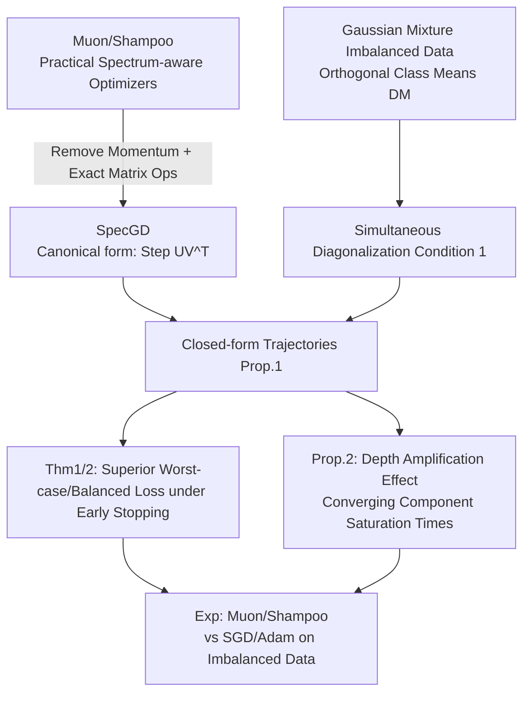

# How Muon's Spectral Design Benefits Generalization: A Study on Imbalanced Data

**Conference**: ICLR 2026  
**OpenReview**: [https://openreview.net/forum?id=YzjS4jcfmS](https://openreview.net/forum?id=YzjS4jcfmS)  
**Code**: TBD  
**Area**: Optimization Theory / Generalization Analysis  
**Keywords**: Muon, Shampoo, Spectral Gradient Descent, Implicit Regularization, Class Imbalance, Spectrum-aware Optimizers  

## TL;DR
This paper abstracts Muon/Shampoo as Spectral Gradient Descent (SpecGD) and provides closed-form training trajectories on Gaussian mixture imbalanced data. It proves that SpecGD learns **all spectral components at the same rate** (whereas GD prioritizes principal components), thereby achieving superior worst-class/class-balanced generalization under early stopping. This reveals the mechanism through which Muon outperforms SGD on imbalanced datasets.

## Background & Motivation

**Background**: Spectrum-aware matrix-valued optimizers, represented by Muon and Shampoo, have demonstrated significant training acceleration on deep classifiers and Large Language Models (LLMs), outperforming SGD+momentum and even Adam. Their fundamental difference from SGD/Adam lies in the fact that while the latter vectorize parameter tensors and perform entry-wise operations, Muon/Shampoo operate directly on layer-wise **matrix parameters**.

**Limitations of Prior Work**: Despite empirical success, the fundamental question of "when spectrum-aware optimizers generalize better than standard methods" remains unanswered. Existing theoretical works (Fan et al. 2025, Tsilivis et al. 2024) characterize the implicit bias of SpecGD—driving weights toward a max-margin classifier in the spectral norm sense—but have two limitations: ① They only describe behavior in the **terminal phase** of training, whereas practice often uses early stopping; ② Implicit bias results **do not directly guarantee generalization** (even in linear settings, the minimum spectral norm solution may not be unique).

**Key Challenge**: Research on Muon/Shampoo has mostly remained at the level of optimization properties (convergence, scalability), while their **generalization behavior and underlying mechanisms** are largely overlooked. A clean, analytical setup capable of precisely quantifying "when spectral methods are superior" is missing.

**Goal**: Identify specific settings where SpecGD clearly outperforms (Euclidean) GD in generalization, and precisely quantify and attribute this advantage to an interpretable mechanism.

**Key Insight**: The authors construct an analytical stage using three simplifications: **[Abstraction 1: Imbalanced Data as Testbed]** Using class/group imbalanced data as the testbed; **[Abstraction 2: SpecGD as Canonical Form]** Reducing Muon/Shampoo to SpecGD by removing momentum and approximations and using exact matrix operations (where each step updates $UV^\top$, with $U\Sigma V^\top$ being the truncated SVD of the gradient), similar to how SignGD is the canonical form of Adam; **[Abstraction 3: Gaussian Mixture + Simultaneous Diagonalization]** Selecting a Gaussian mixture data model within this framework that allows for closed-form trajectories to precisely compare SpecGD and GD.

## Method

### Overall Architecture

This paper does not propose a new algorithm but builds an **analytical theoretical framework**: It first unifies practical optimizers under the perspective of Normalized Steepest Descent (NSD), then derives closed-form training trajectories for GD and SpecGD on a Gaussian mixture imbalanced data model, and finally uses these trajectories to prove the generalization gap under early stopping and extend the findings to deep models.

### Key Designs

**1. Unified Perspective: NSD reduces all optimizers to "Normalized Steepest Descent with respect to different norms."** This is the entry point for the theory. The update for normalized steepest descent is written as $W_{t+1}=W_t-\eta\Delta_t$, where $\Delta_t:=\arg\max_{\|\Delta\|\le 1}\langle\nabla_t,\Delta\rangle$. Different norms yield different optimizers: the Frobenius norm gives NGD ($\Delta_t=\nabla_t/\|\nabla_t\|_F$), the max norm gives SignGD ($\Delta_t=\mathrm{sign}(\nabla_t)$), and the spectral norm gives SpecGD ($\Delta_t=U_tV_t^\top$, i.e., the gradient SVD with singular values removed). With a momentum term $M_t=\beta M_{t-1}+(1-\beta)\nabla_t$, the spectral norm version is Muon (reducing to SpecGD when $\beta=0$). This unification transforms the question of "why Muon is different" into an analytical problem of "what spectral norm steepest descent is doing."

**2. Gaussian Mixture Data Model + Simultaneous Diagonalization Condition enable closed-form trajectories.** The Data Model (DM) assumes $k$ classes with class priors $p_c$. Samples from each class are isotropic Gaussians centered at orthogonal class means $\mu_c$ ($\|\mu_c\|=\mu$, $\mu_i\perp\mu_j$), i.e., $x|y\sim\mathcal N(\mu_y,\sigma_x^2 I)$. Define the minority class $m=\arg\min_c p_c$ and the Signal-to-Noise Ratio $\mathrm{SNR}=\mu^2/\sigma_x^2$. A key lemma proves this model satisfies Condition 1 (Simultaneous Diagonalization): the population moments $\Sigma_{yx}=US_{yx}V^\top$ and $\Sigma_{xx}=VS_{xx}V^\top$ share the same orthogonal bases, and their spectral values satisfy $s^{yx}_c=\mu p_c$ and $s^{xx}_c=\mu^2 p_c+\sigma_x^2$. This means **spectral components are ordered by class priors, with the minority class corresponding to the least significant component.** The authors intentionally adapt the empirical moment conditions of Saxe et al. to **population statistics** to directly discuss test loss, justified by Gidel et al.'s verification that a weakened version of this condition holds approximately on MNIST/CIFAR.

**3. Core Idea—SpecGD learns all components "at the same pace," while GD learns "fat first, thin later."** Under zero initialization and Condition 1, the GD trajectory (gradient flow approximation) is $\overline W_t[c,c]\approx\frac{s^{yx}_c}{s^{xx}_c}(1-e^{-\eta s^{xx}_c t})$. The learning rate for component $c$ is proportional to $s^{xx}_c$, so **principal components are learned quickly, while weak components are learned slowly.** Conversely, Proposition 1 gives the closed-form trajectory for SpecGD: $\overline W_t[c,c]=\eta t\cdot\mathbb 1[t\le\frac{s^{yx}_c}{\eta s^{xx}_c}]+\frac{s^{yx}_c}{s^{xx}_c}\cdot\mathbb 1[t>\frac{s^{yx}_c}{\eta s^{xx}_c}]$. All components grow linearly with the **same slope $\eta$** until they reach their respective saturation points. While both asymptotically converge to the same solution, SpecGD ensures that the minority class (weak components) is learned synchronously in the early stages.

**4. Early Stopping Generalization Theorem: Translating "same pace learning" into quantifiable loss gaps.** Using the per-class loss $L_c(t)=\frac12[(1-\mu\alpha_c(t))^2+\sigma_x^2\sum_j\alpha_j^2(t)]$ (where $\alpha_c=\overline W[c,c]$), Theorem 1 proves that under conditions like $\mu\ge1$, $k\ge 3\mu$, and $p_m\le\frac{1}{5\mathrm{SNR}+6k}$, if $t^\star=s^{yx}_m/s^{xx}_m$ is the moment SpecGF fits the minority class, the gap **grows linearly** over time for all $t\in(0,t^\star]$: $L^{GF}_m(t)-L^{Spec}_m(t)\ge\mu t/4$ and $L^{GF}_{bal}(t)-L^{Spec}_{bal}(t)\ge\mu t/2$. Theorem 2 further dismisses the doubt that "advantages come only from normalization": even when GD is equipped with normalization (NGD), SpecGD still wins with $L^{NGF}_m-L^{Spec}_m\ge\mu t/2$ and similar gains in balanced loss—because the NGD trajectory shape is identical to GD, just faster, still prioritizing principal components.

**5. Depth Amplification Effect: More layers lead to more aligned saturation times.** Extending the model to a deep linear network $W=\prod_i W_i$ of depth $L$, Proposition 2 (for bilinear $L=2$, corresponding to the Unconstrained Feature Model UFM) shows that under SpecGD, the saturation time for component $c$ changes from $t_c=\frac1\eta\frac{s^{yx}_c}{s^{xx}_c}$ in the linear model to $t_c\approx\frac1\eta\sqrt{s^{yx}_c/s^{xx}_c}$. For general depth, $t_c\propto(s^{yx}_c/s^{xx}_c)^{1/L}$. The relative interval between minority and majority class saturation, $\Delta T=\big(\frac{\mathrm{SNR}+1/p_m}{\mathrm{SNR}+1/p_M}\big)^{1/L}-1$, shrinks as $L$ increases. This means **depth accelerates the learning of all components while narrowing the saturation time gap between different components**, allowing the minority class to be learned even earlier.

## Key Experimental Results

### Main Results: Muon vs SGD/Adam/Shampoo on Group/Class Imbalance

| Setting | Dataset | Model | Key Metric | Main Findings |
|------|--------|------|----------|----------|
| Group Imbalance (Spurious) | Colored-MNIST (99% correlation) | MLP | Minority Group Acc | Muon surpasses NMD/Signum early in minority groups. |
| Class STEP Imbalance (20:1) | CIFAR-10 / CIFAR-100 | ResNet-18/50 | Minority Class Acc | Muon significantly reduces the minority-majority gap early on. |
| Group Imbalance (Spurious) | MNIST-CIFAR Dominoes | ResNet-34 | Worst-group / Decoded worst-group Acc | Muon/Shampoo/Adam decoding accuracy is much higher than SGD, indicating core feature learning; SGD relies on spurious features. |
| Subgroup Robustness | MultiNLI (BERT Fine-tuning) | BERT-base | Worst-group Acc | Muon/Shampoo > SGD; Adam slightly better than Muon. |
| Subgroup Robustness | CelebA (ResNet-50 Fine-tuning) | ResNet-50 | Worst-group Acc | Muon/Shampoo > SGD; Muon ≈ Adam as FT epochs increase. |

### Ablation Study / Mechanism Verification

| Experiment | Setting | Theoretical point verified |
|------|------|--------------|
| NGD/SignGD/SpecGD on Linear Models (Cross-entropy, heavy-tail $p_c\propto 1/c$) | $d=200$, $k=20$ | Early-stopped SpecGD achieves higher class-balanced/worst-class accuracy than any stopping point of other rules (Fig.4). |
| Iterative Trajectory $\overline W_t[c,c]$ Tracking ($d=k=3$) | $p=(0.5,0.3,0.2)$ | SpecGD is pace-aligned, while (N)GD learns principal components first; all converge to the same solution eventually (Fig.2). |
| Finite Samples + Random Init vs Theoretical Trajectory | App. C | Theoretical dynamics match empirical observations closely; Muon ($\beta=0.9$) ≈ SpecGD. |
| 2-layer vs 4-layer MLP (Colored-MNIST) | Depth Comparison | Depth accelerates minority component learning and narrows saturation intervals, verifying Prop.2 (Fig.6). |

### Key Findings
- **Mechanism Attribution**: In data with spurious correlations, the spurious features (e.g., color) are the **principal spectral components**, while core features (e.g., digit shape) are weak components. SGD prioritizes principal components → relies on shortcuts; Muon learns at the same pace → captures core features, resulting in better worst-group generalization.
- **Early-stage Advantage**: All methods asymptotically converge to the same solution. The generalization dividend of SpecGD is mainly reflected during **early stopping**, with the gap increasing before converging at saturation.
- **Not Just Normalization**: NGD converges faster but maintains the same trajectory shape, still losing to SpecGD, proving the advantage comes from the spectral design itself.
- **Extension to Language Modeling**: Propagating class imbalance to next-token prediction (word frequency long tails), spectral methods similarly learn long-tail tokens more equitably.

## Highlights & Insights
- **Precise Abstraction**: Using "imbalanced data + population statistics simultaneous diagonalization" compresses the elusive "when is generalization better" question into a form with closed-form solutions, with the data model strictly satisfying theoretical conditions.
- **Elegant Canonical Form Analogy**: The parallel structure of SignGD↔Adam and SpecGD↔Muon/Shampoo allows spectral method analysis to reuse mature tools from max-margin/implicit bias research.
- **Explainable Mechanism**: Rooting "why Muon is better" in the observable "spectral component learning rates" and mapping spurious=principal / core=weak features connects abstract theory back to real-world spurious correlation phenomena.
- **Counter-intuitive Depth Effect**: Depth acts differently on GD vs SpecGD—under SpecGD, depth pulls the saturation times of different components closer, offering a new perspective on why deep networks behave differently on imbalanced data.

## Limitations & Future Work
- **Theoretical Scope**: Limited to squared loss, population settings, and linear/bilinear/deep linear models, relying on Simultaneous Diagonalization (Condition 1, residual $\|B\|=0$), which real non-linear deep networks only satisfy approximately.
- **Idealized Data Model**: Orthogonal class means and isotropic Gaussians. Real-world correlation structures may differ; though supported by MNIST/CIFAR approximations, strictness is lacking.
- **Early-stopping Dependency**: Asymptotically all methods are equivalent; SpecGD's dividend is significant only in early-stopped + imbalanced/spurious scenarios. In MultiNLI, Adam was superior, showing the conclusion is not universal.
- **Gap between SpecGD and Muon**: Practical Muon includes momentum and Newton-Schulz approximations, while the theory is strictly valid for $\beta=0$ and exact SVD. The authors supplement this with empirical evidence, but analytical guarantees are missing.

## Related Work & Insights
- **Implicit Bias Taxonomy**: GD → $\ell_2$ max-margin (Soudry et al. 2018), Adam → $\ell_\infty$ max-margin (Zhang et al. 2024), SpecGD → spectral norm max-margin (Fan et al. 2025). This paper fills the gap regarding generalization dynamics during early stopping.
- **Deep Linear Net Dynamics**: Saxe et al. 2013 and Gidel et al. 2019 provided staged learning trajectories for GD under simultaneous diagonalization. This paper migrates those tools to SpecGD and expands to population statistics.
- **Spectrum-aware Optimizers**: Shampoo (Gupta et al. 2018) and Muon (Jordan et al. 2024; Pethick et al. 2025) were previously studied for optimization/scalability. This paper targets the generalization mechanism.
- **Insight**: ① Optimizer choice is a form of implicit regularization where "which components are learned and when" is more critical for generalization than "where it converges." ② On long-tail/imbalanced/shortcut-prone tasks, spectrum-aware optimizers + early stopping may be a more native solution than resampling/reweighting.

## Rating
- **Novelty**: ⭐⭐⭐⭐⭐ Precisely quantifies Muon/Shampoo's generalization advantage as "pace-aligned spectral learning."
- **Experimental Thoroughness**: ⭐⭐⭐⭐ Covers various benchmarks; theoretical-empirical alignment is solid, though non-linear networks are only approximately verified.
- **Writing Quality**: ⭐⭐⭐⭐ Clear motivation chain; though formula-heavy, the connection between theorems and mechanisms is smooth.
- **Value**: ⭐⭐⭐⭐⭐ Provides a theoretically grounded and quantifiable basis for when to use spectrum-aware optimizers.

## Related Papers

- [\[ICLR 2026\] Generalization Below the Edge of Stability: The Role of Data Geometry](generalization_below_the_edge_of_stability_the_role_of_data_geometry.md)
- [\[NeurIPS 2025\] Implicit Bias of Spectral Descent and Muon on Multiclass Separable Data](../../NeurIPS2025/optimization/implicit_bias_of_spectral_descent_and_muon_on_multiclass_separable_data.md)
- [\[ICLR 2026\] Error Feedback for Muon and Friends](error_feedback_for_muon_and_friends.md)
- [\[ICLR 2026\] MuonBP: Faster Muon via Block-Periodic Orthogonalization](muonbp_faster_muon_via_block-periodic_orthogonalization.md)
- [\[ICLR 2026\] Towards Understanding the Calibration Benefits of Sharpness-Aware Minimization](towards_understanding_the_calibration_benefits_of_sharpness-aware_minimization.md)

<!-- RELATED:END -->

<!-- RELATED:START -->

## Related Papers

- [\[ICLR 2026\] Generalization Below the Edge of Stability: The Role of Data Geometry](generalization_below_the_edge_of_stability_the_role_of_data_geometry.md)
- [\[NeurIPS 2025\] Implicit Bias of Spectral Descent and Muon on Multiclass Separable Data](../../NeurIPS2025/optimization/implicit_bias_of_spectral_descent_and_muon_on_multiclass_separable_data.md)
- [\[ICLR 2026\] Error Feedback for Muon and Friends](error_feedback_for_muon_and_friends.md)
- [\[ICLR 2026\] MuonBP: Faster Muon via Block-Periodic Orthogonalization](muonbp_faster_muon_via_block-periodic_orthogonalization.md)
- [\[ICLR 2026\] Towards Understanding the Calibration Benefits of Sharpness-Aware Minimization](towards_understanding_the_calibration_benefits_of_sharpness-aware_minimization.md)

<!-- RELATED:END -->
