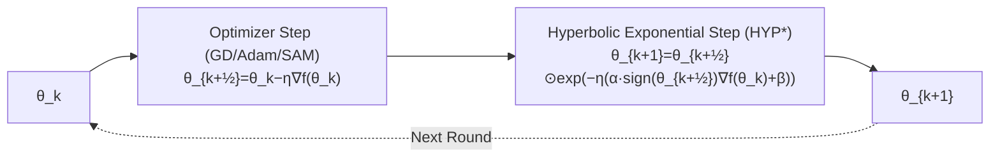

# Hyperbolic Aware Minimization: Implicit Bias for Sparsity

**Conference**: ICLR 2026  
**OpenReview**: [https://openreview.net/forum?id=XKB5Hu0ACY](https://openreview.net/forum?id=XKB5Hu0ACY)  
**Code**: Included with the paper (Appendix G)  
**Area**: optimization  
**Keywords**: implicit bias, sparse training, mirror flow, Riemannian gradient flow, hyperbolic geometry, sign flip, over-parameterization  

## TL;DR
HAM alternates a lightweight "hyperbolic mirror step" with a standard optimizer step. Without increasing parameters or memory, it replicates the sparse implicit bias brought by `m⊙w` pointwise over-parameterization, while fixing its inherent "inverse metric collapse" near the origin that stalls sign flips, leading to gains in both dense and sparse training.

## Background & Motivation

**Background**: Generalization in modern deep learning relies heavily on the implicit bias brought by over-parameterization—when coupled with an optimizer, over-parameterization imposes implicit regularization on training dynamics, thereby improving generalization. Recent sparse training pushes this idea to the limit: PILoT and Sign-In rewrite each weight $\theta$ as the pointwise product of two parameters $m \odot w$. This is equivalent to a **hyperbolic mirror map**, which smoothly transitions from an implicit $L_2$ (dense) bias to an implicit $L_1$ (sparse) bias during training, significantly enhancing sparse network generalization.

**Limitations of Prior Work**: This $m \odot w$ over-parameterization has two major drawbacks. First, it suffers from **inverse metric collapse** near the origin—the Riemannian inverse metric corresponding to $m \odot w$ is $g^{-1}(\theta) = \sqrt{\theta^2 + \gamma^2}$. When the initialization scale parameter $\gamma \to 0$ and the weight $\theta$ is small, the inverse metric is much less than 1, causing parameters to move extremely slowly near 0 and **getting stuck without being able to flip signs**. However, learning signs is a critical bottleneck for successful sparse training. Second, it doubles the number of parameters, incurring extra memory and computational costs. Sign-In attempts to mitigate this by periodically resetting $\gamma$ to 1, but such "hard perturbations" are unstable and offer limited effectiveness.

**Key Challenge**: To obtain the beneficial hyperbolic geometry of $m \odot w$ (promoting sign flips and implicit sparse bias) without its inverse metric collapse and doubled parameter count.

**Goal**: Extract the essential structure of the $m \odot w$ implicit bias into a plug-and-play, zero-parameter optimization step that cures the deceleration problem near the origin.

**Core Idea**: **[Alternating Hyperbolic Step]** Rewrite the gradient flow of $m \odot w$ as an **exponential update step** that acts directly on $\theta$, and execute it **alternately** with any first-order optimizer step. The gradient step pushes parameters away from zero to complete sign flips, while the hyperbolic exponential step injects hyperbolic geometry and sparse bias. Together, they achieve a mechanism where "magnitudes are refined if the sign is correct, and parameters are rapidly zeroed for correction if the sign is wrong."

## Method

### Overall Architecture

The core of HAM is decoupling "implicit bias from over-parameterization" from "explicit dual parameters" into "alternating two update steps in the original parameter space." Each iteration performs a standard optimizer step (GD/Adam/SAM) to obtain an intermediate point $\theta_{k+1/2}$, followed by a lightweight hyperbolic exponential step to pull the result back into hyperbolic geometry. The process introduces no new parameters and reuses computed gradients and signs, resulting in zero memory overhead and negligible extra FLOPs linear to the number of parameters.

### Key Designs

**1. Deriving parameter-free exponential updates from `m⊙w`: Decoupling hyperbolic geometry.** The starting point is the integrated form of the gradient flow for `m⊙w` with weight decay $\beta$: $\theta_t = u_0^2 \odot \exp(-2\int_0^t \nabla f \, ds - 4\beta t) - v_0^2 \odot \exp(2\int_0^t \nabla f \, ds - 4\beta t)$. Leveraging the connection revealed by Wu & Rebeschini that "this hyperbolic gradient flow is also an exponential gradient descent," the authors prove (Thm 3.1): if the initialization satisfies $m_0 = \mathrm{sign}(\theta_0) w_0 = \sqrt{|\theta_0|}$, a single-step exponential update $\theta_{k+1} = \theta_k \exp(-\eta(2\,\mathrm{sign}(\theta_k)\nabla f(\theta_k) + 4\beta))$ is **first-order equivalent** to the original $m \odot w$ dynamics (discretization error $O(\eta^2)$). This means $m, w$ no longer need to be maintained. However, pure exponential updates correspond to $\gamma=0$, which strictly prohibits sign flips—once a parameter reaches 0, the update proportional to $\theta=0$ stays stuck forever.

**2. Alternating mechanism: Using gradient steps to break origin stalling.** This is the true novelty of HAM. It alternates the exponential step with a regular gradient step:
$$\theta_{k+\frac12} = \theta_k - \eta \nabla f(\theta_k) \quad (\text{GD}); \qquad \theta_{k+1} = \theta_{k+\frac12} \odot \exp\big(-\eta(\alpha \, \mathrm{sign}(\theta_k) \nabla f(\theta_k) + \beta)\big) \quad (\text{HYP}).$$
Intuition: The exponential step adds a scale factor; it refines magnitudes when the sign is correct and drives parameters toward zero exponentially fast when the sign is wrong. While a pure exponential step would get stuck at 0, the interleaved gradient step provides a non-zero displacement to push parameters across 0, completing the sign flip. Summary: **Learn magnitude if the sign is correct, rapidly zero out to correct if the sign is wrong**. Hyperparameter $\alpha$ controls convergence speed and "hyperbolic awareness," while $\beta$ injects explicit sparse regularization similar to PILoT.

**3. Memory-friendly deployment (HYP*): Replacing full-step signs with half-step signs.** Naive (HYP) depends on both $\theta_k$ and $\theta_{k+1/2}$, requiring two sets of memory. The authors replace $\mathrm{sign}(\theta_k)$ with $\mathrm{sign}(\theta_{k+1/2})$ to obtain:
$$\theta_{k+1} = \theta_{k+\frac12} \odot \exp\big(-\eta(\alpha \, \mathrm{sign}(\theta_{k+\frac12}) \nabla f(\theta_k) + \beta)\big) \quad (\text{HYP*}),$$
which allows reusing the current weight's sign, achieving **zero extra memory**. Furthermore, aligning the sign with the gradient for "evaluating whether to accelerate" leads to more stable and meaningful sign flips (Appendix D), and theoretical analysis (Thm B.6) still holds. In contrast, $m \odot w$ doubles parameters, and SAM nearly doubles computation per step.

**4. Hyperbolic inverse metric and tunable L2↔L1 implicit bias.** As $\eta \to 0$, the Riemannian gradient flow of HAM is (Thm 4.2):
$$d\theta_t = -(1 + \alpha |\theta_t|) \odot \nabla f(\theta_t) \, dt - \beta \theta_t \, dt,$$
yielding the inverse metric $g^{-1}_{\text{HAM}}(\theta) = 1 + \alpha |\theta|$. Comparing the three: GD is $1$, $m \odot w$ is $\sqrt{\theta^2 + \gamma^2}$ (which collapses to $\ll 1$), while HAM is always $\geq 1$ and **unaffected by noise or regularization**. This solves the inverse metric collapse at the root, ensuring a convergence rate at least as fast as GD (Thm 4.3, linear rate $\Lambda$ under PL conditions). Meanwhile, its corresponding Bregman function $R_\alpha$ is proportional to $\|\theta\|_{L_2}^2$ when $\alpha \to 0$ and to $\|\theta\|_{L_1}$ when $\alpha \to \infty$ (Thm 4.6), showing that $\alpha$ smoothly interpolates between dense and sparse implicit biases.

## Key Experimental Results

### Main Results: Dense Training (ResNet50 / ImageNet, Top-1 %)

| Method | 100 ep | 200 ep | +SAM 100 ep | +SAM 200 ep |
|--------|--------|--------|-------------|-------------|
| Baseline | 76.72±0.19 | 77.27±0.13 | 77.10±0.21 | 77.94±0.16 |
| **HAM** | **77.51±0.11** | **77.86±0.05** | **77.92±0.15** | **78.56±0.12** |

HAM outperforms the baseline in all columns and is **complementary** to SAM (SAM-HAM achieves the best 78.56). HAM adds nearly zero overhead per step, while SAM doubles the cost per step.

### Sparsification Experiments: Dense-to-Sparse / PaI / DST (ResNet50 / ImageNet, Top-1 %)

| Type | Method | s=0.8 | s=0.9 | s=0.95 |
|------|------|-------|-------|--------|
| PaI | Random | 73.87 | 71.56 | 68.72 |
| PaI | Random+Sign-In | 74.12 | 72.19 | 69.38 |
| PaI | **Random+HAM** | **74.84** | **72.72** | **70.05** |
| DtS | AC/DC | 75.83 | 74.75 | 72.59 |
| DtS | AC/DC+Sign-In | 75.9 | 74.74 | 72.88 |
| DtS | **AC/DC+HAM** | **77.2** | **76.66** | **75.45** |
| DST | RiGL | 75.02 | 73.7 | 71.89 |
| DST | **RiGL+HAM** | **76.22** | **74.83** | 72.93 |
| Cont. | STR | 75.49 | 72.4 | 64.94 |
| Cont. | **STR+HAM** | **76.37** | **75.01** | **71.41** |

AC/DC+HAM shows the strongest improvement (72.59 → 75.45 at s=0.95, +2.86). The authors attribute this to the dense phase of AC/DC fully utilizing HAM's geometric advantages. STR at high sparsity s=0.95 collapses to 64.94, but HAM pulls it back to 71.41.

### Key Findings

- **Sign Flipping**: Under Random PaI (90% sparsity, 100 epochs), HAM consistently flips more signs than the baseline and Sign-In throughout training (Fig. 2a), empirically supporting the theory of accelerated learning near the origin.
- **Complementary Mechanism**: HAM focuses on "implicit sparse bias + origin acceleration," while SAM focuses on "finding flat solutions." Their directions are orthogonal, making their combination optimal.
- **Generalization**: The appendix verifies HAM as a general optimization principle for ViT pre-training, LLM fine-tuning, and graph/node classification. $\alpha$ is stable across tasks (optimal around 200), while $\beta$ requires tuning like weight decay.

## Highlights & Insights

- **Elegant Decoupling**: De-linking the benefits of over-parameterization (hyperbolic geometry) from the "creation of dual parameters" by using an alternating exponential step in the original space is a model for engineering implicit bias.
- **Diagnosis + Treatment**: By first identifying the root cause of $m \odot w$ as "inverse metric collapse at the origin leading to sign stalling," and then providing the precise remedy $g^{-1}=1+\alpha|\theta|\geq1$, the theoretical loop is clean.
- **Plug-and-play**: It can be added after any first-order optimizer (GD/Adam/SAM) with zero parameters and near-zero FLOPs, and it is complementary to SAM, making the barrier to adoption extremely low.
- **$\alpha$ as a Continuous Knob for L2↔L1**: Turning the "sparsity strength" of implicit bias into a continuously adjustable hyperparameter is much more controllable than the implicit $\gamma$ of $m \odot w$ which is dictated by noise and initialization.

## Limitations & Future Work

- **Difficulty in Driving Sparsity Alone**: Due to discretization, the strong $L_1$ bias when $\alpha \to \infty$ requires extremely small learning rates to converge. HAM cannot produce strong sparsity on its own and must be paired with sparsification methods like AC/DC/RiGL/STR; its role is a "guide" rather than the "main engine."
- **$\beta$ Tuning**: While $\alpha$ is stable across tasks, $\beta$ still needs dataset-specific tuning (e.g., 1e-3 for ImageNet, 16e-3 for CIFAR100).
- **Theory Limited to Linear Regression**: Implicit bias and convergence proofs are primarily provided for underdetermined linear regression and under PL/convex assumptions; rigorous guarantees for non-convex deep networks remain an open problem.
- **Extensible Mirror Maps**: The authors suggest using different mirror maps in the future to inject task/optimizer-specific "awareness" (e.g., robustness, momentum, normalization), a promising algorithmic-theoretical direction.

## Related Work & Insights

- **Sparse Training Taxonomy**: PaI (SNIP/SynFlow/Random), DtS (IMP/LRR/AC/DC/CAP), DST (RiGL/SET/MEST), and Continuous Sparsification (PILoT/STR/CS/spred). HAM directly competes with and enhances the SOTAs in these categories.
- **$m \odot w$ Over-parameterization**: PILoT and Sign-In are the direct predecessors of HAM. HAM extracts the essence of their hyperbolic geometry while discarding parameter doubling and hard perturbations.
- **Mirror Flow / Implicit Bias**: The mirror flow as Riemannian gradient flow framework (Li et al., 2022) is the theoretical foundation. HAM can also be interpreted via Natural Gradient (Fisher Info), Bayesian (IVON), and Exponential Gradient Descent (Kivinen & Warmuth).
- **Two-step / Alternating Methods**: Similar to SAM, proximal methods, ADMM, soft-thresholding, and birth-death dynamics, but HAM operates at the weight level with a goal of sparse geometry rather than flatness.
- **Inspiration**: Using "equivalent rewriting + alternating execution" to compress expensive over-parameterization into zero-overhead optimization steps—this paradigm of "diagnosing inverse metrics → designing symptomatic geometry" can be extended to other over-parameterizations (e.g., low-rank, tensor decomposition).

## Rating
- **Novelty**: ⭐⭐⭐⭐⭐ Decoupling $m \odot w$ implicit bias into parameter-free alternating steps and fixing the metric collapse is highly original.
- **Experimental Thoroughness**: ⭐⭐⭐⭐ Comprehensive validation on ImageNet/CIFAR100 with dense and three types of sparse methods; extensions to ViT/LLM/Graph. Core theory is limited to linear regression.
- **Writing Quality**: ⭐⭐⭐⭐ Clear logic from motivation to diagnosis, derivation, theory, and experiments. Figures and tables make comparisons intuitive.
- **Value**: ⭐⭐⭐⭐⭐ Zero overhead, plug-and-play, complementary to SAM, and consistent gains. A solid contribution to both the sparse training community and implicit bias theory.

<!-- RELATED:START -->

## Related Papers

- [\[ICLR 2026\] Minor First, Major Last: A Depth-Induced Implicit Bias of Sharpness-Aware Minimization](minor_first_major_last_a_depth-induced_implicit_bias_of_sharpness-aware_minimiza.md)
- [\[ICLR 2026\] Towards Understanding the Calibration Benefits of Sharpness-Aware Minimization](towards_understanding_the_calibration_benefits_of_sharpness-aware_minimization.md)
- [\[ICLR 2026\] MASAM: Multimodal Adaptive Sharpness-Aware Minimization for Heterogeneous Data Fusion](masam_multimodal_adaptive_sharpness-aware_minimization_for_heterogeneous_data_fu.md)
- [\[ICLR 2026\] Implicit Bias of Per-sample Adam on Separable Data: Departure from the Full-batch Regime](implicit_bias_of_per-sample_adam_on_separable_data_departure_from_the_full-batch.md)
- [\[ICLR 2026\] Bi-LoRA: Efficient Sharpness-Aware Minimization for Fine-Tuning Large-Scale Models](bi-lora_efficient_sharpness-aware_minimization_for_fine-tuning_large-scale_model.md)

<!-- RELATED:END -->
