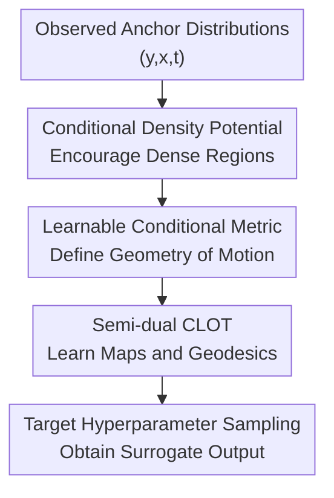

# Hyperparameter Trajectory Inference with Conditional Lagrangian Optimal Transport

**Conference**: ICLR 2026  
**OpenReview**: [https://openreview.net/forum?id=P5B97gZwRb](https://openreview.net/forum?id=P5B97gZwRb)  
**Code**: https://github.com/harrya32/hyperparameter-trajectory-inference  
**Area**: Optimization / Optimal Transport / Hyperparameter Trajectory Inference  
**Keywords**: Hyperparameter trajectory inference, conditional optimal transport, Lagrangian dynamics, neural optimal transport, inference-time adaptation  

## TL;DR

This paper proposes Hyperparameter Trajectory Inference (HTI): treating continuous hyperparameters as "time," it uses conditional Lagrangian optimal transport to learn the trajectory of neural network output distributions across varying hyperparameters. This allows for approximating outputs under unobserved hyperparameter settings at inference time without retraining the original model.

## Background & Motivation

**Background**: The behavior of many neural networks is not solely determined by inputs but is profoundly influenced by fixed training hyperparameters. Reward weights in reinforcement learning, target quantiles in quantile regression, or dropout intensity in generative models all alter the trained model parameters, thereby changing the conditional output distribution $p_{\theta_\lambda}(y|x)$. Conventional practices usually involve training separate models on several hyperparameters or selecting a single compromise setting before deployment.

**Limitations of Prior Work**: The issue lies in the fact that many hyperparameters actually correspond to user preferences or environmental constraints, which may change post-deployment. For example, in medical treatment strategies, one patient might require better protection of immune cells, while another needs rapid tumor suppression. Retraining a reinforcement learning policy for every change in preference would be extremely costly. While standard interpolation or conditional generative models can perform smooth transitions in the output space, they do not ensure that intermediate distributions resemble the outputs of a truly trained neural network.

**Key Challenge**: The difficulty of HTI is not simply "connecting two points with a line" but inferring a feasible conditional probability path from a small number of observed hyperparameter distributions. Neural network training landscapes are complex, and hyperparameter-induced output changes are typically non-linear; simultaneously, the same hyperparameter change may follow different trajectories under different input conditions $x$. Therefore, the method must leverage the least-action bias of optimal transport while avoiding paths that pass through low-density, infeasible output regions.

**Goal**: The authors formalize this problem as Hyperparameter Trajectory Inference: given conditional output samples at several anchor hyperparameters $\Lambda_{obs}$, learn a surrogate model $\hat p(y|x,\lambda)$ that can approximate the original neural network's output distribution for unobserved continuous hyperparameters $\lambda$. This goal encompasses both conditional trajectory inference and rapid adjustment of model behavior at inference time.

**Key Insight**: Starting from trajectory inference and optimal transport, the paper treats the hyperparameter $\lambda$ as a time variable and views output distributions under different hyperparameters as marginal distributions of the same population over time. To make the inferred paths more credible, the authors replace the fixed Euclidean distance cost with a learnable Lagrangian cost and integrate the conditional variable $x$ into the transport mapping, Kantorovich potentials, and geodesic estimations.

**Core Idea**: Use conditional Lagrangian optimal transport to simultaneously learn "what kind of movement cost is reasonable" and "how distributions should move," thereby interpolating sparse hyperparameter anchors into a conditional output trajectory available for inference-time sampling.

## Method

### Overall Architecture

The proposed method can be understood as a neural CLOT framework for conditional trajectory inference. The input consists of sample triplets $(y_i, x_i, t_i)$ at several observed times/hyperparameters $t_k$, where $y_i$ is the output or action of a neural network under input condition $x_i$; the output is a set of conditional optimal transport mappings and geodesic generators between adjacent anchors. At inference time, given a target $t^*$ or $\lambda^*$, samples under the target hyperparameter can be generated starting from the nearest observed anchor.

The core training process consists of three tasks: first, constructing a conditional potential $\hat U(q|x)$ using kernel density estimation to encourage paths to pass through data-dense regions; second, learning a metric matrix $G_{\theta_G}(q|x)$ to define the conditional kinetic energy $K(q,\dot q|x)$; finally, jointly training Kantorovich potentials, transport mappings, and spline geodesic approximations under this Lagrangian cost. The inference stage avoids expensive optimization and directly uses the learned mappings and path networks for sampling within the interval.

Formally, the Lagrangian used by the authors is:

$$
L(q_t,\dot q_t|x)=K(q_t,\dot q_t|x)-U(q_t|x)=\frac{1}{2}\dot q_t^T G(q_t|x)\dot q_t-U(q_t|x).
$$

Given a starting point $y_0$ and an endpoint $y_1$, the transport cost is not a direct $\|y_0-y_1\|^2$, but the minimum action among all connecting curves:

$$
c(y_0,y_1|x)=\inf_{q:q_0=y_0,q_1=y_1}\int_0^1 L(q_t,\dot q_t|x)dt.
$$

This ensures that the "shortest path" is determined by both data geometry and density structure, rather than being forced into a straight line in Euclidean space.

### Key Designs

**1. Conditional Density Potential: Biasing Inferred Paths Toward the Real Data Manifold**

Standard optimal transport in high-dimensional output spaces easily produces paths that are short in distance but infeasible in practice: both endpoints come from real model outputs, but the intermediate path may cross low-density regions never produced by a trained model. The paper addresses this by constructing a potential term $\hat U(q|x)$ using conditional kernel density estimation:

$$
\hat U(q|x)=\alpha \log(\hat p(q|x)+\epsilon),
$$

where $\hat p(q|x)$ is obtained using the Nadaraya-Watson estimator, with Gaussian kernels $K_{h_y}$ and $K_{h_x}$ smoothing the output and conditional spaces, respectively. Since the Lagrangian involves $K-U$, high-density regions correspond to higher $U$ and lower effective action, causing geodesics to naturally favor regions dense with observed samples.

The significance of this design is that it transforms the manifold hypothesis into part of the path cost. Rather than constraining sample points post-hoc, the model treats "passing through regions resembling real outputs" as a cheaper way to move during learning. For HTI, this is critical: outputs under unobserved hyperparameters should look like outputs that a real neural network might produce, rather than a linear average between anchor outputs.

**2. Conditional Lagrangian Optimal Transport: Learning Path Costs and Transport Mappings Simultaneously**

Instead of fixing a cost and solving OT, the paper treats the cost itself as an object to be learned from data. For each pair of adjacent observed marginal distributions $\mu_k(\cdot|x)$ and $\mu_{k+1}(\cdot|x)$, the method uses a semi-dual COT formulation to learn the Kantorovich potential $g_{\theta_g,k}$, the transport mapping $T_{\theta_T,k}(y_k|x)$, and the spline geodesic generator $S_{\theta_S}$.

The training objective is an alternating min-max process: with a fixed metric $G_{\theta_G}$, the potential functions maximize the semi-dual objective to accurately estimate the CLOT under the current cost; with fixed potential functions, the metric network minimizes the total transport cost between adjacent anchors, embedding the least-action bias into the learned geometry. The overall objective is:

$$
\min_{\theta_G}\sum_k \mathbb E_x\left[\max_{\theta_{g,k}} \mathbb E_{y_k\sim\mu_k}[g^c_{\theta_{g,k}}(y_k|x)] + \mathbb E_{y_{k+1}\sim\mu_{k+1}}[g_{\theta_{g,k}}(y_{k+1}|x)]\right].
$$

The key here is that "conditioning" is not just feeding an extra input to the network. Each potential function, mapping network, and path network receives $x$ via FiLM layers, allowing the same hyperparameter interval to have different movement directions and curvatures under different conditions. In RL, for instance, adjusting the reward weight from 0 to 5 can lead to completely different action distribution changes depending on the patient's state or robot's status.

**3. Amortized c-transform and Spline Geodesics: Turning Nested Optimization into Trainable Approximations**

The precise definition of CLOT involves two layers of optimization: calculating $g^c(y_0|x)$ requires minimizing $c(y_0,y_1'|x)-g(y_1'|x)$ over endpoints $y_1'$, while calculating $c$ requires minimizing the action over all connecting curves. Directly putting both layers into training would be extremely slow. The authors adapt and extend the amortization approach from Pooladian et al., using neural networks to provide approximate solutions to these optimizations.

Specifically, the transport mapping network $T_{\theta_T,k}$ predicts an endpoint, which is then refined with a few L-BFGS steps to find a better $T_{c,k}(y_k|x)$; this refined result then serves as the regression target for $T_{\theta_T,k}$. For the paths, the paper represents the curve connecting $y_k$ and $T_{\theta_T,k}(y_k|x)$ as a cubic spline, with parameters output by $S_{\theta_S}(y_k,y_{k+1},x)$ and trained by minimizing the action.

This design collapses theoretically expensive optimal control problems into a form of "minimal optimization at training + network-learned amortization." More importantly, L-BFGS is entirely unnecessary at inference time: one simply selects the interval containing the target hyperparameter, samples $y_k$ from the left anchor, uses $T_{\theta_T,k}$ to find the interval endpoint, and generates the spline via $S_{\theta_S}$ to evaluate at the normalized position $s^*=(t^*-t_k)/(t_{k+1}-t_k)$.

**4. High-Dimensional Positive Definite Metric Parameterization: Avoiding Degeneracy while Allowing Anisotropic Geometry**

When learning the kinetic energy term of the Lagrangian, the metric matrix $G_{\theta_G}$ must be symmetric and positive definite. If the network could arbitrarily shrink eigenvalues in all directions, a degenerate solution would arise: pushing $G$ toward a zero matrix results in zero cost for any movement. Older NLOT methods, primarily targeting 2D spaces, used fixed eigenvalues and a single rotation angle to avoid degeneracy, but this does not scale naturally to high-dimensional outputs.

The paper parameterizes $G_{\theta_G}$ using eigendecomposition $G_{\theta_G}=R_{\theta_G}E_{\theta_G}R_{\theta_G}^T$. Here, $E_{\theta_G}$ is a positive diagonal matrix constrained so that the sum of its eigenvalues equals a non-zero eigenvalue budget; $R_{\theta_G}$ is composed of a sequence of Givens rotations with angles output by the network. This way, the metric remains positive definite with a non-zero volume while learning which directions are cheaper or more expensive for movement.

This is crucial for the utility of HTI. In quantile regression experiments, the output is a 3-step forecast rather than just a 2D point; if metric parameterization only worked on 2D toy data, the method could hardly support trajectory inference for real neural network output distributions. The authors' parameterization allows the same CLOT framework to cover 2D synthetic data, 2D continuous control actions, and higher-dimensional predictive outputs.

### Loss & Training

Training consists of alternating outer and inner loops. The inner loop updates the Kantorovich potentials $g_{\theta_g,k}$, transport mappings $T_{\theta_T,k}$, and path networks $S_{\theta_S}$ for each adjacent time interval; the outer loop updates the metric network $G_{\theta_G}$. Potentials maximize the semi-dual objective, transport mappings minimize the regression error relative to L-BFGS refined endpoints, and path networks minimize the action of the spline curves.

The mapping loss is summarized as:

$$
L_{map}(\theta_{T,k})=\mathbb E[(T_{\theta_T,k}(y_k|x)-T_{c,k}(y_k|x))^2],
$$

while the path loss is:

$$
L_{path}(\theta_S)=\mathbb E[S(q_\phi|x)],\quad \phi=S_{\theta_S}(y_k,T_{\theta_T,k}(y_k|x),x).
$$

The algorithm finally returns the transport mapping for each interval and a shared geodesic generator. During sampling, if the target $t^*$ lies in $[t_k,t_{k+1}]$, it samples $y_k$ from $p_{t_k}(\cdot|x)$, predicts the interval endpoint $\hat y_{k+1}=T_{\theta_T,k}(y_k|x)$, and evaluates the spline path $q_\phi$ at $s^*$. This is the direct reason why the paper claims to achieve rapid inference-time behavior adjustment.

## Key Experimental Results

### Main Results

The paper first validates CTI's basic capability on conditional semi-circle synthetic data, then tests three types of hyperparameters—reward weights, quantile targets, and dropout—in HTI scenarios. The main results demonstrate that the full method $K_\theta-\hat U$ generally outperforms direct regression, CFM, MFM, and NLOT under sparse anchors; when the task primarily requires density manifold bias, the simplified version with $\hat U$ is also very strong.

| Task | Indicators | Ours (Best) | Prev. SOTA / Baseline | Conclusion |
|------|------|--------------|------------------|------|
| Conditional Semi-circle CTI | NLL ↓ | $K_\theta-\hat U$: -0.662 | $K_I-\hat U$: -0.532 | Joint learning of metric and density potential best recovers curved trajectories |
| Cancer RL reward weighting | Reward ↑ | $K_\theta-\hat U$: 102.49 | $K_I-\hat U$: 83.62 | Full method most closely matches true policy behavior with varying NK penalties |
| Reacher reward weighting | Reward ↑ | $K_\theta-\hat U$: -6.093 | $K_\theta$: -6.158 | Learned conditional geometry is most stable for continuous control action interpolation |
| ETTm2 quantile regression | MSE ↓ | $K_\theta-\hat U$: 0.608 | $K_\theta$: 0.620 | Full CLOT still outperforms Flow Matching in high-dimensional outputs |
| Two moons dropout | WD ↓ | $K_I-\hat U$: 0.060 | $K_\theta-\hat U$: 0.079 | Density potential is the main contributor to dropout interpolation |

In the Cancer experiment, the authors train only three PPO policies at $\lambda_{nk}\in\{0,5,10\}$, collecting 1000 state-action samples from each, and then evaluate surrogate policies at $\{1,2,3,4,6,7,8,9\}$. The full method's average reward was 102.49. Training a new PPO policy takes approximately 3.5 hours, whereas training the surrogate model takes about 15 minutes. The paper also notes that while the ground truth curve required training 11 PPO policies (approx. 38 GPU hours), HTI only needed 3 PPO policies plus one surrogate (approx. 11 GPU hours).

### Ablation Study

The synthetic semi-circle experiment clearly disentangles the two inductive biases: $\hat U$ pulls the path toward data-dense regions, while $K_\theta$ learns non-Euclidean curvature. The metric parameterization ablation compares the old fixed-eigenvalue representation with the proposed learnable eigenvalue budget representation.

| Configuration | Key Indicators | Explanation |
|------|----------|------|
| $K_I$ | Semi-circle NLL 105.713, CD 0.323 | Euclidean straight path without density bias, fails to recover semi-circle trajectory |
| $K_\theta$ | Semi-circle NLL 23.008, CD 0.158 | Learns metric only; captures some curvature but still passes through inappropriate regions |
| $K_I-\hat U$ | Semi-circle NLL -0.532, CD 0.016 | Density potential only; avoids low-density regions, resulting in significantly better performance |
| $K_\theta-\hat U$ | Semi-circle NLL -0.662, CD 0.016 | Combines least-action and dense traversal for the best overall performance |
| Fixed eigenvalues | Cancer reward 98.72, Reacher reward -6.122 | Old 2D parameterization works but has lower expressivity |
| Learnable budget | Cancer reward 102.49, Reacher reward -6.093 | Current parameterization is better for most 2D tasks and scales to high dimensions |

### Key Findings

- Density potential $\hat U$ is the critical component for preventing infeasible paths. Experiments with semi-circles and dropout show that as long as the output distribution lies on a low-dimensional manifold, encouraging paths through high-density regions yields significant gains.
- Learning the conditional metric $G_{\theta_G}$ is important for tasks requiring capture of curved dynamics and condition-dependent movement. It does not just smooth paths but defines "what direction of movement is more natural" at the cost level.
- HTI's value is maximized when anchors are sparse. Sparsity investigations in the appendix show that performance gaps narrow as anchors increase; however, the proposed method degrades most slowly as anchors decrease.
- The method currently handles a single continuous hyperparameter. Extension to multiple hyperparameters would require mapping multi-dimensional space to a 1D "time" or developing a multi-dimensional trajectory inference framework, which the authors acknowledge as future work.

## Highlights & Insights

- Expanding "hyperparameter tuning" from scalar performance optimization to "output distribution trajectory inference" is the most interesting aspect of this work. Bayesian optimization typically learns a surrogate for the objective function $J(\lambda)$, whereas HTI learns $p_{\theta_\lambda}(y|x)$, allowing for changing evaluation functions or preferences post-deployment without retraining the entire surrogate.
- The conditional Lagrangian cost setting naturally unifies two priors: least-action prevents erratic paths, and dense traversal prevents paths from crossing regions unlike real data. Compared to simple CFM which learns a vector field, this cost-first approach is better suited for trajectory inference where intermediate distributions must be credible.
- Using kernel density estimation for the potential term rather than training a separate density model is a pragmatic choice. It connects local sample density directly to action; while it may be sensitive to bandwidth, the structure is simple, interpretable, and clearly effective in ablations.
- High-dimensional positive definite metric parameterization is the engineering key that allows this method to move beyond 2D toy problems. Using Givens rotations to assemble rotation matrices with fixed eigenvalue budgets is cleaner than simple regularization.
- The underlying philosophy can be transferred to many "high training cost, frequent preference change" scenarios. For example, robustness strength, fidelity-diversity trade-offs in generative models, RL discount factors, and medical policy preferences can all be viewed as conditional output paths induced by hyperparameters.

## Limitations & Future Work

- The authors acknowledge that HTI currently only applies to a single continuous hyperparameter. Real models often have multiple interacting hyperparameters, such as reward weights, constraint thresholds, and temperature parameters; collapsing multi-dimensional hyperparameter spaces into 1D curves loses local geometry. Full multi-dimensional conditional trajectory inference is a more complete direction.
- Experimental settings are generally controlled. Cancer, Reacher, ETTm2, and two moons demonstrate mechanisms but are still a distance from large-scale real deployment; in complex text or image generation, the geometry of output distributions may be harder to approximate with current spline geodesics.
- The kernel density potential depends on bandwidths $h_y, h_x$ and weight $\alpha$. If the conditional space is high-dimensional or samples are sparse, Nadaraya-Watson estimation becomes fragile, and paths could be pulled toward incorrect densities. Future work could consider learned conditional density estimation or adaptive local bandwidths.
- Training still involves min-max optimization, L-BFGS refinement, and alternating updates of multiple networks. While inference is fast, training stability and hyperparameter sensitivity warrant further analysis. For an average user, it is harder to tune than a direct regression surrogate.
- HTI essentially assumes that model behavior under unobserved hyperparameters can be smoothly inferred from anchor distributions. If the hyperparameter-induced dynamics involve phase transitions, mode collapse, or chaotic changes, even a strong trajectory prior may fail to recover the real path from sparse anchors.

## Related Work & Insights

- **vs Traditional trajectory inference**: Traditional TI is often used to recover population dynamics from sparse time points (e.g., single-cell development trajectories); this paper replaces "time" with neural network hyperparameters and adds dependence on condition $x$. Unlike TI, HTI's goal is to build a deployable surrogate of the network's output rather than explaining a natural process.
- **vs Neural Lagrangian OT / NLOT**: Pooladian et al. proposed using Lagrangian costs for OT, but primarily for non-conditional, low-dimensional scenarios. This paper extends it to conditional OT and adds data-dependent potentials and high-dimensional metric parameterization, making it suitable for practical HTI.
- **vs Conditional Flow Matching**: CFM learns a conditional vector field to generate target distributions but does not guarantee that intermediate trajectories correspond to real hyperparameter changes. This paper emphasizes that the intermediate marginal distributions themselves are the target.
- **vs Bayesian hyperparameter optimization**: BO is concerned with finding the optimal point in hyperparameter space for a scalar target; HTI is concerned with how the entire conditional output distribution changes. The former is for one-time optimization, the latter for rapid behavior adjustment after deployment based on new preferences.

## Rating

- Novelty: ⭐⭐⭐⭐⭐ Formulating HTI is a distinct contribution, and applying conditional Lagrangian OT to hyperparameter-induced trajectories successfully integrates problem setting with methodology.
- Experimental Thoroughness: ⭐⭐⭐⭐ Covers synthetic CTI, RL, quantile regression, and dropout; ablations are clear, though large-scale high-dimensional tasks are missing.
- Writing Quality: ⭐⭐⭐⭐ Clear mathematical narrative with sufficient detail in algorithms and appendices; however, nested optimization makes initial reading challenging.
- Value: ⭐⭐⭐⭐⭐ Highly insightful for scenarios requiring inference-time adjustment of model behavior, especially in applications with high retraining costs like medical policies and control systems.

## Related Papers

- [\[ICLR 2026\] Neural Optimal Transport Meets Multivariate Conformal Prediction](neural_optimal_transport_meets_multivariate_conformal_prediction.md)
- [\[ICLR 2026\] HOTA: Hamiltonian Framework for Optimal Transport Advection](hota_hamiltonian_framework_for_optimal_transport_advection.md)
- [\[ICLR 2026\] Elastic Optimal Transport: Theory, Application, and Empirical Evaluation](elastic_optimal_transport_theory_application_and_empirical_evaluation.md)
- [\[ICLR 2026\] Neural Hamilton–Jacobi Characteristic Flows for Optimal Transport](neural_hamilton--jacobi_characteristic_flows_for_optimal_transport.md)
- [\[ICLR 2026\] Sobolev Gradient Ascent for Optimal Transport: Barycenter Optimization and Convergence Analysis](sobolev_gradient_ascent_for_optimal_transport_barycenter_optimization_and_conver.md)

<!-- RELATED:END -->

<!-- RELATED:START -->

## Related Papers

- [\[ICLR 2026\] Neural Optimal Transport Meets Multivariate Conformal Prediction](neural_optimal_transport_meets_multivariate_conformal_prediction.md)
- [\[ICLR 2026\] HOTA: Hamiltonian Framework for Optimal Transport Advection](hota_hamiltonian_framework_for_optimal_transport_advection.md)
- [\[ICLR 2026\] Elastic Optimal Transport: Theory, Application, and Empirical Evaluation](elastic_optimal_transport_theory_application_and_empirical_evaluation.md)
- [\[ICLR 2026\] Neural Hamilton–Jacobi Characteristic Flows for Optimal Transport](neural_hamilton--jacobi_characteristic_flows_for_optimal_transport.md)
- [\[ICLR 2026\] Sobolev Gradient Ascent for Optimal Transport: Barycenter Optimization and Convergence Analysis](sobolev_gradient_ascent_for_optimal_transport_barycenter_optimization_and_conver.md)

<!-- RELATED:END -->
