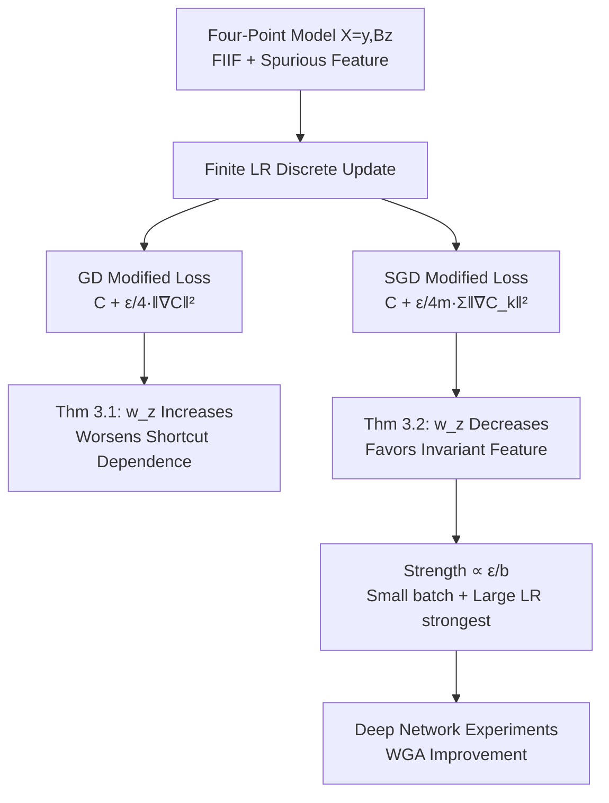

# Implicit Regularization of SGD Reduces Shortcut Learning

**Conference**: ICLR 2026  
**Code**: [github.com/mirzanahal/sgd-implicit-regularization-shortcuts](https://github.com/mirzanahal/sgd-implicit-regularization-shortcuts)  
**Area**: optimization / optimization theory  
**Keywords**: Implicit regularization, SGD, shortcut learning, spurious correlation, batch size, learning rate, group robustness  

## TL;DR
This paper proves that the implicit regularization of SGD (with strength proportional to the learning rate divided by batch size $\epsilon/b$) systematically suppresses the model's reliance on spurious features, thereby improving group robustness without sacrificing accuracy—whereas full-batch GD not only lacks this benefit but may even exacerbate shortcut dependence.

## Background & Motivation
**Background**: The goal of generalization in machine learning is to ensure models work stably across multiple distributions. However, models often rely on "shortcuts" (spurious features)—features that are correlated with labels in the training distribution but unstable across different environments. Even when a Fully Informative Invariant Feature (FIIF) exists that can perfectly predict the label, gradient-based optimizers still tend to select solutions that utilize spurious features because these features often increase the margin and lower the exponential/cross-entropy loss, making shortcut-laden solutions more "attractive" for gradient optimization.

**Limitations of Prior Work**: Previous research primarily analyzed data-side factors—such as spurious correlation strength $\rho$ and feature geometry (scaling factor $B$)—on shortcut dependence, treating the gradient optimizer as a "black box" that converges to the max-margin solution. Empirically, it has been observed that **larger learning rates can reduce shortcut dependence and improve robustness** (Idrissi 2022, Puli 2023, Barsbey 2025), but existing theoretical frameworks cannot explain this phenomenon. How optimizer hyperparameters exactly regulate shortcut learning remains an open problem.

**Key Challenge**: The mechanism by which training hyperparameters (batch size $b$, learning rate $\epsilon$) impact shortcut dependence is unclear—why do larger learning rates lead to better robustness? What role does batch size play? Do GD and SGD exhibit consistent behavior?

**Goal**: To provide a rigorous characterization of how GD and SGD regulate reliance on spurious features from the perspective of **implicit regularization**, and to extend this theory to real-world benchmarks with deep networks.

**Core Idea**: **Under a finite learning rate, neither GD nor SGD exactly follows the gradient flow of the original loss $C(w)$; instead, they approximately follow the gradient flow of a "modified loss"—the original loss plus an implicit regularization term. The regularization term in GD penalizes the full-batch gradient norm $\|\nabla C(w)\|^2$ (favoring flat minima), while SGD additionally penalizes the mean of the mini-batch gradient norms (suppressing gradient variance across mini-batches). It is precisely this variance penalty term unique to SGD, with strength proportional to $\epsilon/b$, that pushes the optimal solution toward smaller spurious feature weights $w_z$ and larger invariant feature weights $w_y$.**

## Method

### Overall Architecture
The paper uses the classic **Four-Point Model** as the theoretical vehicle: data $X=[y,\,Bz]$ lies in a 2D space, where $X_1=y$ is the invariant feature and $X_2=Bz$ is the spurious feature. $z$ equals $y$ with probability $1-\rho$ and is flipped with probability $\rho$; $B>1$ amplifies the influence of the spurious feature. Using a linear classifier and exponential loss, the paper analyzes how the modified losses of GD and SGD shift the optimal solution $w^*=[w_y^*,w_z^*]$. Non-asymptotic guarantees are provided for the linear model (Theorem 3.1 / 3.2), followed by validation on benchmarks like CMNIST, Waterbirds, CelebA, and Multi-NLI using MLP/ResNet/BERT.

### Key Designs

**1. Decomposition of Implicit Regularization in GD/SGD: From "Black Box Optimizer" to "Modified Loss".** The theoretical foundation lies in reinterpreting finite-step optimizers as gradient flows over modified losses. In the continuous limit, gradient flow is described by the ODE $\frac{d}{dt}\tilde w(t)=-\nabla C(\tilde w(t))$, whereas the discrete update of GD $w^{(t+1)}=w^{(t)}-\epsilon\nabla C(w^{(t)})$ introduces a deviation equivalent to moving along the modified loss $C_{\mathrm{GD}}(w)=C(w)+\frac{\epsilon}{4}\|\nabla C(w)\|^2$—which pushes the trajectory away from regions with large gradient norms, favoring flat minima. The modified loss for SGD is $C_{\mathrm{SGD}}(w)=C(w)+\frac{\epsilon}{4m}\sum_{k=0}^{m-1}\|\nabla_b C_k(w)\|^2$, where $m=n/b$ is the number of mini-batches and $\nabla_b C_k$ is the gradient on the $k$-th mini-batch. The key difference is that SGD penalizes the **mean of mini-batch gradient norms** rather than the full-batch gradient norm. and this is equivalent to suppressing gradient variance between mini-batches, which is what causes SGD to diverge from GD behavior.

**2. Sign Analysis of the Variance-Driven Term: Why SGD Pushes Solutions Away from Shortcuts.** In the Four-Point model, the SGD modified loss can be exactly decomposed as $C_{\mathrm{SGD}}(w)=C_{\mathrm{GD}}(w)+\frac{\epsilon\,\mathrm{Var}(\rho_{1:m})}{4}f(w;B,\hat\rho)$, where $\mathrm{Var}(\rho_{1:m})$ is the variance of the $\rho$ estimate across mini-batches, and the magnitude of the second term scales by $\epsilon/b$. The paper proves that minimizing $f(\cdot)$ pushes the optimal solution toward **smaller $w_z$ (less dependence on spurious features) and larger $w_y$ (more dependence on invariant features)**. Intuitively, the gradient variance injected by mini-batches offsets the attractiveness of the shortcut solution: shortcut solutions have high gradient variance across different subgroups (majority vs. minority), so the variance penalty imposes a heavier cost on them, while group-robust solutions have more consistent gradients across mini-batches and receive smaller penalties.

**3. Non-asymptotic Guarantees for GD and SGD: Two Theorems in Opposite Directions.** Theorem 3.1 proves that for $\rho\in(0,\frac13)$, sufficiently large $B$, and sufficiently large $n$, the GD solution satisfies $w^*_{z,\mathrm{GD}}-w^*_z\ge C\epsilon\sqrt{\rho(1-\rho)}+O(\epsilon^2)$, meaning GD **increases** dependence on spurious features, and the degradation grows linearly with the learning rate $\epsilon$. Theorem 3.2 provides the opposite bound for SGD: $w^*_{z,\mathrm{SGD}}-w^*_z\le C_1\epsilon\sqrt{\rho(1-\rho)}-\frac{C_2 B\epsilon}{b}\sqrt{\rho(1-\rho)}+O(\epsilon^2+B^{-1})$. When $B$ is large or $b$ is small, the negative term dominates, making $w^*_{z,\mathrm{SGD}}<w^*_z$, which pushes the solution toward invariant features; this effect also strengthens linearly with $\epsilon$. Together, these theorems reveal that **shortcut suppression is a unique product of SGD stochasticity, not a property of gradient descent itself**.

**4. Batch Size Upper Bound: Stronger Shortcuts Require Smaller Batches.** Corollary 3.3 concretizes these conditions into an explicit upper bound for $b$: $b\le\tilde\Theta\!\left(\frac{B}{\rho(1-\rho)}\right)$—only when the batch size is smaller than this threshold is SGD guaranteed to reduce reliance on spurious features. This provides an actionable intuition: the stronger the spurious correlation (smaller $\rho$ or larger $B$), the smaller the batch size needed to ensure SGD effectively suppresses shortcuts. Large batches degrade into the GD regime, and the benefits disappear. The paper also proves in the general case as $n, m \to \infty$ that as long as the group-robust solution $w_{\mathrm{good}}$ has a smaller "majority-minority" gradient gap on each mini-batch than the shortcut solution $w_{\mathrm{bad}}$, the SGD modified loss will favor the former, while full-batch GD lacks this variance-dependent effect and instead amplifies the preference for $w_{\mathrm{bad}}$.

## Key Experimental Results

### Main Results (Best WGA across different batch sizes, $\rho=5\%$, highest WGA selected from six learning rates per batch)

| Batch $b$ | CMNIST | Domino | Waterbirds | CelebA | CIFAR10 |
|---|---|---|---|---|---|
| 8 | 67.5 | **59.3** | **79.7** | 46.0 | **80.1** |
| 16 | **68.4** | 56.3 | 77.7 | **51.9** | 78.9 |
| 32 | 68.0 | 49.4 | 73.2 | 45.3 | 79.6 |
| 64 | 67.5 | 51.9 | 67.9 | 40.5 | 78.8 |
| 128 | 66.0 | 50.0 | 70.4 | 44.3 | 76.3 |
| 256 | 64.7 | 43.4 | 68.2 | 45.0 | 77.9 |
| **Δ(Max-Min)** | +3.7 | +15.9 | +11.5 | +11.4 | +3.8 |

The highest WGA consistently appears at small batch sizes (8 or 16), while the lowest values are usually at 64 or above—small batches systematically raise the "ceiling" of group robustness.

### Ablation Study (Transformer on language datasets, fixed learning rate)

| Batch $b$ | Multi-NLI WGA | Multi-NLI ACC | CivilComments WGA | CivilComments ACC |
|---|---|---|---|---|
| 8 | **76.75** | 82.18 | **60.72** | 91.76 |
| 16 | 76.58 | 82.40 | 59.73 | 92.12 |
| 32 | 76.50 | 81.74 | 54.89 | 92.34 |
| 64 | 75.80 | 81.93 | 53.40 | 92.30 |
| 128 | 75.78 | 80.96 | 53.70 | 92.02 |
| 256 | 75.17 | 79.34 | — | — |
| **Δ** | +1.58 | — | +7.32 | — |

On BERT, the "smaller batch size, higher WGA" trend persists, proving the effect is not limited to convolutional networks.

### Key Findings
- **Learning rate and robustness have a non-monotonic relationship**: Once ACC reaches near-optimal levels, WGA continues to rise with the learning rate until an optimal point, after which training becomes unstable and both ACC and WGA drop (Figure 2). The improvement is more significant on biased datasets than on balanced ones.
- **WGA is more sensitive to hyperparameters than ACC**: Once the learning rate enters the regime ensuring in-distribution generalization, WGA fluctuates much more with batch size/learning rate than ACC does—this indicates that robustness improvements stem from an independent mechanism of suppressing shortcuts rather than being a byproduct of overall generalization.
- **Implicit regularization term negatively correlates with WGA**: The measured implicit regularization estimator $\hat R$ is negatively Pearson-correlated with WGA across five datasets (Figure 4), directly confirming that "converging to a recursive-regularization-optimal minimum ⇒ more robust."

## Highlights & Insights
- **Clarifies the "large learning rate is more robust" paradox**: A phenomenon long treated as empirical folklore is attributed to the variance penalty of SGD's implicit regularization, with a clean strength scale of $\epsilon/b$.
- **Theoretical support for the qualitative divergence between GD and SGD**: Two non-asymptotic bounds in opposite directions (Thm 3.1 vs 3.2) demonstrate that shortcut suppression is unique to stochasticity, clarifying the debate over whether it is the optimizer or stochasticity that plays the role.
- **Actionable practical insights**: Small batches combined with a well-tuned large learning rate serve as a "free" shortcut mitigation strategy, reducing the need for explicit debiasing methods (like DFR, JTT) and exhaustive hyperparameter searches.

## Limitations & Future Work
- Theoretical rigor is concentrated on the stylized Four-Point model + linear classifier + exponential loss; deep networks/cross-entropy only have general arguments under "mild assumptions" without equally strong non-asymptotic guarantees.
- The batch size upper bound $b\le\tilde\Theta(B/\rho(1-\rho))$ depends on knowledge of $B$ and $\rho$, which are difficult to measure directly in real data, requiring manual tuning in practice.
- Experiments focus on the "near-optimal in-distribution generalization" regime and do not conclude on under-trained or divergent regimes; the trade-off between training time overhead and robustness gains from small batches is not systematically quantified.
- Only single spurious feature scenarios are examined; whether SGD implicit regularization remains monotonically effective under multiple entangled shortcut features remains for future work.

## Related Work & Insights
- **Implicit Regularization Foundations**: The GD modified loss of Barrett & Dherin (2021) and the SGD mini-batch gradient variance characterization of Smith et al. (2021) are the direct starting points for this paper, which connects them to shortcut learning.
- **Four-Point Model and Shortcut Theory**: Puli et al. (2023), Nagarajan et al. (2021), and Xue et al. (2024) used this model to analyze data-side factors $B, \rho$; this paper shifts the focus to optimizer hyperparameters $b, \epsilon$.
- **Explicit Debiasing Methods**: Methods like Kirichenko et al. (2023, DFR) and Qiu et al. (2023) require retraining or exhaustive search; this paper suggests SGD's natural regularization as a more lightweight alternative or complement.
- **Insight**: Explicitly mapping the chain "optimizer hyperparameters → implicit regularization term → inductive bias of the solution" is a reusable paradigm for analyzing other inductive bias phenomena (e.g., grokking, flat minima generalization).

## Rating
- **Novelty**: ⭐⭐⭐⭐⭐ For the first time, it rigorously attributes "large LR/small batch robustness" to the variance penalty of SGD's implicit regularization and illustrates the GD/SGD divergence through two opposite non-asymptotic theorems.
- **Experimental Thoroughness**: ⭐⭐⭐⭐ Covers CMNIST/Domino/Waterbirds/CelebA/CIFAR10 + language datasets across MLP/ResNet/BERT, directly verifying the mechanism via $\hat R$-WGA correlation; however, it lacks direct comparison with explicit debiasing methods like DFR/JTT.
- **Writing Quality**: ⭐⭐⭐⭐ Theoretical derivations are clear, and visualizations (implicit regularization contours, gradient flow trajectories) are intuitive; the dependencies of constants $\Theta(1)$ in some theorems are slightly abstract.
- **Value**: ⭐⭐⭐⭐⭐ It deepens the theoretical understanding of SGD's inductive bias and provides a low-cost practical solution: "small batch + large LR" to mitigate shortcuts, which is meaningful for both robustness research and daily training.

<!-- RELATED:START -->

## Related Papers

- [\[NeurIPS 2025\] The Rich and the Simple: On the Implicit Bias of Adam and SGD](../../NeurIPS2025/optimization/the_rich_and_the_simple_on_the_implicit_bias_of_adam_and_sgd.md)
- [\[ICLR 2026\] Birch SGD: A Tree Graph Framework for Local and Asynchronous SGD Methods](birch_sgd_a_tree_graph_framework_for_local_and_asynchronous_sgd_methods.md)
- [\[ICLR 2026\] Hyperbolic Aware Minimization: Implicit Bias for Sparsity](hyperbolic_aware_minimization_implicit_bias_for_sparsity.md)
- [\[ICLR 2026\] SGD with Adaptive Preconditioning: Unified Analysis and Momentum Acceleration](sgd_with_adaptive_preconditioning_unified_analysis_and_momentum_acceleration.md)
- [\[ICLR 2026\] High-Probability Bounds for the Last Iterate of Clipped SGD](high-probability_bounds_for_the_last_iterate_of_clipped_sgd.md)

<!-- RELATED:END -->
